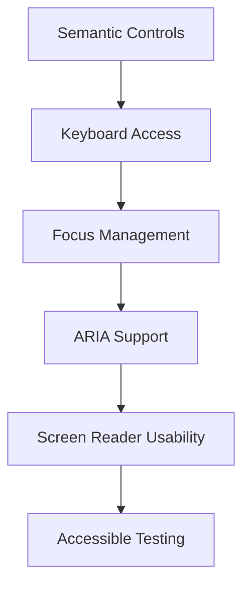

---
title: Accessibility in React
slug: day-067-accessibility-in-react
dayLabel: Day 67
level: Advanced
estimatedMinutes: 30
order: 67
track: react
---
# Day 67 [Advanced]: Accessibility in React

## Goal

Build React features that are keyboard-accessible, screen-reader friendly, and aligned with core WCAG accessibility principles.

## Prerequisites

- Day 66 completed
- Basic understanding of semantic HTML

## Explanation

Accessibility (a11y) is a quality baseline, not an optional enhancement. Semantic HTML, keyboard support, visible focus, correct labeling, focus management, and meaningful status/error communication make products usable by people with diverse abilities.

A practical React accessibility workflow starts with native HTML semantics, adds ARIA only when necessary, and verifies behavior with keyboard testing and automated/manual accessibility checks. Accessibility should be treated as part of component design rather than something added at the end.

## Topic by Topic

### Topic 1: Semantic HTML First

Theory:
Use native elements before ARIA workarounds. Native controls provide built-in keyboard behavior, semantics, and browser accessibility information.

Practical:
Prefer `<button>` over a clickable `<div>`, `<a>` for navigation, headings for document structure, and real `<label>` elements for form controls.

Code Example:

```jsx
function SaveButton({ save }) {
  return (
    <button type="button" onClick={save}>
      Save
    </button>
  );
}
```

A clickable `div` would require manually recreating keyboard interaction, focus behavior, and semantics. Using the native control avoids that unnecessary complexity.

**Explanation:** This topic explains Semantic HTML First in a practical way so you can apply it confidently in real React projects. Native elements are usually the most reliable accessibility implementation.

**Key Points:**

- Understand the core idea of Semantic HTML First.
- Prefer native interactive elements.
- Use headings, landmarks, labels, and lists according to their meaning.
- Avoid recreating browser behavior with generic elements.

### Topic 2: Keyboard Navigation

Theory:
All interactive controls must be reachable and operable via keyboard. Keyboard users need a logical focus order and a visible focus indicator.

Practical:
Verify Tab, Shift+Tab, Enter/Space, and Escape flows according to the control's purpose. Avoid positive `tabIndex` values because they can create confusing focus order.

Code Example:

```jsx
function MenuButton({ openMenu }) {
  return (
    <button type="button" onClick={openMenu}>
      Open menu
    </button>
  );
}
```

For a native button, Enter/Space behavior is provided by the browser. Do not add custom `onKeyDown` logic merely to imitate native button behavior.

**Explanation:** This topic explains Keyboard Navigation in a practical way so you can apply it confidently in real React projects. Keyboard accessibility should be verified as a complete interaction flow, not just whether an element receives focus.

**Key Points:**

- Understand the core idea of Keyboard Navigation.
- Preserve logical DOM and focus order.
- Keep focus indicators visible.
- Avoid positive `tabIndex` and unnecessary custom keyboard handlers.

### Topic 3: ARIA Labels and Relationships

Theory:
ARIA supplements semantics when native HTML cannot fully express a required name, description, role, or state. It should not replace semantic HTML unnecessarily.

Practical:
Use explicit label relationships and state attributes such as `aria-describedby`, `aria-invalid`, and `aria-expanded` when appropriate.

Code Example:

```jsx
function EmailField({ error }) {
  return (
    <div>
      <label htmlFor="email">Email address</label>
      <input
        id="email"
        type="email"
        aria-invalid={error ? "true" : "false"}
        aria-describedby={error ? "email-error" : undefined}
      />
      {error && <p id="email-error">{error}</p>}
    </div>
  );
}
```

The accessible name should normally come from a visible `<label>` for form controls. `aria-label` is useful when a visible label cannot be used, such as some icon-only controls, but should not be the default replacement for visible labeling.

**Explanation:** This topic explains ARIA Labels and Relationships in a practical way so you can apply it confidently in real React projects. Correct relationships help assistive technology understand what controls do and how their states should be interpreted.

**Key Points:**

- Understand the core idea of ARIA Labels and Relationships.
- Prefer visible native labels where possible.
- Use ARIA for names, descriptions, and states that semantics do not already provide.
- Keep IDs stable and relationships correct.

### Topic 4: Focus Management

Theory:
Dialogs, menus, route changes, and dynamically inserted content may require intentional focus management. Focus should move predictably and should not disappear into the document.

Practical:
Move focus to the first appropriate element when a modal opens and restore focus to the triggering element when it closes. A production dialog also needs proper focus containment and Escape/close behavior.

Code Example:

```jsx
import { useEffect, useRef } from "react";

function ConfirmDialog({ open, onClose }) {
  const closeRef = useRef(null);

  useEffect(() => {
    if (open) {
      closeRef.current?.focus();
    }
  }, [open]);

  if (!open) return null;

  return (
    <div role="dialog" aria-modal="true" aria-labelledby="confirm-title">
      <h2 id="confirm-title">Confirm action</h2>
      <button ref={closeRef} type="button" onClick={onClose}>
        Cancel
      </button>
    </div>
  );
}
```

For a complete modal implementation, also trap focus inside the dialog while it is open and return focus to the element that opened it. Prefer a well-tested accessible dialog primitive when the application does not need to implement this behavior itself.

**Explanation:** This topic explains Focus Management in a practical way so you can apply it confidently in real React projects. Correct focus movement prevents keyboard and screen-reader users from becoming lost during dynamic UI changes.

**Key Points:**

- Understand the core idea of Focus Management.
- Move focus intentionally for modal and dynamic interactions.
- Restore focus after closing temporary UI.
- Avoid implementing complex focus traps without testing them thoroughly.

### Topic 5: Accessible Error and Status Messages

Theory:
Dynamic updates should be communicated to assistive technology without unnecessarily interrupting the user's current task. Error messages should be associated with their fields, while status messages can use appropriate live-region behavior.

Practical:
Use `aria-live="polite"` for non-urgent status updates and `role="alert"` carefully for important immediate errors.

Code Example:

```jsx
function SaveStatus({ status }) {
  return (
    <p aria-live="polite">
      {status === "saving" && "Saving..."}
      {status === "saved" && "Changes saved."}
    </p>
  );
}
```

Do not continuously replace live-region content with identical messages. For form errors, link the message to the input with `aria-describedby` and expose invalid state with `aria-invalid` when appropriate.

**Explanation:** This topic explains Accessible Error and Status Messages in a practical way so you can apply it confidently in real React projects. Good announcements provide useful information without creating excessive or repetitive screen-reader noise.

**Key Points:**

- Understand the core idea of Accessible Error and Status Messages.
- Associate errors with their relevant controls.
- Use live regions according to urgency.
- Avoid repetitive or unnecessary announcements.

### Topic 6: Reliability Patterns for Accessibility in React

Theory:
Accessibility behavior can regress when components are refactored, asynchronous UI changes state, or modal/focus flows become more complex. Production reliability requires accessibility checks to cover both success and failure paths.

Practical:
Test keyboard-only flows, focus movement, validation errors, loading/status messages, and failure states. Add automated checks where they provide useful coverage, while remembering that automated tools cannot replace manual keyboard and screen-reader testing.

Code Example:

```jsx
function AsyncStatus({ loading, error, success }) {
  if (loading) return <p role="status">Saving changes...</p>;
  if (error) return <p role="alert">Could not save changes. Try again.</p>;
  if (success) return <p role="status">Changes saved.</p>;
  return null;
}
```

Keep accessibility behavior deterministic across state transitions. Test that focus remains usable after errors, that retry controls are keyboard accessible, and that status announcements do not expose sensitive information.

**Explanation:** This topic explains Reliability Patterns for Accessibility in React in a practical way so you can apply it confidently in real React projects. Accessibility quality depends on behavior across the complete UI lifecycle, not just static markup.

**Key Points:**

- Understand the core idea of Reliability Patterns for Accessibility in React.
- Test both happy and failure paths.
- Combine automated checks with manual keyboard verification.
- Keep focus and announcements predictable during state changes.

## Key Concepts

- Semantic-first implementation
- Keyboard-first interaction model
- Proper ARIA usage
- Focus lifecycle management
- Assistive-technology friendly feedback
- Accessible forms and validation
- Automated plus manual accessibility testing
- Reliability-first implementation

## Visual Concept Map



## End-to-End Practical

1. Audit one feature with keyboard-only testing.
2. Replace non-semantic interactive elements.
3. Add correct label and description relationships.
4. Fix focus entry and restoration for a modal/dialog pattern.
5. Add accessible status and error announcements.
6. Test the same flows with a narrow viewport and zoom where practical.
7. Run automated accessibility checks and manually verify keyboard behavior.

## Hands-on Coding

### Example 1: Case - Replace Clickable div with Button

Scenario:
An admin panel uses clickable `div` controls that are not keyboard-friendly.

```jsx
function Toolbar({ onPublish }) {
  return (
    <div>
      <button type="button" onClick={onPublish}>
        Publish
      </button>
    </div>
  );
}
```

### Example 2: Case - Accessible Modal Focus Entry

Scenario:
An insurance app modal should focus the first actionable element when opened.

```jsx
function ConfirmModal({ open, onClose }) {
  const firstRef = React.useRef(null);

  React.useEffect(() => {
    if (open) firstRef.current?.focus();
  }, [open]);

  if (!open) return null;

  return (
    <div role="dialog" aria-modal="true" aria-labelledby="confirm-title">
      <h2 id="confirm-title">Confirm Policy Update</h2>
      <button ref={firstRef} type="button" onClick={onClose}>
        Close
      </button>
    </div>
  );
}
```

### Example 3: Case - Form Error Announcements

Scenario:
A scholarship form needs clear screen-reader announcements for validation errors.

```jsx
<label htmlFor="email">Email</label>
<input
  id="email"
  aria-invalid={errors.email ? "true" : "false"}
  aria-describedby={errors.email ? "email-error" : undefined}
/>
{errors.email && (
  <p id="email-error" role="alert">
    {errors.email.message}
  </p>
)}
```

## Mini Exercise

Scenario:
You are improving a course enrollment form and confirmation modal.

Fix keyboard navigation, label relationships, focus entry/exit, and error announcements.

Expected output:

- Entire flow works without mouse
- Screen reader reads labels and errors correctly
- Focus order remains logical through modal interactions
- Loading and failure messages are communicated appropriately

## Assessment Quiz

### Quiz Questions

1. Why prefer semantic HTML over custom ARIA roles?
2. What does `aria-live` solve?
3. True or False: Keyboard support is optional if mouse works.
4. What is one common focus issue in modals?
5. Why use `role="alert"` on error blocks?
6. Why should positive `tabIndex` values generally be avoided?
7. Can automated accessibility testing replace manual keyboard testing?
8. Why should focus be restored after a modal closes?

### Quiz Answers

1. Native semantics provide built-in behavior and accessibility information with less custom code.
2. It communicates dynamic content changes to assistive technology according to the chosen announcement priority.
3. False. Keyboard operation is a core accessibility requirement for interactive controls.
4. Focus may not move into the dialog, may escape unexpectedly, or may not return to the triggering element.
5. To communicate an important error promptly to assistive technology; use it carefully to avoid excessive interruptions.
6. Positive values create a custom tab order that can become difficult to maintain and inconsistent with the document order.
7. No. Automated tools catch many detectable issues, but manual keyboard and assistive-technology testing are still important.
8. To return the user to a predictable point in the interface and avoid leaving keyboard focus in an unexpected location.

## Task

- Fix one feature for keyboard and ARIA compliance
- Add accessible focus management for a dialog
- Add accessible live status/error announcements
- Run automated accessibility checks and perform keyboard-only verification
- Complete mini exercise

## Self Check

- You can implement practical accessibility fixes in React
- You can validate keyboard and screen-reader readiness
- You can distinguish native semantics from necessary ARIA
- You can manage focus across dynamic UI states
- You can answer at least 6 out of 8 quiz questions correctly

## Interview Questions and Answers

### Beginner

**Question:** What does accessibility mean in web UI?

**Answer:** Designing interfaces that can be used effectively by people with diverse abilities and interaction methods.

**Question:** Why are semantic elements important?

**Answer:** They provide built-in meaning and browser accessibility behavior, reducing the amount of custom behavior developers must recreate.

### Middle

**Question:** How do you make form errors accessible?

**Answer:** Associate errors with their fields, expose invalid state when appropriate, and use suitable live/alert behavior for important dynamic messages.

**Question:** What keyboard checks should every feature pass?

**Answer:** Controls should be reachable in a logical order, have visible focus, operate with the expected keys, and support Escape/other keyboard behavior where the interaction requires it.

### Advanced

**Question:** When should ARIA be added?

**Answer:** When native HTML semantics cannot express the required accessible name, relationship, role, or state. ARIA should enhance semantics rather than unnecessarily replace native controls.

**Question:** How do you operationalize accessibility in team workflow?

**Answer:** Include accessibility requirements in component APIs, code review checklists, automated testing, keyboard testing, design-system standards, and regression testing for important flows.

**Question:** What is the difference between automated and manual accessibility testing?

**Answer:** Automated tools can detect many structural and rule-based issues, while manual testing verifies real keyboard interaction, focus behavior, content comprehension, and assistive-technology experience that tools cannot fully judge.

**Question:** How would you make a modal accessible in React?

**Answer:** Use an appropriate dialog pattern, provide an accessible name, move focus into the dialog, contain focus while it is open, support an expected close interaction, and restore focus to the triggering element when it closes.

## Day 67 Outcome

- You can deliver accessible React features using semantic-first patterns
- You can enforce keyboard and screen-reader usability patterns
- You can manage labels, errors, live regions, and focus reliably
- You can combine automated checks with manual accessibility verification
- You are ready for measurable performance diagnostics in Day 68
