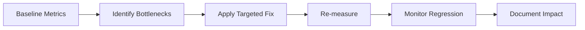

---
title: Profiling and Web Vitals
slug: day-068-profiling-and-web-vitals
dayLabel: Day 68
level: Advanced
estimatedMinutes: 30
order: 68
track: react
---
# Day 68 [Advanced]: Profiling and Web Vitals

## Goal

Measure real frontend performance using React Profiler and Web Vitals, identify evidence-based bottlenecks, and verify that optimizations improve the user experience without adding unnecessary complexity.

## Prerequisites

- Day 67 completed
- Familiarity with memoization and lazy loading

## Explanation

Performance work should begin with measurement rather than assumptions. Web Vitals describe important aspects of the user experience, while React Profiler helps explain component-level rendering cost.

For current web performance work, the Core Web Vitals are **LCP (Largest Contentful Paint)** for loading performance, **INP (Interaction to Next Paint)** for responsiveness, and **CLS (Cumulative Layout Shift)** for visual stability. A good workflow is: establish a baseline, identify the bottleneck, make one targeted change, and measure again.

## Topic by Topic

### Topic 1: Core Web Vitals Overview

Theory:
LCP, INP, and CLS represent loading performance, interaction responsiveness, and visual stability. A metric is useful only when you understand what user experience it represents and where it was collected.

Practical:
Capture baseline vitals for important pages and interactions. The `web-vitals` package can report metrics in the browser.

Code Example:

```jsx
import { onCLS, onINP, onLCP } from "web-vitals";

onCLS((metric) => console.log("CLS", metric.value));
onINP((metric) => console.log("INP", metric.value));
onLCP((metric) => console.log("LCP", metric.value));
```

Use telemetry rather than relying only on local console output in production. Real-user measurements can differ significantly from a fast development machine.

**Explanation:** This topic explains Core Web Vitals Overview in a practical way so you can apply it confidently in real React projects. The goal is to connect each metric to an actual user experience rather than treating scores as isolated numbers.

**Key Points:**

- Understand the core idea of Core Web Vitals Overview.
- Know what LCP, INP, and CLS measure.
- Capture representative measurements before optimizing.
- Compare real-user data with controlled lab measurements.

### Topic 2: Lighthouse Audit Workflow

Theory:
Lighthouse provides repeatable lab diagnostics for performance and related best practices. It is useful for finding opportunities, but lab results are not the same as real-user experience.

Practical:
Run an audit using the same build and comparable conditions before and after an optimization.

Code Example:

```text
Baseline → record metrics and diagnostics
        → change one bottleneck
        → run the same audit again
        → compare results
```

Avoid treating one Lighthouse run as absolute truth. Network conditions, CPU throttling, caching, and page state can influence results, so repeated comparable runs are more useful.

**Explanation:** This topic explains Lighthouse Audit Workflow in a practical way so you can apply it confidently in real React projects. The important skill is creating a repeatable measurement process rather than chasing a single score.

**Key Points:**

- Understand the core idea of Lighthouse Audit Workflow.
- Compare equivalent builds and page states.
- Interpret diagnostics instead of optimizing the score blindly.
- Use Lighthouse alongside real-user metrics.

### Topic 3: React Profiler Analysis

Theory:
React DevTools Profiler helps identify expensive commits, frequently rendering components, and interactions associated with render work. A rerender is not automatically a performance bug.

Practical:
Record a representative interaction and inspect which components render, how long commits take, and whether the work is actually visible to users.

Code Example:

```jsx
import { Profiler } from "react";

function onRender(id, phase, actualDuration) {
  console.log({ id, phase, actualDuration });
}

<Profiler id="ResultsGrid" onRender={onRender}>
  <ResultsGrid />
</Profiler>;
```

Use the Profiler callback for investigation and development diagnostics. Do not ship noisy console logging as your production performance-monitoring strategy.

**Explanation:** This topic explains React Profiler Analysis in a practical way so you can apply it confidently in real React projects. Profiling helps connect a user interaction to actual rendering work.

**Key Points:**

- Understand the core idea of React Profiler Analysis.
- Measure representative interactions.
- Distinguish necessary rerenders from expensive unnecessary work.
- Optimize based on evidence, not render-count anxiety.

### Topic 4: Optimization Actions

Theory:
Common actions include reducing initial JavaScript, code splitting, optimizing images, stabilizing expensive computations, and reducing unnecessary rendering. The correct optimization depends on the measured bottleneck.

Practical:
Apply a targeted change such as lazy-loading a heavy route or memoizing genuinely expensive derived work.

Code Example:

```jsx
import { lazy, Suspense } from "react";

const HeavyPanel = lazy(() => import("./HeavyPanel"));

function App() {
  return (
    <Suspense fallback={<p>Loading panel...</p>}>
      <HeavyPanel />
    </Suspense>
  );
}
```

Do not add `memo`, `useMemo`, or `useCallback` everywhere. Each optimization has maintenance and comparison costs and should address a demonstrated problem.

**Explanation:** This topic explains Optimization Actions in a practical way so you can apply it confidently in real React projects. Performance improvements should be tied to measurable bottlenecks.

**Key Points:**

- Understand the core idea of Optimization Actions.
- Match the fix to the measured bottleneck.
- Prefer simple changes with measurable impact.
- Re-measure after every significant optimization.

### Topic 5: Performance Budget Culture

Theory:
Teams need guardrails for bundle size, loading experience, and interaction responsiveness so that performance does not gradually regress as features are added.

Practical:
Define targets for important metrics, bundle size, and critical user flows, then review them in CI or release checks where appropriate.

Code Example:

```text
Example targets:
LCP < 2.5s
INP < 200ms
CLS < 0.1
```

These values are useful as common "good" Core Web Vitals thresholds, not as a guarantee that every page or user will meet them. Use product-specific budgets in addition to general thresholds.

**Explanation:** This topic explains Performance Budget Culture in a practical way so you can apply it confidently in real React projects. Budgets turn performance from a one-time optimization task into an ongoing engineering practice.

**Key Points:**

- Understand the core idea of Performance Budget Culture.
- Define measurable targets for important journeys.
- Track budgets over time rather than only before releases.
- Balance performance targets with product requirements.

### Topic 6: Reliability Patterns for Profiling and Web Vitals

Theory:
Performance measurements can be misleading when instrumentation is noisy, sampling is inconsistent, or a failure path is ignored. Production-quality performance work needs reliable telemetry, representative scenarios, and regression checks.

Practical:
Record a baseline, simulate a slower device/network where possible, verify metric collection when the page fails or changes state, and add a monitoring signal for important regressions.

Code Example:

```jsx
function reportMetric(metric) {
  if (!Number.isFinite(metric.value)) return;

  navigator.sendBeacon?.(
    "/api/performance",
    JSON.stringify({
      name: metric.name,
      value: metric.value,
      id: metric.id,
    }),
  );
}
```

In a real application, use an authenticated/appropriate telemetry endpoint and avoid sending sensitive page data. Treat telemetry as observability infrastructure rather than as a UI feature.

**Explanation:** This topic explains Reliability Patterns for Profiling and Web Vitals in a practical way so you can apply it confidently in real React projects. Reliable performance engineering requires trustworthy measurements and regression detection.

**Key Points:**

- Understand the core idea of Reliability Patterns for Profiling and Web Vitals.
- Validate instrumentation as well as the UI itself.
- Use representative and repeatable measurement conditions.
- Monitor trends and regressions rather than isolated numbers.

## Key Concepts

- Web Vitals metric interpretation
- LCP, INP, and CLS
- Lighthouse baseline and comparison
- React Profiler commit analysis
- Evidence-based optimization
- Performance budgets
- Real-user vs lab measurements
- Performance telemetry and regression monitoring
- Reliability-first implementation

## Visual Concept Map



## End-to-End Practical

1. Run Lighthouse and record a baseline.
2. Capture Core Web Vitals for the key user journey.
3. Record a representative interaction in React Profiler.
4. Identify two concrete bottlenecks.
5. Apply only the optimizations related to those bottlenecks.
6. Re-run the same measurements.
7. Compare before/after results and document the trade-offs.
8. Define a small performance budget or regression check for the journey.

## Hands-on Coding

### Example 1: Case - Measure Web Vitals in App

Scenario:
A travel booking app needs runtime vitals telemetry for production diagnostics.

```jsx
import { onCLS, onINP, onLCP } from "web-vitals";

onCLS((metric) => reportMetric(metric));
onINP((metric) => reportMetric(metric));
onLCP((metric) => reportMetric(metric));
```

### Example 2: Case - Reduce Rerender Cost in Results Grid

Scenario:
A marketplace results grid rerenders expensive cards when unrelated state changes.

```jsx
import { memo, useMemo } from "react";

const ResultCard = memo(function ResultCard({ item }) {
  return <article>{item.title}</article>;
});

const visible = useMemo(
  () => filterResults(data, filters),
  [data, filters],
);
```

Verify with the Profiler that the change actually reduces useful render work before keeping it.

### Example 3: Case - Defer Non-critical Chart Bundle

Scenario:
A finance dashboard loads a heavy analytics chart only when the insights tab is opened.

```jsx
import { lazy, Suspense } from "react";

const InsightsChart = lazy(() => import("./InsightsChart"));

function Insights({ showInsights }) {
  if (!showInsights) return null;

  return (
    <Suspense fallback={<p>Loading chart...</p>}>
      <InsightsChart />
    </Suspense>
  );
}
```

## Mini Exercise

Scenario:
You are auditing an e-commerce homepage with a slow first interaction.

Collect Lighthouse and Profiler evidence, identify the likely bottleneck, implement two targeted optimizations, and provide before/after measurements.

Expected output:

- Documented baseline and improved values
- Optimizations linked to identified bottlenecks
- Evidence that the optimization helped the measured problem
- No speculative or unnecessary code complexity

## Assessment Quiz

### Quiz Questions

1. What user experience does INP represent?
2. What does LCP measure at a high level?
3. Why is Lighthouse not enough alone?
4. True or False: Performance optimization should start with code changes before measurement.
5. What does React Profiler help you investigate?
6. Why define a performance budget?
7. Why should you re-measure after an optimization?
8. What is one important difference between lab and real-user performance data?

### Quiz Answers

1. How quickly the page responds to user interactions, represented by interaction latency.
2. How quickly the largest relevant content element becomes visible in the viewport.
3. It provides controlled lab diagnostics but does not fully represent every real user's device, network, and usage conditions.
4. False. Start by measuring and identifying a bottleneck.
5. Component rendering work, commit durations, and interactions associated with that work.
6. To create measurable guardrails that help prevent gradual performance regressions.
7. To verify that the change improved the intended bottleneck and did not introduce a regression elsewhere.
8. Lab tests use controlled conditions, while real-user measurements reflect actual devices, networks, and user journeys.

## Task

- Run Lighthouse and React Profiler
- Capture baseline Web Vitals for an important journey
- Implement two metric-driven fixes
- Re-measure and document the results
- Add one practical performance regression guard
- Complete mini exercise

## Self Check

- You can diagnose performance using evidence instead of assumptions
- You can explain LCP, INP, and CLS at a practical level
- You can use React Profiler to investigate render cost
- You can distinguish lab measurements from real-user measurements
- You can answer at least 6 out of 8 quiz questions correctly

## Interview Questions and Answers

### Beginner

**Question:** What are Core Web Vitals?

**Answer:** User-centric performance metrics focused on loading performance, interaction responsiveness, and visual stability: LCP, INP, and CLS.

**Question:** Why use React Profiler?

**Answer:** To investigate component rendering behavior, commit cost, and interaction-related render work.

### Middle

**Question:** What is a practical optimization loop?

**Answer:** Establish a baseline, identify a measurable bottleneck, apply a targeted fix, re-measure, and document the impact.

**Question:** How can lazy loading improve initial performance?

**Answer:** It can keep non-critical JavaScript out of the initial loading path, reducing work required before the user can use the critical experience.

### Advanced

**Question:** Why can memoization fail to improve performance?

**Answer:** Props may be unstable, the component may not be expensive enough to justify comparison overhead, or the optimization may not address the actual bottleneck.

**Question:** How do teams prevent performance regressions at scale?

**Answer:** Combine performance budgets, CI or release checks, real-user monitoring, periodic profiling, and review of important user journeys.

**Question:** Why should performance optimization be evidence-based?

**Answer:** Because an optimization that looks theoretically useful may have negligible impact or introduce maintenance/runtime costs. Measurement confirms whether it improves the user experience.

**Question:** How would you investigate a poor INP score?

**Answer:** Identify slow interactions from real-user data, reproduce representative interactions, use browser/React profiling to locate long tasks or expensive rendering, fix the specific bottleneck, and re-measure the interaction.

## Day 68 Outcome

- You can run practical profiling and Web Vitals audits
- You can interpret LCP, INP, and CLS in context
- You can implement measurable performance improvements
- You can establish performance budgets and regression monitoring
- You are ready for behavior-first testing in Day 69
