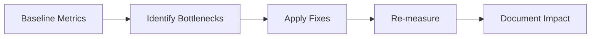

---
title: Profiling and Web Vitals
slug: day-068-profiling-and-web-vitals
dayLabel: Day 68
level: Advanced
estimatedMinutes: 30
order: 68
track: react
---
# Day 68 [Advanced]: Profiling and Web Vitals

## Index

- [Goal](#goal)
- [Prerequisites](#prerequisites)
- [Explanation](#explanation)
- [Topic by Topic](#topic-by-topic)
- [Key Concepts](#key-concepts)
- [Visual Concept Map](#visual-concept-map)
- [End-to-End Practical](#end-to-end-practical)
- [Hands-on Coding](#hands-on-coding)
- [Mini Exercise](#mini-exercise)
- [Assessment Quiz](#assessment-quiz)
- [Task](#task)
- [Self Check](#self-check)
- [Interview Questions and Answers](#interview-questions-and-answers)
- [Day 68 Outcome](#day-68-outcome)

## Goal

Measure real frontend performance using React Profiler and Web Vitals, then implement evidence-based improvements.

## Prerequisites

- Day 67 completed
- Familiarity with memoization and lazy loading

## Explanation

Performance should be monitored with objective metrics. Web Vitals capture user-centric experience while React Profiler explains component-level render cost.

## Topic by Topic

### Topic 1: Core Web Vitals Overview

Theory:
LCP, INP, and CLS represent loading, responsiveness, and visual stability.

Practical:
Capture baseline vitals for key pages.

Code Example:

```jsx
onCLS(console.log);
onLCP(console.log);
onINP(console.log);
```

**Explanation:** This topic explains Core Web Vitals Overview in a practical way so you can apply it confidently in real React projects.

**Key Points:**

- Understand the core idea of Core Web Vitals Overview.
- Apply the pattern using clean, readable code.
- Avoid common mistakes through predictable React flow.

### Topic 2: Lighthouse Audit Workflow

Theory:
Lighthouse highlights bottlenecks across performance and best practices.

Practical:
Run audit before and after optimization.

Code Example:

```jsx
// Compare scores and diagnostics between runs.
```

**Explanation:** This topic explains Lighthouse Audit Workflow in a practical way so you can apply it confidently in real React projects.

**Key Points:**

- Understand the core idea of Lighthouse Audit Workflow.
- Apply the pattern using clean, readable code.
- Avoid common mistakes through predictable React flow.

### Topic 3: React Profiler Analysis

Theory:
Profiler shows commit durations and expensive component trees.

Practical:
Record interaction and inspect frequent rerenders.

Code Example:

```jsx
console.count("ProductRow render");
```

**Explanation:** This topic explains React Profiler Analysis in a practical way so you can apply it confidently in real React projects.

**Key Points:**

- Understand the core idea of React Profiler Analysis.
- Apply the pattern using clean, readable code.
- Avoid common mistakes through predictable React flow.

### Topic 4: Optimization Actions

Theory:
Fixes can include code splitting, image optimization, and render reduction.

Practical:
Apply two changes tied to measured bottlenecks.

Code Example:

```jsx
const HeavyPanel = React.lazy(() => import("./HeavyPanel"));
```

**Explanation:** This topic explains Optimization Actions in a practical way so you can apply it confidently in real React projects.

**Key Points:**

- Understand the core idea of Optimization Actions.
- Apply the pattern using clean, readable code.
- Avoid common mistakes through predictable React flow.

### Topic 5: Performance Budget Culture

Theory:
Teams need guardrails for bundle size and interaction latency.

Practical:
Define simple thresholds and review process.

Code Example:

```jsx
// Budget: LCP < 2.5s, CLS < 0.1, INP < 200ms
```

**Explanation:** This topic explains Performance Budget Culture in a practical way so you can apply it confidently in real React projects.

**Key Points:**

- Understand the core idea of Performance Budget Culture.
- Apply the pattern using clean, readable code.
- Avoid common mistakes through predictable React flow.

### Topic 6: Reliability Patterns for Profiling and Web Vitals

Theory:
Advanced apps need reliable rendering and data workflows that stay stable under retries, loading delays, and test scenarios.

Practical:
Add a failure-path test and one monitoring signal so this topic is validated beyond the happy path.

Code Example:

`jsx
// Validate happy path and failure path for production reliability.
`
**Explanation:** This topic explains Reliability Patterns for Profiling and Web Vitals in a practical way so you can apply it confidently in real React projects.

**Key Points:**

- Understand the core idea of Reliability Patterns for Profiling and Web Vitals.
- Apply the pattern using clean, readable code.
- Avoid common mistakes through predictable React flow.

## Key Concepts

- Web Vitals metric interpretation
- Lighthouse baseline and comparison
- Profiler-driven component diagnostics
- Targeted optimization execution
- Performance budget governance

- Reliability-first implementation

## Visual Concept Map



## End-to-End Practical

1. Run Lighthouse and note baseline score.
2. Record heavy interaction in React Profiler.
3. Identify two concrete hotspots.
4. Apply optimization changes.
5. Re-run tools and compare improvements.

## Hands-on Coding

### Example 1: Case - Measure Web Vitals in App

Scenario:
A travel booking app needs runtime vitals telemetry for production diagnostics.

```jsx
import { onCLS, onINP, onLCP } from "web-vitals";

onCLS((metric) => console.log("CLS", metric.value));
onINP((metric) => console.log("INP", metric.value));
onLCP((metric) => console.log("LCP", metric.value));
```

### Example 2: Case - Reduce Rerender Cost in Results Grid

Scenario:
A marketplace results grid rerenders all cards on minor filter toggles.

```jsx
const ResultCard = React.memo(function ResultCard({ item }) {
  return <article>{item.title}</article>;
});

const visible = React.useMemo(
  () => filterResults(data, filters),
  [data, filters],
);
```

### Example 3: Case - Defer Non-critical Chart Bundle

Scenario:
A finance dashboard loads heavy analytics chart only when insights tab is opened.

```jsx
const InsightsChart = React.lazy(() => import("./InsightsChart"));

{
  showInsights && (
    <React.Suspense fallback={<p>Loading chart...</p>}>
      <InsightsChart />
    </React.Suspense>
  );
}
```

## Mini Exercise

Scenario:
You are auditing an e-commerce homepage with slow first interaction.

Collect Lighthouse + Profiler evidence, implement two optimizations, and provide before/after metrics.

Expected output:

- Documented baseline and improved values
- Optimizations linked to identified bottlenecks
- No speculative or unnecessary code complexity

## Assessment Quiz

### Quiz Questions

1. What user experience does INP represent?
2. Why is Lighthouse not enough alone?
3. True or False: Performance optimization should start with code changes before measurement.
4. What does React Profiler reveal?
5. Why define a performance budget?

### Quiz Answers

1. Input responsiveness and interaction latency
2. It complements but does not replace runtime/component-level profiling
3. False
4. Render frequency and commit cost of component trees
5. To prevent gradual regressions over time

## Task

- Run Lighthouse and React Profiler
- Implement two metric-driven fixes
- Complete mini exercise

## Self Check

- You can diagnose and improve performance with evidence
- You can connect vitals metrics to code-level fixes
- You can answer at least 4 out of 5 quiz questions correctly

## Interview Questions and Answers

### Beginner

**Question:** What are Core Web Vitals?

**Answer:** User-centric metrics for loading, responsiveness, and visual stability.

**Question:** Why use React Profiler?

**Answer:** To find expensive components and rerender hotspots.

### Middle

**Question:** What is a practical optimization loop?

**Answer:** Measure, fix targeted bottleneck, re-measure, and document impact.

**Question:** How can lazy loading improve vitals?

**Answer:** It reduces initial JavaScript payload and speeds up initial render path.

### Advanced

**Question:** Why can memoization fail to improve performance?

**Answer:** If props are unstable or comparator overhead outweighs render savings.

**Question:** How do teams prevent performance regressions at scale?

**Answer:** Use budgets, CI checks, and periodic profiling in release workflow.

## Day 68 Outcome

- You can run practical profiling and vitals audits
- You can implement measurable performance improvements
- You are ready for behavior-first testing in Day 69

