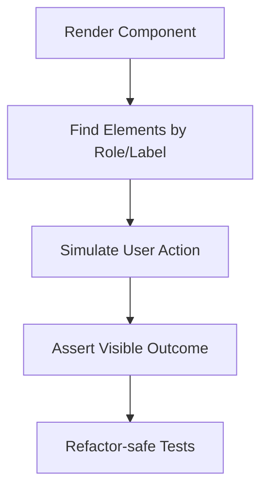

---
title: Testing with React Testing Library
slug: day-069-testing-with-react-testing-library
dayLabel: Day 69
level: Advanced
estimatedMinutes: 30
order: 69
track: react
---
# Day 69 [Advanced]: Testing with React Testing Library

## Index

- [Goal](#goal)
- [Prerequisites](#prerequisites)
- [Explanation](#explanation)
- [Topic by Topic](#topic-by-topic)
- [Key Concepts](#key-concepts)
- [Visual Concept Map](#visual-concept-map)
- [End-to-End Practical](#end-to-end-practical)
- [Hands-on Coding](#hands-on-coding)
- [Mini Exercise](#mini-exercise)
- [Assessment Quiz](#assessment-quiz)
- [Task](#task)
- [Self Check](#self-check)
- [Interview Questions and Answers](#interview-questions-and-answers)
- [Day 69 Outcome](#day-69-outcome)

## Goal

Write robust UI tests with React Testing Library (RTL) by validating user behavior instead of implementation details.

## Prerequisites

- Day 68 completed
- Basic Jest/Vitest and DOM event familiarity

## Explanation

RTL encourages testing from the user perspective: what appears, what can be interacted with, and what changes as a result.

## Topic by Topic

### Topic 1: Query Priority

Theory:
Prefer accessible queries (`getByRole`, `getByLabelText`) over brittle selectors.

Practical:
Find controls by role/name.

Code Example:

```jsx
screen.getByRole("button", { name: /save/i });
```

**Explanation:** This topic explains Query Priority in a practical way so you can apply it confidently in real React projects.

**Key Points:**

- Understand the core idea of Query Priority.
- Apply the pattern using clean, readable code.
- Avoid common mistakes through predictable React flow.

### Topic 2: User Interactions

Theory:
Simulate real user interactions with `userEvent`.

Practical:
Type input and click submit.

Code Example:

```jsx
await user.type(input, "hello");
```

**Explanation:** This topic explains User Interactions in a practical way so you can apply it confidently in real React projects.

**Key Points:**

- Understand the core idea of User Interactions.
- Apply the pattern using clean, readable code.
- Avoid common mistakes through predictable React flow.

### Topic 3: Async Assertions

Theory:
Use async helpers for delayed UI updates.

Practical:
Assert post-request content via `findBy...`.

Code Example:

```jsx
expect(await screen.findByText(/saved/i)).toBeInTheDocument();
```

**Explanation:** This topic explains Async Assertions in a practical way so you can apply it confidently in real React projects.

**Key Points:**

- Understand the core idea of Async Assertions.
- Apply the pattern using clean, readable code.
- Avoid common mistakes through predictable React flow.

### Topic 4: Test Isolation

Theory:
Each test should be deterministic and independent.

Practical:
Reset mocks and avoid shared mutable state.

Code Example:

```jsx
beforeEach(() => vi.clearAllMocks());
```

**Explanation:** This topic explains Test Isolation in a practical way so you can apply it confidently in real React projects.

**Key Points:**

- Understand the core idea of Test Isolation.
- Apply the pattern using clean, readable code.
- Avoid common mistakes through predictable React flow.

### Topic 5: Avoid Implementation-detail Testing

Theory:
Do not test internal state variables directly.

Practical:
Assert visible behavior and output only.

Code Example:

```jsx
expect(screen.getByText(/items: 1/i)).toBeInTheDocument();
```

**Explanation:** This topic explains Avoid Implementation-detail Testing in a practical way so you can apply it confidently in real React projects.

**Key Points:**

- Understand the core idea of Avoid Implementation-detail Testing.
- Apply the pattern using clean, readable code.
- Avoid common mistakes through predictable React flow.

### Topic 6: Reliability Patterns for Testing with React Testing Library

Theory:
Advanced apps need reliable rendering and data workflows that stay stable under retries, loading delays, and test scenarios.

Practical:
Add a failure-path test and one monitoring signal so this topic is validated beyond the happy path.

Code Example:

`jsx
// Validate happy path and failure path for production reliability.
`
**Explanation:** This topic explains Reliability Patterns for Testing with React Testing Library in a practical way so you can apply it confidently in real React projects.

**Key Points:**

- Understand the core idea of Reliability Patterns for Testing with React Testing Library.
- Apply the pattern using clean, readable code.
- Avoid common mistakes through predictable React flow.

## Key Concepts

- Behavior-first test mindset
- Accessible querying strategy
- User-event driven interactions
- Async rendering assertions
- Stable and maintainable test suites

- Reliability-first implementation

## Visual Concept Map



## End-to-End Practical

1. Select one real UI feature.
2. Write rendering expectation tests.
3. Add input and click interaction tests.
4. Add async success/error state assertions.
5. Run test suite and refactor-safe cleanup.

## Hands-on Coding

### Example 1: Case - Render and Basic Interaction

Scenario:
A notes form should render and add a note when user submits valid text.

```jsx
import { render, screen } from "@testing-library/react";
import userEvent from "@testing-library/user-event";
import NotesForm from "./NotesForm";

test("adds a note", async () => {
  const user = userEvent.setup();
  render(<NotesForm />);

  await user.type(screen.getByRole("textbox", { name: /note/i }), "Buy milk");
  await user.click(screen.getByRole("button", { name: /add/i }));

  expect(screen.getByText(/buy milk/i)).toBeInTheDocument();
});
```

### Example 2: Case - Async API Success State

Scenario:
A profile save form shows success message after async submit.

```jsx
test("shows success after save", async () => {
  const user = userEvent.setup();
  render(<ProfileForm />);

  await user.type(screen.getByLabelText(/name/i), "Asha");
  await user.click(screen.getByRole("button", { name: /save/i }));

  expect(await screen.findByText(/profile saved/i)).toBeInTheDocument();
});
```

### Example 3: Case - Validation Error Test

Scenario:
Login form should show inline error when email format is invalid.

```jsx
test("shows email validation error", async () => {
  const user = userEvent.setup();
  render(<LoginForm />);

  await user.type(screen.getByLabelText(/email/i), "wrong-format");
  await user.click(screen.getByRole("button", { name: /login/i }));

  expect(await screen.findByText(/invalid email/i)).toBeInTheDocument();
});
```

## Mini Exercise

Scenario:
You are testing a task manager feature with add, toggle-complete, and delete actions.

Write RTL tests for:

- initial rendering
- input + submit behavior
- async save state and error case

Expected output:

- Tests verify user-visible behavior only
- Queries use roles/labels/text appropriately
- Suite remains stable after internal refactor

## Assessment Quiz

### Quiz Questions

1. Why is `getByRole` preferred in RTL?
2. What is the difference between `getBy` and `findBy`?
3. True or False: Good tests should assert component private state directly.
4. Why use userEvent over low-level event dispatch in many cases?
5. What makes a UI test refactor-safe?

### Quiz Answers

1. It aligns with accessible user interactions
2. `getBy` is synchronous, `findBy` waits for async appearance
3. False
4. It better simulates real user interaction patterns
5. Assertions on observable behavior instead of internals

## Task

- Write tests for render/input/click for one feature
- Add at least one async success or error test
- Complete mini exercise

## Self Check

- You can write user-centric RTL tests confidently
- You can cover async UI states correctly
- You can answer at least 4 out of 5 quiz questions correctly

## Interview Questions and Answers

### Beginner

**Question:** What is React Testing Library mainly for?

**Answer:** Testing UI behavior from the user's point of view.

**Question:** Which query is commonly preferred first?

**Answer:** `getByRole` with accessible name.

### Middle

**Question:** Why avoid testing implementation details?

**Answer:** They make tests brittle and tightly coupled to internals.

**Question:** When should you use `findBy` queries?

**Answer:** When waiting for asynchronous UI changes.

### Advanced

**Question:** How do you improve confidence in UI behavior without over-testing?

**Answer:** Cover critical user journeys, edge states, and accessibility-sensitive interactions.

**Question:** What is a common smell in RTL test suites?

**Answer:** Heavy use of non-accessible selectors and timing hacks.

## Day 69 Outcome

- You can create meaningful behavior-first test coverage
- You can validate synchronous and asynchronous UI interactions
- You are ready for workflow-level validation in Day 70

