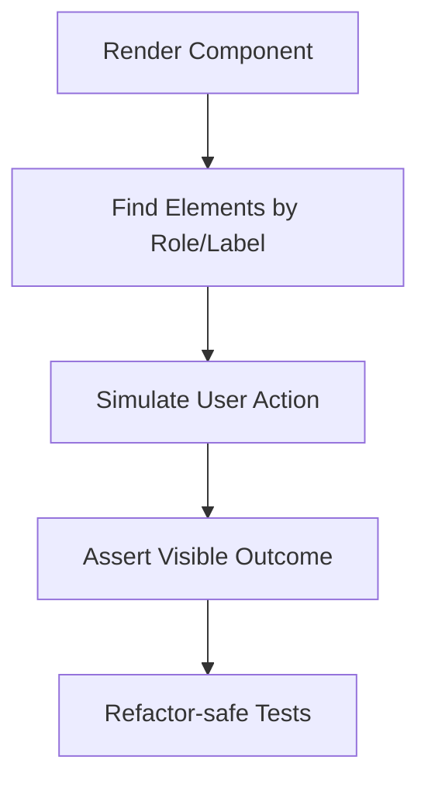

---
title: Testing with React Testing Library
slug: day-069-testing-with-react-testing-library
dayLabel: Day 69
level: Advanced
estimatedMinutes: 30
order: 69
track: react
---
# Day 69 [Advanced]: Testing with React Testing Library

## Goal

Write robust UI tests with React Testing Library (RTL) by validating user behavior instead of implementation details.

## Prerequisites

- Day 68 completed
- Basic Jest/Vitest and DOM event familiarity

## Explanation

RTL encourages testing from the user perspective: what appears, what can be interacted with, and what changes as a result.

A strong RTL test suite combines accessible queries, realistic interactions, asynchronous assertions, deterministic setup, and meaningful failure-path coverage. Tests should give useful confidence without becoming tightly coupled to component implementation details.

## Topic by Topic

### Topic 1: Query Priority

Theory:
Prefer accessible queries (`getByRole`, `getByLabelText`) over brittle selectors. Use the Testing Library query that best represents how a user or assistive technology would find the element.

Practical:
Find controls by role and accessible name.

Code Example:

```jsx
screen.getByRole("button", { name: /save/i });
screen.getByLabelText(/email/i);
```

Use `getByText` when visible text is the meaningful way to identify content. Avoid defaulting to test IDs when an accessible query is available.

**Explanation:** This topic explains Query Priority in a practical way so you can apply it confidently in real React projects.

**Key Points:**

- Understand the core idea of Query Priority.
- Prefer accessible roles, labels, and names.
- Use test IDs only when better user-facing queries are unavailable.
- Avoid brittle CSS/class selectors.

### Topic 2: User Interactions

Theory:
Simulate real user interactions with `userEvent` rather than relying on low-level event dispatch for normal UI flows.

Practical:
Type input and click submit through the user-event API.

Code Example:

```jsx
const user = userEvent.setup();
await user.type(screen.getByRole("textbox", { name: /name/i }), "Asha");
await user.click(screen.getByRole("button", { name: /save/i }));
```

`userEvent` is asynchronous for many interactions, so await the interaction before asserting the resulting UI state.

**Explanation:** This topic explains User Interactions in a practical way so you can apply it confidently in real React projects.

**Key Points:**

- Understand the core idea of User Interactions.
- Model interactions as a real user would perform them.
- Await asynchronous user-event operations.
- Avoid unnecessary low-level event simulation.

### Topic 3: Async Assertions

Theory:
Use async helpers for delayed UI updates. `findBy...` is useful when an element is expected to appear after an asynchronous operation, while `waitFor` is useful for retrying a specific assertion or condition.

Practical:
Assert post-request content via `findBy...`.

Code Example:

```jsx
expect(await screen.findByText(/saved/i)).toBeInTheDocument();
```

Do not use arbitrary `setTimeout` delays to make tests pass. Wait for the observable condition that matters to the user.

**Explanation:** This topic explains Async Assertions in a practical way so you can apply it confidently in real React projects.

**Key Points:**

- Understand the core idea of Async Assertions.
- Use `findBy` for asynchronously appearing elements.
- Use `waitFor` for retryable assertions that have no suitable find query.
- Avoid timing hacks and unnecessary sleeps.

### Topic 4: Test Isolation

Theory:
Each test should be deterministic and independent. Shared mutable state, leaked mocks, and incomplete cleanup can cause order-dependent failures.

Practical:
Reset mocks and create fresh user-event instances per test.

Code Example:

```jsx
afterEach(() => {
  vi.restoreAllMocks();
});

test("shows data", async () => {
  const user = userEvent.setup();
  // arrange and test independently
});
```

Choose `clearAllMocks`, `resetAllMocks`, or `restoreAllMocks` according to what your test setup needs. Do not blindly reset everything if doing so destroys intentional test configuration.

**Explanation:** This topic explains Test Isolation in a practical way so you can apply it confidently in real React projects.

**Key Points:**

- Understand the core idea of Test Isolation.
- Keep tests independent and deterministic.
- Clean up mocks according to their intended lifecycle.
- Avoid shared mutable test state.

### Topic 5: Avoid Implementation-detail Testing

Theory:
Do not test internal state variables, private functions, or exact implementation steps when they are not observable user behavior.

Practical:
Assert visible behavior and accessible output instead.

Code Example:

```jsx
expect(screen.getByText(/items: 1/i)).toBeInTheDocument();
```

If a refactor changes `useState` to a reducer but preserves the same user experience, a good behavior-focused test should continue to pass.

**Explanation:** This topic explains Avoid Implementation-detail Testing in a practical way so you can apply it confidently in real React projects.

**Key Points:**

- Understand the core idea of Avoid Implementation-detail Testing.
- Assert observable outcomes rather than internal state.
- Prefer stable user-facing contracts.
- Keep tests resilient to reasonable refactoring.

### Topic 6: Reliability Patterns for Testing with React Testing Library

Theory:
Advanced apps need reliable rendering and data workflows that stay stable under retries, loading delays, failures, and test scenarios.

Practical:
Cover both success and failure paths, make asynchronous expectations explicit, and verify that cleanup and mocks do not leak between tests.

Code Example:

```jsx
test("shows an API failure", async () => {
  server.use(failureHandler);
  render(<ProfileForm />);

  await userEvent.setup().click(
    screen.getByRole("button", { name: /save/i }),
  );

  expect(
    await screen.findByRole("alert", { name: /unable to save/i }),
  ).toBeInTheDocument();
});
```

Keep network behavior controlled by the test environment, preferably through a request-mocking layer such as MSW, rather than replacing every implementation detail inside the component. Test loading, success, empty, and failure states where those states matter to the product.

**Explanation:** This topic explains Reliability Patterns for Testing with React Testing Library in a practical way so you can apply it confidently in real React projects.

**Key Points:**

- Understand the core idea of Reliability Patterns for Testing with React Testing Library.
- Cover meaningful success and failure paths.
- Make asynchronous behavior deterministic.
- Keep test setup and network mocks isolated.

## Key Concepts

- Behavior-first test mindset
- Accessible querying strategy
- User-event driven interactions
- Async rendering assertions
- Test isolation and deterministic setup
- Success, loading, empty, and failure state coverage
- Stable and maintainable test suites
- Reliability-first implementation

## Visual Concept Map



## End-to-End Practical

1. Select one real UI feature.
2. Write rendering expectation tests.
3. Add input and click interaction tests.
4. Add async success/error state assertions.
5. Verify loading and empty states where applicable.
6. Isolate API behavior with controlled test handlers.
7. Run the test suite and confirm cleanup leaves tests independent.
8. Refactor the component internally and verify behavior-focused tests remain useful.

## Hands-on Coding

### Example 1: Case - Render and Basic Interaction

Scenario:
A notes form should render and add a note when user submits valid text.

```jsx
import { render, screen } from "@testing-library/react";
import userEvent from "@testing-library/user-event";
import NotesForm from "./NotesForm";

test("adds a note", async () => {
  const user = userEvent.setup();
  render(<NotesForm />);

  await user.type(
    screen.getByRole("textbox", { name: /note/i }),
    "Buy milk",
  );
  await user.click(screen.getByRole("button", { name: /add/i }));

  expect(screen.getByText(/buy milk/i)).toBeInTheDocument();
});
```

### Example 2: Case - Async API Success State

Scenario:
A profile save form shows success message after async submit.

```jsx
test("shows success after save", async () => {
  const user = userEvent.setup();
  render(<ProfileForm />);

  await user.type(screen.getByLabelText(/name/i), "Asha");
  await user.click(screen.getByRole("button", { name: /save/i }));

  expect(
    await screen.findByText(/profile saved/i),
  ).toBeInTheDocument();
});
```

### Example 3: Case - Validation Error Test

Scenario:
Login form should show inline error when email format is invalid.

```jsx
test("shows email validation error", async () => {
  const user = userEvent.setup();
  render(<LoginForm />);

  await user.type(screen.getByLabelText(/email/i), "wrong-format");
  await user.click(screen.getByRole("button", { name: /login/i }));

  expect(
    await screen.findByText(/invalid email/i),
  ).toBeInTheDocument();
});
```

## Mini Exercise

Scenario:
You are testing a task manager feature with add, toggle-complete, and delete actions.

Write RTL tests for:

- initial rendering
- input + submit behavior
- loading state
- async save success and error cases
- toggle and delete behavior

Expected output:

- Tests verify user-visible behavior only
- Queries use roles/labels/text appropriately
- Async expectations do not rely on arbitrary delays
- Suite remains stable after internal refactor

## Assessment Quiz

### Quiz Questions

1. Why is `getByRole` preferred in RTL?
2. What is the difference between `getBy` and `findBy`?
3. True or False: Good tests should assert component private state directly.
4. Why use userEvent over low-level event dispatch in many cases?
5. What makes a UI test refactor-safe?
6. When is `waitFor` useful?
7. Why should success and failure paths both be tested for important async features?
8. What is the benefit of mocking network requests at the request boundary?

### Quiz Answers

1. It aligns with accessible user interactions and encourages testing the UI's accessible contract.
2. `getBy` is synchronous and throws when no matching element is found; `findBy` waits asynchronously for the element to appear.
3. False.
4. It better simulates realistic user interaction patterns and browser behavior.
5. Assertions focus on observable behavior instead of component internals.
6. When an assertion needs to be retried until an asynchronous condition becomes true and no more specific async query is appropriate.
7. Real applications must handle failures as well as successful requests, and failure paths often contain important user-facing behavior.
8. It keeps tests independent from component implementation while still exercising realistic request/response behavior.

## Task

- Write tests for render/input/click for one feature
- Add at least one async success and one error test
- Add loading/empty assertions where applicable
- Keep network behavior isolated from component implementation
- Complete mini exercise

## Self Check

- You can write user-centric RTL tests confidently
- You can cover synchronous and asynchronous UI states correctly
- You can isolate mocks and test data reliably
- You can explain query priority and behavior-focused assertions
- You can answer at least 6 out of 8 quiz questions correctly

## Interview Questions and Answers

### Beginner

**Question:** What is React Testing Library mainly for?

**Answer:** Testing UI behavior from the user's point of view.

**Question:** Which query is commonly preferred first?

**Answer:** `getByRole` with an accessible name when the element is exposed as a meaningful role.

### Middle

**Question:** Why avoid testing implementation details?

**Answer:** They make tests brittle and tightly coupled to internals that can change during refactoring.

**Question:** When should you use `findBy` queries?

**Answer:** When waiting for an element to appear as a result of asynchronous UI behavior.

### Advanced

**Question:** How do you improve confidence in UI behavior without over-testing?

**Answer:** Cover critical user journeys, important edge states, accessibility-sensitive interactions, and meaningful failure paths rather than asserting every implementation detail.

**Question:** What is a common smell in RTL test suites?

**Answer:** Heavy use of non-accessible selectors, arbitrary timing delays, direct state assertions, and tests that depend on internal component structure.

**Question:** How would you test an API-driven component reliably?

**Answer:** Render the real component, control requests at the network boundary with a test handler, exercise the user interaction, and assert loading, success, empty, and failure outcomes from the UI.

**Question:** How do you prevent flaky asynchronous RTL tests?

**Answer:** Await user interactions, use semantic async queries or `waitFor` for the actual condition, avoid arbitrary sleeps, isolate mocks, and ensure each test controls its own data and request behavior.

## Day 69 Outcome

- You can create meaningful behavior-first test coverage
- You can validate synchronous and asynchronous UI interactions
- You can test important loading, success, empty, and failure states
- You can build maintainable tests that survive reasonable refactoring
- You are ready for workflow-level validation in Day 70
