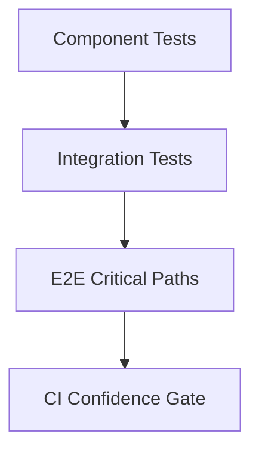

---
title: Integration and E2E
slug: day-070-integration-and-e2e
dayLabel: Day 70
level: Advanced
estimatedMinutes: 30
order: 70
track: react
---
# Day 70 [Advanced]: Integration and E2E

## Goal

Validate real application workflows using integration testing and end-to-end (E2E) automation.

## Prerequisites

- Day 69 completed
- Familiarity with component testing and async behavior

## Explanation

Unit tests validate small pieces, while integration and E2E tests verify complete user journeys across components, API boundaries, and routing. The strongest strategy is layered: keep most checks close to the component/module boundary, then use integration and E2E tests for workflows where collaboration and browser behavior matter.

A useful rule is to test through stable user-facing contracts. Integration tests should exercise real application wiring with controlled network responses, while E2E tests should validate a small number of business-critical journeys in an environment close to production.

## Topic by Topic

### Topic 1: Integration Test Scope

Theory:
Integration tests verify collaboration between multiple components/modules and their surrounding application providers, state, routing, and request behavior.

Practical:
Test feature workflow with realistic state and API mocks rather than mocking every child component.

Code Example:

```jsx
render(<AppWithProviders />);
```

The goal is to verify that the pieces work together. If every dependency is mocked, the test can become a unit test with a larger setup rather than a meaningful integration test.

**Explanation:** This topic explains Integration Test Scope in a practical way so you can apply it confidently in real React projects.

**Key Points:**

- Understand the core idea of Integration Test Scope.
- Test meaningful collaboration between application pieces.
- Keep network behavior controlled without mocking away the feature itself.
- Avoid turning integration tests into large implementation-detail tests.

### Topic 2: MSW for API Mocking

Theory:
MSW intercepts network calls for predictable test behavior while allowing the application to use its normal request layer.

Practical:
Mock success, empty, validation, and failure responses with request handlers.

Code Example:

```jsx
http.get("/api/tasks", () =>
  HttpResponse.json([{ id: 1, title: "Prepare report", done: false }]),
);
```

Keep default handlers deterministic and override them only inside the test that needs a special response. This makes failure-path tests explicit and prevents one test's network behavior from leaking into another.

**Explanation:** This topic explains MSW for API Mocking in a practical way so you can apply it confidently in real React projects.

**Key Points:**

- Understand the core idea of MSW for API Mocking.
- Keep request behavior at the network boundary.
- Cover success, empty, validation, and failure responses.
- Reset handlers between tests.

### Topic 3: E2E Journey Design

Theory:
E2E should focus on business-critical paths rather than duplicating every component assertion already covered by lower-level tests.

Practical:
Automate login-to-checkout or an equivalent primary journey using stable semantic locators.

Code Example:

```jsx
await page.getByRole("button", { name: /checkout/i }).click();
```

Prefer user-visible roles, labels, and stable test contracts. Avoid selectors based on generated CSS classes or DOM structure that can change during harmless refactors.

**Explanation:** This topic explains E2E Journey Design in a practical way so you can apply it confidently in real React projects.

**Key Points:**

- Understand the core idea of E2E Journey Design.
- Prioritize critical business workflows.
- Use stable, user-facing locators.
- Avoid duplicating exhaustive component-level coverage in E2E.

### Topic 4: Test Data and Environment Stability

Theory:
Flaky tests often come from unstable data, timing assumptions, shared state, environment drift, or dependencies on external services.

Practical:
Use deterministic fixtures, isolated test data, explicit state assertions, and condition-based waits.

Code Example:

```jsx
await expect(page.getByText("Order Confirmed")).toBeVisible();
```

Wait for the observable condition rather than sleeping for an arbitrary number of milliseconds. Where possible, create unique test records or reset the environment so parallel tests do not compete for the same mutable data.

**Explanation:** This topic explains Test Data and Environment Stability in a practical way so you can apply it confidently in real React projects.

**Key Points:**

- Understand the core idea of Test Data and Environment Stability.
- Use deterministic and isolated test data.
- Wait for observable conditions instead of arbitrary delays.
- Design tests to work reliably in parallel CI execution.

### Topic 5: CI Test Strategy

Theory:
Run fast integration tests per commit and E2E on key pipelines, with a smaller smoke suite protecting pull requests and broader regression coverage running on suitable release or scheduled pipelines.

Practical:
Tag test groups by scope and execution frequency.

Code Example:

```jsx
// smoke, critical-path, full-regression
```

CI should publish artifacts such as screenshots, traces, videos, or logs when E2E failures occur. This reduces the time needed to diagnose failures and distinguishes product defects from environment problems.

**Explanation:** This topic explains CI Test Strategy in a practical way so you can apply it confidently in real React projects.

**Key Points:**

- Understand the core idea of CI Test Strategy.
- Balance execution speed with confidence.
- Separate smoke, critical-path, and full-regression suites.
- Preserve useful failure artifacts for diagnosis.

### Topic 6: Reliability Patterns for Integration and E2E

Theory:
Advanced apps need reliable rendering and data workflows that stay stable under retries, loading delays, network failures, authentication expiry, and test execution in CI.

Practical:
Add a failure-path test, deterministic test data, condition-based waits, and one useful diagnostic signal so this topic is validated beyond the happy path.

Code Example:

```jsx
test("shows payment failure and allows retry", async ({ page }) => {
  await page.goto("/checkout");
  await page.getByRole("button", { name: /pay now/i }).click();

  await expect(page.getByRole("alert")).toContainText(/payment failed/i);
  await expect(page.getByRole("button", { name: /retry/i })).toBeVisible();
});
```

When a test fails, capture enough context to reproduce it: browser trace or screenshot, relevant console/network information, and the test data identifier. Do not hide failures with unlimited retries; retries can mask flaky behavior instead of fixing it.

**Explanation:** This topic explains Reliability Patterns for Integration and E2E in a practical way so you can apply it confidently in real React projects.

**Key Points:**

- Understand the core idea of Reliability Patterns for Integration and E2E.
- Validate both happy and failure paths.
- Use deterministic data and condition-based waits.
- Collect diagnostics without hiding genuine failures.

## Key Concepts

- Integration vs E2E coverage boundaries
- MSW-powered deterministic API behavior
- Critical-path journey testing
- Flake reduction techniques
- CI-friendly test layering
- Test data isolation
- Failure diagnostics and artifacts
- Reliability-first implementation

## Visual Concept Map



## End-to-End Practical

1. Define one core business workflow.
2. Write an MSW-backed integration test for the feature module.
3. Write one E2E happy path for the complete flow.
4. Add one failure-path assertion.
5. Use deterministic test data and condition-based waits.
6. Classify tests by execution layer.
7. Configure useful failure artifacts for E2E diagnosis.

## Hands-on Coding

### Example 1: Case - MSW-backed Integration Test

Scenario:
A task dashboard should render tasks fetched from API and allow completion toggles.

```jsx
import { http, HttpResponse } from "msw";
import { setupServer } from "msw/node";
import { render, screen } from "@testing-library/react";
import userEvent from "@testing-library/user-event";

const server = setupServer(
  http.get("/api/tasks", () =>
    HttpResponse.json([{ id: 1, title: "Prepare report", done: false }]),
  ),
);

beforeAll(() => server.listen());
afterEach(() => server.resetHandlers());
afterAll(() => server.close());

test("loads and toggles task", async () => {
  const user = userEvent.setup();
  render(<TaskDashboard />);

  expect(await screen.findByText(/prepare report/i)).toBeInTheDocument();
  await user.click(screen.getByRole("checkbox", { name: /prepare report/i }));
});
```

### Example 2: Case - E2E Checkout Path (Playwright-style)

Scenario:
An e-commerce app must validate the cart-to-checkout-to-confirmation journey.

```jsx
test("user completes checkout", async ({ page }) => {
  await page.goto("/");
  await page.getByRole("button", { name: /add to cart/i }).click();
  await page.getByRole("link", { name: /cart/i }).click();
  await page.getByRole("button", { name: /checkout/i }).click();
  await expect(page.getByText(/order confirmed/i)).toBeVisible();
});
```

### Example 3: Case - Failure-path Validation

Scenario:
Payment failure should show a clear error and allow retry.

```jsx
test("shows payment failure and retry", async ({ page }) => {
  await page.goto("/checkout");
  await page.getByRole("button", { name: /pay now/i }).click();
  await expect(page.getByRole("alert")).toContainText(/payment failed/i);
  await expect(page.getByRole("button", { name: /retry/i })).toBeVisible();
});
```

## Mini Exercise

Scenario:
You are testing an online learning platform with login, enroll, and lesson start flow.

Create:

- one integration test with MSW for enrollment API
- one E2E happy path and one E2E failure path
- deterministic test data for the workflow
- useful failure diagnostics for the E2E suite

Expected output:

- Workflow behavior validated across test layers
- Stable deterministic API behavior in integration suite
- User-critical journey confidence before release
- Failure-path behavior is observable and diagnosable

## Assessment Quiz

### Quiz Questions

1. What is the main difference between integration and E2E tests?
2. Why is MSW helpful in integration testing?
3. True or False: E2E tests should cover every tiny UI detail.
4. What is a common cause of flaky E2E tests?
5. Why layer test strategy in CI?
6. Why are condition-based waits better than arbitrary sleeps?
7. Why should important E2E failures preserve diagnostic artifacts?
8. Why should E2E retries be used carefully?

### Quiz Answers

1. Integration tests verify collaboration between application pieces; E2E tests verify complete user journeys in a browser/runtime environment.
2. It provides controlled, realistic API behavior without requiring the frontend test to call a real backend.
3. False.
4. Unstable data, timing assumptions, shared state, environment drift, and external dependencies are common causes.
5. To balance fast feedback with broader confidence across commit, release, and scheduled pipelines.
6. They wait for the actual user-visible condition and are less sensitive to machine or network speed.
7. Screenshots, traces, logs, and related context make CI failures much easier to reproduce and diagnose.
8. Excessive retries can hide flaky tests or genuine product failures instead of exposing the underlying problem.

## Task

- Add one MSW-backed integration test and one E2E path
- Add one failure-path workflow assertion
- Add deterministic test data and condition-based waits
- Preserve useful E2E failure diagnostics
- Complete mini exercise

## Self Check

- You can design practical integration and E2E coverage
- You can reduce flakiness with deterministic setup
- You can distinguish integration and E2E responsibilities
- You can diagnose failed browser tests using useful artifacts
- You can answer at least 6 out of 8 quiz questions correctly

## Interview Questions and Answers

### Beginner

**Question:** What does E2E testing validate?

**Answer:** Real user workflows across the application, commonly including routing, UI behavior, network interactions, and backend integration in an environment close to production.

**Question:** Why do integration tests matter?

**Answer:** They verify interactions between combined components/modules and application infrastructure without requiring a full browser journey for every scenario.

### Middle

**Question:** How does MSW improve frontend test quality?

**Answer:** It enables realistic API contracts with stable and repeatable responses while allowing the application to use its normal network layer.

**Question:** What should E2E tests prioritize first?

**Answer:** Business-critical paths such as login, checkout, enrollment, payment, and submission flows.

### Advanced

**Question:** How do you control E2E suite runtime while preserving confidence?

**Answer:** Keep a small smoke/critical-path set for pull requests and broader regression suites on scheduled or release pipelines, while relying on lower-level tests for detailed component behavior.

**Question:** What architecture supports maintainable test pyramids?

**Answer:** Clear boundaries between unit, integration, and E2E responsibilities, shared test utilities/fixtures, deterministic data, and a consistent approach to network mocking.

**Question:** How do you reduce E2E flakiness?

**Answer:** Use stable locators, isolated data, condition-based waits, controlled external dependencies, deterministic environments, and failure artifacts. Avoid arbitrary sleeps and excessive retries.

**Question:** How would you diagnose an E2E test that fails only in CI?

**Answer:** Compare environment differences, inspect traces/screenshots/logs/network activity, identify timing or data dependencies, reproduce under CI-like conditions, and fix the underlying synchronization or environment problem rather than adding a blind delay.

## Day 70 Outcome

- You can validate complete workflows with integration and E2E tests
- You can design practical layered testing strategy for production apps
- You can reduce flakiness using deterministic data and condition-based synchronization
- You can diagnose CI failures with useful test artifacts
- You are prepared for reliability-focused advanced modules ahead
