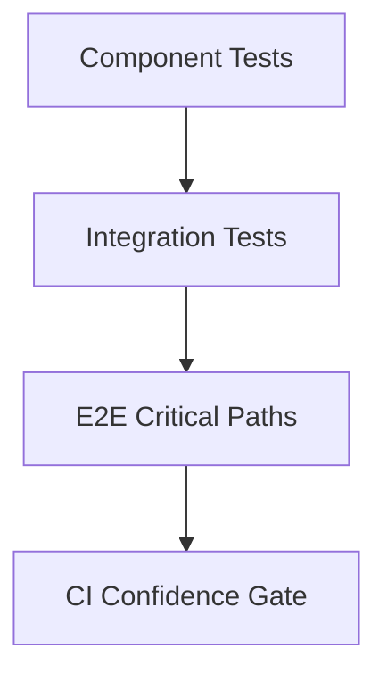

---
title: Integration and E2E
slug: day-070-integration-and-e2e
dayLabel: Day 70
level: Advanced
estimatedMinutes: 30
order: 70
track: react
---
# Day 70 [Advanced]: Integration and E2E

## Index

- [Goal](#goal)
- [Prerequisites](#prerequisites)
- [Explanation](#explanation)
- [Topic by Topic](#topic-by-topic)
- [Key Concepts](#key-concepts)
- [Visual Concept Map](#visual-concept-map)
- [End-to-End Practical](#end-to-end-practical)
- [Hands-on Coding](#hands-on-coding)
- [Mini Exercise](#mini-exercise)
- [Assessment Quiz](#assessment-quiz)
- [Task](#task)
- [Self Check](#self-check)
- [Interview Questions and Answers](#interview-questions-and-answers)
- [Day 70 Outcome](#day-70-outcome)

## Goal

Validate real application workflows using integration testing and end-to-end (E2E) automation.

## Prerequisites

- Day 69 completed
- Familiarity with component testing and async behavior

## Explanation

Unit tests validate small pieces, while integration and E2E tests verify complete user journeys across components, API boundaries, and routing.

## Topic by Topic

### Topic 1: Integration Test Scope

Theory:
Integration tests verify collaboration between multiple components/modules.

Practical:
Test feature workflow with realistic state and API mocks.

Code Example:

```jsx
render(<AppWithProviders />);
```

**Explanation:** This topic explains Integration Test Scope in a practical way so you can apply it confidently in real React projects.

**Key Points:**

- Understand the core idea of Integration Test Scope.
- Apply the pattern using clean, readable code.
- Avoid common mistakes through predictable React flow.

### Topic 2: MSW for API Mocking

Theory:
MSW intercepts network calls for predictable test behavior.

Practical:
Mock success and failure responses.

Code Example:

```jsx
http.get("/api/tasks", () => HttpResponse.json([...]))
```

**Explanation:** This topic explains MSW for API Mocking in a practical way so you can apply it confidently in real React projects.

**Key Points:**

- Understand the core idea of MSW for API Mocking.
- Apply the pattern using clean, readable code.
- Avoid common mistakes through predictable React flow.

### Topic 3: E2E Journey Design

Theory:
E2E should focus on business-critical paths.

Practical:
Automate login-to-checkout or equivalent primary journey.

Code Example:

```jsx
await page.getByRole("button", { name: "Checkout" }).click();
```

**Explanation:** This topic explains E2E Journey Design in a practical way so you can apply it confidently in real React projects.

**Key Points:**

- Understand the core idea of E2E Journey Design.
- Apply the pattern using clean, readable code.
- Avoid common mistakes through predictable React flow.

### Topic 4: Test Data and Environment Stability

Theory:
Flaky tests often come from unstable data/timing assumptions.

Practical:
Use deterministic fixtures and explicit waits.

Code Example:

```jsx
await expect(page.getByText("Order Confirmed")).toBeVisible();
```

**Explanation:** This topic explains Test Data and Environment Stability in a practical way so you can apply it confidently in real React projects.

**Key Points:**

- Understand the core idea of Test Data and Environment Stability.
- Apply the pattern using clean, readable code.
- Avoid common mistakes through predictable React flow.

### Topic 5: CI Test Strategy

Theory:
Run fast integration tests per commit and E2E on key pipelines.

Practical:
Tag test groups by scope and execution frequency.

Code Example:

```jsx
// smoke, critical-path, full-regression
```

**Explanation:** This topic explains CI Test Strategy in a practical way so you can apply it confidently in real React projects.

**Key Points:**

- Understand the core idea of CI Test Strategy.
- Apply the pattern using clean, readable code.
- Avoid common mistakes through predictable React flow.

### Topic 6: Reliability Patterns for Integration and E2E

Theory:
Advanced apps need reliable rendering and data workflows that stay stable under retries, loading delays, and test scenarios.

Practical:
Add a failure-path test and one monitoring signal so this topic is validated beyond the happy path.

Code Example:

`jsx
// Validate happy path and failure path for production reliability.
`
**Explanation:** This topic explains Reliability Patterns for Integration and E2E in a practical way so you can apply it confidently in real React projects.

**Key Points:**

- Understand the core idea of Reliability Patterns for Integration and E2E.
- Apply the pattern using clean, readable code.
- Avoid common mistakes through predictable React flow.

## Key Concepts

- Integration vs E2E coverage boundaries
- MSW-powered deterministic API behavior
- Critical-path journey testing
- Flake reduction techniques
- CI-friendly test layering

- Reliability-first implementation

## Visual Concept Map



## End-to-End Practical

1. Define one core business workflow.
2. Write MSW-backed integration test for feature module.
3. Write one E2E happy path for complete flow.
4. Add one failure-path assertion.
5. Classify tests by execution layer.

## Hands-on Coding

### Example 1: Case - MSW-backed Integration Test

Scenario:
A task dashboard should render tasks fetched from API and allow completion toggles.

```jsx
import { http, HttpResponse } from "msw";
import { setupServer } from "msw/node";
import { render, screen } from "@testing-library/react";
import userEvent from "@testing-library/user-event";

const server = setupServer(
  http.get("/api/tasks", () =>
    HttpResponse.json([{ id: 1, title: "Prepare report", done: false }]),
  ),
);

beforeAll(() => server.listen());
afterEach(() => server.resetHandlers());
afterAll(() => server.close());

test("loads and toggles task", async () => {
  const user = userEvent.setup();
  render(<TaskDashboard />);

  expect(await screen.findByText(/prepare report/i)).toBeInTheDocument();
  await user.click(screen.getByRole("checkbox", { name: /prepare report/i }));
});
```

### Example 2: Case - E2E Checkout Path (Playwright-style)

Scenario:
An e-commerce app must validate cart-to-checkout-to-confirmation journey.

```jsx
test("user completes checkout", async ({ page }) => {
  await page.goto("/");
  await page.getByRole("button", { name: /add to cart/i }).click();
  await page.getByRole("link", { name: /cart/i }).click();
  await page.getByRole("button", { name: /checkout/i }).click();
  await expect(page.getByText(/order confirmed/i)).toBeVisible();
});
```

### Example 3: Case - Failure-path Validation

Scenario:
Payment failure should show clear error and allow retry.

```jsx
test("shows payment failure and retry", async ({ page }) => {
  await page.goto("/checkout");
  await page.getByRole("button", { name: /pay now/i }).click();
  await expect(page.getByText(/payment failed/i)).toBeVisible();
  await expect(page.getByRole("button", { name: /retry/i })).toBeVisible();
});
```

## Mini Exercise

Scenario:
You are testing an online learning platform with login, enroll, and lesson start flow.

Create:

- one integration test with MSW for enrollment API
- one E2E happy path and one E2E failure path

Expected output:

- Workflow behavior validated across test layers
- Stable deterministic API behavior in integration suite
- User-critical journey confidence before release

## Assessment Quiz

### Quiz Questions

1. What is the main difference between integration and E2E tests?
2. Why is MSW helpful in integration testing?
3. True or False: E2E tests should cover every tiny UI detail.
4. What is a common cause of flaky E2E tests?
5. Why layer test strategy in CI?

### Quiz Answers

1. Integration tests modules together in-app; E2E tests full user journey in browser/runtime
2. It provides controlled, realistic API behavior without hitting real backend
3. False
4. Unstable data/timing assumptions and implicit waits
5. To balance speed with confidence across commit and release stages

## Task

- Add one MSW-backed integration test and one E2E path
- Add one failure-path workflow assertion
- Complete mini exercise

## Self Check

- You can design practical integration and E2E coverage
- You can reduce flakiness with deterministic setup
- You can answer at least 4 out of 5 quiz questions correctly

## Interview Questions and Answers

### Beginner

**Question:** What does E2E testing validate?

**Answer:** Real user workflows across the full application stack.

**Question:** Why do integration tests matter?

**Answer:** They verify interactions between combined components/modules.

### Middle

**Question:** How does MSW improve frontend test quality?

**Answer:** It enables realistic API contracts with stable and repeatable responses.

**Question:** What should E2E tests prioritize first?

**Answer:** Business-critical paths such as login, checkout, and submission flows.

### Advanced

**Question:** How do you control E2E suite runtime while preserving confidence?

**Answer:** Keep a small smoke critical-path set for PRs and broader suites on scheduled/release runs.

**Question:** What architecture supports maintainable test pyramids?

**Answer:** Clear boundaries between unit, integration, and E2E responsibilities with shared fixtures.

## Day 70 Outcome

- You can validate complete workflows with integration and E2E tests
- You can design practical layered testing strategy for production apps
- You are prepared for reliability-focused advanced modules ahead

