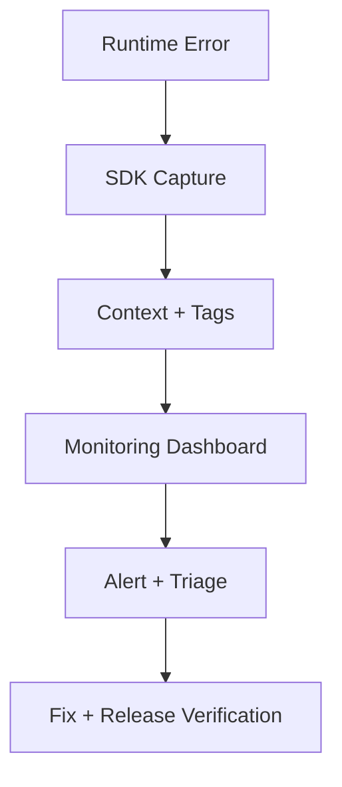

# Day 71 [Advanced]: Error Monitoring

## Index

- [Goal](#goal)
- [Prerequisites](#prerequisites)
- [Explanation](#explanation)
- [Topic by Topic](#topic-by-topic)
- [Key Concepts](#key-concepts)
- [Visual Concept Map](#visual-concept-map)
- [End-to-End Practical](#end-to-end-practical)
- [Hands-on Coding](#hands-on-coding)
- [Mini Exercise](#mini-exercise)
- [Assessment Quiz](#assessment-quiz)
- [Task](#task)
- [Self Check](#self-check)
- [Interview Questions and Answers](#interview-questions-and-answers)
- [Day 71 Outcome](#day-71-outcome)

## Goal

Implement frontend error monitoring so runtime failures are captured, triaged, and fixed faster.

## Prerequisites

- Day 70 completed
- Basic understanding of Error Boundaries and async API errors

## Explanation

Error monitoring converts production incidents into actionable diagnostics by capturing stack traces, user context, and release information.

## Topic by Topic

### Topic 1: Monitoring Fundamentals

Theory:
Monitoring tools capture runtime exceptions and performance anomalies.

Practical:
Set up SDK initialization in app bootstrap.

Code Example:

```jsx
Monitoring.init({ dsn: import.meta.env.VITE_MONITOR_DSN });
```

**Explanation:** Monitoring starts with SDK setup. If initialization is missing or incomplete, later errors will never reach the dashboard.

**Key Points:**

- Initialize monitoring as early as possible.
- Read DSN and environment values from config.
- Confirm setup with a safe test event.

### Topic 2: Capturing Exceptions

Theory:
Unhandled exceptions should be tracked automatically and manually.

Practical:
Capture API and custom business errors.

Code Example:

```jsx
Monitoring.captureException(error);
```

**Explanation:** Automatic capture helps with unexpected crashes, while manual capture helps you report handled failures with business context.

**Key Points:**

- Capture both unhandled and handled errors.
- Include business failures, not just crashes.
- Re-throw errors when UI flow still needs to handle them.

### Topic 3: Context and Breadcrumbs

Theory:
Metadata and breadcrumbs speed root-cause analysis.

Practical:
Attach route, user role, and action logs.

Code Example:

```jsx
Monitoring.setContext("route", { path: location.pathname });
```

**Explanation:** Context and breadcrumbs explain what the user was doing before the failure, which makes debugging far faster.

**Key Points:**

- Add route, user role, and flow context.
- Keep context relevant and compact.
- Use breadcrumbs to reconstruct user actions.

### Topic 4: Release and Environment Tagging

Theory:
Tags map issues to deployment and environment.

Practical:
Add release and env tags during init.

Code Example:

```jsx
Monitoring.setTag("release", "web-2.4.0");
```

**Explanation:** Release and environment tags help teams answer two key questions quickly: when did this start, and where is it happening?

**Key Points:**

- Tag production and staging separately.
- Tie issues to release versions.
- Use tags to speed rollback decisions.

### Topic 5: Alerting and Triage Workflow

Theory:
Monitoring is useful only when alerts trigger fast response.

Practical:
Define severity rules and triage checklist.

Code Example:

```jsx
// P1: checkout failures, P2: feature degradation, P3: minor UI issues
```

**Explanation:** Monitoring only adds value when alerts lead to clear action. Teams need severity rules so they do not treat every issue the same way.

**Key Points:**

- Define severity levels up front.
- Assign owners and response expectations.
- Review alert noise regularly.

### Topic 6: Scalability Decisions for Error Monitoring

Theory:
As projects grow, architectural and typing decisions should optimize team velocity, change safety, and long-term consistency.

Practical:
Document one design decision for this topic with tradeoff notes so future contributors understand why it was chosen.

Code Example:

`jsx
// Record architecture tradeoff and migration path in project docs.
`

**Explanation:** Monitoring choices should scale with the team. Writing down the tradeoff helps future contributors understand cost, coverage, and rollout decisions.

**Key Points:**

- Document what you monitor and why.
- Note tradeoffs like SDK cost or noise.
- Keep migration steps visible for future teams.

## Key Concepts

- Runtime observability
- Exception capture patterns
- Diagnostic context enrichment
- Release-aware issue tracking
- Incident triage workflow

- Scalable architecture thinking

## Visual Concept Map



## End-to-End Practical

1. Install and configure monitoring SDK.
2. Wrap app with error boundary integration.
3. Capture handled API exceptions.
4. Add user and release context.
5. Trigger test error and verify dashboard entry.

## Hands-on Coding

### Example 1: Case - SDK Initialization at App Entry

Scenario:
An education platform wants visibility into client crashes after releases.

```jsx
import * as Monitoring from "@acme/monitoring";

Monitoring.init({
  dsn: import.meta.env.VITE_MONITOR_DSN,
  environment: import.meta.env.MODE,
  release: "academy-web@1.12.0",
});
```

### Example 2: Case - Capture API Failure with Context

Scenario:
An order history page fails when backend returns malformed payload.

```jsx
async function fetchOrders(userId) {
  try {
    const res = await fetch(`/api/orders?user=${userId}`);
    if (!res.ok) throw new Error("Orders request failed");
    return await res.json();
  } catch (error) {
    Monitoring.setContext("orders", { userId });
    Monitoring.captureException(error);
    throw error;
  }
}
```

### Example 3: Case - Manual Test Exception Trigger

Scenario:
Team verifies monitoring setup before production rollout.

```jsx
function MonitoringTestButton() {
  return (
    <button
      onClick={() => {
        throw new Error("Test monitoring exception");
      }}
    >
      Trigger Test Error
    </button>
  );
}
```

## Mini Exercise

Scenario:
You are maintaining a payments dashboard with frequent third-party API instability.

Integrate monitoring, capture errors with route and user role context, and define one alerting rule for critical payment failures.

Expected output:

- Exceptions appear in monitoring dashboard
- Context fields help identify impacted flow
- Team has clear alert and triage path

## Assessment Quiz

### Quiz Questions

1. Why is error monitoring essential in production?
2. What is the benefit of adding release tags?
3. True or False: Monitoring only unhandled errors is enough.
4. What is a breadcrumb in monitoring?
5. What should happen after critical alert firing?

### Quiz Answers

1. It provides visibility into real user failures
2. Correlates issues to specific deployments
3. False
4. A timeline event that helps reconstruct user actions
5. Triage, assign owner, fix, and verify resolution

## Task

- Integrate monitoring SDK and trigger test exception
- Capture one handled error with context
- Complete mini exercise

## Self Check

- You can instrument React apps for production observability
- You can design basic incident response flow
- You can answer at least 4 out of 5 quiz questions correctly

## Interview Questions and Answers

### Beginner

**Question:** Why do frontend apps need monitoring?

**Answer:** To track runtime issues that users experience in production.

**Question:** What is a DSN in monitoring tools?

**Answer:** A project-specific endpoint/config key used to send telemetry.

### Middle

**Question:** What metadata should be attached to errors?

**Answer:** Route, user role/id, release version, and action context.

**Question:** How do Error Boundaries and monitoring work together?

**Answer:** Boundaries contain crashes while monitoring records diagnostics.

### Advanced

**Question:** How can alert fatigue be reduced?

**Answer:** Deduplicate issues, tune thresholds, and classify severity by business impact.

**Question:** What is a good production verification step after deploying a monitoring SDK?

**Answer:** Trigger a controlled test exception and validate end-to-end ingestion.

## Day 71 Outcome

- You can make runtime errors observable and actionable
- You can capture richer diagnostics for faster debugging
- You are ready for frontend security hardening in Day 72
