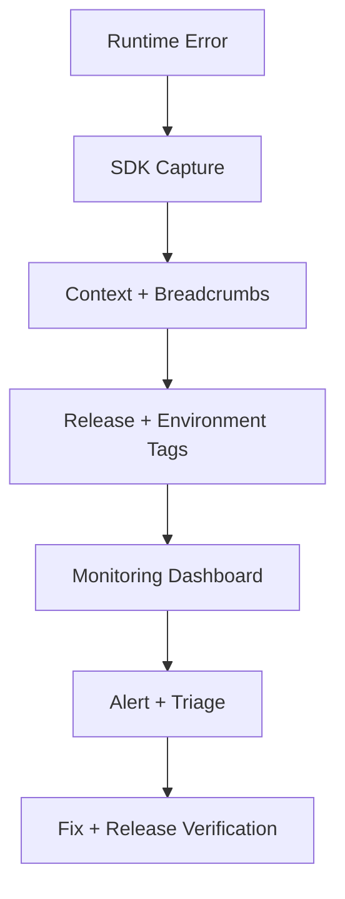

---
title: Error Monitoring
slug: day-071-error-monitoring
dayLabel: Day 71
level: Advanced
estimatedMinutes: 30
order: 71
track: react
---
# Day 71 [Advanced]: Error Monitoring

## Goal

Implement frontend error monitoring so runtime failures are captured, triaged, and fixed faster.

## Prerequisites

- Day 70 completed
- Basic understanding of Error Boundaries and async API errors

## Explanation

Error monitoring converts production incidents into actionable diagnostics by capturing stack traces, user context, release information, breadcrumbs, and environment details.

A production monitoring strategy should distinguish between crashes, handled exceptions, failed network requests, and expected business errors. The objective is not to report everything, but to capture failures with enough context to reproduce and prioritize them without leaking sensitive information.

## Topic by Topic

### Topic 1: Monitoring Fundamentals

Theory:
Monitoring tools capture runtime exceptions and performance anomalies. A monitoring SDK should be initialized early enough to observe application failures while remaining safe for local development and environments where telemetry is disabled.

Practical:
Set up SDK initialization in app bootstrap.

Code Example:

```jsx
Monitoring.init({
  dsn: import.meta.env.VITE_MONITOR_DSN,
  environment: import.meta.env.MODE,
  enabled: import.meta.env.PROD,
});
```

**Explanation:** Monitoring starts with SDK setup. If initialization is missing or incomplete, later errors will never reach the dashboard. Configuration should also be environment-aware so local development does not accidentally pollute production telemetry.

**Key Points:**

- Initialize monitoring as early as practical.
- Read DSN and environment values from configuration.
- Disable or isolate telemetry when it is not needed.
- Confirm setup with a safe test event.
- Never hard-code secrets or sensitive credentials in frontend source.

### Topic 2: Capturing Exceptions

Theory:
Unhandled exceptions should be tracked automatically, while handled failures should be captured deliberately when they represent an actionable production problem.

Practical:
Capture API and custom business errors.

Code Example:

```jsx
try {
  await saveOrder(order);
} catch (error) {
  Monitoring.captureException(error);
  throw error;
}
```

**Explanation:** Automatic capture helps with unexpected crashes, while manual capture helps you report handled failures with business context. Expected validation errors do not always need to be reported as exceptions; monitoring should focus on failures that require investigation.

**Key Points:**

- Capture both unhandled and meaningful handled errors.
- Include business failures when they indicate a system problem.
- Avoid reporting expected validation or cancellation events as exceptions.
- Re-throw errors when UI flow still needs to handle them.
- Prevent duplicate reporting when the same error is captured at multiple layers.

### Topic 3: Context and Breadcrumbs

Theory:
Metadata and breadcrumbs speed root-cause analysis by showing what the user was doing immediately before a failure.

Practical:
Attach route, user role, and action logs without collecting unnecessary personal information.

Code Example:

```jsx
Monitoring.setContext("route", { path: location.pathname });
Monitoring.addBreadcrumb({
  category: "checkout",
  message: "Payment button clicked",
});
```

**Explanation:** Context and breadcrumbs explain what the user was doing before the failure, which makes debugging far faster. Context should be useful but minimal; avoid passwords, access tokens, payment details, or unnecessary personal data.

**Key Points:**

- Add route, user role, and flow context where appropriate.
- Keep context relevant and compact.
- Use breadcrumbs to reconstruct important user actions.
- Redact sensitive values before sending telemetry.
- Use stable identifiers rather than exposing private user information.

### Topic 4: Release and Environment Tagging

Theory:
Tags map issues to deployment and environment, allowing teams to correlate regressions with releases.

Practical:
Add release and environment tags during initialization.

Code Example:

```jsx
Monitoring.setTag("release", "web-2.4.0");
Monitoring.setTag("environment", import.meta.env.MODE);
```

**Explanation:** Release and environment tags help teams answer two key questions quickly: when did this start, and where is it happening? Source maps should also be configured in the monitoring platform so minified production stack traces can be mapped back to readable source code.

**Key Points:**

- Tag production and staging separately.
- Tie issues to release versions or deployment identifiers.
- Use tags to speed rollback decisions.
- Upload source maps securely without exposing unnecessary source artifacts publicly.
- Compare error rates before and after releases.

### Topic 5: Alerting and Triage Workflow

Theory:
Monitoring is useful only when alerts trigger fast response. Alerts should be based on severity, frequency, affected users, and business impact rather than simply reporting every exception.

Practical:
Define severity rules and a triage checklist.

Code Example:

```jsx
// P1: checkout/payment outage
// P2: major feature degradation
// P3: low-impact or isolated UI issue
```

**Explanation:** Monitoring only adds value when alerts lead to clear action. Teams need severity rules so they do not treat every issue the same way. Alert ownership, escalation paths, and noise reduction are part of the monitoring design.

**Key Points:**

- Define severity levels up front.
- Assign owners and response expectations.
- Review alert noise regularly.
- Group duplicate errors into actionable issues.
- Track time to acknowledge and time to resolve critical incidents.

### Topic 6: Scalability Decisions for Error Monitoring

Theory:
As projects grow, architectural and operational decisions should optimize team velocity, change safety, observability coverage, privacy, and long-term consistency.

Practical:
Document one monitoring design decision with tradeoff notes so future contributors understand why it was chosen.

Code Example:

```jsx
const monitoringConfig = {
  environment: import.meta.env.MODE,
  sampleRate: import.meta.env.PROD ? 0.2 : 1,
  redactSensitiveData: true,
};
```

**Explanation:** Monitoring choices should scale with the team. Sampling can control telemetry volume, while redaction and retention policies protect user data. The exact configuration depends on the monitoring provider, application size, incident requirements, and compliance constraints.

**Key Points:**

- Document what you monitor and why.
- Note tradeoffs such as SDK cost, sampling, noise, and coverage.
- Protect sensitive data and define retention expectations.
- Keep migration and rollout steps visible for future teams.
- Review monitoring configuration as application traffic and architecture evolve.

## Key Concepts

- Runtime observability
- Exception capture patterns
- Diagnostic context enrichment
- Breadcrumbs and user-flow reconstruction
- Release-aware issue tracking
- Source-map-assisted debugging
- Incident triage workflow
- Privacy-aware telemetry
- Scalable architecture thinking

## Visual Concept Map



## End-to-End Practical

1. Install and configure monitoring SDK.
2. Initialize monitoring at application bootstrap.
3. Integrate Error Boundary reporting.
4. Capture meaningful handled API exceptions.
5. Add route, release, environment, and useful user-flow context.
6. Configure privacy-safe redaction and sampling.
7. Configure source maps for readable production stack traces.
8. Trigger a controlled test error and verify dashboard ingestion.
9. Define severity, ownership, and triage workflow.
10. Verify the next release has lower or stable error rates.

## Hands-on Coding

### Example 1: Case - SDK Initialization at App Entry

Scenario:
An education platform wants visibility into client crashes after releases.

```jsx
import * as Monitoring from "@acme/monitoring";

Monitoring.init({
  dsn: import.meta.env.VITE_MONITOR_DSN,
  environment: import.meta.env.MODE,
  release: "academy-web@1.12.0",
  enabled: import.meta.env.PROD,
});
```

### Example 2: Case - Capture API Failure with Context

Scenario:
An order history page fails when the backend returns an unsuccessful response or malformed payload.

```jsx
async function fetchOrders(userId) {
  try {
    const res = await fetch(`/api/orders?user=${userId}`);
    if (!res.ok) throw new Error("Orders request failed");

    const data = await res.json();
    if (!Array.isArray(data)) {
      throw new Error("Invalid orders response");
    }

    return data;
  } catch (error) {
    Monitoring.setContext("orders", { userId });
    Monitoring.captureException(error);
    throw error;
  }
}
```

### Example 3: Case - Manual Test Exception Trigger

Scenario:
The team verifies monitoring setup before production rollout.

```jsx
function MonitoringTestButton() {
  return (
    <button
      onClick={() => {
        throw new Error("Test monitoring exception");
      }}
    >
      Trigger Test Error
    </button>
  );
}
```

Use this only in a controlled non-production verification flow. A safer production smoke test can be a provider-supported test event rather than intentionally crashing a user-facing component.

## Mini Exercise

Scenario:
You are maintaining a payments dashboard with frequent third-party API instability.

Integrate monitoring, capture errors with route and user role context, redact sensitive fields, and define one alerting rule for critical payment failures.

Expected output:

- Exceptions appear in monitoring dashboard
- Context fields help identify the impacted flow
- Sensitive values are not sent as telemetry
- Team has a clear alert and triage path
- Release information helps correlate regressions

## Assessment Quiz

### Quiz Questions

1. Why is error monitoring essential in production?
2. What is the benefit of adding release tags?
3. True or False: Monitoring only unhandled errors is enough.
4. What is a breadcrumb in monitoring?
5. What should happen after a critical alert fires?
6. Why are source maps useful for production error monitoring?
7. Why should sensitive data be redacted from telemetry?
8. What is the purpose of sampling error or performance events?

### Quiz Answers

1. It provides visibility into real user failures and helps teams prioritize and diagnose production incidents.
2. It correlates issues with specific deployments and helps identify regressions introduced by a release.
3. False.
4. A timeline event that helps reconstruct important user actions before an error.
5. Triage, assign an owner, investigate, fix, deploy, and verify resolution.
6. They map minified production stack traces back to readable source locations.
7. Telemetry can contain user or application data, so redaction reduces privacy and security risk.
8. Sampling controls telemetry volume and cost while retaining enough data to identify important patterns.

## Task

- Integrate monitoring SDK and trigger a controlled test exception
- Capture one meaningful handled error with context
- Add release and environment information
- Configure privacy-safe telemetry/redaction
- Complete mini exercise

## Self Check

- You can instrument React apps for production observability
- You can capture and enrich meaningful runtime errors
- You understand release tagging and source-map debugging
- You can design a basic incident response flow
- You understand privacy and sampling considerations
- You can answer at least 6 out of 8 quiz questions correctly

## Interview Questions and Answers

### Beginner

**Question:** Why do frontend apps need monitoring?

**Answer:** To track runtime issues that users experience in production and provide enough diagnostic information to investigate them.

**Question:** What is a DSN in monitoring tools?

**Answer:** A project-specific endpoint or configuration value used by a monitoring SDK to send telemetry to the correct project.

### Middle

**Question:** What metadata should be attached to errors?

**Answer:** Route, release, environment, relevant user/tenant context, and action context, while avoiding sensitive or unnecessary personal data.

**Question:** How do Error Boundaries and monitoring work together?

**Answer:** Error Boundaries prevent supported rendering failures from taking down the entire React UI, while monitoring records the exception and diagnostic context for investigation.

### Advanced

**Question:** How can alert fatigue be reduced?

**Answer:** Deduplicate issues, tune thresholds, group related events, classify severity by business impact, assign ownership, and regularly review noisy alerts.

**Question:** What is a good production verification step after deploying a monitoring SDK?

**Answer:** Trigger a controlled test event in a safe environment or provider-supported verification flow and validate end-to-end ingestion, release metadata, and source-map resolution.

**Question:** How should sensitive user data be handled in frontend telemetry?

**Answer:** Collect only what is necessary, redact secrets and sensitive fields before transmission, avoid credentials and payment data, and apply appropriate retention/access controls.

**Question:** How would you investigate a sudden increase in frontend errors after a release?

**Answer:** Compare error rate and affected users before and after the release, group issues by stack trace and release, inspect breadcrumbs/context, verify source maps, identify the regression, and either roll back or deploy a targeted fix followed by release verification.

## Day 71 Outcome

- You can make runtime errors observable and actionable
- You can capture richer diagnostics for faster debugging
- You can correlate production failures with releases and environments
- You can design privacy-aware monitoring and alerting workflows
- You are ready for frontend security hardening in Day 72
