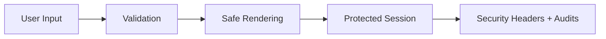

# Day 72 [Advanced]: Security Basics

## Index

- [Goal](#goal)
- [Prerequisites](#prerequisites)
- [Explanation](#explanation)
- [Topic by Topic](#topic-by-topic)
- [Key Concepts](#key-concepts)
- [Visual Concept Map](#visual-concept-map)
- [End-to-End Practical](#end-to-end-practical)
- [Hands-on Coding](#hands-on-coding)
- [Mini Exercise](#mini-exercise)
- [Assessment Quiz](#assessment-quiz)
- [Task](#task)
- [Self Check](#self-check)
- [Interview Questions and Answers](#interview-questions-and-answers)
- [Day 72 Outcome](#day-72-outcome)

## Goal

Establish core frontend security hygiene by preventing common vulnerabilities in React applications.

## Prerequisites

- Day 71 completed
- Basic auth flow and API integration knowledge

## Explanation

Frontend security focuses on minimizing attack surfaces: unsafe rendering, insecure token handling, unvalidated inputs, and overly exposed client logic.

## Topic by Topic

### Topic 1: XSS Prevention Basics

Theory:
Cross-site scripting often enters through unsafe HTML rendering.

Practical:
Avoid raw HTML unless sanitized.

Code Example:

```jsx
<p>{userComment}</p>
```

**Explanation:** React escapes normal text output by default, which is why plain JSX rendering is safer than raw HTML injection.

**Key Points:**

- Prefer safe text rendering by default.
- Avoid raw HTML unless sanitized.
- Review all user-generated content paths.

### Topic 2: Safe Token Handling

Theory:
Tokens in accessible storage are vulnerable to script access.

Practical:
Prefer secure cookie strategy with backend support.

Code Example:

```jsx
// Keep sensitive tokens out of localStorage when possible.
```

**Explanation:** If malicious JavaScript runs in the page, browser-accessible tokens are easier to steal. That is why secure cookie strategies are usually safer.

**Key Points:**

- Minimize token exposure to JavaScript.
- Prefer backend-managed secure sessions when possible.
- Treat storage choices as security decisions.

### Topic 3: Input Validation and Output Encoding

Theory:
Validate on both client and server; never trust user input.

Practical:
Apply schema validation before submit.

Code Example:

```jsx
const parsed = schema.safeParse(formData);
```

**Explanation:** Validation should happen before sending data, but client checks do not replace server checks. They improve UX and reduce bad requests.

**Key Points:**

- Validate input early on client side.
- Re-validate on server side too.
- Keep schemas close to form contracts.

### Topic 4: Dependency and Supply-chain Safety

Theory:
Frontend dependencies can introduce vulnerabilities.

Practical:
Audit dependencies and remove unused risky packages.

Code Example:

```jsx
// Run regular dependency audits in CI.
```

**Explanation:** Frontend security includes your dependency tree. Vulnerable packages can create risk even when your own code looks correct.

**Key Points:**

- Audit dependencies regularly.
- Remove unused packages quickly.
- Track security updates in CI or release process.

### Topic 5: Security Headers and CSP Collaboration

Theory:
Headers like CSP, HSTS, and X-Frame-Options strengthen protection.

Practical:
Coordinate frontend requirements with backend/infrastructure.

Code Example:

```jsx
// Example policy: script-src 'self' trusted-cdn.example
```

**Explanation:** Security headers are often configured outside React, but frontend teams still need to know what scripts, frames, and origins the app depends on.

**Key Points:**

- Coordinate CSP with platform teams.
- Avoid relying on broad unsafe rules.
- Treat headers as part of app design.

### Topic 6: Scalability Decisions for Security Basics

Theory:
As projects grow, architectural and typing decisions should optimize team velocity, change safety, and long-term consistency.

Practical:
Document one design decision for this topic with tradeoff notes so future contributors understand why it was chosen.

Code Example:

`jsx
// Record architecture tradeoff and migration path in project docs.
`

**Explanation:** Security decisions age quickly as products grow. Writing down tradeoffs helps teams avoid repeating risky choices without context.

**Key Points:**

- Document security-sensitive decisions.
- Note safer future migration paths.
- Revisit decisions as threat model changes.

## Key Concepts

- XSS risk reduction
- Safe authentication token strategy
- Input validation discipline
- Dependency security posture
- Platform-level defense in depth

- Scalable architecture thinking

## Visual Concept Map



## End-to-End Practical

1. Audit one feature for unsafe rendering patterns.
2. Replace insecure token storage approach.
3. Add client-side schema validation.
4. Verify dependencies and known vulnerabilities.
5. Document required headers/security checklist.

## Hands-on Coding

### Example 1: Case - Replace Unsafe HTML Rendering

Scenario:
A community app displays user posts and currently injects raw HTML.

```jsx
function SafeComment({ text }) {
  return <p>{text}</p>;
}
```

### Example 2: Case - Validation Before API Submit

Scenario:
A support portal receives malicious payloads in ticket title field.

```jsx
import { z } from "zod";

const ticketSchema = z.object({
  title: z.string().min(5).max(120),
  description: z.string().min(20),
});

function submitTicket(payload) {
  const parsed = ticketSchema.safeParse(payload);
  if (!parsed.success) return { ok: false, errors: parsed.error.flatten() };
  return fetch("/api/tickets", {
    method: "POST",
    body: JSON.stringify(parsed.data),
  });
}
```

### Example 3: Case - Session-aware API Calls

Scenario:
An internal HR tool uses cookie-based session and avoids exposing auth token to JS.

```jsx
async function getProfile() {
  const res = await fetch("/api/profile", {
    credentials: "include",
  });
  return res.json();
}
```

## Mini Exercise

Scenario:
You are reviewing a blog admin panel for security hygiene.

Identify one unsafe rendering issue, one weak session/token handling practice, and one missing input validation path. Fix all three.

Expected output:

- Unsafe rendering path removed
- Session handling approach improved
- Input validation enforced before API call

## Assessment Quiz

### Quiz Questions

1. What is the common React anti-pattern that can lead to XSS?
2. Why should token exposure to JavaScript be minimized?
3. True or False: Client-side validation alone is sufficient for security.
4. Why are dependency audits important?
5. What does CSP help control?

### Quiz Answers

1. Rendering unsanitized user HTML directly
2. Script access risk increases account takeover impact
3. False
4. Third-party packages may contain known vulnerabilities
5. Which scripts/resources are allowed to execute/load

## Task

- Audit for unsafe rendering/token handling and fix one issue
- Add one validation hardening improvement
- Complete mini exercise

## Self Check

- You can identify major frontend security risks
- You can apply practical mitigation patterns in React
- You can answer at least 4 out of 5 quiz questions correctly

## Interview Questions and Answers

### Beginner

**Question:** What is XSS in frontend context?

**Answer:** Injection of malicious scripts into pages viewed by users.

**Question:** Why avoid unnecessary HTML injection?

**Answer:** It can execute attacker-controlled script content.

### Middle

**Question:** How do you improve session security from frontend side?

**Answer:** Prefer secure cookie-based session handling and limit token exposure.

**Question:** Why combine client and server validation?

**Answer:** Client improves UX, server enforces trust boundary.

### Advanced

**Question:** How does CSP complement React security?

**Answer:** It restricts executable resource origins and reduces script injection impact.

**Question:** What process keeps frontend security sustainable?

**Answer:** Continuous audits, dependency scanning, secure code review, and threat modeling.

## Day 72 Outcome

- You can improve frontend security baseline with practical mitigations
- You can audit and harden common risk areas
- You are ready for TypeScript fundamentals in Day 73
