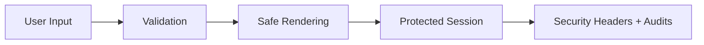

---
title: Security Basics
slug: day-072-security-basics
dayLabel: Day 72
level: Advanced
estimatedMinutes: 30
order: 72
track: react
---
# Day 72 [Advanced]: Security Basics

## Goal

Establish core frontend security hygiene by preventing common vulnerabilities in React applications and understanding where frontend controls end and backend/platform controls begin.

## Prerequisites

- Day 71 completed
- Basic auth flow and API integration knowledge

## Explanation

Frontend security focuses on minimizing attack surfaces: unsafe rendering, insecure token handling, unvalidated inputs, vulnerable dependencies, weak browser policies, and overly exposed client logic.

A secure React application follows defense in depth. React's escaping behavior helps with normal text rendering, but it does not make an application automatically secure. Authentication, authorization, server-side validation, HTTP security headers, dependency management, and secure API design remain essential.

## Topic by Topic

### Topic 1: XSS Prevention Basics

Theory:
Cross-site scripting often enters through unsafe HTML rendering or other paths where attacker-controlled content becomes executable markup.

Practical:
Avoid raw HTML unless there is a clear requirement and the content has been safely sanitized.

Code Example:

```jsx
<p>{userComment}</p>
```

**Explanation:** React escapes normal text output by default, which is why plain JSX rendering is safer than raw HTML injection. Be especially careful with `dangerouslySetInnerHTML`, third-party HTML renderers, and content coming from untrusted sources.

**Key Points:**

- Prefer safe text rendering by default.
- Avoid raw HTML unless sanitized with a trusted approach.
- Review all user-generated content paths.
- Do not assume client-side escaping replaces server-side security controls.

### Topic 2: Safe Token Handling

Theory:
Tokens accessible to JavaScript are vulnerable to theft if malicious script executes in the application's origin.

Practical:
Prefer secure, appropriately scoped cookie-based session strategies with backend support when the architecture allows it.

Code Example:

```jsx
// Keep sensitive tokens out of localStorage when possible.
```

**Explanation:** If malicious JavaScript runs in the page, browser-accessible tokens are easier to steal. HttpOnly cookies can prevent JavaScript from directly reading a session cookie, while `Secure`, `SameSite`, expiration, and appropriate cookie scope provide additional protection. Cookie-based authentication still requires appropriate CSRF defenses for state-changing requests.

**Key Points:**

- Minimize token exposure to JavaScript.
- Prefer backend-managed secure sessions when possible.
- Treat storage choices as security decisions.
- Consider CSRF protection when using cookies for authentication.

### Topic 3: Input Validation and Output Encoding

Theory:
Validate on both client and server; never trust user input.

Practical:
Apply schema validation before submit while keeping server-side validation as the final trust boundary.

Code Example:

```jsx
const parsed = schema.safeParse(formData);
```

**Explanation:** Validation should happen before sending data, but client checks do not replace server checks. They improve UX and reduce bad requests. Server-side validation must enforce authorization, business rules, size limits, and data integrity regardless of what the browser sends.

**Key Points:**

- Validate input early on client side.
- Re-validate on server side too.
- Keep schemas close to form contracts.
- Enforce authorization and business rules on the server.

### Topic 4: Dependency and Supply-chain Safety

Theory:
Frontend dependencies can introduce vulnerabilities, malicious code, licensing concerns, or unexpected transitive dependencies.

Practical:
Audit dependencies, remove unused risky packages, keep lockfiles consistent, and review important security advisories.

Code Example:

```jsx
// Run regular dependency audits in CI.
```

**Explanation:** Frontend security includes your dependency tree. Vulnerable packages can create risk even when your own code looks correct. Dependency scanning should be combined with sensible update policies and review of package provenance.

**Key Points:**

- Audit dependencies regularly.
- Remove unused packages quickly.
- Keep lockfiles committed and reproducible.
- Track security updates in CI or the release process.

### Topic 5: Security Headers and CSP Collaboration

Theory:
Headers such as Content-Security-Policy (CSP), Strict-Transport-Security (HSTS), and frame-related protections strengthen defense in depth.

Practical:
Coordinate frontend requirements with backend and infrastructure teams before enforcing restrictive policies in production.

Code Example:

```jsx
// Example policy concept: script-src 'self' trusted-cdn.example
```

**Explanation:** Security headers are often configured outside React, but frontend teams need to know what scripts, frames, connections, and origins the app depends on. CSP should be introduced carefully, ideally starting with reporting/observation and then tightening the policy as dependencies are understood.

**Key Points:**

- Coordinate CSP with platform teams.
- Avoid relying on broad unsafe rules.
- Treat headers as part of app design.
- Use HTTPS and strong transport policies in production.

### Topic 6: Scalability Decisions for Security Basics

Theory:
As projects grow, security decisions should optimize change safety, consistency, observability, and long-term maintainability rather than relying on individual developer habits.

Practical:
Document one security-sensitive design decision with tradeoff notes, ownership, and a safer migration path so future contributors understand why it was chosen.

Code Example:

```jsx
// Record security tradeoff and migration path in project docs.
```

**Explanation:** Security decisions age quickly as products grow. Writing down tradeoffs helps teams avoid repeating risky choices without context and makes security review part of normal engineering work.

**Key Points:**

- Document security-sensitive decisions.
- Note safer future migration paths.
- Revisit decisions as the threat model changes.
- Prefer repeatable security controls over manual checks.

## Key Concepts

- XSS risk reduction
- Safe authentication token strategy
- Input validation discipline
- Dependency security posture
- Platform-level defense in depth
- Security headers and CSP
- CSRF awareness for cookie-based authentication
- Scalable security decision-making

## Visual Concept Map



## End-to-End Practical

1. Audit one feature for unsafe rendering patterns.
2. Review and improve the token/session storage approach.
3. Add client-side schema validation.
4. Verify server-side validation and authorization remain enforced.
5. Check dependencies and known vulnerabilities.
6. Document required security headers and browser-policy requirements.
7. Record one security-sensitive architecture decision and its tradeoffs.

## Hands-on Coding

### Example 1: Case - Replace Unsafe HTML Rendering

Scenario:
A community app displays user posts and currently injects raw HTML.

```jsx
function SafeComment({ text }) {
  return <p>{text}</p>;
}
```

### Example 2: Case - Validation Before API Submit

Scenario:
A support portal receives malicious or invalid payloads in the ticket title field.

```jsx
import { z } from "zod";

const ticketSchema = z.object({
  title: z.string().min(5).max(120),
  description: z.string().min(20),
});

function submitTicket(payload) {
  const parsed = ticketSchema.safeParse(payload);
  if (!parsed.success) {
    return { ok: false, errors: parsed.error.flatten() };
  }

  return fetch("/api/tickets", {
    method: "POST",
    headers: { "Content-Type": "application/json" },
    body: JSON.stringify(parsed.data),
  });
}
```

### Example 3: Case - Session-aware API Calls

Scenario:
An internal HR tool uses a cookie-based session and avoids exposing the authentication token to JavaScript.

```jsx
async function getProfile() {
  const res = await fetch("/api/profile", {
    credentials: "include",
  });

  if (!res.ok) {
    throw new Error("Unable to load profile");
  }

  return res.json();
}
```

## Mini Exercise

Scenario:
You are reviewing a blog admin panel for security hygiene.

Identify one unsafe rendering issue, one weak session/token handling practice, one missing input validation path, and one dependency or security-header gap. Fix or document all four.

Expected output:

- Unsafe rendering path removed
- Session handling approach improved
- Input validation enforced before API call
- Dependency/header risk identified and addressed or documented

## Assessment Quiz

### Quiz Questions

1. What is the common React anti-pattern that can lead to XSS?
2. Why should token exposure to JavaScript be minimized?
3. True or False: Client-side validation alone is sufficient for security.
4. Why are dependency audits important?
5. What does CSP help control?
6. Why can HttpOnly cookies improve session security?
7. Why is server-side authorization still required when the UI hides protected actions?
8. What is an important concern when adopting cookie-based authentication?

### Quiz Answers

1. Rendering unsanitized user-controlled HTML directly, commonly through raw HTML injection APIs.
2. If malicious JavaScript executes in the application origin, browser-accessible tokens may be stolen.
3. False.
4. Third-party and transitive packages may contain known vulnerabilities or risky code.
5. Which scripts and other resource sources the browser is allowed to load or execute.
6. JavaScript cannot directly read an HttpOnly cookie, reducing token theft through script access.
7. Attackers can call APIs directly without using the UI, so authorization must be enforced at the server trust boundary.
8. State-changing requests need appropriate CSRF protection and cookie configuration.

## Task

- Audit for unsafe rendering and token/session handling and fix one issue
- Add one validation hardening improvement
- Review one dependency or security-header concern
- Document one security-sensitive design decision
- Complete mini exercise

## Self Check

- You can identify major frontend security risks
- You can apply practical mitigation patterns in React
- You understand the boundary between frontend validation and server enforcement
- You can explain secure session/token storage tradeoffs
- You can answer at least 6 out of 8 quiz questions correctly

## Interview Questions and Answers

### Beginner

**Question:** What is XSS in frontend context?

**Answer:** Injection of malicious scripts or markup into content that is rendered to users.

**Question:** Why avoid unnecessary HTML injection?

**Answer:** It can turn attacker-controlled content into executable markup and increase XSS risk.

### Middle

**Question:** How do you improve session security from frontend side?

**Answer:** Prefer secure, appropriately scoped cookie-based sessions when suitable, minimize token exposure to JavaScript, use HTTPS, and coordinate CSRF protections with the backend.

**Question:** Why combine client and server validation?

**Answer:** Client validation improves UX and catches errors early, while server validation enforces the actual security and trust boundary.

### Advanced

**Question:** How does CSP complement React security?

**Answer:** CSP restricts where executable resources can come from and can reduce the impact of certain script-injection attacks. It complements, rather than replaces, safe rendering and secure application design.

**Question:** What process keeps frontend security sustainable?

**Answer:** Continuous dependency scanning, secure code review, threat modeling, security testing, incident monitoring, and periodic review of authentication and browser policies.

**Question:** Why isn't hiding an admin button a security control?

**Answer:** A malicious user can bypass the UI and call the protected API directly. Authorization must be enforced by the backend for every protected operation.

**Question:** What should you consider before choosing localStorage versus cookies for authentication?

**Answer:** Consider XSS exposure, CSRF implications, token lifetime, cookie attributes, architecture, refresh strategy, and backend support. There is no single storage choice that removes every security risk.

## Day 72 Outcome

- You can improve frontend security baseline with practical mitigations
- You can audit and harden common risk areas
- You understand secure session, validation, dependency, and browser-policy fundamentals
- You are ready for TypeScript fundamentals in Day 73
