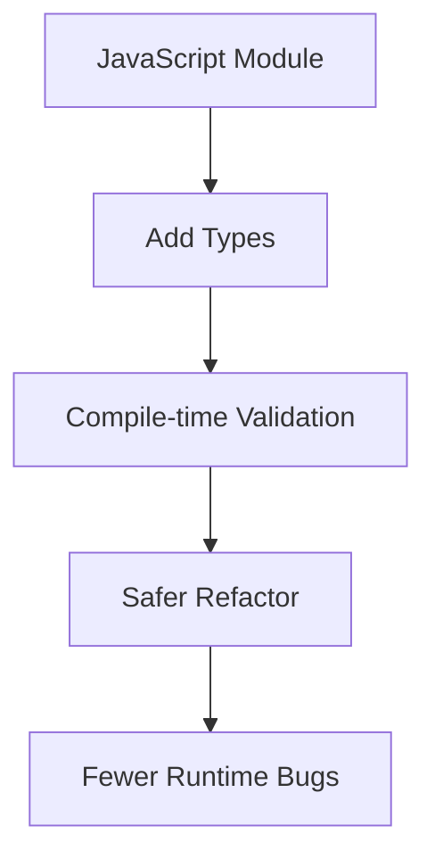

# Day 73 [Advanced]: TypeScript Basics

## Index

- [Goal](#goal)
- [Prerequisites](#prerequisites)
- [Explanation](#explanation)
- [Topic by Topic](#topic-by-topic)
- [Key Concepts](#key-concepts)
- [Visual Concept Map](#visual-concept-map)
- [End-to-End Practical](#end-to-end-practical)
- [Hands-on Coding](#hands-on-coding)
- [Mini Exercise](#mini-exercise)
- [Assessment Quiz](#assessment-quiz)
- [Task](#task)
- [Self Check](#self-check)
- [Interview Questions and Answers](#interview-questions-and-answers)
- [Day 73 Outcome](#day-73-outcome)

## Goal

Learn core TypeScript patterns to improve safety, maintainability, and refactoring confidence in frontend modules.

## Prerequisites

- Day 72 completed
- Solid JavaScript fundamentals

## Explanation

TypeScript adds static typing on top of JavaScript, helping detect errors at build time and documenting data contracts clearly.

## Topic by Topic

### Topic 1: Primitive and Object Types

Theory:
Types define valid shape and values.

Practical:
Type user model and function params.

Code Example:

```ts
type User = { id: number; name: string; active: boolean };
```

**Explanation:** Types make your data shape explicit. That means teammates and tools can both understand what values are expected.

**Key Points:**

- Type both primitives and object shapes.
- Keep type names readable and meaningful.
- Use types to reduce guesswork in large codebases.

### Topic 2: Arrays, Unions, and Literals

Theory:
Unions represent multiple allowed value sets.

Practical:
Use status union instead of free-form strings.

Code Example:

```ts
type Status = "idle" | "loading" | "success" | "error";
```

**Explanation:** Unions are safer than loose strings because they restrict values to known valid states.

**Key Points:**

- Use unions for finite UI states.
- Prevent invalid string values at compile time.
- Improve refactor safety for state-driven logic.

### Topic 3: Function Typing

Theory:
Explicit return and param types reduce ambiguity.

Practical:
Type utility module strictly.

Code Example:

```ts
function add(a: number, b: number): number {
  return a + b;
}
```

**Explanation:** Typed function inputs and outputs clarify how a helper should be used and what it promises to return.

**Key Points:**

- Type parameters and return values clearly.
- Catch mismatch errors before runtime.
- Keep utility contracts small and explicit.

### Topic 4: Interfaces and Reuse

Theory:
Interfaces help define reusable contracts.

Practical:
Use shared interfaces for API objects.

Code Example:

```ts
interface Product {
  id: string;
  title: string;
  price: number;
}
```

**Explanation:** Interfaces help you reuse the same contract in components, API layers, and helper functions.

**Key Points:**

- Reuse shared data contracts.
- Keep models consistent across modules.
- Avoid duplicate shape definitions.

### Topic 5: Strict Mode and Any Avoidance

Theory:
`any` removes type safety and should be minimized.

Practical:
Enable strict checks and fix inference gaps.

Code Example:

```ts
// tsconfig: "strict": true
```

**Explanation:** Strict mode pushes the codebase toward safer assumptions. It may feel harder at first, but it prevents many silent type holes.

**Key Points:**

- Enable strict mode early.
- Reduce `any` wherever possible.
- Fix inference gaps instead of suppressing them.

### Topic 6: Scalability Decisions for TypeScript Basics

Theory:
As projects grow, architectural and typing decisions should optimize team velocity, change safety, and long-term consistency.

Practical:
Document one design decision for this topic with tradeoff notes so future contributors understand why it was chosen.

Code Example:

`jsx
// Record architecture tradeoff and migration path in project docs.
`

**Explanation:** TypeScript strategy should be deliberate in large codebases. Documenting tradeoffs helps teams migrate consistently instead of mixing styles randomly.

**Key Points:**

- Document where types live and why.
- Explain migration rules from JS to TS.
- Keep team conventions consistent over time.

## Key Concepts

- Static type checking
- Type composition and unions
- Function and object contracts
- Reusable interfaces
- Strict typing discipline

- Scalable architecture thinking

## Visual Concept Map



## End-to-End Practical

1. Pick one JS helper module.
2. Rename file to `.ts`.
3. Add explicit types to data and functions.
4. Remove `any` usage.
5. Compile and fix strict-mode issues.

## Hands-on Coding

### Example 1: Case - Typing an API Response Model

Scenario:
A learning app consumes course API and needs safe model access.

```ts
type Course = {
  id: string;
  title: string;
  lessons: number;
  published: boolean;
};

function getCourseTitle(course: Course): string {
  return course.title;
}
```

### Example 2: Case - Union for UI State

Scenario:
A dashboard status flag should allow only known values.

```ts
type LoadState = "idle" | "pending" | "success" | "error";

function renderStatus(state: LoadState): string {
  if (state === "pending") return "Loading";
  if (state === "success") return "Done";
  if (state === "error") return "Failed";
  return "Idle";
}
```

### Example 3: Case - Strictly Typed Utility Module

Scenario:
An e-commerce app needs reliable cart math utilities.

```ts
type CartItem = { price: number; qty: number };

export function calculateTotal(items: CartItem[]): number {
  return items.reduce((sum, item) => sum + item.price * item.qty, 0);
}
```

## Mini Exercise

Scenario:
You are migrating a `payments.js` helper with parsing and summary functions.

Convert to TypeScript, define interfaces for payment records, and eliminate all `any` usage.

Expected output:

- Module compiles in strict mode
- Function signatures are explicit
- Data contracts are reusable and clear

## Assessment Quiz

### Quiz Questions

1. What is the biggest benefit of TypeScript in large codebases?
2. Why are unions better than generic strings for status flags?
3. True or False: `any` increases type safety.
4. What does strict mode encourage?
5. Why type API response objects?

### Quiz Answers

1. Early error detection and safer refactoring
2. They constrain values to valid states
3. False
4. Explicit contracts and fewer silent type holes
5. Prevent unsafe property access and mismatched assumptions

## Task

- Convert one JS module to TS with strict typing
- Remove avoidable `any` usage
- Complete mini exercise

## Self Check

- You can migrate JavaScript modules into strongly typed TypeScript
- You can design reusable type contracts
- You can answer at least 4 out of 5 quiz questions correctly

## Interview Questions and Answers

### Beginner

**Question:** Why use TypeScript with React?

**Answer:** It catches many bugs during development and improves code clarity.

**Question:** What is a union type?

**Answer:** A type that allows one value from a defined set.

### Middle

**Question:** How do interfaces help in team projects?

**Answer:** They standardize contracts across modules and reduce misunderstandings.

**Question:** What is a practical way to reduce `any`?

**Answer:** Start from function boundaries, then type inputs/outputs incrementally.

### Advanced

**Question:** How does strict mode influence architecture quality?

**Answer:** It forces explicit data modeling and exposes hidden coupling early.

**Question:** What is a safe migration strategy for JS-to-TS at scale?

**Answer:** Migrate feature by feature with strict settings and CI type checks.

## Day 73 Outcome

- You can apply TypeScript fundamentals in real modules
- You can enforce stricter data and function contracts
- You are ready for typed React components in Day 74
