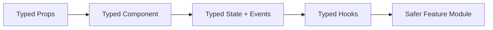

# Day 74 [Advanced]: React + TypeScript

## Index

- [Goal](#goal)
- [Prerequisites](#prerequisites)
- [Explanation](#explanation)
- [Topic by Topic](#topic-by-topic)
- [Key Concepts](#key-concepts)
- [Visual Concept Map](#visual-concept-map)
- [End-to-End Practical](#end-to-end-practical)
- [Hands-on Coding](#hands-on-coding)
- [Mini Exercise](#mini-exercise)
- [Assessment Quiz](#assessment-quiz)
- [Task](#task)
- [Self Check](#self-check)
- [Interview Questions and Answers](#interview-questions-and-answers)
- [Day 74 Outcome](#day-74-outcome)

## Goal

Type React components end-to-end, including props, state, events, and hooks for production-grade reliability.

## Prerequisites

- Day 73 completed
- Comfort with TypeScript basics and React component patterns

## Explanation

React + TypeScript improves UI contract safety by validating component props and internal state transitions at compile time.

## Topic by Topic

### Topic 1: Typed Props

Theory:
Props should be explicit contracts.

Practical:
Define component props interface.

Code Example:

```tsx
type CardProps = { title: string; onOpen: () => void };
```

**Explanation:** Typed props turn a component API into an explicit contract, which reduces misuse and improves autocomplete.

**Key Points:**

- Type props for every reusable component.
- Keep prop names and types intentional.
- Catch missing or wrong props early.

### Topic 2: Typed State and Setters

Theory:
State type inference is useful but explicit unions improve clarity.

Practical:
Type nullable and union state.

Code Example:

```tsx
const [mode, setMode] = useState<"view" | "edit">("view");
```

**Explanation:** Explicit state types are especially helpful for nullable values, unions, and complex feature modes.

**Key Points:**

- Let inference help when simple.
- Add explicit types when state meaning matters.
- Use unions to model allowed UI states.

### Topic 3: Typed Events

Theory:
Event generics prevent incorrect target access.

Practical:
Type form and input handlers.

Code Example:

```tsx
const onChange = (e: React.ChangeEvent<HTMLInputElement>) =>
  setName(e.target.value);
```

**Explanation:** Typed events tell TypeScript exactly which element triggered the handler, so field access stays safe.

**Key Points:**

- Type form and input events directly.
- Avoid guessing event target shape.
- Use React event generics consistently.

### Topic 4: Typed Custom Hooks

Theory:
Hooks should expose typed return contracts.

Practical:
Define hook return type for reusable logic.

Code Example:

```tsx
function useToggle(initial = false): [boolean, () => void] { ... }
```

**Explanation:** Custom hooks are easier to reuse when their return shape is obvious and stable.

**Key Points:**

- Type hook parameters and return values.
- Keep hook contracts small and predictable.
- Improve consumer confidence with explicit signatures.

### Topic 5: Generic Components

Theory:
Generics support reusable typed UI abstractions.

Practical:
Build typed list component.

Code Example:

```tsx
function List<T>({ items, renderItem }: { items: T[]; renderItem: (item: T) => React.ReactNode }) { ... }
```

**Explanation:** Generics let one component stay reusable without losing type safety for the specific data it renders.

**Key Points:**

- Use generics for reusable abstractions.
- Preserve type information across props.
- Avoid falling back to `any` in shared UI.

### Topic 6: Scalability Decisions for React + TypeScript

Theory:
As projects grow, architectural and typing decisions should optimize team velocity, change safety, and long-term consistency.

Practical:
Document one design decision for this topic with tradeoff notes so future contributors understand why it was chosen.

Code Example:

`jsx
// Record architecture tradeoff and migration path in project docs.
`

**Explanation:** Typed React systems grow better when conventions are shared. Architecture notes keep the team aligned on prop, hook, and model patterns.

**Key Points:**

- Document team typing patterns.
- Note tradeoffs for strictness versus speed.
- Keep React and TS conventions easy to follow.

## Key Concepts

- Typed props contracts
- Stateful union safety
- Event typing correctness
- Hook return signatures
- Generic reusable components

- Scalable architecture thinking

## Visual Concept Map



## End-to-End Practical

1. Select one feature built in plain JS React.
2. Convert components to `.tsx`.
3. Type props, events, and local state.
4. Add typed custom hooks and utility helpers.
5. Ensure zero implicit any warnings.

## Hands-on Coding

### Example 1: Case - Typed Product Card Component

Scenario:
A marketplace card requires strict props to prevent rendering invalid product data.

```tsx
type Product = {
  id: string;
  name: string;
  price: number;
};

type ProductCardProps = {
  product: Product;
  onAdd: (id: string) => void;
};

function ProductCard({ product, onAdd }: ProductCardProps) {
  return (
    <div>
      <h3>{product.name}</h3>
      <p>{product.price}</p>
      <button onClick={() => onAdd(product.id)}>Add</button>
    </div>
  );
}
```

### Example 2: Case - Typed Form Event Handling

Scenario:
A profile edit form should update typed state safely.

```tsx
function ProfileEditor() {
  const [name, setName] = React.useState<string>("");

  const onNameChange = (e: React.ChangeEvent<HTMLInputElement>) => {
    setName(e.target.value);
  };

  return <input value={name} onChange={onNameChange} />;
}
```

### Example 3: Case - Generic Table Component

Scenario:
A reporting feature needs one reusable table for different row types.

```tsx
type GenericTableProps<T> = {
  rows: T[];
  renderRow: (row: T, index: number) => React.ReactNode;
};

function GenericTable<T>({ rows, renderRow }: GenericTableProps<T>) {
  return <div>{rows.map((row, i) => renderRow(row, i))}</div>;
}
```

## Mini Exercise

Scenario:
You are converting an inventory management feature from JSX to TSX.

Type all props, component state, event handlers, and one reusable generic list/table component.

Expected output:

- Feature compiles with strict checks
- Runtime prop mismatch risks are reduced
- Shared UI abstraction supports multiple typed models

## Assessment Quiz

### Quiz Questions

1. Why explicitly type component props?
2. What is a common benefit of event typing?
3. True or False: Generics are only for backend code.
4. Why type custom hook return values?
5. What does implicit any warning indicate?

### Quiz Answers

1. Enforces clear component contracts
2. Prevents invalid event target usage
3. False
4. Ensures consumers use hook outputs correctly
5. Missing type information that weakens safety

## Task

- Convert one complete feature to typed React
- Add types for props/state/events/hooks
- Complete mini exercise

## Self Check

- You can build strongly typed React components
- You can design reusable typed abstractions
- You can answer at least 4 out of 5 quiz questions correctly

## Interview Questions and Answers

### Beginner

**Question:** What extension is commonly used for typed React components?

**Answer:** `.tsx` for JSX with TypeScript.

**Question:** Why type props?

**Answer:** To prevent invalid data contracts between parent and child components.

### Middle

**Question:** How do you type an input change handler?

**Answer:** Use `React.ChangeEvent<HTMLInputElement>`.

**Question:** When should state union types be used?

**Answer:** When state can be one of a finite set of modes.

### Advanced

**Question:** What is a key design advantage of generic UI components?

**Answer:** Reusability across data models while preserving type safety.

**Question:** How can teams enforce typed React quality at scale?

**Answer:** Strict compiler rules, linting, and type checks in CI.

## Day 74 Outcome

- You can ship production-style typed React features
- You can reduce integration bugs through compile-time contracts
- You are ready for typed global state in Day 75
