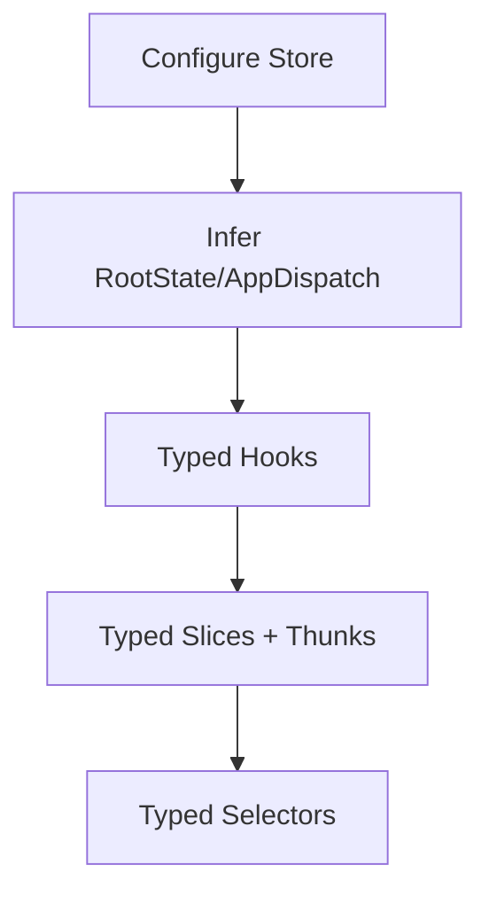

---
title: Typed State Management
slug: day-075-typed-state-management
dayLabel: Day 75
level: Advanced
estimatedMinutes: 30
order: 75
track: react
---
# Day 75 [Advanced]: Typed State Management

## Goal

Build a fully typed Redux Toolkit state layer with typed store, hooks, selectors, and async flows.

## Prerequisites

- Day 74 completed
- Redux Toolkit fundamentals from earlier days

## Explanation

Typed state management prevents contract mismatches between reducers, selectors, dispatch calls, and async thunks.

The most maintainable approach is to derive types from the configured store instead of duplicating the entire state shape manually. TypeScript improves compile-time safety, but it does not validate runtime API responses, persisted data, or other untrusted input.

## Topic by Topic

### Topic 1: Typed Store and RootState

Theory:
RootState and AppDispatch should come from configured store.

Practical:
Export inferred store types.

Code Example:

```ts
export const store = configureStore({ reducer: rootReducer });
export type RootState = ReturnType<typeof store.getState>;
export type AppDispatch = typeof store.dispatch;
```

**Explanation:** Inferring types from the store avoids stale manual definitions and keeps type contracts synchronized with actual reducers and middleware.

**Key Points:**

- Infer types instead of duplicating them.
- Keep store as source of truth.
- Reduce maintenance when reducers change.
- Derive `AppDispatch` from the configured store so middleware-enhanced dispatch remains represented.

### Topic 2: Typed Hooks

Theory:
Typed hooks prevent repetitive manual annotations.

Practical:
Create `useAppDispatch` and `useAppSelector`.

Code Example:

```ts
export const useAppDispatch = useDispatch.withTypes<AppDispatch>();
export const useAppSelector = useSelector.withTypes<RootState>();
```

**Explanation:** Typed hooks remove repetitive annotations in components and make Redux usage safer everywhere.

**Key Points:**

- Create typed hooks once and reuse them.
- Improve dispatch and selector ergonomics.
- Keep components cleaner and safer.
- Keep the hook definitions close to the store setup so the application has one consistent typing pattern.

### Topic 3: Typed Slice State and Payloads

Theory:
Reducers should enforce payload structure.

Practical:
Use `PayloadAction<T>`.

Code Example:

```ts
addTodo: (
  state,
  action: PayloadAction<{ id: string; text: string }>
) => {
  state.items.push({ ...action.payload, done: false });
}
```

**Explanation:** Reducer payload typing prevents invalid actions from slipping into state updates and documents the action contract for every consumer.

**Key Points:**

- Type action payloads explicitly.
- Keep reducer contracts predictable.
- Catch malformed action data at compile time.
- Keep domain state types separate when the slice model becomes complex.

### Topic 4: Typed Async Thunks

Theory:
Thunk return type and reject value should be explicit.

Practical:
Add generic parameters for `createAsyncThunk`.

Code Example:

```ts
createAsyncThunk<User, string, { rejectValue: string }>(
  "users/fetch",
  async (id, thunkApi) => {
    // return User or thunkApi.rejectWithValue(...)
  }
);
```

**Explanation:** Async thunk generics clarify success data, input params, and error payloads in one place. This makes pending, fulfilled, and rejected reducer logic easier to type correctly.

**Key Points:**

- Type both success and failure paths.
- Keep thunk contracts explicit.
- Make reducers and UI error handling safer.
- Treat rejected values differently from unexpected exceptions when designing UI error states.

### Topic 5: Typed Selectors

Theory:
Selectors should return predictable data shapes.

Practical:
Type selector signatures from RootState.

Code Example:

```ts
const selectCartTotal = (state: RootState): number => state.cart.total;
const selectCartItems = (state: RootState) => state.cart.items;
```

**Explanation:** Typed selectors make component consumption safer because the returned value shape is known and stable. Selectors also create a boundary between components and the internal store shape.

**Key Points:**

- Type selector inputs and outputs.
- Reuse selectors across components.
- Prevent accidental state shape assumptions.
- Prefer selectors over reading deeply nested store paths directly in many components.

### Topic 6: Scalability Decisions for Typed State Management

Theory:
As projects grow, architectural and typing decisions should optimize team velocity, change safety, and long-term consistency.

Practical:
Document one design decision for this topic with tradeoff notes so future contributors understand why it was chosen.

Code Example:

```ts
// types/user.ts
export interface User {
  id: string;
  name: string;
}

// Keep domain types close to their domain and reuse them at module boundaries.
```

**Explanation:** State-layer typing standards matter more as the app grows. Documenting them avoids mixed patterns across teams and features.

**Key Points:**

- Record typed Redux conventions clearly.
- Note migration tradeoffs for legacy slices.
- Keep state contracts consistent app-wide.
- Avoid creating one giant global type file that becomes a dependency hotspot.

## Key Concepts

- Inferred store contracts
- Reusable typed Redux hooks
- Payload-safe reducers
- Generic typed async thunks
- Reliable selector interfaces
- Scalable architecture thinking
- Compile-time state safety vs runtime validation
- Feature-oriented type organization

## Visual Concept Map



## End-to-End Practical

1. Type store exports and hooks.
2. Add typed state interfaces for slices.
3. Type reducer payloads.
4. Type async thunks with reject values.
5. Use typed selectors in components.
6. Add runtime validation where state receives untrusted external data.

## Hands-on Coding

### Example 1: Case - Store and Hook Typing

Scenario:
A logistics dashboard uses Redux across many features and needs safe shared hooks.

```ts
import { configureStore } from "@reduxjs/toolkit";
import { useDispatch, useSelector } from "react-redux";

export const store = configureStore({
  reducer: {
    // reducers
  },
});

export type RootState = ReturnType<typeof store.getState>;
export type AppDispatch = typeof store.dispatch;

export const useAppDispatch = useDispatch.withTypes<AppDispatch>();
export const useAppSelector = useSelector.withTypes<RootState>();
```

### Example 2: Case - Typed Slice Payload Contracts

Scenario:
An issue tracker slice must reject malformed ticket payloads at compile-time.

```ts
import { createSlice, PayloadAction } from "@reduxjs/toolkit";

type Ticket = { id: string; title: string; done: boolean };
type TicketState = { items: Ticket[] };

const initialState: TicketState = { items: [] };

const ticketSlice = createSlice({
  name: "tickets",
  initialState,
  reducers: {
    addTicket: (state, action: PayloadAction<Ticket>) => {
      state.items.push(action.payload);
    },
  },
});
```

### Example 3: Case - Typed Async Thunk + Selector

Scenario:
A profile module needs typed fetch and safe error handling.

```ts
type Profile = { id: string; name: string };

export const fetchProfile = createAsyncThunk<
  Profile,
  string,
  { rejectValue: string }
>("profile/fetch", async (id, thunkApi) => {
  const res = await fetch(`/api/profile/${id}`);
  if (!res.ok) return thunkApi.rejectWithValue("Profile fetch failed");
  return (await res.json()) as Profile;
});

export const selectProfileName = (state: RootState): string | undefined =>
  state.profile.data?.name;
```

The type assertion above describes the expected response to TypeScript; in production, untrusted JSON should be runtime-validated before being treated as a `Profile`.

## Mini Exercise

Scenario:
You are upgrading a cart + orders Redux module to full TypeScript safety.

Add typed store exports, hooks, slice payloads, async thunk generics, and selectors.

Expected output:

- Dispatch and selector usage are fully typed
- Async thunk success and error values are explicit
- Component integrations compile without implicit any
- External API data is validated before being trusted when its shape cannot be guaranteed

## Assessment Quiz

### Quiz Questions

1. Why infer RootState from store instead of manual type?
2. What is the value of typed hooks?
3. True or False: PayloadAction typing is optional in strict projects.
4. Why type rejectValue in async thunk?
5. What benefit do typed selectors provide?
6. Why should selectors be used as a boundary around store structure?
7. True or False: TypeScript automatically validates an API JSON response at runtime.
8. Why should typed Redux conventions be standardized across a large team?

### Quiz Answers

1. Keeps types in sync automatically with reducer changes
2. Consistent, safer dispatch/selector usage across app
3. False
4. Strongly typed error handling in reducers/components
5. Predictable return shapes and fewer consumer mistakes
6. They reduce coupling between components and the internal shape of the store.
7. False. Runtime validation is separate from compile-time TypeScript checking.
8. Consistent conventions reduce duplicated patterns, migration friction, and maintenance cost.

## Task

- Add typed Redux hooks and async slice typing
- Type at least one selector and one thunk reject path
- Identify one external data boundary that requires runtime validation
- Complete mini exercise

## Self Check

- You can build end-to-end typed Redux Toolkit architecture
- You can reduce runtime bugs using compile-time state contracts
- You understand typed success and failure paths in async flows
- You can answer at least 6 out of 8 quiz questions correctly

## Interview Questions and Answers

### Beginner

**Question:** What is RootState in Redux with TypeScript?

**Answer:** The typed shape of the entire Redux store state.

**Question:** Why create useAppDispatch/useAppSelector?

**Answer:** To avoid repeating types and prevent dispatch/selector mistakes.

### Middle

**Question:** How do you type reducer payloads in RTK?

**Answer:** Use `PayloadAction<T>` in reducer action parameter.

**Question:** Why type async thunks with generics?

**Answer:** To define argument, success return, and error value contracts.

### Advanced

**Question:** What is a maintainable pattern for large typed Redux apps?

**Answer:** Central typed store exports, feature-local typed slices/selectors, and shared typed hooks.

**Question:** How does typed state management improve refactoring speed?

**Answer:** Compiler highlights all impacted usage points when contracts change.

**Question:** Why should selectors be treated as an abstraction boundary?

**Answer:** They keep components independent from internal state structure and provide a reusable place for derived data and future state-shape changes.

**Question:** How should runtime API data be handled in a typed Redux application?

**Answer:** Treat external data as untrusted, validate its shape at the boundary when necessary, then place the validated domain model into state. A TypeScript assertion alone does not perform runtime validation.

## Day 75 Outcome

- You can implement strongly typed global state management
- You can improve safety across reducers, thunks, and selectors
- You understand compile-time typing versus runtime validation in state flows
- You can establish scalable typing conventions for Redux Toolkit
- You are ready for framework-level progression starting Day 76
