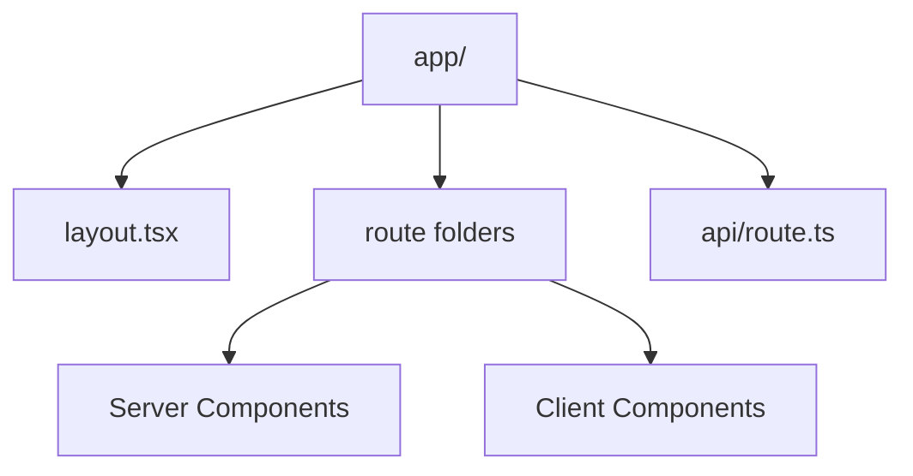

# Day 76 [Advanced]: Next.js Fundamentals

## Index

- [Goal](#goal)
- [Prerequisites](#prerequisites)
- [Explanation](#explanation)
- [Topic by Topic](#topic-by-topic)
- [Key Concepts](#key-concepts)
- [Visual Concept Map](#visual-concept-map)
- [End-to-End Practical](#end-to-end-practical)
- [Hands-on Coding](#hands-on-coding)
- [Mini Exercise](#mini-exercise)
- [Assessment Quiz](#assessment-quiz)
- [Task](#task)
- [Self Check](#self-check)
- [Interview Questions and Answers](#interview-questions-and-answers)
- [Day 76 Outcome](#day-76-outcome)

## Goal

Understand Next.js core architecture and build a small app using server and client components correctly.

## Prerequisites

- Day 75 completed
- Strong React and TypeScript fundamentals

## Explanation

Next.js provides routing, rendering strategies, data fetching, and server-first patterns for production-grade React apps.

## Topic by Topic

### Topic 1: App Router Basics

Theory:
In App Router, folders map to routes and layouts.

Practical:
Create `app/dashboard/page.tsx` and shared `layout.tsx`.

Code Example:

```tsx
export default function Page() {
  return <h1>Dashboard</h1>;
}
```

**Explanation:** App Router is file-system based, so route structure starts with folders and files rather than route config objects.

**Key Points:**

- Folders map directly to routes.
- Shared layouts live beside route segments.
- Clear structure improves project navigation.

### Topic 2: Server vs Client Components

Theory:
Server Components are default; Client Components require `"use client"`.

Practical:
Keep data-heavy rendering on server; interactions on client.

Code Example:

```tsx
"use client";
```

**Explanation:** Next.js defaults to server components, so you only opt into client components when browser interactivity is required.

**Key Points:**

- Keep interactive logic in client components.
- Keep data-heavy rendering on server when possible.
- Avoid unnecessary client bundles.

### Topic 3: Data Fetching in Next.js

Theory:
Server-side fetch reduces client bundle and can improve performance.

Practical:
Fetch data directly in async server component.

Code Example:

```tsx
const res = await fetch("https://api.example.com/products");
```

**Explanation:** Server-side fetching lets the page prepare data before sending HTML, which can improve load experience and reduce browser work.

**Key Points:**

- Fetch directly in async server components.
- Choose cache policy intentionally.
- Keep server data work close to route.

### Topic 4: Layouts and Nested Routes

Theory:
Layouts provide persistent UI shells.

Practical:
Use nested layouts for dashboard sections.

Code Example:

```tsx
export default function Layout({ children }: { children: React.ReactNode }) { ... }
```

**Explanation:** Layouts keep shared UI persistent across routes, which reduces repeated markup and improves navigation continuity.

**Key Points:**

- Use layouts for shared shells.
- Nest layouts by route area when needed.
- Keep page components focused on route content.

### Topic 5: API Routes and Full-stack Flow

Theory:
Route handlers allow backend-like endpoints in same project.

Practical:
Create `app/api/tasks/route.ts` for JSON data.

Code Example:

```tsx
return Response.json({ ok: true });
```

**Explanation:** Route handlers let a Next.js project support lightweight backend behavior without leaving the app directory model.

**Key Points:**

- Return JSON for internal app APIs.
- Keep route handler responsibilities focused.
- Use handlers for app-local full-stack flows.

### Topic 6: Streaming, Loading UI, and Runtime Boundaries

Theory:
Next.js apps feel faster when slow parts load progressively. Also, server-only and client-only logic must stay in the correct runtime boundary.

Practical:
Use loading states for slow routes and avoid importing browser-only hooks into server components.

Code Example:

```tsx
// app/products/loading.tsx
export default function Loading() {
  return <p>Loading products...</p>;
}
```

**Explanation:** Loading UI and runtime boundaries shape the user experience. They also prevent server-only and client-only code from being mixed incorrectly.

**Key Points:**

- Add route-level loading states deliberately.
- Respect server and client runtime boundaries.
- Keep progressive rendering user-friendly.

## Key Concepts

- App Router structure
- Server/Client component split
- Server-side data fetching
- Layout-driven UI composition
- Full-stack route handlers
- Progressive loading experience
- Runtime boundary discipline

## Visual Concept Map



## End-to-End Practical

1. Initialize a Next.js app.
2. Build two routes with shared layout.
3. Fetch product data in server component.
4. Add interactive filter in client component.
5. Add one API route and consume it.

## Hands-on Coding

### Example 1: Case - Server-rendered Product List

Scenario:
An e-commerce page should render product list server-side for fast first load.

```tsx
// app/products/page.tsx
export default async function ProductsPage() {
  const res = await fetch("https://dummyjson.com/products?limit=8", {
    cache: "no-store",
  });
  const data = await res.json();

  return (
    <ul>
      {data.products.map((p: { id: number; title: string }) => (
        <li key={p.id}>{p.title}</li>
      ))}
    </ul>
  );
}
```

### Example 2: Case - Client Search Widget in Server Page

Scenario:
A course catalog page needs interactive local filtering in browser.

```tsx
// app/courses/CourseSearch.tsx
"use client";

import { useState } from "react";

export default function CourseSearch({ courses }: { courses: string[] }) {
  const [query, setQuery] = useState("");
  const visible = courses.filter((c) =>
    c.toLowerCase().includes(query.toLowerCase()),
  );

  return (
    <div>
      <input
        value={query}
        onChange={(e) => setQuery(e.target.value)}
        placeholder="Search course"
      />
      <p>Matches: {visible.length}</p>
    </div>
  );
}
```

### Example 3: Case - Simple Route Handler

Scenario:
An admin panel needs local API endpoint for status health check.

```tsx
// app/api/health/route.ts
export async function GET() {
  return Response.json({ status: "ok", service: "admin-web" });
}
```

## Mini Exercise

Scenario:
You are creating a Next.js learning portal.

Build:

- one server-rendered page for lessons
- one client interactive component for search
- one route handler for lesson stats

Expected output:

- Clear server/client boundary
- Functional route and API response
- Layout shared across pages

## Assessment Quiz

### Quiz Questions

1. What is default component type in App Router?
2. When do you add `"use client"`?
3. True or False: Route handlers can return JSON responses.
4. Why keep heavy data fetch on server when possible?
5. What is a layout used for in Next.js?
6. Why should loading UI be considered part of route design?

### Quiz Answers

1. Server Component
2. When component needs browser-only interactivity/hooks
3. True
4. Smaller client bundle and efficient initial render
5. Persistent UI structure across nested routes
6. It improves perceived performance when server work is slow.

## Task

- Create small Next.js app with server/client split
- Add one server page and one client interactive module
- Complete mini exercise

## Self Check

- You can build baseline Next.js App Router flows
- You can choose server vs client components correctly
- You can answer at least 4 out of 5 quiz questions correctly

## Interview Questions and Answers

### Beginner

**Question:** What does Next.js provide beyond React?

**Answer:** Routing, rendering strategies, server features, and production conventions.

**Question:** Why are Server Components useful?

**Answer:** They can fetch/render on server and reduce client-side JavaScript.

### Middle

**Question:** How do you decide component boundary between server and client?

**Answer:** Keep pure data rendering on server, move interaction/stateful UI to client.

**Question:** What is a route handler in Next.js?

**Answer:** An endpoint file in `app/api` that handles HTTP methods.

### Advanced

**Question:** What architectural mistake increases Next.js bundle size?

**Answer:** Marking too many components with `"use client"` unnecessarily.

**Question:** How does layout nesting improve architecture?

**Answer:** Shared shells reduce duplication and enforce route-level structure.

## Day 76 Outcome

- You can implement core Next.js fundamentals
- You can apply server/client split with confidence
- You are ready for rendering strategy depth in Day 77
