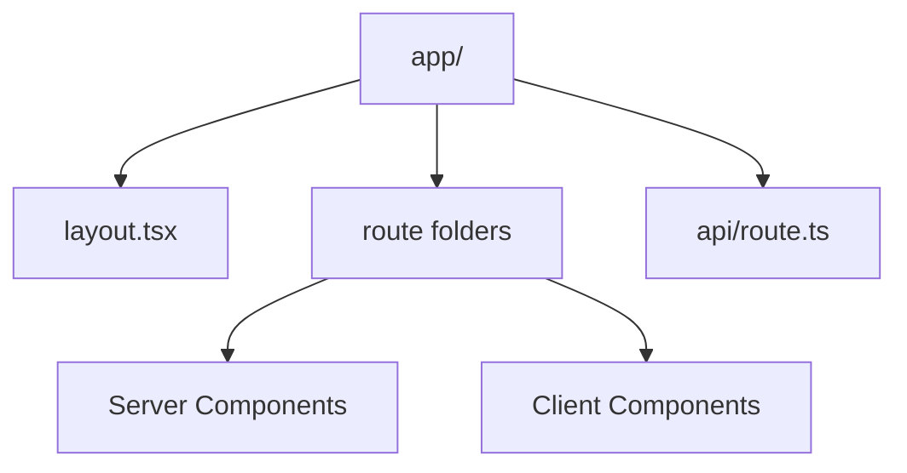

---
title: Next.js Fundamentals
slug: day-076-next-js-fundamentals
dayLabel: Day 76
level: Advanced
estimatedMinutes: 30
order: 76
track: react
---
# Day 76 [Advanced]: Next.js Fundamentals

## Goal

Understand Next.js core architecture and build a small app using server and client components correctly.

## Prerequisites

- Day 75 completed
- Strong React and TypeScript fundamentals

## Explanation

Next.js provides routing, rendering strategies, data fetching, and server-first patterns for production-grade React apps. In the App Router model, route segments, layouts, Server Components, Client Components, route handlers, and loading/error boundaries work together to define the application architecture.

A key principle is to keep the server/client boundary intentional: use Server Components for server-safe rendering and data access, and introduce Client Components only where browser state, effects, event handlers, or browser APIs are required.

## Topic by Topic

### Topic 1: App Router Basics

Theory:
In App Router, folders map to routes and layouts. Special files such as `page.tsx`, `layout.tsx`, `loading.tsx`, and `error.tsx` give route segments defined behavior.

Practical:
Create `app/dashboard/page.tsx` and shared `layout.tsx`.

Code Example:

```tsx
export default function Page() {
  return <h1>Dashboard</h1>;
}
```

**Explanation:** App Router is file-system based, so route structure starts with folders and files rather than route config objects. A route becomes accessible through its segment path when a `page.tsx` file exists.

**Key Points:**

- Folders map directly to routes.
- Shared layouts live beside route segments.
- Special route files provide framework behavior.
- Clear structure improves project navigation.

### Topic 2: Server vs Client Components

Theory:
Server Components are default; Client Components require `"use client"`.

Practical:
Keep data-heavy rendering on server; interactions on client.

Code Example:

```tsx
"use client";

import { useState } from "react";

export default function Counter() {
  const [count, setCount] = useState(0);
  return <button onClick={() => setCount(count + 1)}>{count}</button>;
}
```

**Explanation:** Next.js defaults to Server Components, so you only opt into Client Components when browser interactivity is required. A Client Component boundary also affects the dependency graph, so pushing the boundary too high can increase client JavaScript.

**Key Points:**

- Keep interactive logic in Client Components.
- Keep server-safe data work on the server when possible.
- Avoid unnecessary client bundles.
- Do not use browser-only APIs or React client hooks directly in Server Components.

### Topic 3: Data Fetching in Next.js

Theory:
Server-side fetching can keep secrets and server-only credentials away from the browser and can reduce client work. Cache and revalidation behavior should be chosen deliberately rather than assumed.

Practical:
Fetch data directly in an async Server Component.

Code Example:

```tsx
const res = await fetch("https://api.example.com/products", {
  next: { revalidate: 60 },
});

if (!res.ok) {
  throw new Error("Failed to load products");
}

const products = await res.json();
```

**Explanation:** Server-side fetching lets the page prepare data before sending the rendered result and can keep private credentials on the server. The cache/revalidation policy should match whether the data is static, periodically changing, or request-specific.

**Key Points:**

- Fetch directly in async Server Components when appropriate.
- Choose cache/revalidation behavior intentionally.
- Check response status before consuming data.
- Keep secrets and privileged credentials server-side.

### Topic 4: Layouts and Nested Routes

Theory:
Layouts provide persistent UI shells.

Practical:
Use nested layouts for dashboard sections.

Code Example:

```tsx
export default function Layout({
  children,
}: {
  children: React.ReactNode;
}) {
  return <section className="dashboard-shell">{children}</section>;
}
```

**Explanation:** Layouts keep shared UI persistent across routes, which reduces repeated markup and improves navigation continuity. Nested layouts let different areas of a large application have their own navigation or providers.

**Key Points:**

- Use layouts for shared shells.
- Nest layouts by route area when needed.
- Keep page components focused on route content.
- Avoid putting unrelated page-specific behavior into a global layout.

### Topic 5: API Routes and Full-stack Flow

Theory:
Route handlers allow backend-like endpoints in the same project.

Practical:
Create `app/api/tasks/route.ts` for JSON data and validate incoming input before changing server-side state.

Code Example:

```tsx
export async function GET() {
  return Response.json({ tasks: [] });
}
```

**Explanation:** Route handlers let a Next.js project support lightweight backend behavior without leaving the App Router model. They run on the server, so authentication, authorization, input validation, and secret handling must remain server-side concerns.

**Key Points:**

- Return JSON for internal app APIs.
- Keep route handler responsibilities focused.
- Validate untrusted request input.
- Perform authorization on the server rather than trusting client UI state.

### Topic 6: Streaming, Loading UI, and Runtime Boundaries

Theory:
Next.js apps feel faster when slow parts load progressively. Also, server-only and client-only logic must stay in the correct runtime boundary.

Practical:
Use loading states for slow routes and avoid importing browser-only hooks into Server Components.

Code Example:

```tsx
// app/products/loading.tsx
export default function Loading() {
  return <p aria-live="polite">Loading products...</p>;
}
```

**Explanation:** Loading UI and runtime boundaries shape the user experience. `loading.tsx` can provide route-level fallback UI while server work is pending, and Client Components should be introduced only when their browser capabilities are needed.

**Key Points:**

- Add route-level loading states deliberately.
- Respect server and client runtime boundaries.
- Keep progressive rendering user-friendly.
- Design loading states to preserve layout stability and accessibility.

## Key Concepts

- App Router structure
- Server/Client component split
- Server-side data fetching and caching choices
- Layout-driven UI composition
- Full-stack route handlers
- Progressive loading experience
- Runtime boundary discipline
- Server-side validation and authorization

## Visual Concept Map



## End-to-End Practical

1. Initialize a Next.js app.
2. Build two routes with shared layout.
3. Fetch product data in a Server Component.
4. Add an interactive filter in a Client Component.
5. Add one route handler and consume it from the appropriate boundary.
6. Add loading UI for a slow route.
7. Define an explicit cache/revalidation strategy for the product data.

## Hands-on Coding

### Example 1: Case - Server-rendered Product List

Scenario:
An e-commerce page should render a product list server-side for fast first load while using a deliberate freshness policy.

```tsx
// app/products/page.tsx
export default async function ProductsPage() {
  const res = await fetch("https://dummyjson.com/products?limit=8", {
    next: { revalidate: 60 },
  });

  if (!res.ok) {
    throw new Error("Unable to load products");
  }

  const data: { products: { id: number; title: string }[] } = await res.json();

  return (
    <ul>
      {data.products.map((p) => (
        <li key={p.id}>{p.title}</li>
      ))}
    </ul>
  );
}
```

### Example 2: Case - Client Search Widget in Server Page

Scenario:
A course catalog page needs interactive local filtering in the browser.

```tsx
// app/courses/CourseSearch.tsx
"use client";

import { useState } from "react";

export default function CourseSearch({ courses }: { courses: string[] }) {
  const [query, setQuery] = useState("");
  const visible = courses.filter((c) =>
    c.toLowerCase().includes(query.toLowerCase()),
  );

  return (
    <div>
      <label>
        Search course
        <input
          value={query}
          onChange={(e) => setQuery(e.target.value)}
          placeholder="Search course"
        />
      </label>
      <p>Matches: {visible.length}</p>
    </div>
  );
}
```

### Example 3: Case - Simple Route Handler

Scenario:
An admin panel needs a local API endpoint for a status health check.

```tsx
// app/api/health/route.ts
export async function GET() {
  return Response.json({ status: "ok", service: "admin-web" });
}
```

The handler can later be extended with authentication and server-side authorization when the endpoint exposes protected information.

## Mini Exercise

Scenario:
You are creating a Next.js learning portal.

Build:

- one server-rendered page for lessons
- one client interactive component for search
- one route handler for lesson stats
- one route-level loading state

Expected output:

- Clear server/client boundary
- Functional route and API response
- Layout shared across pages
- Loading behavior that is visible during slow data work

## Assessment Quiz

### Quiz Questions

1. What is the default component type in App Router?
2. When do you add `"use client"`?
3. True or False: Route handlers can return JSON responses.
4. Why keep heavy data fetching on the server when possible?
5. What is a layout used for in Next.js?
6. Why should loading UI be considered part of route design?
7. Why should a server-side fetch check `res.ok` before using the response body?
8. Why should authorization not depend only on a Client Component's UI state?

### Quiz Answers

1. Server Component
2. When the component needs browser-only interactivity, client hooks, event handlers, or browser APIs.
3. True
4. It can reduce client-side JavaScript, keep privileged work server-side, and simplify server-rendered data flows.
5. Persistent UI structure across nested routes.
6. It improves perceived performance and gives users feedback while slow server work is pending.
7. A fetch can resolve successfully at the network level while the HTTP response still represents an error status.
8. Client state can be modified or bypassed; authorization must be enforced on the server.

## Task

- Create a small Next.js app with a server/client split
- Add one server page and one client interactive module
- Add one route handler
- Add route-level loading UI
- Complete the mini exercise

## Self Check

- You can build baseline Next.js App Router flows
- You can choose Server vs Client Components correctly
- You understand intentional data-fetching and cache decisions
- You can explain route handlers and server-side security boundaries
- You can answer at least 6 out of 8 quiz questions correctly

## Interview Questions and Answers

### Beginner

**Question:** What does Next.js provide beyond React?

**Answer:** Routing, rendering strategies, server features, data-fetching conventions, and production-oriented application structure.

**Question:** Why are Server Components useful?

**Answer:** They can fetch and render data on the server, keep server-only work away from the browser, and reduce unnecessary client-side JavaScript.

### Middle

**Question:** How do you decide the component boundary between server and client?

**Answer:** Keep server-safe rendering and data work on the server, then move only interactive or browser-dependent parts into Client Components.

**Question:** What is a route handler in Next.js?

**Answer:** A server-side endpoint file such as `app/api/tasks/route.ts` that handles HTTP methods and returns a `Response`.

### Advanced

**Question:** What architectural mistake increases a Next.js bundle size?

**Answer:** Marking large portions of the component tree with `"use client"` when only a small interactive leaf actually needs browser behavior.

**Question:** How does layout nesting improve architecture?

**Answer:** Shared shells reduce duplication, preserve persistent UI across navigation, and allow route areas to own their own navigation or providers.

**Question:** How should you choose between cached, revalidated, and request-specific data fetching?

**Answer:** Match the strategy to freshness requirements. Stable data can use caching, periodically changing data can use revalidation, and request-specific or highly dynamic data may require a request-time strategy. The important part is making the choice explicit rather than relying on an accidental default.

**Question:** Why is a Server Component not automatically a security boundary for every operation?

**Answer:** Server execution keeps code and secrets away from the browser, but application authorization still needs to be enforced at the server/API/data-access boundary. Rendering a hidden button is not authorization.

## Day 76 Outcome

- You can implement core Next.js fundamentals
- You can apply Server/Client Component boundaries with confidence
- You can build route handlers and route-level loading UI
- You understand intentional data-fetching and caching decisions
- You are ready for rendering strategy depth in Day 77
