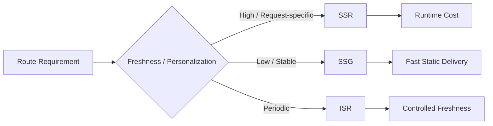

---
title: SSR, SSG, ISR
slug: day-077-ssr-ssg-isr
dayLabel: Day 77
level: Advanced
estimatedMinutes: 30
order: 77
track: react
---
# Day 77 [Advanced]: SSR, SSG, ISR

## Goal

Understand and implement SSR, SSG, and ISR in Next.js based on SEO, freshness, latency, and operational requirements.

## Prerequisites

- Day 76 completed
- Familiarity with Next.js App Router and data fetching

## Explanation

Rendering strategy determines when HTML is produced, where work happens, how often data can change, and what users receive on the first response. The practical goal is not to choose one strategy for the whole application, but to choose the least expensive strategy that still satisfies freshness, SEO, personalization, and latency requirements.

In the App Router, caching and revalidation are important parts of the rendering model. The exact behavior can also depend on the Next.js version and deployment/runtime configuration, so production teams should verify the current framework behavior rather than relying on an old mental model.

## Topic by Topic

### Topic 1: SSR (Server-side Rendering)

Theory:
HTML is generated at request time using current request-specific or dynamic data.

Practical:
Use a request-time strategy when the response must reflect current information or request context.

Code Example:

```tsx
await fetch(url, { cache: "no-store" });
```

**Explanation:** SSR is useful when data must be fresh for each request or when the response depends on request-specific information. The tradeoff is additional server work and potentially higher response latency than serving a prebuilt result.

**Key Points:**

- Use request-time rendering for high-freshness or request-specific routes.
- Expect request-time server cost.
- Good candidates include personalized or frequently changing pages.
- Do not choose SSR automatically when static or revalidated output is sufficient.

### Topic 2: SSG (Static Site Generation)

Theory:
HTML is generated ahead of time and served as static output.

Practical:
Use static generation for content whose freshness requirements allow prebuilt output.

Code Example:

```tsx
await fetch(url, { cache: "force-cache" });
```

**Explanation:** SSG works well when content changes rarely and fast delivery matters more than immediate freshness. Static output can reduce runtime rendering work and is often a strong fit for documentation, landing pages, and stable reference content.

**Key Points:**

- Build and serve stable output efficiently.
- Best for docs, marketing, and relatively stable content.
- Minimize unnecessary runtime server work.
- Confirm the caching behavior for the Next.js version and deployment model you use.

### Topic 3: ISR (Incremental Static Regeneration)

Theory:
Static output can be revalidated so that changing content does not require rebuilding the entire application.

Practical:
Set `revalidate` when controlled freshness is acceptable.

Code Example:

```tsx
export const revalidate = 60;
```

**Explanation:** ISR provides a middle path between fully static and request-time rendering. It is useful when content changes periodically and a short period of staleness is acceptable in exchange for efficient delivery.

**Key Points:**

- Balance freshness and performance.
- Use revalidation according to an explicit freshness requirement.
- Good for catalogs, blogs, and moderate-change content.
- Understand how the chosen deployment/runtime implements revalidation.

### Topic 4: Tradeoff Matrix

Theory:
SSR generally prioritizes request-time freshness, SSG prioritizes stable prebuilt output, and ISR balances static delivery with controlled updates.

Practical:
Map features to strategy types using freshness, personalization, SEO, latency, and infrastructure cost.

Code Example:

```tsx
// Product listing: ISR, admin panel: request-time, docs: SSG
```

**Explanation:** Rendering strategy is not one-size-fits-all. A route should be evaluated against its actual business requirements instead of being categorized only by its page type.

**Key Points:**

- Choose strategy per route or data requirement.
- Trade speed, freshness, personalization, and infrastructure cost deliberately.
- Document the reasoning for major routes.
- Revisit the choice when product requirements change.

### Topic 5: SEO and Content Freshness

Theory:
Pre-rendered HTML can improve crawlability and social previews, while freshness determines how often users and crawlers see updated content.

Practical:
Use metadata and an appropriate rendering strategy for each public route.

Code Example:

```tsx
export const metadata = { title: "Blog" };
```

**Explanation:** SEO is only one input into rendering strategy. Public content often benefits from pre-rendered output, but highly dynamic or personalized content may require request-time work. Metadata should accurately describe the actual page rather than being treated as a replacement for good content.

**Key Points:**

- Consider SEO alongside performance and freshness.
- Pair rendering decisions with route metadata.
- Define acceptable freshness windows for important content.
- Remember that SEO does not require every page to use SSR.

### Topic 6: Scalability Decisions for SSR, SSG, ISR

Theory:
As projects grow, rendering decisions should optimize team velocity, user experience, infrastructure cost, and predictable freshness.

Practical:
Document one route-level rendering decision with its freshness SLA, tradeoffs, and migration path so future contributors understand why it was chosen.

Code Example:

```ts
// Example architecture note:
// Product catalog -> ISR -> freshness target: <= 2 minutes
// Admin dashboard -> request-time -> personalized data
```

**Explanation:** At scale, teams need written rules for when SSR, SSG, or ISR should be used. A documented freshness requirement makes rendering choices reviewable and prevents every developer from inventing a different policy.

**Key Points:**

- Document rendering decisions clearly.
- Define freshness and latency expectations.
- Explain infrastructure and UX tradeoffs.
- Keep route strategies easy to review and change.

## Key Concepts

- Request-time vs build-time rendering
- Revalidation model
- Rendering strategy selection criteria
- SEO-performance-freshness balance
- Route-level optimization mindset
- Cache and deployment considerations
- Freshness service-level expectations
- Scalable architecture thinking

## Visual Concept Map



## End-to-End Practical

1. Create one request-time news page.
2. Create one static docs page.
3. Create one revalidated products page.
4. Compare response behavior, freshness, and server work.
5. Document strategy rationale for each route.
6. Define an acceptable freshness target for each page.
7. Verify the behavior in the actual deployment/runtime rather than assuming local development behaves identically.

## Hands-on Coding

### Example 1: Case - SSR for Live Stock Prices

Scenario:
A finance dashboard requires current data on every request.

```tsx
// app/stocks/page.tsx
export default async function StocksPage() {
  const res = await fetch("https://api.example.com/stocks", {
    cache: "no-store",
  });

  if (!res.ok) {
    throw new Error("Unable to load stock prices");
  }

  const data = await res.json();
  return <pre>{JSON.stringify(data, null, 2)}</pre>;
}
```

### Example 2: Case - SSG for Help Documentation

Scenario:
Support docs rarely change and should load extremely fast.

```tsx
// app/help/page.tsx
export default async function HelpPage() {
  const res = await fetch("https://api.example.com/help", {
    cache: "force-cache",
  });

  if (!res.ok) {
    throw new Error("Unable to load help content");
  }

  const docs = await res.json();
  return <p>Total Articles: {docs.length}</p>;
}
```

### Example 3: Case - ISR for Product Catalog

Scenario:
An e-commerce catalog updates regularly but does not need second-by-second freshness.

```tsx
// app/catalog/page.tsx
export const revalidate = 120;

export default async function CatalogPage() {
  const res = await fetch("https://api.example.com/catalog");

  if (!res.ok) {
    throw new Error("Unable to load catalog");
  }

  const items = await res.json();
  return <p>Products: {items.length}</p>;
}
```

## Mini Exercise

Scenario:
You are building a media app with:

- trending page (high freshness)
- about page (rarely changes)
- episodes page (moderate freshness)

Implement each route with an appropriate strategy and explain why. For each route, state the acceptable freshness window and what infrastructure/runtime behavior you expect.

Expected output:

- Correct strategy per route
- Working examples for SSR, SSG, ISR
- Clear tradeoff reasoning
- Explicit freshness target for each route

## Assessment Quiz

### Quiz Questions

1. Which strategy is appropriate when data must be generated at request time?
2. Which strategy is generally best for stable content pages?
3. True or False: ISR can refresh static content without rebuilding the entire application.
4. What does `revalidate` express in an ISR-style design?
5. Why is strategy selection route-specific?
6. Which requirements should be considered besides freshness?
7. Why should production rendering behavior be verified on the target deployment?
8. True or False: SEO alone means every public page should use SSR.

### Quiz Answers

1. SSR/request-time rendering
2. SSG/static rendering
3. True
4. A desired revalidation/freshness interval for static output.
5. Different routes have different freshness, personalization, SEO, latency, and cost requirements.
6. Personalization, SEO, latency, infrastructure cost, cache behavior, and operational constraints.
7. Caching and revalidation behavior can vary with framework version, runtime, hosting, and deployment configuration.
8. False. Static and revalidated pages can also provide pre-rendered HTML suitable for SEO.

## Task

- Build one SSG page and one request-time page and compare them
- Add one ISR/revalidated page with an explicit freshness interval
- Document the tradeoff for each route
- Complete mini exercise

## Self Check

- You can choose rendering strategies based on business requirements
- You can implement SSR, SSG, and ISR/revalidation patterns in Next.js
- You understand freshness, SEO, performance, and infrastructure tradeoffs
- You can explain why local and production rendering behavior may differ
- You can answer at least 6 out of 8 quiz questions correctly

## Interview Questions and Answers

### Beginner

**Question:** What is SSR?

**Answer:** Rendering a response on the server at request time when the route requires dynamic/request-specific output.

**Question:** What is SSG?

**Answer:** Generating stable output ahead of requests so it can be served without rendering the page on every request.

### Middle

**Question:** When is ISR preferable over SSG?

**Answer:** When content changes periodically and a controlled amount of staleness is acceptable while still benefiting from efficient static delivery.

**Question:** How do you request request-time data in App Router?

**Answer:** One common pattern is `fetch` with `cache: "no-store"` when request-time behavior is required, while also considering the current Next.js version and deployment configuration.

### Advanced

**Question:** What is a common SEO/performance mistake in rendering strategy?

**Answer:** Using request-time rendering for every route even when static or revalidated output satisfies the freshness requirements, increasing unnecessary server work and latency.

**Question:** How do you operationalize strategy decisions at scale?

**Answer:** Define route-level freshness and latency targets, map them to rendering/cache policies, document the rationale, and monitor whether production behavior meets those targets.

**Question:** Why can an ISR design still produce stale content?

**Answer:** Revalidation intentionally permits a freshness window. In addition, caching layers and deployment/runtime behavior can influence when updated data becomes visible, so teams should validate the actual production path.

**Question:** How would you choose SSR over ISR for a dashboard?

**Answer:** If the dashboard depends on user-specific authorization, rapidly changing data, request headers/cookies, or strict freshness requirements, request-time rendering may be appropriate. If data can tolerate a freshness window and is not personalized, revalidation may be more efficient.

## Day 77 Outcome

- You can apply SSR, SSG, and ISR/revalidation with clear tradeoff understanding
- You can optimize route behavior for SEO, freshness, and performance
- You can define rendering policies using measurable requirements
- You understand why deployment/runtime behavior matters
- You are ready for scalable styling systems in Day 78
