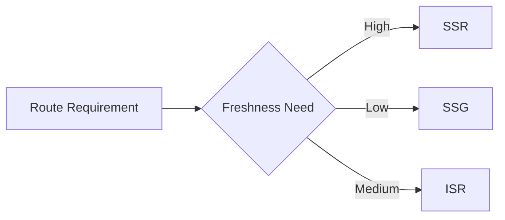

# Day 77 [Advanced]: SSR, SSG, ISR

## Index

- [Goal](#goal)
- [Prerequisites](#prerequisites)
- [Explanation](#explanation)
- [Topic by Topic](#topic-by-topic)
- [Key Concepts](#key-concepts)
- [Visual Concept Map](#visual-concept-map)
- [End-to-End Practical](#end-to-end-practical)
- [Hands-on Coding](#hands-on-coding)
- [Mini Exercise](#mini-exercise)
- [Assessment Quiz](#assessment-quiz)
- [Task](#task)
- [Self Check](#self-check)
- [Interview Questions and Answers](#interview-questions-and-answers)
- [Day 77 Outcome](#day-77-outcome)

## Goal

Understand and implement SSR, SSG, and ISR in Next.js based on SEO, freshness, and performance needs.

## Prerequisites

- Day 76 completed
- Familiarity with Next.js App Router and data fetching

## Explanation

Rendering strategy determines when HTML is produced and how often data updates reach users.

## Topic by Topic

### Topic 1: SSR (Server-side Rendering)

Theory:
HTML is generated per request using latest data.

Practical:
Use dynamic data with `cache: "no-store"`.

Code Example:

```tsx
await fetch(url, { cache: "no-store" });
```

**Explanation:** SSR is best when data must be fresh on each request, even if that means more server work.

**Key Points:**

- Use SSR for high-freshness routes.
- Expect request-time rendering cost.
- Good for dashboards and live feeds.

### Topic 2: SSG (Static Site Generation)

Theory:
HTML is prebuilt at build time and served fast.

Practical:
Use static fetch/cache for content pages.

Code Example:

```tsx
await fetch(url, { cache: "force-cache" });
```

**Explanation:** SSG works well when content changes rarely and fast delivery matters more than immediate freshness.

**Key Points:**

- Build once and serve fast.
- Best for docs and marketing content.
- Minimize runtime server work.

### Topic 3: ISR (Incremental Static Regeneration)

Theory:
Static pages update in background at intervals.

Practical:
Set `revalidate` for controlled freshness.

Code Example:

```tsx
export const revalidate = 60;
```

**Explanation:** ISR gives a middle path by serving static content and refreshing it in the background on a schedule.

**Key Points:**

- Balance freshness and performance.
- Use revalidate to control update interval.
- Good for moderate-change content.

### Topic 4: Tradeoff Matrix

Theory:
SSR = freshest, SSG = fastest, ISR = balanced.

Practical:
Map features to strategy types.

Code Example:

```tsx
// Product listing: ISR, admin panel: SSR, docs: SSG
```

**Explanation:** Rendering strategy is not one-size-fits-all. Each route should match business freshness, SEO, and latency needs.

**Key Points:**

- Choose strategy per route.
- Trade speed against freshness deliberately.
- Document the reasoning for major routes.

### Topic 5: SEO and Content Freshness

Theory:
Pre-rendered HTML improves crawlability and social previews.

Practical:
Use metadata and suitable rendering per route.

Code Example:

```tsx
export const metadata = { title: "Blog" };
```

**Explanation:** Pre-rendered HTML helps crawlers and social previews, so rendering decisions often affect both performance and discoverability.

**Key Points:**

- Consider SEO when picking strategy.
- Pair rendering with route metadata.
- Freshness needs depend on user and crawler expectations.

### Topic 6: Scalability Decisions for SSR, SSG, ISR

Theory:
As projects grow, architectural and typing decisions should optimize team velocity, change safety, and long-term consistency.

Practical:
Document one design decision for this topic with tradeoff notes so future contributors understand why it was chosen.

Code Example:

`jsx
// Record architecture tradeoff and migration path in project docs.
`

**Explanation:** As a project scales, teams need written rules for when SSR, SSG, or ISR should be used so route behavior stays consistent.

**Key Points:**

- Document rendering decisions clearly.
- Explain tradeoffs for future contributors.
- Keep route strategies easy to review and change.

## Key Concepts

- Request-time vs build-time rendering
- Background regeneration model
- Rendering strategy selection criteria
- SEO-performance-freshness balance
- Route-level optimization mindset

- Scalable architecture thinking

## Visual Concept Map



## End-to-End Practical

1. Create one SSR news page.
2. Create one SSG docs page.
3. Create one ISR products page.
4. Compare response behavior and freshness.
5. Document strategy rationale for each route.

## Hands-on Coding

### Example 1: Case - SSR for Live Stock Prices

Scenario:
Finance dashboard requires latest data on every request.

```tsx
// app/stocks/page.tsx
export default async function StocksPage() {
  const res = await fetch("https://api.example.com/stocks", {
    cache: "no-store",
  });
  const data = await res.json();
  return <pre>{JSON.stringify(data, null, 2)}</pre>;
}
```

### Example 2: Case - SSG for Help Documentation

Scenario:
Support docs rarely change and should load extremely fast.

```tsx
// app/help/page.tsx
export default async function HelpPage() {
  const res = await fetch("https://api.example.com/help", {
    cache: "force-cache",
  });
  const docs = await res.json();
  return <p>Total Articles: {docs.length}</p>;
}
```

### Example 3: Case - ISR for Product Catalog

Scenario:
E-commerce catalog updates regularly but not every second.

```tsx
// app/catalog/page.tsx
export const revalidate = 120;

export default async function CatalogPage() {
  const res = await fetch("https://api.example.com/catalog");
  const items = await res.json();
  return <p>Products: {items.length}</p>;
}
```

## Mini Exercise

Scenario:
You are building a media app with:

- trending page (high freshness)
- about page (rarely changes)
- episodes page (moderate freshness)

Implement each route with appropriate strategy and explain why.

Expected output:

- Correct strategy per route
- Working examples for SSR, SSG, ISR
- Clear tradeoff reasoning

## Assessment Quiz

### Quiz Questions

1. Which strategy gives freshest response per request?
2. Which strategy is best for stable content pages?
3. True or False: ISR can refresh static content without full rebuild.
4. What does `revalidate` control?
5. Why is strategy selection route-specific?

### Quiz Answers

1. SSR
2. SSG
3. True
4. Regeneration interval for static page content
5. Different routes have different freshness and latency needs

## Task

- Build one SSG page and one SSR page and compare
- Add one ISR page with revalidate interval
- Complete mini exercise

## Self Check

- You can choose rendering strategies based on business requirements
- You can implement SSR, SSG, and ISR in Next.js
- You can answer at least 4 out of 5 quiz questions correctly

## Interview Questions and Answers

### Beginner

**Question:** What is SSR?

**Answer:** Rendering HTML on server for each incoming request.

**Question:** What is SSG?

**Answer:** Rendering HTML at build time and serving static output.

### Middle

**Question:** When is ISR preferable over SSG?

**Answer:** When content changes periodically and needs background refresh.

**Question:** How do you enforce request-time data in App Router?

**Answer:** Use fetch with `cache: "no-store"`.

### Advanced

**Question:** What is a common SEO/perf mistake in rendering strategy?

**Answer:** Using SSR for all routes even when static or ISR would be more efficient.

**Question:** How do you operationalize strategy decisions at scale?

**Answer:** Define route-level freshness SLAs and map them to SSR/SSG/ISR policies.

## Day 77 Outcome

- You can apply SSR, SSG, ISR with clear tradeoff understanding
- You can optimize route behavior for SEO and performance
- You are ready for scalable styling systems in Day 78
