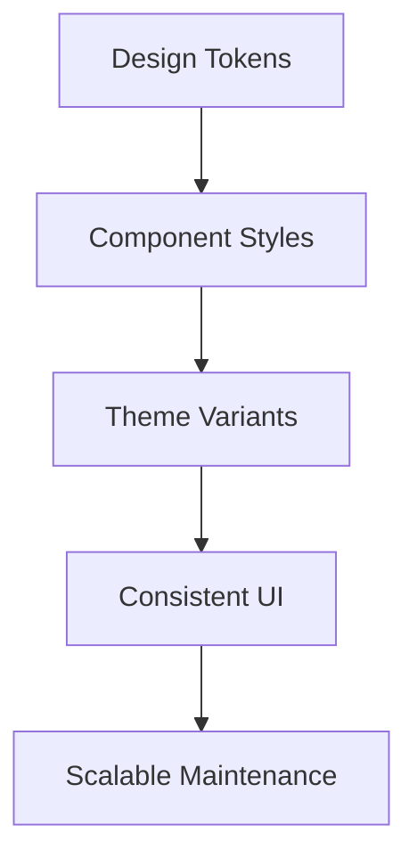

---
title: Styling Systems
slug: day-078-styling-systems
dayLabel: Day 78
level: Advanced
estimatedMinutes: 30
order: 78
track: react
---
# Day 78 [Advanced]: Styling Systems

## Goal

Design a scalable styling system using tokens, reusable components, and consistent theming patterns.

## Prerequisites

- Day 77 completed
- Basic CSS and component architecture familiarity

## Explanation

Styling systems reduce inconsistency by centralizing design decisions into tokens and reusable patterns. A scalable system should also define ownership, accessibility expectations, responsive behavior, and how teams introduce or deprecate visual patterns.

## Topic by Topic

### Topic 1: Design Tokens

Theory:
Tokens store color, spacing, radius, typography, and other shared design values.

Practical:
Create CSS variables in a central token file.

Code Example:

```css
:root {
  --space-4: 16px;
  --radius-md: 12px;
  --color-primary: #2563eb;
}
```

**Explanation:** Tokens centralize design values so teams can change spacing, colors, and typography without hunting through every component. Prefer semantic names such as `--color-primary` or `--color-surface` when the value represents a design role rather than a raw color.

**Key Points:**

- Store shared visual values once.
- Reuse tokens instead of hard-coded values.
- Keep naming clear and consistent.
- Prefer semantic tokens at component boundaries.

### Topic 2: Component-level Styling Strategy

Theory:
Each component should consume tokens, not hard-coded values.

Practical:
Refactor button/card styles to token usage.

Code Example:

```css
.btn {
  padding: var(--space-3);
  border-radius: var(--radius-md);
  background: var(--color-primary);
}
```

**Explanation:** Components should consume tokens, not invent their own values. That keeps the UI system visually consistent and makes global design changes safer.

**Key Points:**

- Build components from shared tokens.
- Reduce one-off styling decisions.
- Improve consistency across screens.
- Keep component APIs aligned with visual variants.

### Topic 3: Theming and Variants

Theory:
Themes and variants help scale branding and role-based UI.

Practical:
Use data-theme attributes and variant classes.

Code Example:

```css
[data-theme="dark"] {
  --bg: #111;
  --text: #f9fafb;
}
```

**Explanation:** Themes and variants help one system support multiple visual modes without rewriting every component style. Theme values should maintain sufficient contrast and should not depend on hard-coded component-specific overrides everywhere.

**Key Points:**

- Use theme variables for global changes.
- Use variants for controlled component differences.
- Keep theming rules predictable.
- Test contrast and focus states in every supported theme.

### Topic 4: Utility vs Component CSS Balance

Theory:
Utility classes are fast, component styles preserve semantic reuse.

Practical:
Use utilities for layout, components for domain UI.

Code Example:

```css
.stack {
  display: grid;
  gap: var(--space-4);
}
```

**Explanation:** Utilities are useful for layout speed, while component styles preserve domain meaning and reuse. A team should establish clear boundaries so developers know when a utility, component class, or variant is appropriate.

**Key Points:**

- Use utilities for repeated layout patterns.
- Use component CSS for business UI parts.
- Avoid mixing strategies without purpose.
- Document exceptions instead of creating ad-hoc conventions.

### Topic 5: CSS Modules vs Tailwind vs Styled Components

Theory:
React teams commonly choose between scoped CSS files, utility-first styling, and CSS-in-JS. Each approach has different tradeoffs.

Practical:
Compare when a team would choose CSS Modules, Tailwind, or Styled Components.

Code Example:

```text
CSS Modules:
- Scoped CSS files per component

Tailwind:
- Utility-first classes in markup

Styled Components:
- Styles written inside JavaScript components
```

**Explanation:** CSS Modules are useful when teams want familiar CSS with local scoping. Tailwind is useful when teams want rapid utility-based styling. Styled Components is a CSS-in-JS approach where styles live close to component logic. The right choice depends on team conventions, runtime requirements, build tooling, design-system needs, and migration cost.

**Key Points:**

- CSS Modules give file-level scoped CSS.
- Tailwind favors utility classes.
- Styled Components keeps styles close to component code.
- Avoid choosing a tool solely because it is popular; evaluate the application's constraints.

### Topic 6: Maintainability Guidelines

Theory:
Naming conventions and style linting avoid design drift.

Practical:
Define naming rules and review checklist.

Code Example:

```css
/* c-card, c-button, u-flex naming style */
```

**Explanation:** Governance matters because styling systems decay quickly when naming and review standards are unclear. Accessibility, responsive behavior, and deprecated-token handling should also be part of the review process.

**Key Points:**

- Define naming conventions early.
- Review new styles for consistency.
- Treat style quality as a team concern.
- Include accessibility and responsive behavior in reviews.

### Topic 7: Scalability Decisions for Styling Systems

Theory:
As projects grow, styling decisions should optimize team velocity, change safety, accessibility, performance, and long-term consistency.

Practical:
Document one design decision for this topic with tradeoff notes so future contributors understand why it was chosen.

Code Example:

```text
Architecture decision:
- Choose one primary styling approach
- Define token ownership
- Document component/utility boundaries
- Define migration and deprecation rules
```

**Explanation:** Styling architecture should be intentional. Documenting the chosen system helps new contributors extend it without creating drift and gives reviewers a shared standard for evaluating new styles.

**Key Points:**

- Record styling-system choices clearly.
- Note tradeoffs between utilities and components.
- Keep design evolution manageable over time.
- Define how old tokens/components are deprecated.

## Key Concepts

- Tokenized design values
- Reusable component style contracts
- Theme/variant architecture
- Utility-component balance
- Styling ecosystem tradeoffs
- Style governance and consistency
- Accessibility and responsive styling
- Scalable architecture thinking

## Visual Concept Map



## End-to-End Practical

1. Define token set for spacing/color/typography.
2. Refactor one feature to token-driven styles.
3. Add theme switch support.
4. Standardize button/card variants.
5. Document style conventions.
6. Check keyboard focus and color contrast in each theme.
7. Define a process for introducing and deprecating tokens/components.

## Hands-on Coding

### Example 1: Case - Token Foundation File

Scenario:
A healthcare dashboard uses inconsistent paddings and brand shades.

```css
/* styles/tokens.css */
:root {
  --color-brand: #0057b8;
  --color-surface: #f6f8fb;
  --color-text: #1f2937;
  --space-2: 8px;
  --space-4: 16px;
  --space-6: 24px;
  --radius-md: 10px;
}
```

### Example 2: Case - Token-driven Card + Button Styles

Scenario:
A SaaS settings page needs reusable styles for cards and actions.

```css
.c-card {
  background: var(--color-surface);
  color: var(--color-text);
  border-radius: var(--radius-md);
  padding: var(--space-6);
}

.c-button {
  background: var(--color-brand);
  color: white;
  padding: var(--space-2) var(--space-4);
  border-radius: var(--radius-md);
}
```

### Example 3: Case - Theme Toggle Pattern

Scenario:
A learning portal offers light and dark preference using token overrides.

```css
[data-theme="dark"] {
  --color-surface: #111827;
  --color-text: #f9fafb;
}
```

```tsx
// Example only: production apps should also persist preference
// and consider prefers-color-scheme and hydration behavior.
document.documentElement.setAttribute("data-theme", "dark");
```

## Mini Exercise

Scenario:
You are refactoring a profile screen with scattered inline styles.

Create token file, migrate component styles, and add one theme variant. Verify keyboard focus visibility and sufficient contrast for important text and controls.

Expected output:

- No repeated hard-coded spacing/color values
- Reusable styles for common components
- Theme change affects UI consistently
- Focus and contrast behavior remains accessible

## Assessment Quiz

### Quiz Questions

1. Why are design tokens important?
2. What is a variant in styling systems?
3. True or False: Hard-coded values in every component improve scalability.
4. When should utilities be preferred?
5. How does style governance help teams?
6. Why are semantic tokens useful?
7. What should be checked when adding a new theme?
8. Why should a styling system define deprecation rules?

### Quiz Answers

1. They centralize and standardize visual decisions.
2. A controlled style mode such as a primary/secondary button.
3. False.
4. For repetitive layout primitives and quick composition.
5. It prevents inconsistency and regression over time.
6. They represent design intent, making global visual changes safer than scattering raw values.
7. Contrast, focus visibility, readability, component states, and responsive behavior.
8. They prevent obsolete styles and tokens from accumulating and give teams a safe migration path.

## Task

- Refactor one UI screen with a design-token approach.
- Add reusable component styles and one theme variant.
- Add a short styling convention document for the feature.
- Check keyboard focus and contrast.
- Complete mini exercise.

## Self Check

- You can design maintainable styling architecture.
- You can reduce UI inconsistency with token-driven systems.
- You can compare common React styling approaches using practical tradeoffs.
- You can include accessibility and maintainability in styling decisions.
- You can answer at least 6 out of 8 quiz questions correctly.

## Interview Questions and Answers

### Beginner

**Question:** What is a design token?

**Answer:** A reusable named value for design properties like color or spacing.

**Question:** Why avoid hard-coded style values everywhere?

**Answer:** They are hard to maintain and cause inconsistency.

### Middle

**Question:** How do themes work in token systems?

**Answer:** Base tokens are overridden by theme-specific values.

**Question:** What is a practical split between utilities and component styles?

**Answer:** Use utilities for layout primitives and component styles for domain UI behavior.

### Advanced

**Question:** What is a common anti-pattern in styling architecture?

**Answer:** Mixing multiple uncontrolled styling paradigms without token governance.

**Question:** How do you roll out token migration incrementally?

**Answer:** Start with core components and high-traffic screens, then expand feature by feature while keeping compatibility and deprecation rules explicit.

**Question:** How do you prevent a design-token system from becoming another source of inconsistency?

**Answer:** Use semantic naming, ownership rules, review standards, documentation, automated checks where practical, and a controlled deprecation process.

**Question:** How should accessibility influence a styling system?

**Answer:** Accessibility should be a system-level requirement covering contrast, focus indicators, reduced-motion preferences, target sizing, readable typography, and behavior across themes rather than being left to individual screens.

## Day 78 Outcome

- You can create scalable styling systems for large React apps
- You can enforce consistency with tokens and variants
- You can evaluate styling approaches using practical tradeoffs
- You can include accessibility and governance in styling decisions
- You are ready for architecture-level planning in Day 79
