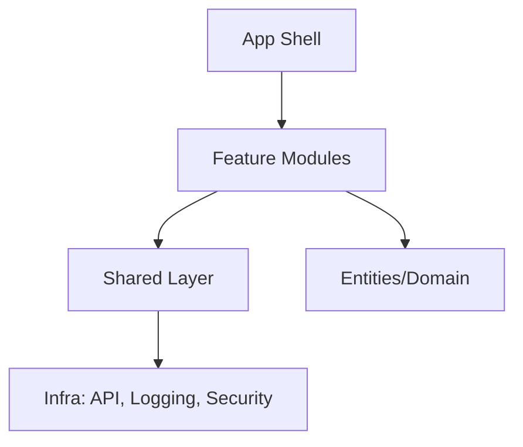

---
title: Frontend Architecture
slug: day-079-frontend-architecture
dayLabel: Day 79
level: Advanced
estimatedMinutes: 35
order: 79
track: react
---
# Day 79 [Advanced]: Frontend Architecture

## Goal

Design a frontend architecture that scales across teams, features, and long-term product evolution.

## Prerequisites

- Day 78 completed
- Prior experience with feature-based folder structure and typed state

## Explanation

Architecture decisions impact delivery speed, reliability, onboarding cost, and future refactoring complexity. Good architecture is less about creating many folders and more about creating boundaries that are easy to understand, enforce, test, and change.

## Topic by Topic

### Topic 1: Layered Architecture

Theory:
Separate app shell, features, shared libraries, entities, and infrastructure concerns.

Practical:
Define `app`, `features`, `shared`, `entities` layers and document what each layer is allowed to contain.

Code Example:

```text
src/app, src/features, src/shared, src/entities
```

**Explanation:** Layered architecture helps separate concerns so app shell, features, and shared code do not become tangled together. The value comes from explicit dependency rules, not folder names alone.

**Key Points:**

- Separate stable layers from fast-changing features.
- Keep architecture easy to explain.
- Use folder structure to support boundaries.
- Define allowed responsibilities for each layer.

### Topic 2: Feature Boundaries and Ownership

Theory:
Each feature should own components, hooks, state, and tests where practical.

Practical:
Assign module ownership and clear APIs between features.

Code Example:

```text
features/checkout/{ui,model,api,tests}
```

**Explanation:** Feature ownership works best when each module controls its UI, state, data access, and tests in one place. Features should expose only the contracts that other modules genuinely need.

**Key Points:**

- Group feature logic by domain.
- Give teams clear module ownership.
- Expose only intentional feature APIs.
- Avoid turning feature folders into unrelated catch-all buckets.

### Topic 3: Dependency Direction Rules

Theory:
Dependencies should flow according to explicit architectural boundaries.

Practical:
Prevent cyclic imports and forbidden dependencies with lint rules or dependency-graph tooling.

Code Example:

```text
feature -> shared allowed
shared -> feature disallowed
feature A -> feature B only through an approved public API
```

**Explanation:** Dependency direction rules stop accidental coupling and make large codebases easier to reason about. The exact direction can vary by architecture; what matters is that it is explicit and enforceable.

**Key Points:**

- Keep dependencies flowing according to documented rules.
- Prevent cyclic imports early.
- Enforce rules with linting where possible.
- Review cross-feature dependencies carefully.

### Topic 4: Cross-cutting Concerns

Theory:
Observability, security, error handling, configuration, and performance should be architectural concerns rather than duplicated feature code.

Practical:
Create shared infrastructure for logging, error handling, API access, and monitoring while keeping feature-specific behavior inside the feature.

Code Example:

```ts
export const apiClient = withMonitoring(withAuth(fetch));
```

**Explanation:** Cross-cutting concerns should be built into shared infrastructure so every feature benefits from the same standards. Avoid creating an oversized shared module that contains unrelated business logic.

**Key Points:**

- Centralize auth, logging, and monitoring helpers.
- Avoid duplicating infrastructure logic per feature.
- Keep shared wrappers predictable.
- Keep business rules out of generic infrastructure utilities.

### Topic 5: Decision Records and Governance

Theory:
Architecture drifts without explicit written decisions.

Practical:
Maintain lightweight architecture decision records (ADRs), ownership information, and dependency policies.

Code Example:

```md
ADR-007: Use feature-based module boundaries
```

**Explanation:** Written decisions reduce architecture drift because future contributors can see not just what was chosen, but why. ADRs should capture meaningful tradeoffs rather than become documentation for every small implementation detail.

**Key Points:**

- Use ADRs for important architecture choices.
- Keep decision notes lightweight and clear.
- Revisit them when constraints change.
- Pair documentation with automated enforcement where possible.

### Topic 6: Scalability Decisions for Frontend Architecture

Theory:
As projects grow, architectural decisions should optimize team velocity, change safety, observability, and long-term consistency.

Practical:
Document one design decision for this topic with tradeoff notes so future contributors understand why it was chosen.

Code Example:

```text
Architecture decision:
- Boundary: feature owns domain behavior
- Public API: index.ts
- Dependency rule: shared cannot import feature
- Enforcement: lint/dependency graph check
```

**Explanation:** Scaling architecture needs explicit tradeoff records and enforceable rules so teams can evolve structure without losing the original reasoning.

**Key Points:**

- Document architecture tradeoffs openly.
- Include migration paths for future changes.
- Use the notes to support team alignment.
- Prefer enforceable architectural rules over documentation alone.

## Key Concepts

- Layered modular architecture
- Feature ownership and contracts
- One-way dependency flow
- Shared cross-cutting infrastructure
- Governance through documented decisions
- Automated architecture enforcement
- Team ownership and migration strategy
- Scalable architecture thinking

## Visual Concept Map



## End-to-End Practical

1. Pick one medium-size React/Next feature set.
2. Map modules into architectural layers.
3. Define dependency rules and public module APIs.
4. Add shared cross-cutting utilities.
5. Write one architecture note (ADR style).
6. Identify ownership for each feature.
7. Add at least one automated check for a forbidden dependency or import cycle.

## Hands-on Coding

### Example 1: Case - Scalable Folder Blueprint

Scenario:
A fast-growing SaaS app needs predictable feature onboarding.

```text
src/
	app/
		providers/
		router/
	features/
		billing/
			ui/
			model/
			api/
			tests/
		reports/
			ui/
			model/
	shared/
		ui/
		lib/
		config/
```

### Example 2: Case - Public API per Feature

Scenario:
Teams should import feature behavior only through explicit entry points.

```ts
// features/billing/index.ts
export { BillingPage } from "./ui/BillingPage";
export { useBillingSummary } from "./model/useBillingSummary";
```

### Example 3: Case - ADR Template Snippet

Scenario:
Architecture review needs concise rationale for module boundaries.

```md
# ADR-011: Feature Module Boundaries

## Context

Current imports are tangled across unrelated modules.

## Decision

Adopt feature-based boundaries with public index exports.

## Consequences

Improves ownership clarity and reduces accidental coupling.

## Enforcement

Add a dependency rule to CI so forbidden imports fail the build.
```

## Mini Exercise

Scenario:
You are architecting a multi-team commerce frontend with catalog, checkout, and support modules.

Create layer map, dependency rules, ownership assignments, and one ADR for boundary policy.

Expected output:

- Clear module ownership per domain
- Dependency direction documented
- Team onboarding path simplified
- At least one architecture rule that could be automated in CI

## Assessment Quiz

### Quiz Questions

1. Why is explicit dependency direction important?
2. What is a feature public API file?
3. True or False: Architecture docs are optional once code is written.
4. What belongs in shared layer?
5. Why use ADRs?
6. Why should architecture rules be automated where possible?
7. What is a common sign that a shared module is becoming unhealthy?
8. Why is ownership important in a multi-team frontend?

### Quiz Answers

1. Prevents coupling and cyclic design issues.
2. A controlled entry point exposing feature contracts.
3. False.
4. Cross-feature reusable utilities and primitives that do not contain feature-specific business rules.
5. To preserve decision rationale and avoid repeated debates.
6. Automated checks catch violations consistently before they become architectural debt.
7. It accumulates unrelated business logic and becomes a dependency used by almost everything.
8. Clear ownership reduces coordination overhead and makes architectural decisions easier to maintain.

## Task

- Create architecture note for scaling app modules
- Define boundary and dependency guidelines
- Define ownership for at least three feature areas
- Add one enforceable dependency rule
- Complete mini exercise

## Self Check

- You can design architecture for scaling teams and features
- You can document and enforce architectural decisions
- You can explain dependency direction and public feature APIs
- You can distinguish shared infrastructure from business-specific feature logic
- You can answer at least 6 out of 8 quiz questions correctly

## Interview Questions and Answers

### Beginner

**Question:** What is frontend architecture?

**Answer:** The structural design of modules, dependencies, ownership, and shared concerns in frontend code.

**Question:** Why separate features into modules?

**Answer:** It improves maintainability, ownership, and change safety.

### Middle

**Question:** How do you avoid architecture drift?

**Answer:** Use documented rules, lint checks, ownership, and regular architecture reviews.

**Question:** What is a practical dependency rule?

**Answer:** Shared modules should not import from feature modules, while cross-feature dependencies should use approved public APIs.

### Advanced

**Question:** How does architecture affect delivery velocity?

**Answer:** Good boundaries reduce coordination overhead, regression risk, and the number of modules teams must understand before making a change.

**Question:** What is a scalable governance model for frontend architecture?

**Answer:** ADRs, ownership maps, dependency constraints, public module APIs, and CI-enforced architecture checks.

**Question:** How do you detect architecture debt before it becomes expensive?

**Answer:** Monitor dependency graphs, cycle counts, oversized shared modules, cross-feature imports, build/test boundaries, and repeated ownership conflicts.

**Question:** When should a shared utility become a dedicated feature/domain module?

**Answer:** When it starts containing domain-specific rules, requires a distinct owner, or becomes tightly coupled to one business capability. Keeping it shared only because many modules import it can create unhealthy coupling.

## Day 79 Outcome

- You can define and justify scalable frontend architecture
- You can align structure with team growth and product complexity
- You can document and enforce architectural boundaries
- You understand ownership, dependency direction, and governance tradeoffs
- You are ready for final capstone consolidation in Day 80
