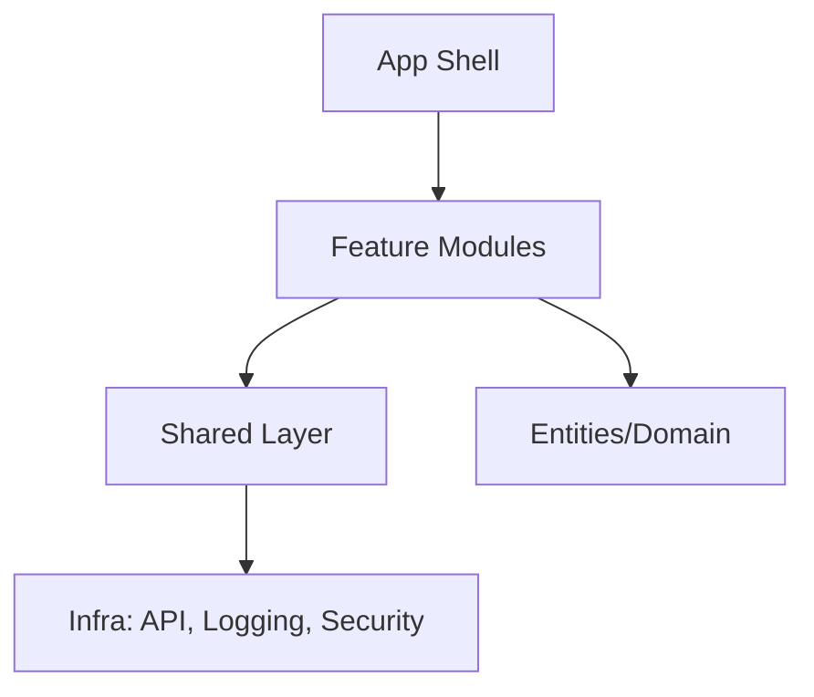

# Day 79 [Advanced]: Frontend Architecture

## Index

- [Goal](#goal)
- [Prerequisites](#prerequisites)
- [Explanation](#explanation)
- [Topic by Topic](#topic-by-topic)
- [Key Concepts](#key-concepts)
- [Visual Concept Map](#visual-concept-map)
- [End-to-End Practical](#end-to-end-practical)
- [Hands-on Coding](#hands-on-coding)
- [Mini Exercise](#mini-exercise)
- [Assessment Quiz](#assessment-quiz)
- [Task](#task)
- [Self Check](#self-check)
- [Interview Questions and Answers](#interview-questions-and-answers)
- [Day 79 Outcome](#day-79-outcome)

## Goal

Design a frontend architecture that scales across teams, features, and long-term product evolution.

## Prerequisites

- Day 78 completed
- Prior experience with feature-based folder structure and typed state

## Explanation

Architecture decisions impact delivery speed, reliability, onboarding cost, and future refactoring complexity.

## Topic by Topic

### Topic 1: Layered Architecture

Theory:
Separate app shell, features, shared libraries, and infrastructure concerns.

Practical:
Define `app`, `features`, `shared`, `entities` layers.

Code Example:

```text
src/app, src/features, src/shared
```

**Explanation:** Layered architecture helps separate concerns so app shell, features, and shared code do not become tangled together.

**Key Points:**

- Separate stable layers from fast-changing features.
- Keep architecture easy to explain.
- Use folder structure to support boundaries.

### Topic 2: Feature Boundaries and Ownership

Theory:
Each feature should own components, hooks, state, and tests.

Practical:
Assign module ownership and clear APIs between features.

Code Example:

```text
features/checkout/{ui,model,api,tests}
```

**Explanation:** Feature ownership works best when each module controls its UI, state, data access, and tests in one place.

**Key Points:**

- Group feature logic by domain.
- Give teams clear module ownership.
- Expose only intentional feature APIs.

### Topic 3: Dependency Direction Rules

Theory:
Dependencies should flow from high-level app to stable shared modules.

Practical:
Prevent cyclic imports with lint rules.

Code Example:

```text
feature -> shared allowed, shared -> feature disallowed
```

**Explanation:** Dependency direction rules stop accidental coupling and make large codebases easier to reason about.

**Key Points:**

- Keep dependencies flowing one way.
- Prevent cyclic imports early.
- Enforce rules with linting where possible.

### Topic 4: Cross-cutting Concerns

Theory:
Observability, security, and performance should be architectural defaults.

Practical:
Create shared wrappers for logging, error handling, and API client.

Code Example:

```ts
export const apiClient = withMonitoring(withAuth(fetch));
```

**Explanation:** Cross-cutting concerns should be built into shared infrastructure so every feature benefits from the same standards.

**Key Points:**

- Centralize auth, logging, and monitoring helpers.
- Avoid duplicating infra logic per feature.
- Keep shared wrappers predictable.

### Topic 5: Decision Records and Governance

Theory:
Architecture drifts without explicit written decisions.

Practical:
Maintain lightweight architecture decision records (ADRs).

Code Example:

```md
ADR-007: Use feature-based module boundaries
```

**Explanation:** Written decisions reduce architecture drift because future contributors can see not just what was chosen, but why.

**Key Points:**

- Use ADRs for important architecture choices.
- Keep decision notes lightweight and clear.
- Revisit them when constraints change.

### Topic 6: Scalability Decisions for Frontend Architecture

Theory:
As projects grow, architectural and typing decisions should optimize team velocity, change safety, and long-term consistency.

Practical:
Document one design decision for this topic with tradeoff notes so future contributors understand why it was chosen.

Code Example:

`jsx
// Record architecture tradeoff and migration path in project docs.
`

**Explanation:** Scaling architecture needs explicit tradeoff records so teams can evolve structure without losing the original reasoning.

**Key Points:**

- Document architecture tradeoffs openly.
- Include migration paths for future changes.
- Use the notes to support team alignment.

## Key Concepts

- Layered modular architecture
- Feature ownership and contracts
- One-way dependency flow
- Shared cross-cutting infrastructure
- Governance through documented decisions

- Scalable architecture thinking

## Visual Concept Map



## End-to-End Practical

1. Pick one medium-size React/Next feature set.
2. Map modules into architectural layers.
3. Define dependency rules and public module APIs.
4. Add shared cross-cutting utilities.
5. Write one architecture note (ADR style).

## Hands-on Coding

### Example 1: Case - Scalable Folder Blueprint

Scenario:
A fast-growing SaaS app needs predictable feature onboarding.

```text
src/
	app/
		providers/
		router/
	features/
		billing/
			ui/
			model/
			api/
			tests/
		reports/
			ui/
			model/
	shared/
		ui/
		lib/
		config/
```

### Example 2: Case - Public API per Feature

Scenario:
Teams should import feature behavior only through explicit entry points.

```ts
// features/billing/index.ts
export { BillingPage } from "./ui/BillingPage";
export { useBillingSummary } from "./model/useBillingSummary";
```

### Example 3: Case - ADR Template Snippet

Scenario:
Architecture review needs concise rationale for module boundaries.

```md
# ADR-011: Feature Module Boundaries

## Context

Current imports are tangled across unrelated modules.

## Decision

Adopt feature-based boundaries with public index exports.

## Consequences

Improves ownership clarity and reduces accidental coupling.
```

## Mini Exercise

Scenario:
You are architecting a multi-team commerce frontend with catalog, checkout, and support modules.

Create layer map, dependency rules, and one ADR for boundary policy.

Expected output:

- Clear module ownership per domain
- Dependency direction documented
- Team onboarding path simplified

## Assessment Quiz

### Quiz Questions

1. Why is explicit dependency direction important?
2. What is a feature public API file?
3. True or False: Architecture docs are optional once code is written.
4. What belongs in shared layer?
5. Why use ADRs?

### Quiz Answers

1. Prevents coupling and cyclic design issues
2. Controlled entry point exposing feature contracts
3. False
4. Cross-feature reusable utilities and primitives
5. To preserve decision rationale and avoid repeated debates

## Task

- Create architecture note for scaling app modules
- Define boundary and dependency guidelines
- Complete mini exercise

## Self Check

- You can design architecture for scaling teams and features
- You can document and enforce architectural decisions
- You can answer at least 4 out of 5 quiz questions correctly

## Interview Questions and Answers

### Beginner

**Question:** What is frontend architecture?

**Answer:** The structural design of modules, dependencies, and shared concerns in frontend code.

**Question:** Why separate features into modules?

**Answer:** Improves maintainability, ownership, and change safety.

### Middle

**Question:** How do you avoid architecture drift?

**Answer:** Use documented rules, lint checks, and regular architecture reviews.

**Question:** What is a practical dependency rule?

**Answer:** Shared modules do not import from feature modules.

### Advanced

**Question:** How does architecture affect delivery velocity?

**Answer:** Good boundaries reduce coordination overhead and regression risk.

**Question:** What is a scalable governance model for frontend architecture?

**Answer:** ADRs, ownership maps, and CI-enforced dependency constraints.

## Day 79 Outcome

- You can define and justify scalable frontend architecture
- You can align structure with team growth and product complexity
- You are ready for final capstone consolidation in Day 80
