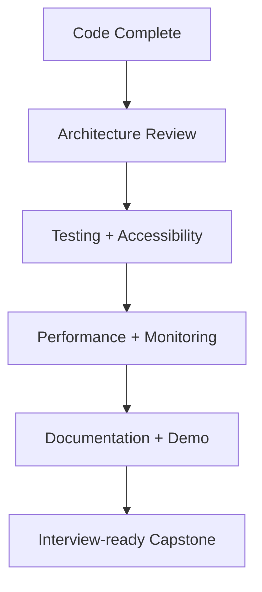

# Day 80 [Advanced]: Capstone Review

## Index

- [Goal](#goal)
- [Prerequisites](#prerequisites)
- [Explanation](#explanation)
- [Topic by Topic](#topic-by-topic)
- [Key Concepts](#key-concepts)
- [Visual Concept Map](#visual-concept-map)
- [End-to-End Practical](#end-to-end-practical)
- [Hands-on Coding](#hands-on-coding)
- [Mini Exercise](#mini-exercise)
- [Assessment Quiz](#assessment-quiz)
- [Task](#task)
- [Self Check](#self-check)
- [Interview Questions and Answers](#interview-questions-and-answers)
- [Day 80 Outcome](#day-80-outcome)

## Goal

Perform a complete capstone quality review across architecture, accessibility, performance, testing, and production readiness.

## Prerequisites

- Day 79 completed
- Capstone or large mini-project implemented

## Explanation

Capstone review ensures your project is not only functional, but also maintainable, performant, secure, and interview-ready.

## Topic by Topic

### Topic 1: Architecture Review Checklist

Theory:
Structure quality predicts long-term maintainability.

Practical:
Verify module boundaries and dependency direction.

Code Example:

```text
No cross-feature deep imports without public APIs
```

**Explanation:** Capstone review starts with structure because architecture problems usually slow future work even when the app appears to function today.

**Key Points:**

- Check boundaries before polishing details.
- Look for coupling and unclear ownership.
- Treat structure as a quality signal.

### Topic 2: Testing and Reliability Review

Theory:
Critical paths need test confidence at multiple levels.

Practical:
Check unit, integration, and E2E coverage of core flows.

Code Example:

```text
login -> primary action -> success/failure path tests
```

**Explanation:** Reliability review should focus on critical flows, not just test count. The goal is confidence where failure matters most.

**Key Points:**

- Test important paths first.
- Include both success and failure cases.
- Use multiple test levels when needed.

### Topic 3: Accessibility and UX Quality

Theory:
Keyboard, semantics, and feedback states are mandatory quality signals.

Practical:
Run keyboard walkthrough and screen-reader checks.

Code Example:

```text
Tab order, visible focus, proper labels, aria-live statuses
```

**Explanation:** Accessibility review checks whether real users can operate the interface fully, not whether the UI simply looks complete.

**Key Points:**

- Review keyboard behavior end to end.
- Check semantics and feedback states.
- Fix usability blockers before launch.

### Topic 4: Performance and Monitoring

Theory:
Performance budgets and error observability must be validated.

Practical:
Check vitals baseline and ensure monitoring events flow.

Code Example:

```text
LCP/INP/CLS targets + one monitoring event verification
```

**Explanation:** Performance and monitoring checks verify both speed and production visibility, which are key parts of real-world readiness.

**Key Points:**

- Measure vitals against clear targets.
- Confirm monitoring events are flowing.
- Combine speed and observability checks.

### Topic 5: Portfolio and Interview Packaging

Theory:
Strong presentation converts technical work into interview impact.

Practical:
Prepare README with decisions, tradeoffs, and demos.

Code Example:

```md
## Why this architecture?

## Performance results

## Testing strategy
```

**Explanation:** A strong capstone is easier to discuss when the technical story is documented clearly for reviewers and interviewers.

**Key Points:**

- Summarize tradeoffs and decisions clearly.
- Show evidence with metrics and tests.
- Make reviewer understanding fast and easy.

### Topic 6: Scalability Decisions for Capstone Review

Theory:
As projects grow, architectural and typing decisions should optimize team velocity, change safety, and long-term consistency.

Practical:
Document one design decision for this topic with tradeoff notes so future contributors understand why it was chosen.

Code Example:

`jsx
// Record architecture tradeoff and migration path in project docs.
`

**Explanation:** Final project review should leave a record of major decisions so the project is maintainable beyond the interview or demo stage.

**Key Points:**

- Keep final design rationale documented.
- Note what should improve next.
- Treat capstone review as a maintenance handoff too.

## Key Concepts

- End-to-end quality gates
- Risk-based testing and reliability
- Accessibility compliance checks
- Performance + observability validation
- Storytelling for portfolio/interview

- Scalable architecture thinking

## Visual Concept Map



## End-to-End Practical

1. Select your best project as capstone.
2. Run architecture and code health audit.
3. Validate tests, accessibility, and performance.
4. Fix highest-priority quality gaps.
5. Publish final README and review notes.

## Hands-on Coding

### Example 1: Case - Capstone Audit Matrix

Scenario:
A candidate is preparing a project for frontend interview panel.

```md
| Area          | Check                     | Status  | Action              |
| ------------- | ------------------------- | ------- | ------------------- |
| Architecture  | Feature boundaries        | Partial | Remove deep imports |
| Testing       | Checkout integration test | Missing | Add MSW test        |
| Accessibility | Modal focus loop          | Failing | Add focus restore   |
| Performance   | LCP > 3.0s                | Failing | Optimize hero image |
```

### Example 2: Case - Performance + Error Monitoring Snapshot

Scenario:
A marketplace app should show measurable improvements before final submission.

```md
Before:

- LCP: 3.4s
- INP: 260ms

After:

- LCP: 2.1s
- INP: 150ms

Monitoring:

- Error ingestion validated with release tag `capstone-v1`
```

### Example 3: Case - Interview-ready README Sections

Scenario:
Reviewer should understand architecture and engineering decisions quickly.

```md
## Project Highlights

- Feature-based architecture with typed state layer
- SSR + ISR strategy by route requirement
- RTL + integration + E2E coverage for critical flows
```

## Mini Exercise

Scenario:
You are finalizing your Day 56+ commerce project as portfolio capstone.

Run a full quality review and produce:

- audit matrix
- top 5 fixes
- final technical summary

Expected output:

- Concrete gap list with severity
- Applied fixes and measurable improvements
- Clear presentation for interview discussion

## Assessment Quiz

### Quiz Questions

1. Why should capstone review include non-functional checks?
2. What is one sign architecture is not production-ready?
3. True or False: A working UI without tests is enough for strong portfolio quality.
4. Why document performance before/after numbers?
5. What makes a capstone interview-ready?

### Quiz Answers

1. Reliability and maintainability determine real-world readiness
2. Unclear boundaries and tangled dependencies
3. False
4. Demonstrates evidence-based engineering impact
5. Clear tradeoffs, quality signals, and polished technical narrative

## Task

- Run final checks on performance, tests, accessibility, and structure
- Implement top-priority quality fixes
- Complete mini exercise

## Self Check

- You can perform structured capstone quality review
- You can present engineering decisions with measurable outcomes
- You can answer at least 4 out of 5 quiz questions correctly

## Interview Questions and Answers

### Beginner

**Question:** What should a capstone project demonstrate?

**Answer:** Functional correctness plus maintainability, testing, and usability quality.

**Question:** Why include README architecture notes?

**Answer:** To explain technical decisions and project scalability clearly.

### Middle

**Question:** How do you prioritize final capstone fixes?

**Answer:** Start with highest user/business risk: crashes, core flow failures, accessibility blockers.

**Question:** Which metrics strengthen portfolio credibility?

**Answer:** Test coverage signals, performance improvements, and resolved reliability issues.

### Advanced

**Question:** How would you defend a tradeoff in interview (for example ISR over SSR)?

**Answer:** Explain freshness requirement, performance goals, cost impact, and measured outcomes.

**Question:** What process keeps capstone quality sustainable post-release?

**Answer:** CI quality gates, observability alerts, regression tests, and periodic architecture review.

## Day 80 Outcome

- You can run a complete professional-grade project review
- You can transform project work into interview-ready evidence
- You have completed a scalable advanced React engineering track
