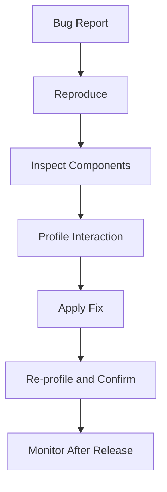

---
title: React DevTools Deep Dive
slug: day-081-react-devtools-deep-dive
dayLabel: Day 81
level: Intermediate
estimatedMinutes: 30
order: 81
track: react
---
# Day 81 [Intermediate]: React DevTools Deep Dive

## Goal

Use React DevTools effectively to diagnose rendering issues, inspect state flow, and validate performance decisions.

## Prerequisites

- Day 80 completed
- Comfort with React components, hooks, and state updates

## Explanation

React DevTools helps you inspect component trees, props, hook state, context, render behavior, and profiling timelines to debug faster. The most important skill is not simply knowing where a value appears in DevTools, but building an evidence-based workflow: reproduce the issue, inspect the relevant component, measure the behavior, make the smallest useful change, and verify the result again.

## Topic by Topic

### Topic 1: Components Panel Basics

Theory:
Components tab shows hierarchy, props, and current hook state.

Practical:
Inspect a nested component and track prop flow.

Code Example:

```jsx
// Observe props change in ProductList -> ProductCard chain.
```

**Explanation:** The Components panel is the fastest place to confirm what props and state a component actually has during runtime. It can also help identify unexpected component nesting, duplicated providers, and values that differ from what the source code suggests.

**Key Points:**

- Inspect the real rendered tree, not just source code assumptions.
- Verify prop flow between parent and child.
- Use it to confirm whether state lives in the right place.
- Inspect provider/context boundaries when values look incorrect.

### Topic 2: Hooks State Inspection

Theory:
DevTools reveals `useState`, `useReducer`, and context values.

Practical:
Verify unexpected state values directly in panel.

Code Example:

```jsx
const [filter, setFilter] = useState("all");
```

**Explanation:** Hook inspection helps you verify whether current state values match what the UI should be showing. It is especially useful when an event appears to fire correctly but the rendered result does not match the expected state transition.

**Key Points:**

- Check `useState`, `useReducer`, and context values directly.
- Confirm whether stale or unexpected state exists.
- Use it before rewriting logic blindly.
- Compare state before and after the user interaction that reproduces the bug.

### Topic 3: Profiler Timeline

Theory:
Profiler displays commit durations and expensive re-renders.

Practical:
Record interaction and identify slow component commits.

Code Example:

```jsx
console.count("Rendered ProductRow");
```

**Explanation:** The Profiler helps measure actual render cost, so performance work is based on evidence instead of guesswork. Look for expensive commits, repeated renders, and components that consume a disproportionate amount of the interaction's render time.

**Key Points:**

- Record the slow interaction first.
- Compare commit durations before and after changes.
- Optimize only the components causing real cost.
- Measure the same user interaction after the change.

### Topic 4: Why Did This Render?

Theory:
Render reason tools explain which props/state changed.

Practical:
Compare before/after memoization impact.

Code Example:

```jsx
const Row = React.memo(function Row({ item }) {
  return <div>{item.name}</div>;
});
```

**Explanation:** Render reason information helps explain why a component re-rendered, which is critical when memoization does not behave as expected. A re-render is not automatically a performance bug; the goal is to determine whether the render is expensive, unnecessary, or caused by unstable inputs.

**Key Points:**

- Check which prop or state changed.
- Use this to validate memoization decisions.
- Avoid adding memoization without proof.
- Look for unstable object, array, and callback references when relevant.

### Topic 5: Debug Workflow Pattern

Theory:
Best debugging flow: reproduce -> inspect -> measure -> patch -> re-validate.

Practical:
Create repeatable issue triage checklist.

Code Example:

```text
Issue template:
- Symptoms
- Reproduction steps
- DevTools evidence
- Root cause
- Fix
- Before/after validation
```

**Explanation:** A repeatable debug workflow reduces random trial-and-error and makes team debugging much faster. DevTools evidence should support the root-cause claim rather than simply being attached as a screenshot.

**Key Points:**

- Reproduce the issue before inspecting it.
- Measure and document the fix.
- Re-validate after the patch lands.
- Keep the smallest reproducible case when possible.

### Topic 6: Operational Readiness for React DevTools Deep Dive

Theory:
Senior-level frontend work connects implementation with observability, release discipline, security posture, and platform constraints.

Practical:
Add one operational rule (monitoring, rollback, security check, or browser support gate) tied to this topic.

Code Example:

```text
Operational gate:
- Capture baseline performance
- Validate the fix in the target browser/runtime
- Monitor relevant errors after release
- Keep a rollback path for risky changes
```

**Explanation:** DevTools findings matter more when they connect to rollout safety, monitoring, and production support practices. Local profiling is useful evidence, but production behavior can differ because of data volume, devices, network conditions, and runtime environment.

**Key Points:**

- Turn debugging lessons into release checks.
- Add rollback or monitoring gates for risky UI changes.
- Treat observability as part of engineering quality.
- Validate important fixes under realistic production-like conditions.

## Key Concepts

- Component tree inspection
- Hook/state visibility
- Render profiling and commit cost
- Render-cause diagnostics
- Repeatable debugging process
- Evidence-based optimization
- Production validation and observability
- Operational excellence mindset

## Visual Concept Map



## End-to-End Practical

1. Reproduce a UI lag issue.
2. Inspect tree/props in Components panel.
3. Inspect relevant hook/context state.
4. Profile the interaction timeline.
5. Patch unnecessary re-render or bad state flow.
6. Record before/after findings.
7. Re-run the same interaction and verify the improvement.
8. Define one production monitoring or rollback check.

## Hands-on Coding

### Example 1: Case - Prop Drilling Debug

Scenario:
A catalog filter doesn't update deep card badges correctly.

```jsx
function ProductList({ filter, products }) {
  return products.map((p) => (
    <ProductCard key={p.id} product={p} filter={filter} />
  ));
}
```

Use DevTools Components panel to verify whether `filter` reaches `ProductCard` with the expected value. Inspect the parent and child before changing the state architecture.

### Example 2: Case - Re-render Spike in Table

Scenario:
Dashboard table re-renders all rows when opening a side panel.

```jsx
const UserRow = React.memo(function UserRow({ user }) {
  return (
    <tr>
      <td>{user.name}</td>
    </tr>
  );
});
```

Use Profiler to confirm row commit behavior before and after memoization. Also verify that the `user` reference is stable; `React.memo` cannot prevent a render when the prop reference changes on every parent render.

### Example 3: Case - Stale State Investigation

Scenario:
Status chip shows outdated count after batch updates.

```jsx
setCount((c) => c + 1);
setCount((c) => c + 1);
```

Use hook state inspection to confirm the final value and ensure updates are functional-style. This pattern is safer when multiple updates depend on the previous state.

## Mini Exercise

Scenario:
You are debugging a CRM list page where search feels slow and item selection state is inconsistent.

Use DevTools to identify one performance issue and one state-flow issue, then fix both. Capture the evidence that led you to the root cause and compare the same interaction before and after the fix.

Expected output:

- Root cause documented with DevTools evidence
- Patch validated by reduced re-renders or corrected state
- Clear short debugging report
- Before/after measurement for the performance issue

## Assessment Quiz

### Quiz Questions

1. What can Components panel help verify?
2. Why use Profiler before optimization?
3. True or False: DevTools can inspect hook state values.
4. What does render reason analysis help with?
5. What is the ideal final step after a fix?
6. Why can `React.memo` still allow a child to re-render?
7. Should every re-render be treated as a performance bug?
8. Why should an important DevTools-based fix be validated in realistic conditions?

### Quiz Answers

1. Component hierarchy, props, state, and provider/context relationships.
2. To target real bottlenecks with evidence.
3. True.
4. Understanding what triggered a component re-render.
5. Re-profile and confirm measurable improvement.
6. Because changed state, changed context, or changed prop references can still trigger rendering; unstable object/function references are common causes.
7. No. Re-renders are normal React behavior; the concern is unnecessary or expensive rendering.
8. Real devices, data volume, network conditions, and production runtime behavior can differ from local development.

## Task

- Debug one issue and capture findings
- Validate the fix using DevTools evidence
- Compare before/after profiling data
- Add one operational validation or monitoring rule
- Complete mini exercise

## Self Check

- You can diagnose component and state issues with DevTools
- You can connect profiling output to concrete fixes
- You can distinguish normal re-renders from expensive unnecessary work
- You can validate memoization and state changes using runtime evidence
- You can answer at least 6 out of 8 quiz questions correctly

## Interview Questions and Answers

### Beginner

**Question:** What is React DevTools used for?

**Answer:** Inspecting React components, props, state, context, and render behavior during runtime.

**Question:** Which tab helps analyze rendering performance?

**Answer:** The Profiler tab.

### Middle

**Question:** How do you confirm an optimization actually worked?

**Answer:** Reproduce the same interaction and compare profiler commit information, render behavior, and user-visible responsiveness before and after the change.

**Question:** What is a common anti-pattern during debugging?

**Answer:** Making optimization changes without profiling evidence or changing several variables at once so the real cause becomes unclear.

### Advanced

**Question:** How does DevTools help prevent architecture regressions?

**Answer:** It reveals recurring render hotspots, unexpected component boundaries, excessive prop/context propagation, and state placement problems early enough to address them before they become systemic.

**Question:** What should a production debugging note include?

**Answer:** Reproduction steps, root cause, impacted scope, DevTools evidence, fix details, before/after validation, and any monitoring or rollback considerations.

**Question:** Why might `React.memo` fail to reduce renders?

**Answer:** The component can still render when its props change by reference, when its own state changes, or when consumed context changes. Memoization also does not fix expensive work that occurs outside the memoized boundary.

**Question:** How would you investigate a page that feels slow but has no obvious single expensive component?

**Answer:** Record the exact interaction, inspect commit patterns, look for repeated moderate-cost renders, unstable references, large component trees, state updates with broad fan-out, and browser-level work such as layout or scripting. Then make one targeted change and measure again.

## Day 81 Outcome

- You can use React DevTools as a professional debugging workflow
- You can find and verify performance/state fixes with evidence
- You can distinguish normal rendering from actionable performance problems
- You can connect local debugging findings with production validation
- You are ready for complex state orchestration in Day 82
