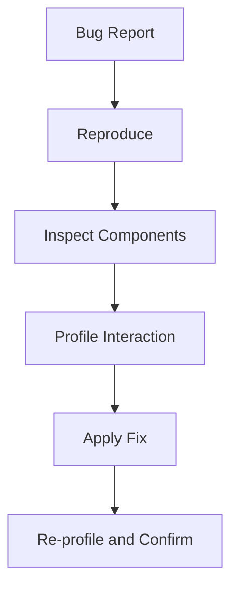

# Day 81 [Intermediate]: React DevTools Deep Dive

## Index

- [Goal](#goal)
- [Prerequisites](#prerequisites)
- [Explanation](#explanation)
- [Topic by Topic](#topic-by-topic)
- [Key Concepts](#key-concepts)
- [Visual Concept Map](#visual-concept-map)
- [End-to-End Practical](#end-to-end-practical)
- [Hands-on Coding](#hands-on-coding)
- [Mini Exercise](#mini-exercise)
- [Assessment Quiz](#assessment-quiz)
- [Task](#task)
- [Self Check](#self-check)
- [Interview Questions and Answers](#interview-questions-and-answers)
- [Day 81 Outcome](#day-81-outcome)

## Goal

Use React DevTools effectively to diagnose rendering issues, inspect state flow, and validate performance decisions.

## Prerequisites

- Day 80 completed
- Comfort with React components, hooks, and state updates

## Explanation

React DevTools helps you inspect component trees, hook state, render reasons, and profiling timelines to debug faster.

## Topic by Topic

### Topic 1: Components Panel Basics

Theory:
Components tab shows hierarchy, props, and current hook state.

Practical:
Inspect a nested component and track prop flow.

Code Example:

```jsx
// Observe props change in ProductList -> ProductCard chain.
```

**Explanation:** The Components panel is the fastest place to confirm what props and state a component actually has during runtime.

**Key Points:**

- Inspect the real rendered tree, not just source code assumptions.
- Verify prop flow between parent and child.
- Use it to confirm whether state lives in the right place.

### Topic 2: Hooks State Inspection

Theory:
DevTools reveals `useState`, `useReducer`, and context values.

Practical:
Verify unexpected state values directly in panel.

Code Example:

```jsx
const [filter, setFilter] = useState("all");
```

**Explanation:** Hook inspection helps you verify whether current state values match what the UI should be showing.

**Key Points:**

- Check `useState`, `useReducer`, and context values directly.
- Confirm whether stale or unexpected state exists.
- Use it before rewriting logic blindly.

### Topic 3: Profiler Timeline

Theory:
Profiler displays commit durations and expensive re-renders.

Practical:
Record interaction and identify slow component commits.

Code Example:

```jsx
console.count("Rendered ProductRow");
```

**Explanation:** The Profiler helps measure actual render cost, so performance work is based on evidence instead of guesswork.

**Key Points:**

- Record the slow interaction first.
- Compare commit durations before and after changes.
- Optimize only the components causing real cost.

### Topic 4: Why Did This Render?

Theory:
Render reason tools explain which props/state changed.

Practical:
Compare before/after memoization impact.

Code Example:

```jsx
const Row = React.memo(function Row({ item }) { ... });
```

**Explanation:** Render reason tools explain why a component re-rendered, which is critical when memoization does not behave as expected.

**Key Points:**

- Check which prop or state changed.
- Use this to validate memoization decisions.
- Avoid adding memoization without proof.

### Topic 5: Debug Workflow Pattern

Theory:
Best debugging flow: reproduce -> inspect -> measure -> patch -> re-validate.

Practical:
Create repeatable issue triage checklist.

Code Example:

```jsx
// Issue template: symptoms, root cause, fix, verification.
```

**Explanation:** A repeatable debug workflow reduces random trial-and-error and makes team debugging much faster.

**Key Points:**

- Reproduce the issue before inspecting it.
- Measure and document the fix.
- Re-validate after the patch lands.

### Topic 6: Operational Readiness for React DevTools Deep Dive

Theory:
Senior-level frontend work connects implementation with observability, release discipline, security posture, and platform constraints.

Practical:
Add one operational rule (monitoring, rollback, security check, or browser support gate) tied to this topic.

Code Example:

`jsx
// Define an operational gate for safe rollout and rollback.
`
**Explanation:** DevTools findings matter more when they connect to rollout safety, monitoring, and production support practices.

**Key Points:**

- Turn debugging lessons into release checks.
- Add rollback or monitoring gates for risky UI changes.
- Treat observability as part of engineering quality.

## Key Concepts

- Component tree inspection
- Hook/state visibility
- Render profiling and commit cost
- Render-cause diagnostics
- Repeatable debugging process

- Operational excellence mindset

## Visual Concept Map



## End-to-End Practical

1. Reproduce a UI lag issue.
2. Inspect tree/props in Components panel.
3. Profile interaction timeline.
4. Patch unnecessary re-render or bad state flow.
5. Record before/after findings.

## Hands-on Coding

### Example 1: Case - Prop Drilling Debug

Scenario:
A catalog filter doesn�t update deep card badges correctly.

```jsx
function ProductList({ filter }) {
  return products.map((p) => (
    <ProductCard key={p.id} product={p} filter={filter} />
  ));
}
```

Use DevTools Components panel to verify whether `filter` reaches `ProductCard` with expected value.

### Example 2: Case - Re-render Spike in Table

Scenario:
Dashboard table re-renders all rows when opening a side panel.

```jsx
const UserRow = React.memo(function UserRow({ user }) {
  return (
    <tr>
      <td>{user.name}</td>
    </tr>
  );
});
```

Use Profiler to confirm row commit count decreases after memoization + stable props.

### Example 3: Case - Stale State Investigation

Scenario:
Status chip shows outdated count after batch updates.

```jsx
setCount((c) => c + 1);
setCount((c) => c + 1);
```

Use hook state inspection to confirm final value and ensure updates are functional-style.

## Mini Exercise

Scenario:
You are debugging a CRM list page where search feels slow and item selection state is inconsistent.

Use DevTools to identify one performance issue and one state-flow issue, then fix both.

Expected output:

- Root cause documented with DevTools evidence
- Patch validated by reduced re-renders or corrected state
- Clear short debugging report

## Assessment Quiz

### Quiz Questions

1. What can Components panel help verify?
2. Why use Profiler before optimization?
3. True or False: DevTools can inspect hook state values.
4. What does render reason analysis help with?
5. What is the ideal final step after a fix?

### Quiz Answers

1. Component hierarchy, props, and state
2. To target real bottlenecks with evidence
3. True
4. Understanding what triggered re-render
5. Re-profile and confirm measurable improvement

## Task

- Debug one issue and capture findings
- Validate the fix using DevTools evidence
- Complete mini exercise

## Self Check

- You can diagnose component and state issues with DevTools
- You can connect profiling output to concrete fixes
- You can answer at least 4 out of 5 quiz questions correctly

## Interview Questions and Answers

### Beginner

**Question:** What is React DevTools used for?

**Answer:** Inspecting React components, props, state, and render behavior.

**Question:** Which tab helps analyze rendering performance?

**Answer:** Profiler tab.

### Middle

**Question:** How do you confirm an optimization actually worked?

**Answer:** Compare profiler commit times and render counts before/after.

**Question:** What is a common anti-pattern during debugging?

**Answer:** Making optimization changes without profiling evidence.

### Advanced

**Question:** How does DevTools help prevent architecture regressions?

**Answer:** It reveals recurring render hotspots and excessive prop chains early.

**Question:** What should a production debugging note include?

**Answer:** Repro steps, root cause, impacted scope, fix details, and validation metrics.

## Day 81 Outcome

- You can use React DevTools as a professional debugging workflow
- You can find and verify performance/state fixes with evidence
- You are ready for complex state orchestration in Day 82
