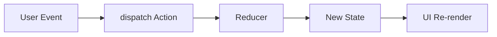

---
title: useReducer for Complex State
slug: day-082-usereducer-for-complex-state
dayLabel: Day 82
level: Intermediate
estimatedMinutes: 30
order: 82
track: react
---
# Day 82 [Intermediate]: useReducer for Complex State

## Goal

Use `useReducer` to manage complex multi-action state with explicit transitions and predictable updates.

## Prerequisites

- Day 81 completed
- Solid understanding of useState and immutable updates

## Explanation

When state contains multiple related fields and many transitions, reducers centralize logic and make behavior easier to reason about. A reducer is especially useful when several state fields must change together in response to a single event. It does not automatically make code better; simple independent state can remain clearer with `useState`.

## Topic by Topic

### Topic 1: Reducer Pattern Fundamentals

Theory:
Reducer receives current state + action and returns next state.

Practical:
Define action types and payload contracts.

Code Example:

```jsx
function reducer(state, action) {
  switch (action.type) {
    case "INCREMENT":
      return { ...state, count: state.count + 1 };
    default:
      return state;
  }
}
```

**Explanation:** `useReducer` is useful when state transitions are easier to understand as named actions instead of many separate setters. The reducer should be a pure function: the same state and action should produce the same next state.

**Key Points:**

- Prefer reducers for more complex state transitions.
- Keep state updates action-driven.
- Use it when `useState` becomes hard to manage.
- Keep reducer logic pure and deterministic.

### Topic 2: Initial State Design

Theory:
A clear initial shape avoids missing-field bugs.

Practical:
Model form fields, loading flags, and error states.

Code Example:

```jsx
const initialState = {
  values: {},
  errors: {},
  status: "idle",
};
```

**Explanation:** Good initial state design makes the reducer easier to read, test, and extend later. State should represent meaningful UI states without duplicating values that can already be derived.

**Key Points:**

- Model the feature state clearly up front.
- Keep related values grouped logically.
- Avoid unclear or duplicated state fields.
- Prefer derived values over storing redundant state.

### Topic 3: Action-driven Updates

Theory:
Each action should represent a domain event.

Practical:
Use `ADD_ITEM`, `REMOVE_ITEM`, `SUBMIT_SUCCESS` style actions.

Code Example:

```jsx
dispatch({ type: "SET_FIELD", payload: { key: "email", value } });
```

**Explanation:** Actions describe what happened, while the reducer decides how state should change. Event-oriented actions generally scale better than vague commands because they make state transitions easier to understand during debugging.

**Key Points:**

- Use clear action names.
- Keep payload shape predictable.
- Centralize transition logic in the reducer.
- Avoid actions that expose unnecessary implementation details.

### Topic 4: Reducer + Side Effects

Theory:
Reducer must stay pure; async logic lives outside reducer.

Practical:
Dispatch start/success/error around async call.

Code Example:

```jsx
dispatch({ type: "LOAD_START" });
```

**Explanation:** Reducers must stay pure, so side effects should happen outside and only send results back through actions. In React, the async operation can live in an event handler, effect, or custom hook depending on the workflow.

**Key Points:**

- Do not place async work inside reducers.
- Dispatch follow-up actions from effects or handlers.
- Keep reducers deterministic and testable.
- Model loading, success, and failure explicitly when the UI needs those states.

### Topic 5: Scalability with Custom Hooks

Theory:
Encapsulate reducer logic into hook for reuse and testing.

Practical:
Create `useCheckoutReducer` hook.

Code Example:

```jsx
function useCheckoutReducer() {
  return useReducer(reducer, initialState);
}
```

**Explanation:** Wrapping reducer logic in a custom hook helps reuse complex state behavior without repeating setup code. The hook can also expose a smaller domain-specific API instead of making every component know the reducer's internal action format.

**Key Points:**

- Extract repeated reducer patterns into hooks.
- Keep hook API easy to consume.
- Hide internal complexity behind a clean interface.
- Keep domain logic close to the feature that owns it.

### Topic 6: Operational Readiness for useReducer for Complex State

Theory:
Senior-level frontend work connects implementation with observability, release discipline, security posture, and platform constraints.

Practical:
Add one operational rule (monitoring, rollback, security check, or browser support gate) tied to this topic.

Code Example:

```jsx
// Define an operational gate for safe rollout and rollback.
const canSubmit = state.status !== "submitting";
```

**Explanation:** Complex state systems need operational checks because state bugs can affect critical flows in subtle ways. Critical reducer-driven workflows should have clear failure states, tests for important transitions, and a safe release or rollback strategy.

**Key Points:**

- Add rollback plans for risky reducer changes.
- Monitor critical state-driven screens after release.
- Treat state architecture as an operational concern.
- Test failure and recovery transitions, not only the happy path.

## Key Concepts

- Centralized state transitions
- Action semantics
- Pure reducer discipline
- Async orchestration around reducer
- Reusable reducer hooks
- Derived state vs stored state
- Operational excellence mindset

## Visual Concept Map



## End-to-End Practical

1. Pick a component with many useState calls.
2. Design state shape and action list.
3. Implement reducer and replace setState calls.
4. Add async submit with start/success/error actions.
5. Test each state transition path.
6. Identify derived values that should not be stored separately.
7. Add failure/recovery coverage for important transitions.

## Hands-on Coding

### Example 1: Case - Multi-step Form Reducer

Scenario:
A loan form tracks values, validation errors, and submit status.

```jsx
const initialState = {
  values: { name: "", amount: "" },
  errors: {},
  status: "idle",
};

function reducer(state, action) {
  switch (action.type) {
    case "SET_FIELD":
      return {
        ...state,
        values: {
          ...state.values,
          [action.payload.key]: action.payload.value,
        },
      };
    case "SET_ERRORS":
      return { ...state, errors: action.payload };
    case "SUBMIT_START":
      return { ...state, status: "submitting" };
    case "SUBMIT_SUCCESS":
      return { ...state, status: "success" };
    case "SUBMIT_ERROR":
      return { ...state, status: "error" };
    default:
      return state;
  }
}
```

### Example 2: Case - Cart Item Actions with Reducer

Scenario:
An order panel supports add/remove/clear actions with one centralized reducer.

```jsx
function cartReducer(state, action) {
  switch (action.type) {
    case "ADD":
      return [...state, action.payload];
    case "REMOVE":
      return state.filter((i) => i.id !== action.payload);
    case "CLEAR":
      return [];
    default:
      return state;
  }
}
```

### Example 3: Case - Async Fetch Status Flow

Scenario:
A report module should render loading, success, and error states predictably.

```jsx
async function loadReports() {
  dispatch({ type: "LOAD_START" });

  try {
    const response = await fetch("/api/reports");
    if (!response.ok) {
      throw new Error(`Request failed: ${response.status}`);
    }

    const data = await response.json();
    dispatch({ type: "LOAD_SUCCESS", payload: data });
  } catch (error) {
    dispatch({
      type: "LOAD_ERROR",
      payload: error instanceof Error ? error.message : "Unknown error",
    });
  }
}
```

## Mini Exercise

Scenario:
You are refactoring a task manager form with filters and async save.

Replace multiple `useState` hooks with one reducer, then model submit lifecycle states.

Expected output:

- Clear reducer action map
- Predictable state transitions
- Less scattered update logic
- Explicit loading and error recovery states
- Tests for important reducer transitions

## Assessment Quiz

### Quiz Questions

1. When is useReducer preferred over useState?
2. Why should reducers stay pure?
3. True or False: Async API calls should be executed directly inside reducer.
4. What does action type represent?
5. Why model submit status in state?
6. When should derived data remain outside reducer state?
7. Why should reducers handle unknown actions safely?
8. What should you test in a reducer-driven workflow?

### Quiz Answers

1. For complex related state and multi-action transitions.
2. Predictability and testability.
3. False.
4. A domain event causing a state transition.
5. To drive consistent UI feedback states.
6. When the value can be calculated reliably from existing state without representing an independent transition.
7. Returning the current state prevents accidental corruption when an unsupported action reaches the reducer.
8. Important state/action combinations, edge cases, failure states, and expected next-state results.

## Task

- Refactor a complex form/list component to reducer pattern
- Add async lifecycle action handling
- Add failure/recovery handling
- Write unit tests for core reducer transitions
- Complete mini exercise

## Self Check

- You can structure complex UI logic with reducers
- You can separate pure transitions from side effects
- You can distinguish stored state from derived values
- You can test reducer transitions independently
- You can answer at least 6 out of 8 quiz questions correctly

## Interview Questions and Answers

### Beginner

**Question:** What does useReducer return?

**Answer:** Current state and dispatch function.

**Question:** Why use dispatch instead of many setters?

**Answer:** It centralizes transitions and improves readability.

### Middle

**Question:** How do you design good reducer actions?

**Answer:** Use clear domain events with minimal required payload.

**Question:** How do you test reducer logic?

**Answer:** Unit test input state + action to expected output state.

**Question:** When would you keep useState instead of moving to useReducer?

**Answer:** When state is simple, transitions are independent, and a reducer would add more abstraction than value.

### Advanced

**Question:** What is a common reducer architecture smell?

**Answer:** Huge switch with unrelated concerns and unclear action semantics.

**Question:** How can reducer complexity be controlled at scale?

**Answer:** Split by feature domain and encapsulate in custom hooks/modules.

**Question:** How do you prevent stale or redundant reducer state?

**Answer:** Store only values that represent real state and derive values that can be calculated from existing state. Keep transitions explicit and test them independently.

**Question:** How would you handle optimistic updates with useReducer?

**Answer:** Model the optimistic state transition explicitly, retain enough information to roll back, and dispatch a success or failure action when the server operation completes.

## Day 82 Outcome

- You can manage complex UI state with reducer architecture
- You can model explicit and testable state transitions
- You can separate pure state logic from asynchronous side effects
- You can choose between useState and useReducer based on complexity rather than habit
- You are ready for imperative component APIs in Day 83
