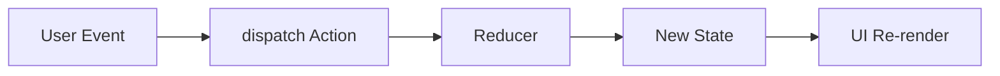

# Day 82 [Intermediate]: useReducer for Complex State

## Index

- [Goal](#goal)
- [Prerequisites](#prerequisites)
- [Explanation](#explanation)
- [Topic by Topic](#topic-by-topic)
- [Key Concepts](#key-concepts)
- [Visual Concept Map](#visual-concept-map)
- [End-to-End Practical](#end-to-end-practical)
- [Hands-on Coding](#hands-on-coding)
- [Mini Exercise](#mini-exercise)
- [Assessment Quiz](#assessment-quiz)
- [Task](#task)
- [Self Check](#self-check)
- [Interview Questions and Answers](#interview-questions-and-answers)
- [Day 82 Outcome](#day-82-outcome)

## Goal

Use `useReducer` to manage complex multi-action state with explicit transitions and predictable updates.

## Prerequisites

- Day 81 completed
- Solid understanding of useState and immutable updates

## Explanation

When state contains multiple related fields and many transitions, reducers centralize logic and make behavior easier to reason about.

## Topic by Topic

### Topic 1: Reducer Pattern Fundamentals

Theory:
Reducer receives current state + action and returns next state.

Practical:
Define action types and payload contracts.

Code Example:

```jsx
function reducer(state, action) { ... }
```

**Explanation:** `useReducer` is useful when state transitions are easier to understand as named actions instead of many separate setters.

**Key Points:**

- Prefer reducers for more complex state transitions.
- Keep state updates action-driven.
- Use it when `useState` becomes hard to manage.

### Topic 2: Initial State Design

Theory:
A clear initial shape avoids missing-field bugs.

Practical:
Model form fields, loading flags, and error states.

Code Example:

```jsx
const initialState = { values: {}, errors: {}, status: "idle" };
```

**Explanation:** Good initial state design makes the reducer easier to read, test, and extend later.

**Key Points:**

- Model the feature state clearly up front.
- Keep related values grouped logically.
- Avoid unclear or duplicated state fields.

### Topic 3: Action-driven Updates

Theory:
Each action should represent a domain event.

Practical:
Use `ADD_ITEM`, `REMOVE_ITEM`, `SUBMIT_SUCCESS` style actions.

Code Example:

```jsx
dispatch({ type: "SET_FIELD", payload: { key: "email", value } });
```

**Explanation:** Actions describe what happened, while the reducer decides how state should change.

**Key Points:**

- Use clear action names.
- Keep payload shape predictable.
- Centralize transition logic in the reducer.

### Topic 4: Reducer + Side Effects

Theory:
Reducer must stay pure; async logic lives outside reducer.

Practical:
Dispatch start/success/error around async call.

Code Example:

```jsx
dispatch({ type: "LOAD_START" });
```

**Explanation:** Reducers must stay pure, so side effects should happen outside and only send results back through actions.

**Key Points:**

- Do not place async work inside reducers.
- Dispatch follow-up actions from effects or handlers.
- Keep reducers deterministic and testable.

### Topic 5: Scalability with Custom Hooks

Theory:
Encapsulate reducer logic into hook for reuse and testing.

Practical:
Create `useCheckoutReducer` hook.

Code Example:

```jsx
function useCheckoutReducer() {
  return useReducer(reducer, initialState);
}
```

**Explanation:** Wrapping reducer logic in a custom hook helps reuse complex state behavior without repeating setup code.

**Key Points:**

- Extract repeated reducer patterns into hooks.
- Keep hook API easy to consume.
- Hide internal complexity behind a clean interface.

### Topic 6: Operational Readiness for useReducer for Complex State

Theory:
Senior-level frontend work connects implementation with observability, release discipline, security posture, and platform constraints.

Practical:
Add one operational rule (monitoring, rollback, security check, or browser support gate) tied to this topic.

Code Example:

`jsx
// Define an operational gate for safe rollout and rollback.
`
**Explanation:** Complex state systems need operational checks because state bugs can affect critical flows in subtle ways.

**Key Points:**

- Add rollback plans for risky reducer changes.
- Monitor critical state-driven screens after release.
- Treat state architecture as an operational concern.

## Key Concepts

- Centralized state transitions
- Action semantics
- Pure reducer discipline
- Async orchestration around reducer
- Reusable reducer hooks

- Operational excellence mindset

## Visual Concept Map



## End-to-End Practical

1. Pick a component with many useState calls.
2. Design state shape and action list.
3. Implement reducer and replace setState calls.
4. Add async submit with start/success/error actions.
5. Test each state transition path.

## Hands-on Coding

### Example 1: Case - Multi-step Form Reducer

Scenario:
A loan form tracks values, validation errors, and submit status.

```jsx
const initialState = {
  values: { name: "", amount: "" },
  errors: {},
  status: "idle",
};

function reducer(state, action) {
  switch (action.type) {
    case "SET_FIELD":
      return {
        ...state,
        values: { ...state.values, [action.payload.key]: action.payload.value },
      };
    case "SET_ERRORS":
      return { ...state, errors: action.payload };
    case "SUBMIT_START":
      return { ...state, status: "submitting" };
    case "SUBMIT_SUCCESS":
      return { ...state, status: "success" };
    default:
      return state;
  }
}
```

### Example 2: Case - Cart Item Actions with Reducer

Scenario:
An order panel supports add/remove/clear actions with one centralized reducer.

```jsx
function cartReducer(state, action) {
  switch (action.type) {
    case "ADD":
      return [...state, action.payload];
    case "REMOVE":
      return state.filter((i) => i.id !== action.payload);
    case "CLEAR":
      return [];
    default:
      return state;
  }
}
```

### Example 3: Case - Async Fetch Status Flow

Scenario:
A report module should render loading, success, and error states predictably.

```jsx
dispatch({ type: "LOAD_START" });
try {
  const data = await fetchReports();
  dispatch({ type: "LOAD_SUCCESS", payload: data });
} catch (error) {
  dispatch({ type: "LOAD_ERROR", payload: String(error) });
}
```

## Mini Exercise

Scenario:
You are refactoring a task manager form with filters and async save.

Replace multiple `useState` hooks with one reducer, then model submit lifecycle states.

Expected output:

- Clear reducer action map
- Predictable state transitions
- Less scattered update logic

## Assessment Quiz

### Quiz Questions

1. When is useReducer preferred over useState?
2. Why should reducers stay pure?
3. True or False: Async API calls should be executed directly inside reducer.
4. What does action type represent?
5. Why model submit status in state?

### Quiz Answers

1. For complex related state and multi-action transitions
2. Predictability and testability
3. False
4. A domain event causing state transition
5. To drive consistent UI feedback states

## Task

- Refactor a complex form/list component to reducer pattern
- Add async lifecycle action handling
- Complete mini exercise

## Self Check

- You can structure complex UI logic with reducers
- You can separate pure transitions from side effects
- You can answer at least 4 out of 5 quiz questions correctly

## Interview Questions and Answers

### Beginner

**Question:** What does useReducer return?

**Answer:** Current state and dispatch function.

**Question:** Why use dispatch instead of many setters?

**Answer:** It centralizes transitions and improves readability.

### Middle

**Question:** How do you design good reducer actions?

**Answer:** Use clear domain events with minimal required payload.

**Question:** How do you test reducer logic?

**Answer:** Unit test input state + action to expected output state.

### Advanced

**Question:** What is a common reducer architecture smell?

**Answer:** Huge switch with unrelated concerns and unclear action semantics.

**Question:** How can reducer complexity be controlled at scale?

**Answer:** Split by feature domain and encapsulate in custom hooks/modules.

## Day 82 Outcome

- You can manage complex UI state with reducer architecture
- You can model explicit and testable state transitions
- You are ready for imperative component APIs in Day 83
