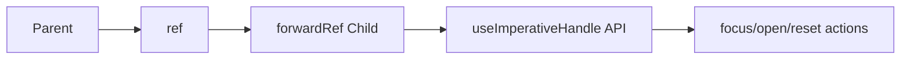

---
title: forwardRef and useImperativeHandle
slug: day-083-forwardref-and-useimperativehandle
dayLabel: Day 83
level: Intermediate
estimatedMinutes: 30
order: 83
track: react
---
# Day 83 [Intermediate]: forwardRef and useImperativeHandle

## Goal

Create reusable components that expose controlled imperative methods using `forwardRef` and `useImperativeHandle`.

## Prerequisites

- Day 82 completed
- Comfortable with refs and component composition

## Explanation

Most React logic is declarative, but some workflows require imperative controls like focus, open, reset, or scroll APIs. The goal is not to make React components imperative; it is to expose a small, stable command surface only where parent-driven control is genuinely useful.

## Topic by Topic

### Topic 1: Why forwardRef Exists

Theory:
`forwardRef` lets parent pass refs into child components.

Practical:
Expose child input DOM ref to parent.

Code Example:

```jsx
const Input = React.forwardRef((props, ref) => <input ref={ref} {...props} />);
```

**Explanation:** `forwardRef` exists so parent components can reach a child DOM node or imperative child API when needed. It is particularly useful for reusable form controls and low-level UI primitives.

**Key Points:**

- Use it only when parent access is required.
- Keep ref exposure intentional.
- Avoid using it as a default pattern.
- Prefer declarative props when they express the behavior clearly.

### Topic 2: useImperativeHandle Basics

Theory:
Expose specific API instead of raw DOM internals.

Practical:
Expose `focus` and `clear` methods only.

Code Example:

```jsx
useImperativeHandle(ref, () => ({
  focus() {},
  clear() {},
}), []);
```

**Explanation:** `useImperativeHandle` lets a child expose a small controlled API instead of leaking its entire internal DOM structure. The dependency list should reflect values captured by the exposed methods; use `[]` only when the implementation does not need changing reactive values.

**Key Points:**

- Expose only the methods the parent truly needs.
- Keep the imperative API minimal.
- Preserve component encapsulation.
- Treat the exposed API as a component contract.

### Topic 3: Encapsulation Benefits

Theory:
Imperative API should be minimal and intentional.

Practical:
Hide implementation details while exposing useful actions.

Code Example:

```jsx
// expose open/close, hide internal state
```

**Explanation:** Encapsulation matters because imperative APIs can quickly become messy if the parent depends on too much child internals. A parent should ask the child to perform a meaningful action rather than manipulate its internal state directly.

**Key Points:**

- Keep child implementation private.
- Expose behavior, not internal structure.
- Make future refactors safer.
- Keep method names domain-relevant and predictable.

### Topic 4: Modal and Form Patterns

Theory:
Imperative methods are common in modal/dialog and form controls.

Practical:
Implement `openModal` from parent action.

Code Example:

```jsx
modalRef.current?.open();
```

**Explanation:** Modal, input focus, and form reset behaviors are common cases where imperative control is practical and readable. However, if opening a modal is already naturally represented by application state, a normal prop such as `open={isOpen}` is usually preferable.

**Key Points:**

- Use imperative handles for narrow UI control cases.
- Prefer declarative state for most visual behavior.
- Keep parent-child interaction understandable.
- Avoid using refs as a replacement for shared application state.

### Topic 5: Safety and Anti-patterns

Theory:
Avoid exposing too many imperative methods.

Practical:
Expose only stable, business-relevant operations.

Code Example:

```jsx
// good: focus/reset, bad: direct internal mutable state access
```

**Explanation:** The main anti-pattern is turning imperative handles into a backdoor for manipulating child internals directly. Large imperative APIs also make refactoring and testing harder because parents become dependent on implementation details.

**Key Points:**

- Do not expose too many methods.
- Avoid leaking internal state mutation.
- Prefer simpler patterns when possible.
- Test the public behavior rather than the internal ref implementation.

### Topic 6: Operational Readiness for forwardRef and useImperativeHandle

Theory:
Senior-level frontend work connects implementation with observability, release discipline, security posture, and platform constraints.

Practical:
Add one operational rule (monitoring, rollback, security check, or browser support gate) tied to this topic.

Code Example:

```text
// Define an operational gate for safe rollout and rollback.
// Example: verify the public ref API in component tests before release.
```

**Explanation:** Imperative component APIs need careful rollout because they can create hidden coupling across features. A shared component's ref API should be treated as a compatibility contract: document it, test it, and avoid silently renaming or removing methods used by consumers.

**Key Points:**

- Document exposed ref APIs clearly.
- Review compatibility before changing them.
- Treat shared imperative components as stable contracts.
- Include public ref behavior in regression tests.

## Key Concepts

- Ref forwarding
- Controlled imperative APIs
- Component encapsulation
- Practical parent-child control patterns
- Imperative design restraint
- Operational excellence mindset

## Visual Concept Map



## End-to-End Practical

1. Create reusable input with `focus` and `clear` methods.
2. Build modal with `open` and `close` imperative API.
3. Control both from parent dashboard page.
4. Keep API surface minimal.
5. Validate behavior with user flows.
6. Add tests for each exposed public method.
7. Decide whether each imperative interaction could instead be expressed declaratively.

## Hands-on Coding

### Example 1: Case - Smart Input with Focus API

Scenario:
Customer support form should focus search input when command button is clicked.

```jsx
const SmartInput = React.forwardRef(function SmartInput(props, ref) {
  const inputRef = React.useRef(null);

  React.useImperativeHandle(ref, () => ({
    focus: () => inputRef.current?.focus(),
    clear: () => {
      if (inputRef.current) inputRef.current.value = "";
    },
  }), []);

  return <input ref={inputRef} {...props} />;
});
```

### Example 2: Case - Imperative Modal Control

Scenario:
Billing screen opens confirmation modal from different toolbar actions.

```jsx
const ConfirmModal = React.forwardRef(function ConfirmModal(_, ref) {
  const [open, setOpen] = React.useState(false);

  React.useImperativeHandle(ref, () => ({
    open: () => setOpen(true),
    close: () => setOpen(false),
  }), []);

  return open ? (
    <div role="dialog" aria-modal="true" aria-label="Confirm action">
      Confirm action
    </div>
  ) : null;
});
```

### Example 3: Case - Parent Orchestration with Refs

Scenario:
Admin page controls multiple child components with explicit APIs.

```jsx
function AdminTools() {
  const inputRef = React.useRef(null);
  const modalRef = React.useRef(null);

  return (
    <>
      <button onClick={() => inputRef.current?.focus()}>Focus Search</button>
      <button onClick={() => modalRef.current?.open()}>Open Modal</button>
      <SmartInput ref={inputRef} />
      <ConfirmModal ref={modalRef} />
    </>
  );
}
```

## Mini Exercise

Scenario:
You are building a recruitment panel with a searchable candidate input and invite confirmation modal.

Expose imperative child APIs and orchestrate from parent actions.

Expected output:

- Parent can focus/reset input
- Parent can open/close modal
- Child internals remain encapsulated
- Public imperative methods are covered by behavior-focused tests
- You can explain why each imperative API is preferable to, or necessary beyond, a declarative alternative

## Assessment Quiz

### Quiz Questions

1. What does forwardRef enable?
2. Why use useImperativeHandle instead of exposing raw DOM always?
3. True or False: Imperative APIs should expose every internal method.
4. Name one suitable use case for imperative handle.
5. What risk comes from overusing imperative patterns?
6. When is a declarative prop usually preferable to an imperative ref method?
7. Why should an exposed imperative API be treated as a component contract?
8. What should tests verify for a component exposing an imperative handle?

### Quiz Answers

1. Passing refs through custom components.
2. To provide a controlled, limited API surface and preserve encapsulation.
3. False.
4. Focus/reset a form field or control a narrow UI action such as opening a dialog.
5. Tight coupling and harder component maintenance.
6. When the behavior represents application/UI state that can be expressed naturally through props.
7. Because parent components may depend on its method names and behavior across releases.
8. The observable result of each public method, not implementation details of how the ref is wired internally.

## Task

- Build ref-driven input and modal controls.
- Expose minimal imperative APIs.
- Add behavior-focused tests for the exposed methods.
- Identify one interaction that should remain declarative and explain why.
- Complete mini exercise.

## Self Check

- You can design safe imperative component contracts.
- You can combine declarative UI with controlled imperative actions.
- You can distinguish appropriate ref use from application-state management.
- You can test the behavior exposed through an imperative API.
- You can answer at least 6 out of 8 quiz questions correctly.

## Interview Questions and Answers

### Beginner

**Question:** What is forwardRef?

**Answer:** A React API to forward refs to child components.

**Question:** What does useImperativeHandle do?

**Answer:** Customizes what parent can access through a ref.

### Middle

**Question:** Why not expose child DOM directly in all cases?

**Answer:** It leaks implementation details and increases coupling.

**Question:** What methods are ideal to expose from child components?

**Answer:** Small stable actions like focus, reset, open, close.

### Advanced

**Question:** How do imperative APIs affect component design quality?

**Answer:** Good design keeps APIs narrow and behavior-oriented to maintain encapsulation.

**Question:** What testing approach helps imperative components?

**Answer:** Validate parent-triggered outcomes rather than internal ref mechanics.

**Question:** When should you choose an imperative handle instead of lifting state?

**Answer:** Use it when the parent needs to command a localized child behavior such as focus, scroll, reset, or a UI primitive action, while shared application state should generally remain declarative.

**Question:** What makes an imperative API safe for a reusable component library?

**Answer:** A small documented surface, stable semantics, behavior-focused tests, clear ownership, and a compatibility strategy for changes.

## Day 83 Outcome

- You can implement reusable ref-based imperative APIs safely
- You can preserve component encapsulation while enabling control
- You can distinguish imperative UI commands from declarative application state
- You can test and maintain stable imperative component contracts
- You are ready for memoization edge-case debugging in Day 84
