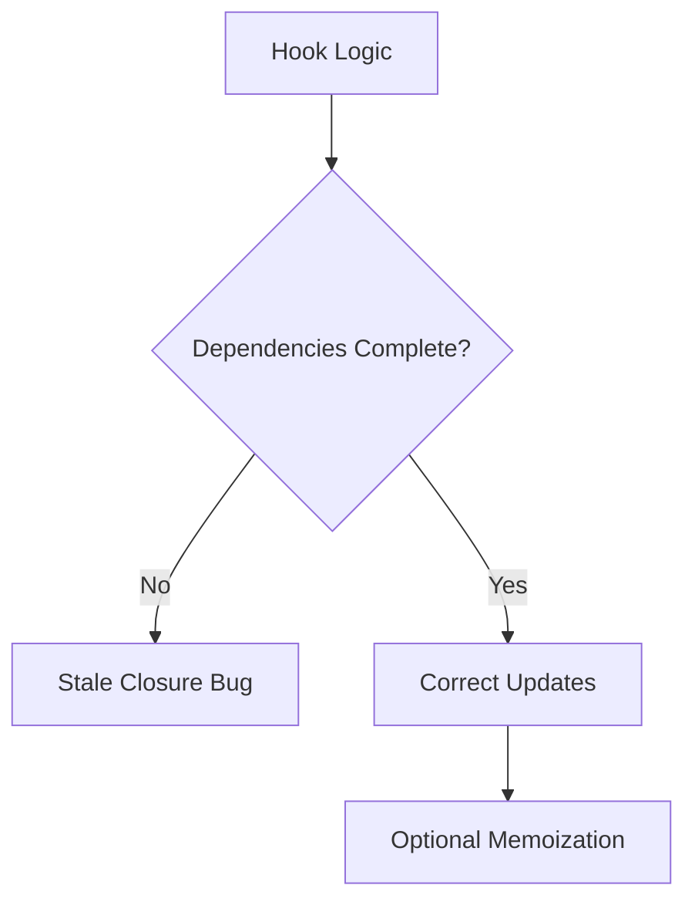

---
title: Memoization Pitfalls and Stale Closures
slug: day-084-memoization-pitfalls-and-stale-closures
dayLabel: Day 84
level: Advanced
estimatedMinutes: 30
order: 84
track: react
---
# Day 84 [Advanced]: Memoization Pitfalls and Stale Closures

## Goal

Identify and fix memoization bugs, stale closures, and dependency-array mistakes in advanced React hooks logic.

## Prerequisites

- Day 83 completed
- Good understanding of useEffect/useMemo/useCallback

## Explanation

Memoization improves performance but can introduce correctness bugs when closures capture outdated values or dependencies are incomplete. The safe workflow is **correctness first, measurement second, optimization third**: make hook dependencies truthful, reproduce the behavior, measure the hotspot, then apply the smallest optimization that solves the measured problem.

## Topic by Topic

### Topic 1: Closure Refresher

Theory:
Functions capture variables from creation time.

Practical:
Reproduce stale callback with missing dependencies.

Code Example:

```jsx
const log = useCallback(() => console.log(count), []);
```

**Explanation:** Closures are not a React feature alone, but React code makes closure mistakes very visible because renders create new function scopes often. The callback above permanently captures the value from the render in which it was created because its dependency list is empty.

**Key Points:**

- Remember closures capture render-time values.
- Old closures can cause stale behavior.
- Debugging starts with understanding that capture model.
- A stable function identity does not mean a function sees the latest state.

### Topic 2: Dependency Array Truthfulness

Theory:
Dependencies must include every reactive value used inside hook.

Practical:
Fix missing values in `useEffect` and `useCallback`.

Code Example:

```jsx
useEffect(() => {
  fetchBy(query);
}, [query]);
```

**Explanation:** Dependency arrays must reflect the values your logic uses, otherwise effects and memoized values can drift from reality. Do not remove a dependency merely to make an effect run less often; instead, restructure the logic when the dependency relationship itself is wrong.

**Key Points:**

- Keep dependency arrays honest.
- Missing dependencies cause stale logic.
- Lint rules help catch common mistakes.
- If a dependency causes unwanted work, investigate the design instead of suppressing the rule blindly.

### Topic 3: Over-memoization Pitfall

Theory:
Memoization can add complexity with little gain.

Practical:
Keep memoization only for measured hotspots.

Code Example:

```jsx
const derived = useMemo(() => heavy(data), [data]);
```

**Explanation:** Memoization has overhead, so using it on trivial calculations can make code harder to read without meaningful benefit. It can also become ineffective when dependencies are recreated unnecessarily.

**Key Points:**

- Memoize only where evidence supports it.
- Do not optimize tiny calculations blindly.
- Prefer clarity over unnecessary caching.
- Verify that memoization actually improves the measured bottleneck.

### Topic 4: Stale State in Async Logic

Theory:
Timers/promises can run with outdated state references.

Practical:
Use functional state updates or refs when needed.

Code Example:

```jsx
setCount((c) => c + 1);
```

**Explanation:** Async callbacks often reveal stale closure bugs because they run later while the component state may already have changed. Functional updates are ideal when the next state depends on the previous state; refs are useful when asynchronous code needs access to a mutable latest value without triggering a render.

**Key Points:**

- Watch async logic carefully.
- Use refs or functional updates when appropriate.
- Test delayed behavior, not only immediate UI.
- Cancel or ignore obsolete async work when results can arrive out of order.

### Topic 5: Debug Checklist

Theory:
Correctness first, then optimization.

Practical:
Use lint + profiling + test cases to validate fixes.

Code Example:

```jsx
// eslint-plugin-react-hooks catches missing dependencies.
```

**Explanation:** A checklist keeps memoization debugging disciplined instead of relying on random tweaks to hooks and dependencies. Reproduce the bug first, identify the captured value, inspect dependencies and identity changes, fix correctness, and then use profiling to decide whether optimization is necessary.

**Key Points:**

- Review dependencies first.
- Then inspect prop identity and async flow.
- Re-measure after each change.
- Test both correctness and performance after optimization.

### Topic 6: Operational Readiness for Memoization Pitfalls and Stale Closures

Theory:
Senior-level frontend work connects implementation with observability, release discipline, security posture, and platform constraints.

Practical:
Add one operational rule (monitoring, rollback, security check, or browser support gate) tied to this topic.

Code Example:

```jsx
// Define an operational gate for safe rollout and rollback.
const optimizationGate = {
  measureBefore: true,
  monitorAfterRelease: true,
  rollbackIfRegression: true,
};
```

**Explanation:** Memoization bugs can be subtle in production, so high-risk performance changes should be paired with monitoring and rollback plans. A performance optimization should have observable success criteria rather than being judged only by whether the code looks faster.

**Key Points:**

- Monitor affected screens after optimization.
- Add safe rollback path for regressions.
- Treat performance changes as production changes, not local tweaks.
- Define measurable signals before rollout.

## Key Concepts

- Closure capture timing
- Dependency completeness
- Correctness vs optimization balance
- Async stale-state mitigation
- Hook debugging discipline
- Operational excellence mindset

## Visual Concept Map



## End-to-End Practical

1. Reproduce stale closure in callback/effect.
2. Inspect dependency omissions.
3. Apply minimal correct dependency fixes.
4. Validate behavior with rapid interaction scenarios.
5. Keep only useful memoization.
6. Profile before and after the optimization.
7. Add regression coverage for the stale-value scenario.

## Hands-on Coding

### Example 1: Case - Stale Callback in Counter

Scenario:
Analytics action logs old count after multiple increments.

```jsx
function CounterLogger() {
  const [count, setCount] = React.useState(0);

  const logCount = React.useCallback(() => {
    console.log("Current count:", count);
  }, [count]);

  return (
    <>
      <button onClick={() => setCount((c) => c + 1)}>+</button>
      <button onClick={logCount}>Log</button>
    </>
  );
}
```

### Example 2: Case - Missing Effect Dependency

Scenario:
Search results fail to update when query changes quickly.

```jsx
useEffect(() => {
  let active = true;
  fetch(`/api/search?q=${encodeURIComponent(query)}`)
    .then((r) => {
      if (!r.ok) throw new Error(`Search failed: ${r.status}`);
      return r.json();
    })
    .then((data) => {
      if (active) setResults(data);
    })
    .catch((error) => {
      if (active) setError(error);
    });
  return () => {
    active = false;
  };
}, [query]);
```

### Example 3: Case - Timer with Stale State

Scenario:
Countdown widget uses stale value in delayed callbacks.

```jsx
useEffect(() => {
  const id = setInterval(() => {
    setSeconds((s) => Math.max(0, s - 1));
  }, 1000);
  return () => clearInterval(id);
}, []);
```

## Mini Exercise

Scenario:
You are fixing a sales dashboard where filters and auto-refresh show inconsistent numbers.

Find two stale-closure issues and one over-memoization case, then refactor safely. Record what value was stale, which dependency or update pattern caused it, and what measurement justified the final optimization decision.

Expected output:

- Correct, up-to-date values in callbacks/effects
- Cleaner dependency arrays
- Reduced unnecessary memoization complexity
- A regression test for at least one stale-closure case

## Assessment Quiz

### Quiz Questions

1. What causes stale closure bugs in hooks?
2. Why is dependency accuracy critical?
3. True or False: Empty dependency array is always safest.
4. What helps avoid stale state in async timers?
5. When should memoization be removed?
6. Why can a memoized callback still observe stale state?
7. What should you do before adding `useMemo` to a component?
8. Why should async search logic guard against obsolete responses?

### Quiz Answers

1. Callbacks/effects capturing outdated values
2. Ensures hook logic re-runs with latest reactive values
3. False
4. Functional updates or latest value refs
5. When there is no measurable benefit and complexity increases
6. Because memoization can preserve a callback identity while its closure still contains values from an older render.
7. Reproduce and measure the actual performance bottleneck.
8. A slower response from an older request could otherwise overwrite newer results.

## Task

- Reproduce and fix stale closure in effect/callback
- Remove one unnecessary memoization usage
- Add one regression test for stale state
- Measure one optimization before and after the change
- Complete mini exercise

## Self Check

- You can diagnose stale closures confidently
- You can balance correctness and optimization
- You can explain why dependency arrays should be truthful
- You can distinguish memoization from correctness
- You can answer at least 6 out of 8 quiz questions correctly

## Interview Questions and Answers

### Beginner

**Question:** What is a stale closure in React?

**Answer:** A function using outdated values captured from an earlier render.

**Question:** Why include values in dependency arrays?

**Answer:** To keep hook behavior synced with latest state/props.

### Middle

**Question:** What is a common stale closure symptom?

**Answer:** Logs/UI actions showing old state even after updates.

**Question:** How does linting help with hooks correctness?

**Answer:** It flags missing dependencies that can cause stale logic.

### Advanced

**Question:** How do you resolve stale closures in performance-sensitive components?

**Answer:** First ensure correct dependencies, then optimize with stable structures and measured memoization.

**Question:** What is a dangerous misconception about useCallback/useMemo?

**Answer:** Assuming they always improve performance regardless of context.

**Question:** How would you debug a callback that is stable but sees an old value?

**Answer:** Identify which render created the callback, inspect its dependency list, reproduce the interaction across renders, and determine whether the callback should depend on the changing value or instead use a functional update/ref-based design.

**Question:** How do you decide whether a memoization optimization is successful?

**Answer:** Compare a representative workload before and after the change using profiling or user-facing performance measurements, while confirming that behavior and correctness remain unchanged.

## Day 84 Outcome

- You can fix complex stale closure and dependency bugs
- You can apply memoization responsibly and safely
- You can validate performance improvements with evidence
- You are ready for SSR hydration mismatch debugging in Day 85
