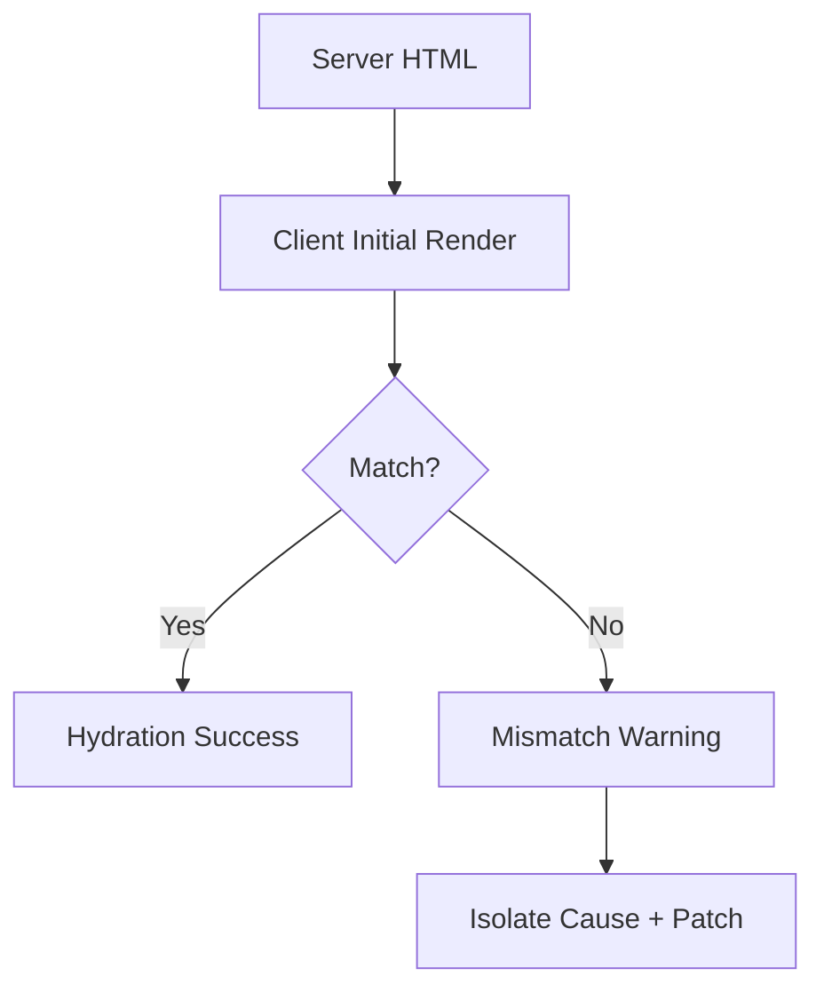

# Day 85 [Advanced]: Hydration and SSR Mismatch Debugging

## Index

- [Goal](#goal)
- [Prerequisites](#prerequisites)
- [Explanation](#explanation)
- [Topic by Topic](#topic-by-topic)
- [Key Concepts](#key-concepts)
- [Visual Concept Map](#visual-concept-map)
- [End-to-End Practical](#end-to-end-practical)
- [Hands-on Coding](#hands-on-coding)
- [Mini Exercise](#mini-exercise)
- [Assessment Quiz](#assessment-quiz)
- [Task](#task)
- [Self Check](#self-check)
- [Interview Questions and Answers](#interview-questions-and-answers)
- [Day 85 Outcome](#day-85-outcome)

## Goal

Diagnose and fix hydration mismatches in SSR apps by making server and client render output deterministic.

## Prerequisites

- Day 84 completed
- Next.js rendering strategy familiarity (SSR/SSG/ISR)

## Explanation

Hydration mismatch occurs when HTML generated on server differs from what client renders initially, causing warnings and unstable UI.

## Topic by Topic

### Topic 1: Hydration Lifecycle

Theory:
Server renders initial HTML, then client hydrates and attaches event handlers.

Practical:
Identify mismatch stage from console warnings.

Code Example:

```tsx
// Warning: Text content did not match.
```

**Explanation:** Hydration is the process where the client connects React behavior to already-rendered HTML, so both sides must agree on output.

**Key Points:**

- Server and client render must match.
- Hydration happens after HTML is delivered.
- Mismatches often show up as warnings and broken UI behavior.

### Topic 2: Common Mismatch Causes

Theory:
Non-deterministic values (`Date.now`, `Math.random`, locale differences) break SSR parity.

Practical:
Move dynamic-only values to client effect.

Code Example:

```tsx
useEffect(() => setNow(Date.now()), []);
```

**Explanation:** Mismatch causes usually come from values that differ between server and client at render time.

**Key Points:**

- Avoid non-deterministic render output.
- Watch time, randomness, and browser-only conditions.
- Keep first render stable across environments.

### Topic 3: Browser-only APIs

Theory:
`window`, `localStorage`, and media queries are unavailable on server.

Practical:
Guard browser-only code in client components/effects.

Code Example:

```tsx
if (typeof window !== "undefined") { ... }
```

**Explanation:** Browser-only APIs must be handled carefully because the server cannot access `window`, `document`, or other client globals.

**Key Points:**

- Guard browser-only code paths.
- Move client-specific work to effects or client components.
- Keep server render safe and deterministic.

### Topic 4: Deterministic Rendering Strategy

Theory:
Initial markup must be stable across server and client.

Practical:
Use placeholders for client-only values during first render.

Code Example:

```tsx
return <span>{mounted ? timezone : "Loading..."}</span>;
```

**Explanation:** Deterministic rendering means the first HTML should be predictable, even if richer client-only data appears after hydration.

**Key Points:**

- Prefer stable initial markup.
- Defer volatile values until after mount if needed.
- Separate placeholder and enhanced UI clearly.

### Topic 5: Debugging Workflow

Theory:
Reproduce, isolate component, compare SSR/client output, patch deterministically.

Practical:
Use incremental isolation to pinpoint culprit.

Code Example:

```tsx
// Temporarily reduce tree to locate mismatch source.
```

**Explanation:** Debugging hydration issues works best when you compare server and client output step by step instead of changing many things at once.

**Key Points:**

- Reproduce mismatch reliably.
- Isolate the unstable render source.
- Verify warnings disappear after the fix.

### Topic 6: Operational Readiness for Hydration and SSR Mismatch Debugging

Theory:
Senior-level frontend work connects implementation with observability, release discipline, security posture, and platform constraints.

Practical:
Add one operational rule (monitoring, rollback, security check, or browser support gate) tied to this topic.

Code Example:

`jsx
// Define an operational gate for safe rollout and rollback.
`
**Explanation:** SSR and hydration bugs can impact whole routes, so they need release checks and rollback plans like other production risks.

**Key Points:**

- Add SSR-specific test or smoke checks.
- Monitor route errors after deployment.
- Keep rollback steps ready for broken hydration.

## Key Concepts

- SSR hydration lifecycle
- Deterministic initial render principle
- Browser-only guard patterns
- Client-only dynamic value handling
- Structured mismatch debugging workflow

- Operational excellence mindset

## Visual Concept Map



## End-to-End Practical

1. Reproduce a hydration warning in sample route.
2. Identify non-deterministic or browser-only source.
3. Refactor initial render to deterministic output.
4. Move client-only logic to `useEffect`/client component.
5. Verify warning disappears.

## Hands-on Coding

### Example 1: Case - Date.now Mismatch Fix

Scenario:
Order page displays render timestamp and triggers text mismatch.

```tsx
"use client";

function SafeTimestamp() {
  const [stamp, setStamp] = React.useState<string>("--");

  React.useEffect(() => {
    setStamp(new Date().toISOString());
  }, []);

  return <p>Rendered At: {stamp}</p>;
}
```

### Example 2: Case - localStorage-dependent Theme

Scenario:
Theme label mismatches between SSR output and client storage value.

```tsx
"use client";

function ThemeLabel() {
  const [theme, setTheme] = React.useState("system");

  React.useEffect(() => {
    const saved = localStorage.getItem("theme");
    if (saved) setTheme(saved);
  }, []);

  return <p>Theme: {theme}</p>;
}
```

### Example 3: Case - Random Number Rendering

Scenario:
Promo badge uses random number at render time and breaks hydration.

```tsx
"use client";

function PromoCode() {
  const [code, setCode] = React.useState("PENDING");

  React.useEffect(() => {
    setCode(`PROMO-${Math.floor(Math.random() * 1000)}`);
  }, []);

  return <p>{code}</p>;
}
```

## Mini Exercise

Scenario:
You are debugging a Next.js events page with hydration warnings in date, theme, and live visitor count widgets.

Reproduce warning, isolate each source, and apply deterministic rendering fixes.

Expected output:

- Console hydration warnings removed
- Initial server and client markup match
- Client-only dynamic values load safely after hydration

## Assessment Quiz

### Quiz Questions

1. What does hydration mismatch mean?
2. Why can `Math.random()` cause SSR issues?
3. True or False: Accessing `window` in server component is always safe.
4. What is one safe pattern for client-only values?
5. Why should initial render be deterministic?

### Quiz Answers

1. Server HTML and initial client render differ
2. It creates non-deterministic output between server/client renders
3. False
4. Render placeholder first, then set value in `useEffect`
5. To ensure hydration attaches cleanly without mismatch warnings

## Task

- Reproduce mismatch in Next.js and patch safely
- Fix at least one non-deterministic render source
- Complete mini exercise

## Self Check

- You can debug and fix SSR hydration mismatches
- You can design deterministic initial rendering patterns
- You can answer at least 4 out of 5 quiz questions correctly

## Interview Questions and Answers

### Beginner

**Question:** What is hydration in SSR apps?

**Answer:** Client process of attaching React behavior to server-rendered HTML.

**Question:** What is a hydration mismatch warning?

**Answer:** A warning that server and client initial output differ.

### Middle

**Question:** Name two common causes of hydration mismatch.

**Answer:** Non-deterministic values and browser-only API usage during initial render.

**Question:** How do you fix localStorage-based mismatches?

**Answer:** Read localStorage in client effect and render stable fallback initially.

### Advanced

**Question:** How do rendering strategy decisions reduce mismatch risk?

**Answer:** Clear server/client boundaries and deterministic server output reduce divergence points.

**Question:** What verification step confirms a hydration fix?

**Answer:** No mismatch warnings plus consistent first-paint UI under hard refresh.

## Day 85 Outcome

- You can troubleshoot and resolve hydration mismatch issues
- You can ship safer SSR features with deterministic rendering
- You are ready for advanced authentication patterns in Day 86
