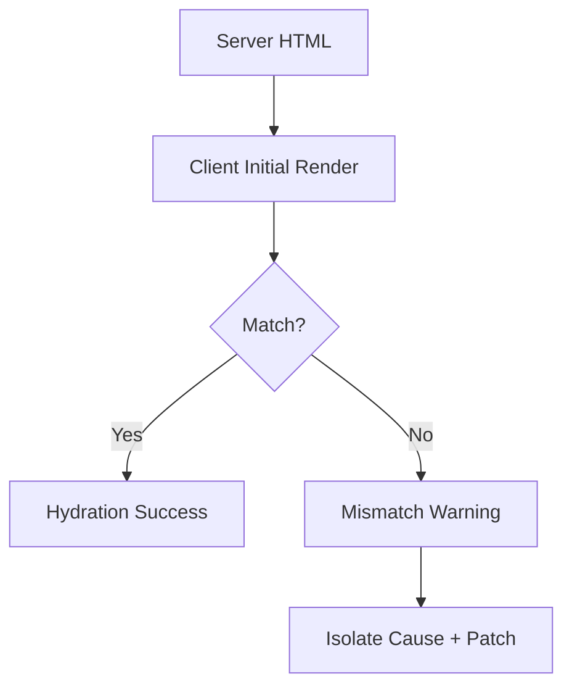

---
title: Hydration and SSR Mismatch Debugging
slug: day-085-hydration-and-ssr-mismatch-debugging
dayLabel: Day 85
level: Advanced
estimatedMinutes: 30
order: 85
track: react
---
# Day 85 [Advanced]: Hydration and SSR Mismatch Debugging

## Goal

Diagnose and fix hydration mismatches in SSR apps by making server and client render output deterministic.

## Prerequisites

- Day 84 completed
- Next.js rendering strategy familiarity (SSR/SSG/ISR)

## Explanation

Hydration mismatch occurs when HTML generated on server differs from what client renders initially, causing warnings and potentially unstable UI. The safest approach is to make the first server and client render deterministic, then introduce browser-only or time-sensitive behavior after hydration. Do not silence a warning before understanding its cause because that can hide a real rendering bug.

## Topic by Topic

### Topic 1: Hydration Lifecycle

Theory:
Server renders initial HTML, then client hydrates and attaches event handlers.

Practical:
Identify mismatch stage from console warnings and compare the server HTML with the client's initial render assumptions.

Code Example:

```tsx
// Conceptual warning:
// Text content does not match between server and client.
```

**Explanation:** Hydration is the process where the client connects React behavior to already-rendered HTML, so both sides must agree on the initial output. Hydration is not the same as generating the server HTML; it is the client-side reconciliation step that follows delivery of that HTML.

**Key Points:**

- Server and client initial render must match.
- Hydration happens after server HTML is delivered.
- Mismatches can produce warnings and unstable UI.
- Fix the source of divergence instead of merely hiding the warning.

### Topic 2: Common Mismatch Causes

Theory:
Non-deterministic values (`Date.now`, `Math.random`, locale differences) break SSR parity.

Practical:
Move dynamic-only values to client effect or provide the same deterministic value to both server and client.

Code Example:

```tsx
useEffect(() => {
  setNow(Date.now());
}, []);
```

**Explanation:** Mismatch causes usually come from values that differ between server and client at render time. Time, randomness, locale/time-zone formatting, generated IDs used incorrectly, asynchronous data differences, and environment-dependent branches are common sources.

**Key Points:**

- Avoid non-deterministic render output.
- Watch time, randomness, locale, and browser-only conditions.
- Keep first render stable across environments.
- Prefer passing deterministic data from the server when the value must appear immediately.

### Topic 3: Browser-only APIs

Theory:
`window`, `localStorage`, and media queries are unavailable on server.

Practical:
Guard browser-only code in client components/effects and avoid branching the initial markup on browser state unless both renders can agree.

Code Example:

```tsx
if (typeof window !== "undefined") {
  // Client-only work should not change the server's initial markup unexpectedly.
}
```

**Explanation:** Browser-only APIs must be handled carefully because the server cannot access `window`, `document`, or other client globals. Simply checking `typeof window` does not automatically make the resulting markup safe; if the server renders one branch and the client renders another immediately, a mismatch can still occur.

**Key Points:**

- Guard browser-only code paths.
- Move client-specific work to effects or client components.
- Keep server render safe and deterministic.
- Separate environment detection from initial markup decisions when possible.

### Topic 4: Deterministic Rendering Strategy

Theory:
Initial markup must be stable across server and client.

Practical:
Use placeholders for client-only values during first render.

Code Example:

```tsx
return <span>{mounted ? timezone : "Loading..."}</span>;
```

**Explanation:** Deterministic rendering means the first HTML should be predictable, even if richer client-only data appears after hydration. A placeholder is useful when the value genuinely cannot be known on the server, but it should still provide an intentional accessible loading or fallback state.

**Key Points:**

- Prefer stable initial markup.
- Defer volatile values until after mount if needed.
- Keep placeholder and enhanced UI intentional.
- Avoid using a client-only fallback as a blanket solution for every mismatch.

### Topic 5: Debugging Workflow

Theory:
Reproduce, isolate component, compare SSR/client output, patch deterministically.

Practical:
Use incremental isolation to pinpoint the culprit and verify the fix with a hard refresh and production-like rendering.

Code Example:

```tsx
// Temporarily reduce the tree to locate the mismatch source.
// Then restore the tree and fix the underlying render dependency.
```

**Explanation:** Debugging hydration issues works best when you compare server and client output step by step instead of changing many things at once. Check the browser console, identify the component stack, inspect values rendered during the first pass, and test under hard refresh rather than relying only on client-side navigation.

**Key Points:**

- Reproduce the mismatch reliably.
- Isolate the unstable render source.
- Compare first-render values, not only final UI.
- Verify the fix after a hard refresh and production build.

### Topic 6: Operational Readiness for Hydration and SSR Mismatch Debugging

Theory:
Senior-level frontend work connects implementation with observability, release discipline, security posture, and platform constraints.

Practical:
Add one operational rule (monitoring, rollback, security check, or browser support gate) tied to this topic.

Code Example:

```jsx
// Define an operational gate for safe rollout and rollback.
const hydrationReleaseGate = {
  runSsrSmokeTest: true,
  monitorRouteErrors: true,
  rollbackIfRegression: true,
};
```

**Explanation:** SSR and hydration bugs can impact whole routes, so they need release checks and rollback plans like other production risks. A hydration fix should be validated in an environment that resembles production because development-only behavior can hide differences introduced by build, caching, locale, or deployment configuration.

**Key Points:**

- Add SSR-specific tests or smoke checks.
- Monitor route errors after deployment.
- Keep rollback steps ready for broken hydration.
- Validate hard refresh, direct navigation, and production builds.

## Key Concepts

- SSR hydration lifecycle
- Deterministic initial render principle
- Browser-only guard patterns
- Client-only dynamic value handling
- Structured mismatch debugging workflow
- Production verification and rollback
- Operational excellence mindset

## Visual Concept Map



## End-to-End Practical

1. Reproduce a hydration warning in a sample route.
2. Identify the non-deterministic, browser-only, locale, or data source.
3. Refactor initial render to deterministic output.
4. Move client-only logic to `useEffect`/client component when appropriate.
5. Verify warning disappears after hard refresh.
6. Run the production build and test direct navigation.
7. Add a regression check for the original mismatch.

## Hands-on Coding

### Example 1: Case - Date.now Mismatch Fix

Scenario:
Order page displays a render timestamp and triggers text mismatch.

```tsx
"use client";

function SafeTimestamp() {
  const [stamp, setStamp] = React.useState<string>("--");

  React.useEffect(() => {
    setStamp(new Date().toISOString());
  }, []);

  return <p>Rendered At: {stamp}</p>;
}
```

### Example 2: Case - localStorage-dependent Theme

Scenario:
Theme label mismatches between SSR output and client storage value.

```tsx
"use client";

function ThemeLabel() {
  const [theme, setTheme] = React.useState("system");

  React.useEffect(() => {
    const saved = localStorage.getItem("theme");
    if (saved) setTheme(saved);
  }, []);

  return <p>Theme: {theme}</p>;
}
```

### Example 3: Case - Random Number Rendering

Scenario:
Promo badge uses a random number at render time and breaks hydration.

```tsx
"use client";

function PromoCode() {
  const [code, setCode] = React.useState("PENDING");

  React.useEffect(() => {
    setCode(`PROMO-${Math.floor(Math.random() * 1000)}`);
  }, []);

  return <p>{code}</p>;
}
```

## Mini Exercise

Scenario:
You are debugging a Next.js events page with hydration warnings in date, theme, and live visitor count widgets.

Reproduce the warning, isolate each source, and apply deterministic rendering fixes. For each widget, record whether the value should be server-known, client-only, or supplied from a shared deterministic source.

Expected output:

- Console hydration warnings removed
- Initial server and client markup match
- Client-only dynamic values load safely after hydration
- Root cause documented for each mismatch

## Assessment Quiz

### Quiz Questions

1. What does hydration mismatch mean?
2. Why can `Math.random()` cause SSR issues?
3. True or False: Accessing `window` in a server component is always safe.
4. What is one safe pattern for client-only values?
5. Why should initial render be deterministic?
6. Why can a `typeof window` check still lead to a mismatch?
7. Why should hydration fixes be tested with a hard refresh?
8. What is preferable when a dynamic value must appear in the initial HTML?

### Quiz Answers

1. Server HTML and initial client render differ.
2. It creates non-deterministic output between server/client renders.
3. False.
4. Render a stable placeholder first, then set the value in `useEffect`.
5. To ensure hydration attaches cleanly without mismatch warnings.
6. Because different server/client branches can still produce different initial markup.
7. Hard refresh exercises the SSR-to-hydration path instead of relying on an already hydrated client.
8. Provide the same deterministic value to both server and client, often through server-fetched or serialized data.

## Task

- Reproduce a mismatch in Next.js and patch it safely.
- Fix at least one non-deterministic render source.
- Test the fix using hard refresh and direct navigation.
- Add one regression check for the original issue.
- Complete the mini exercise.

## Self Check

- You can debug and fix SSR hydration mismatches.
- You can design deterministic initial rendering patterns.
- You understand the difference between client-only fallback and true server/client parity.
- You can verify hydration fixes under production-like conditions.
- You can answer at least 6 out of 8 quiz questions correctly.

## Interview Questions and Answers

### Beginner

**Question:** What is hydration in SSR apps?

**Answer:** The client process of attaching React behavior to server-rendered HTML.

**Question:** What is a hydration mismatch warning?

**Answer:** A warning that server and client initial output differ.

### Middle

**Question:** Name two common causes of hydration mismatch.

**Answer:** Non-deterministic values and browser-only API usage during initial render.

**Question:** How do you fix localStorage-based mismatches?

**Answer:** Read localStorage in a client effect and render a stable fallback initially.

### Advanced

**Question:** How do rendering strategy decisions reduce mismatch risk?

**Answer:** Clear server/client boundaries and deterministic server output reduce divergence points.

**Question:** What verification step confirms a hydration fix?

**Answer:** No mismatch warnings plus consistent first-paint UI under hard refresh and direct navigation.

**Question:** Why should you avoid simply suppressing a hydration warning?

**Answer:** Suppression can hide a real server/client divergence and leave incorrect or unstable UI behavior in production.

**Question:** How would you debug a mismatch that only occurs in production?

**Answer:** Compare production server output and client initial state, reproduce with the production build, inspect locale/time-zone/configuration differences, check caching/data freshness, and isolate the smallest component that produces divergent markup.

## Day 85 Outcome

- You can troubleshoot and resolve hydration mismatch issues
- You can ship safer SSR features with deterministic rendering
- You can verify hydration fixes using production-like workflows
- You are ready for advanced authentication patterns in Day 86
