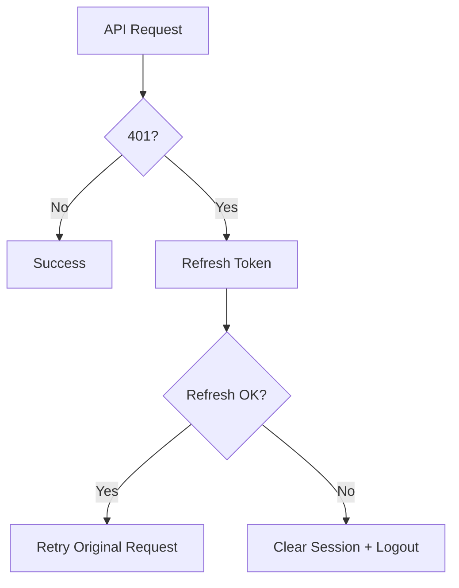

# Day 86 [Advanced]: Authentication Beyond Basics

## Index

- [Goal](#goal)
- [Prerequisites](#prerequisites)
- [Explanation](#explanation)
- [Topic by Topic](#topic-by-topic)
- [Key Concepts](#key-concepts)
- [Visual Concept Map](#visual-concept-map)
- [End-to-End Practical](#end-to-end-practical)
- [Hands-on Coding](#hands-on-coding)
- [Mini Exercise](#mini-exercise)
- [Assessment Quiz](#assessment-quiz)
- [Task](#task)
- [Self Check](#self-check)
- [Interview Questions and Answers](#interview-questions-and-answers)
- [Day 86 Outcome](#day-86-outcome)

## Goal

Build production-grade authentication flow with token refresh, expiry handling, route protection, and safe logout recovery.

## Prerequisites

- Day 85 completed
- Understanding of JWT/session basics and API interceptors

## Explanation

Modern apps require resilient authentication behavior: token expiry recovery, secure persistence strategy, and graceful failure handling.

## Topic by Topic

### Topic 1: Access vs Refresh Token Model

Theory:
Access tokens are short-lived; refresh tokens renew sessions.

Practical:
Design flow where expired access token triggers refresh call.

Code Example:

```ts
if (response.status === 401) refreshSession();
```

**Explanation:** Separating access and refresh responsibilities improves security and makes session renewal flows more manageable.

**Key Points:**

- Keep access tokens short-lived.
- Use refresh flow for session continuity.
- Design auth around both UX and security.

### Topic 2: Interceptor-based Retry Flow

Theory:
Interceptors can centralize retry logic for protected requests.

Practical:
Retry original request after successful token refresh.

Code Example:

```ts
return api(originalRequest);
```

**Explanation:** Interceptors centralize retry behavior so every request does not need custom token refresh logic.

**Key Points:**

- Handle token expiry in one place.
- Keep request code simpler.
- Prevent duplicated retry logic.

### Topic 3: Concurrent 401 Handling

Theory:
Multiple simultaneous 401s can cause refresh storms.

Practical:
Queue pending requests while one refresh is in-flight.

Code Example:

```ts
let isRefreshing = false;
```

**Explanation:** Concurrent 401 handling matters because multiple failing requests can otherwise trigger duplicate refresh attempts and unstable auth state.

**Key Points:**

- Coordinate refresh attempts carefully.
- Avoid race conditions across requests.
- Release queued requests after refresh result.

### Topic 4: Fallback Logout Strategy

Theory:
If refresh fails, session must be invalidated cleanly.

Practical:
Clear auth state and redirect to login.

Code Example:

```ts
authStore.clear();
navigate("/login");
```

**Explanation:** When refresh fails, the app needs a clear fallback path so the user is not left in a broken partial-auth state.

**Key Points:**

- Fail closed when session cannot recover.
- Clear auth state fully on logout.
- Redirect users to a safe re-auth flow.

### Topic 5: Protected UX and Session Awareness

Theory:
Apps should show friendly session expiry messaging.

Practical:
Add banner/modal when session expires.

Code Example:

```tsx
<p>Your session expired. Please sign in again.</p>
```

**Explanation:** Protected UX should guide the user through session changes instead of failing silently or surprising them.

**Key Points:**

- Communicate session expiry clearly.
- Preserve user intent where possible.
- Keep protected-route experience predictable.

### Topic 6: Operational Readiness for Authentication Beyond Basics

Theory:
Senior-level frontend work connects implementation with observability, release discipline, security posture, and platform constraints.

Practical:
Add one operational rule (monitoring, rollback, security check, or browser support gate) tied to this topic.

Code Example:

`jsx
// Define an operational gate for safe rollout and rollback.
`
**Explanation:** Advanced authentication changes are high risk, so rollout should include monitoring, rollback, and abuse-resistant checks.

**Key Points:**

- Watch auth error spikes after release.
- Keep rollback steps documented.
- Treat auth flows as critical production infrastructure.

## Key Concepts

- Token lifecycle orchestration
- Interceptor retry architecture
- Refresh deduplication under concurrency
- Reliable logout fallback
- Secure and user-friendly auth UX

- Operational excellence mindset

## Visual Concept Map



## End-to-End Practical

1. Create authenticated API client wrapper.
2. Add response interceptor for 401 cases.
3. Implement single-flight refresh logic.
4. Retry queued requests after refresh success.
5. Force logout when refresh fails.

## Hands-on Coding

### Example 1: Case - Interceptor Refresh Flow

Scenario:
A learning portal API returns 401 when access token expires during lesson progress save.

```ts
api.interceptors.response.use(
  (res) => res,
  async (error) => {
    const original = error.config;
    if (error.response?.status === 401 && !original._retry) {
      original._retry = true;
      await refreshAccessToken();
      return api(original);
    }
    return Promise.reject(error);
  },
);
```

### Example 2: Case - Single Refresh for Concurrent Requests

Scenario:
A dashboard sends several parallel requests and all fail with 401 at once.

```ts
let isRefreshing = false;
let queue: Array<() => void> = [];

async function refreshOnce() {
  if (isRefreshing) return new Promise<void>((resolve) => queue.push(resolve));
  isRefreshing = true;
  await refreshAccessToken();
  isRefreshing = false;
  queue.forEach((resolve) => resolve());
  queue = [];
}
```

### Example 3: Case - Graceful Expiry Logout

Scenario:
If refresh token is invalid, app should reset auth and route user to login.

```ts
async function handleRefreshFailure() {
  localStorage.removeItem("user");
  authStore.clear();
  window.location.href = "/login?reason=session-expired";
}
```

## Mini Exercise

Scenario:
You are building an HR portal with protected employee routes.

Implement refresh-on-401, queued retry for concurrent failures, and fallback logout with expiry notification.

Expected output:

- Smooth auto-refresh for expired access token
- No refresh storm under concurrent failures
- Secure forced logout when refresh cannot recover

## Assessment Quiz

### Quiz Questions

1. Why separate access and refresh tokens?
2. What problem does interceptor-based refresh solve?
3. True or False: On refresh failure, app should keep retrying forever.
4. Why queue requests during token refresh?
5. What should user experience include on session expiry?

### Quiz Answers

1. Short-lived access and controlled long-lived session renewal
2. Centralized recovery from token expiry without duplicating logic
3. False
4. To avoid multiple refresh calls and race conditions
5. Clear message and safe redirection to login

## Task

- Add interceptor-based refresh flow with fallback logout
- Handle concurrent 401 request scenarios safely
- Complete mini exercise

## Self Check

- You can implement production-style auth recovery flows
- You can prevent token-refresh race conditions
- You can answer at least 4 out of 5 quiz questions correctly

## Interview Questions and Answers

### Beginner

**Question:** What happens when access token expires?

**Answer:** App attempts refresh token flow to obtain a new access token.

**Question:** Why is logout fallback needed?

**Answer:** To protect app when session can no longer be recovered.

### Middle

**Question:** How do interceptors improve auth architecture?

**Answer:** They centralize token handling and reduce repeated request logic.

**Question:** What is refresh storm and how to avoid it?

**Answer:** Many simultaneous refresh calls; avoid with single in-flight refresh and request queue.

### Advanced

**Question:** What security risk appears if refresh token is stored insecurely?

**Answer:** Compromise can allow long-lived session takeover.

**Question:** How do you validate auth resilience in testing?

**Answer:** Simulate 401 bursts, refresh failures, retry success paths, and forced logout behavior.

## Day 86 Outcome

- You can implement robust authentication beyond basic login
- You can recover expired sessions safely with fallback protections
- You are ready for API runtime contract safety in Day 87
