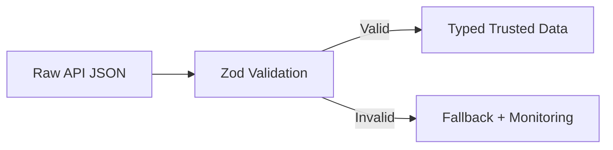

---
title: API Contracts and Runtime Validation
slug: day-087-api-contracts-and-runtime-validation
dayLabel: Day 87
level: Advanced
estimatedMinutes: 30
order: 87
track: react
---
# Day 87 [Advanced]: API Contracts and Runtime Validation

## Goal

Protect frontend flows by validating API contracts at runtime and handling malformed payloads safely.

## Prerequisites

- Day 86 completed
- TypeScript basics and Zod familiarity

## Explanation

Static types alone cannot guarantee runtime API shape correctness. Runtime validation catches unexpected payload changes before they break UI. Treat data crossing an API boundary as untrusted until it has been validated, and keep transport DTOs separate from UI-facing models when the backend contract does not map cleanly to the view layer.

## Topic by Topic

### Topic 1: Contract-first Thinking

Theory:
UI should rely on explicit data contracts, not assumptions.

Practical:
Define schema per endpoint response.

Code Example:

```ts
const UserSchema = z.object({ id: z.string(), name: z.string() });
```

**Explanation:** Contract-first thinking reduces ambiguity because frontend and backend agree on shapes before integration bugs appear. The contract should also describe nullability, enums, nested objects, and important constraints instead of checking only whether a property exists.

**Key Points:**

- Define data contracts explicitly.
- Align frontend and backend expectations early.
- Reduce guesswork during integration.
- Model meaningful runtime constraints, not only property names.

### Topic 2: Runtime Parsing with Zod

Theory:
Parse validates and transforms unknown data into trusted shape.

Practical:
Use `.safeParse` and branch error handling.

Code Example:

```ts
const result = UserSchema.safeParse(payload);
```

**Explanation:** Runtime validation protects the app when external data does not match compile-time assumptions. `safeParse` is useful at application boundaries because it lets the caller choose a controlled failure path instead of throwing immediately.

**Key Points:**

- Parse untrusted data at boundaries.
- Do not trust API responses blindly.
- Use schema errors to improve debugging.
- Prefer controlled validation failures for user-facing flows.

### Topic 3: Error Surface Strategy

Theory:
Validation failures need app-level handling and observability.

Practical:
Send structured error to monitoring and show fallback UI.

Code Example:

```ts
Monitoring.captureMessage("Contract mismatch");
```

**Explanation:** Error surface strategy matters because validation failures need both safe user messaging and useful developer diagnostics. Capture enough metadata to identify the endpoint and schema version, but do not send sensitive payloads or credentials to monitoring systems.

**Key Points:**

- Separate user errors from developer details.
- Keep logs actionable.
- Avoid leaking raw internals to end users.
- Redact sensitive payload fields before telemetry.

### Topic 4: Normalization Layer

Theory:
Central API client should normalize raw payloads once.

Practical:
Expose typed data from one gateway module.

Code Example:

```ts
return UserSchema.parse(json);
```

**Explanation:** A normalization layer keeps UI code cleaner by converting raw backend shapes into stable frontend-friendly models. Keep this transformation near the data boundary so individual components do not independently reinterpret the same API response.

**Key Points:**

- Normalize once near the data boundary.
- Keep UI components simpler.
- Hide backend quirks from the view layer.
- Keep transport and presentation models separate when needed.

### Topic 5: Version Drift and Backward Compatibility

Theory:
APIs evolve; contracts must handle optional/legacy fields deliberately.

Practical:
Use optional fields and defaults where safe.

Code Example:

```ts
z.object({ status: z.string().default("unknown") });
```

**Explanation:** Version drift is normal in real systems, so compatibility planning reduces breakage during backend evolution. Defaults should be used only when the fallback value is semantically safe; silently defaulting a required security or business field can hide a breaking contract.

**Key Points:**

- Plan for contract changes over time.
- Support transitional schemas carefully.
- Document deprecation and migration behavior.
- Do not use defaults to conceal critical contract failures.

### Topic 6: Operational Readiness for API Contracts and Runtime Validation

Theory:
Senior-level frontend work connects implementation with observability, release discipline, security posture, and platform constraints.

Practical:
Add one operational rule (monitoring, rollback, security check, or browser support gate) tied to this topic.

Code Example:

```ts
// Define an operational gate for safe rollout and rollback.
const validationGate = {
  monitorContractFailures: true,
  redactSensitiveFields: true,
  rollbackIfRegression: true,
};
```

**Explanation:** Contract validation decisions should connect to operational rules because schema mismatches can break entire flows in production. Track mismatch rates by endpoint/version and use the signal to coordinate backend rollouts and frontend rollback decisions.

**Key Points:**

- Monitor validation failure rates.
- Add rollback path for breaking contract changes.
- Treat schemas as operational boundaries.
- Redact sensitive fields from validation telemetry.

## Key Concepts

- Runtime contract enforcement
- Trusted parsing boundary
- Safe fallback on malformed payloads
- Centralized normalization layer
- API evolution resilience
- Transport vs presentation models
- Contract observability and redaction
- Operational excellence mindset

## Visual Concept Map



## End-to-End Practical

1. Select one critical API endpoint.
2. Define Zod response schema.
3. Validate payload in API client.
4. Handle invalid payload with fallback UI.
5. Log contract failures for triage.
6. Redact sensitive fields before sending telemetry.
7. Define a compatibility/deprecation strategy for the next API version.

## Hands-on Coding

### Example 1: Case - User Profile Contract Validation

Scenario:
An identity endpoint changed field type unexpectedly and broke profile page.

```ts
import { z } from "zod";

const ProfileSchema = z.object({
  id: z.string(),
  email: z.string().email(),
  fullName: z.string(),
  role: z.enum(["admin", "editor", "viewer"]),
});

export async function fetchProfile() {
  const res = await fetch("/api/profile");
  if (!res.ok) throw new Error(`Profile request failed: ${res.status}`);

  const json: unknown = await res.json();
  const parsed = ProfileSchema.safeParse(json);
  if (!parsed.success) throw new Error("Invalid profile contract");
  return parsed.data;
}
```

### Example 2: Case - List Endpoint with Nested Items

Scenario:
Orders list contains nested line items and nullable fields from backend.

```ts
const OrderSchema = z.object({
  id: z.string(),
  total: z.number(),
  items: z.array(
    z.object({ sku: z.string(), qty: z.number().int().positive() }),
  ),
  note: z.string().nullable().optional(),
});

const OrdersResponseSchema = z.array(OrderSchema);
```

### Example 3: Case - Fallback UI + Monitoring on Contract Failure

Scenario:
Analytics widget should not crash entire dashboard when payload shape is invalid.

```ts
try {
  const json: unknown = await response.json();
  const data = AnalyticsSchema.parse(json);
  setData(data);
} catch (error) {
  Monitoring.captureException(error);
  setError("Analytics data format changed. Try again later.");
}
```

**Review point:** Monitoring should capture safe context such as endpoint name and schema/version metadata while avoiding raw response payloads that may contain personal or sensitive information.

## Mini Exercise

Scenario:
You are responsible for `orders`, `profile`, and `notifications` endpoints.

Add runtime schemas, safe parsing, and fallback behavior for all three. For each endpoint, document what should happen when the response is malformed, missing, or from an older compatible version.

Expected output:

- Frontend rejects malformed payloads safely
- Monitoring captures contract mismatch details
- UI remains stable with clear fallback messaging
- Sensitive payload data is not exposed through telemetry

## Assessment Quiz

### Quiz Questions

1. Why isn't TypeScript alone enough for API safety?
2. What does `safeParse` return?
3. True or False: Invalid payload should always crash the whole page.
4. Why centralize validation in API layer?
5. How can schemas support evolving APIs?
6. Why should `unknown` be preferred for unvalidated API JSON?
7. What should monitoring capture when a contract fails?
8. When is a default value dangerous in a schema?

### Quiz Answers

1. TS checks compile-time, not runtime external JSON
2. Success/failure result object with parsed data or error
3. False
4. Consistent contract enforcement and less duplicated checks
5. Optional fields/defaults and explicit version handling
6. It forces the application to validate external data before treating it as a trusted shape.
7. Safe diagnostic context such as endpoint/version/schema information without sensitive raw payloads.
8. When it hides a required field or a meaningful breaking contract.

## Task

- Add Zod schema checks for one API response
- Add fallback + monitoring for invalid contract
- Add safe telemetry/redaction handling
- Document one backward-compatibility strategy
- Complete mini exercise

## Self Check

- You can enforce runtime API contracts in frontend code
- You can prevent malformed payloads from breaking UI
- You can distinguish untrusted transport data from trusted application models
- You can answer at least 6 out of 8 quiz questions correctly

## Interview Questions and Answers

### Beginner

**Question:** What is runtime validation?

**Answer:** Verifying actual API data shape while app is running.

**Question:** Why use Zod in frontend API handling?

**Answer:** It validates and narrows unknown payloads into trusted types.

### Middle

**Question:** What is a safe handling pattern for invalid payload?

**Answer:** Catch parse error, log safe diagnostic context, and show stable fallback UI.

**Question:** Where should contract validation happen?

**Answer:** In centralized API client/service layer.

### Advanced

**Question:** How does runtime contract validation reduce blast radius?

**Answer:** It isolates malformed responses before they propagate through app state.

**Question:** How would you manage contract drift between teams?

**Answer:** Shared schemas/contracts, versioning, compatibility rules, and monitoring alerts for mismatch spikes.

**Question:** Why type an API response as `unknown` before validation?

**Answer:** It prevents unvalidated external data from being treated as trusted application data and makes the parsing boundary explicit.

**Question:** How would you roll out a breaking API contract safely?

**Answer:** Introduce a compatible transition period, version or feature-gate the contract, monitor validation failures, migrate consumers, and remove the legacy path only after usage drops to an acceptable level.

## Day 87 Outcome

- You can implement runtime contract safety for server integrations
- You can maintain stable UI under API shape changes
- You can design safer compatibility and observability strategies
- You are ready for delivery automation in Day 88
