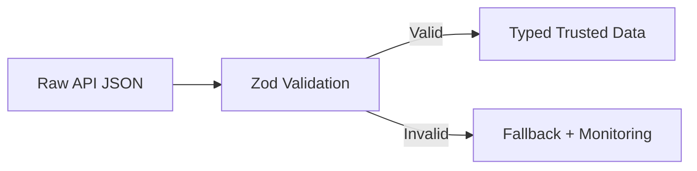

# Day 87 [Advanced]: API Contracts and Runtime Validation

## Index

- [Goal](#goal)
- [Prerequisites](#prerequisites)
- [Explanation](#explanation)
- [Topic by Topic](#topic-by-topic)
- [Key Concepts](#key-concepts)
- [Visual Concept Map](#visual-concept-map)
- [End-to-End Practical](#end-to-end-practical)
- [Hands-on Coding](#hands-on-coding)
- [Mini Exercise](#mini-exercise)
- [Assessment Quiz](#assessment-quiz)
- [Task](#task)
- [Self Check](#self-check)
- [Interview Questions and Answers](#interview-questions-and-answers)
- [Day 87 Outcome](#day-87-outcome)

## Goal

Protect frontend flows by validating API contracts at runtime and handling malformed payloads safely.

## Prerequisites

- Day 86 completed
- TypeScript basics and Zod familiarity

## Explanation

Static types alone cannot guarantee runtime API shape correctness. Runtime validation catches unexpected payload changes before they break UI.

## Topic by Topic

### Topic 1: Contract-first Thinking

Theory:
UI should rely on explicit data contracts, not assumptions.

Practical:
Define schema per endpoint response.

Code Example:

```ts
const UserSchema = z.object({ id: z.string(), name: z.string() });
```

**Explanation:** Contract-first thinking reduces ambiguity because frontend and backend agree on shapes before integration bugs appear.

**Key Points:**

- Define data contracts explicitly.
- Align frontend and backend expectations early.
- Reduce guesswork during integration.

### Topic 2: Runtime Parsing with Zod

Theory:
Parse validates and transforms unknown data into trusted shape.

Practical:
Use `.safeParse` and branch error handling.

Code Example:

```ts
const result = UserSchema.safeParse(payload);
```

**Explanation:** Runtime validation protects the app when external data does not match compile-time assumptions.

**Key Points:**

- Parse untrusted data at boundaries.
- Do not trust API responses blindly.
- Use schema errors to improve debugging.

### Topic 3: Error Surface Strategy

Theory:
Validation failures need app-level handling and observability.

Practical:
Send structured error to monitoring and show fallback UI.

Code Example:

```ts
Monitoring.captureMessage("Contract mismatch");
```

**Explanation:** Error surface strategy matters because validation failures need both safe user messaging and useful developer diagnostics.

**Key Points:**

- Separate user errors from developer details.
- Keep logs actionable.
- Avoid leaking raw internals to end users.

### Topic 4: Normalization Layer

Theory:
Central API client should normalize raw payloads once.

Practical:
Expose typed data from one gateway module.

Code Example:

```ts
return UserSchema.parse(json);
```

**Explanation:** A normalization layer keeps UI code cleaner by converting raw backend shapes into stable frontend-friendly models.

**Key Points:**

- Normalize once near the data boundary.
- Keep UI components simpler.
- Hide backend quirks from the view layer.

### Topic 5: Version Drift and Backward Compatibility

Theory:
APIs evolve; contracts must handle optional/legacy fields deliberately.

Practical:
Use optional fields and defaults where safe.

Code Example:

```ts
z.object({ status: z.string().default("unknown") });
```

**Explanation:** Version drift is normal in real systems, so compatibility planning reduces breakage during backend evolution.

**Key Points:**

- Plan for contract changes over time.
- Support transitional schemas carefully.
- Document deprecation and migration behavior.

### Topic 6: Operational Readiness for API Contracts and Runtime Validation

Theory:
Senior-level frontend work connects implementation with observability, release discipline, security posture, and platform constraints.

Practical:
Add one operational rule (monitoring, rollback, security check, or browser support gate) tied to this topic.

Code Example:

`jsx
// Define an operational gate for safe rollout and rollback.
`
**Explanation:** Contract validation decisions should connect to operational rules because schema mismatches can break entire flows in production.

**Key Points:**

- Monitor validation failure rates.
- Add rollback path for breaking contract changes.
- Treat schemas as operational boundaries.

## Key Concepts

- Runtime contract enforcement
- Trusted parsing boundary
- Safe fallback on malformed payloads
- Centralized normalization layer
- API evolution resilience

- Operational excellence mindset

## Visual Concept Map



## End-to-End Practical

1. Select one critical API endpoint.
2. Define Zod response schema.
3. Validate payload in API client.
4. Handle invalid payload with fallback UI.
5. Log contract failures for triage.

## Hands-on Coding

### Example 1: Case - User Profile Contract Validation

Scenario:
An identity endpoint changed field type unexpectedly and broke profile page.

```ts
import { z } from "zod";

const ProfileSchema = z.object({
  id: z.string(),
  email: z.string().email(),
  fullName: z.string(),
  role: z.enum(["admin", "editor", "viewer"]),
});

export async function fetchProfile() {
  const res = await fetch("/api/profile");
  const json = await res.json();
  const parsed = ProfileSchema.safeParse(json);
  if (!parsed.success) throw new Error("Invalid profile contract");
  return parsed.data;
}
```

### Example 2: Case - List Endpoint with Nested Items

Scenario:
Orders list contains nested line items and nullable fields from backend.

```ts
const OrderSchema = z.object({
  id: z.string(),
  total: z.number(),
  items: z.array(
    z.object({ sku: z.string(), qty: z.number().int().positive() }),
  ),
  note: z.string().nullable().optional(),
});

const OrdersResponseSchema = z.array(OrderSchema);
```

### Example 3: Case - Fallback UI + Monitoring on Contract Failure

Scenario:
Analytics widget should not crash entire dashboard when payload shape is invalid.

```ts
try {
  const data = AnalyticsSchema.parse(await response.json());
  setData(data);
} catch (error) {
  Monitoring.captureException(error);
  setError("Analytics data format changed. Try again later.");
}
```

## Mini Exercise

Scenario:
You are responsible for `orders`, `profile`, and `notifications` endpoints.

Add runtime schemas, safe parsing, and fallback behavior for all three.

Expected output:

- Frontend rejects malformed payloads safely
- Monitoring captures contract mismatch details
- UI remains stable with clear fallback messaging

## Assessment Quiz

### Quiz Questions

1. Why isn�t TypeScript alone enough for API safety?
2. What does `safeParse` return?
3. True or False: Invalid payload should always crash the whole page.
4. Why centralize validation in API layer?
5. How can schemas support evolving APIs?

### Quiz Answers

1. TS checks compile-time, not runtime external JSON
2. Success/failure result object with parsed data or error
3. False
4. Consistent contract enforcement and less duplicated checks
5. Optional fields/defaults and explicit version handling

## Task

- Add Zod schema checks for one API response
- Add fallback + monitoring for invalid contract
- Complete mini exercise

## Self Check

- You can enforce runtime API contracts in frontend code
- You can prevent malformed payloads from breaking UI
- You can answer at least 4 out of 5 quiz questions correctly

## Interview Questions and Answers

### Beginner

**Question:** What is runtime validation?

**Answer:** Verifying actual API data shape while app is running.

**Question:** Why use Zod in frontend API handling?

**Answer:** It validates and narrows unknown payloads into trusted types.

### Middle

**Question:** What is a safe handling pattern for invalid payload?

**Answer:** Catch parse error, log it, and show stable fallback UI.

**Question:** Where should contract validation happen?

**Answer:** In centralized API client/service layer.

### Advanced

**Question:** How does runtime contract validation reduce blast radius?

**Answer:** It isolates malformed responses before they propagate through app state.

**Question:** How would you manage contract drift between teams?

**Answer:** Shared schemas/contracts, versioning, and monitoring alerts for mismatch spikes.

## Day 87 Outcome

- You can implement runtime contract safety for server integrations
- You can maintain stable UI under API shape changes
- You are ready for delivery automation in Day 88
