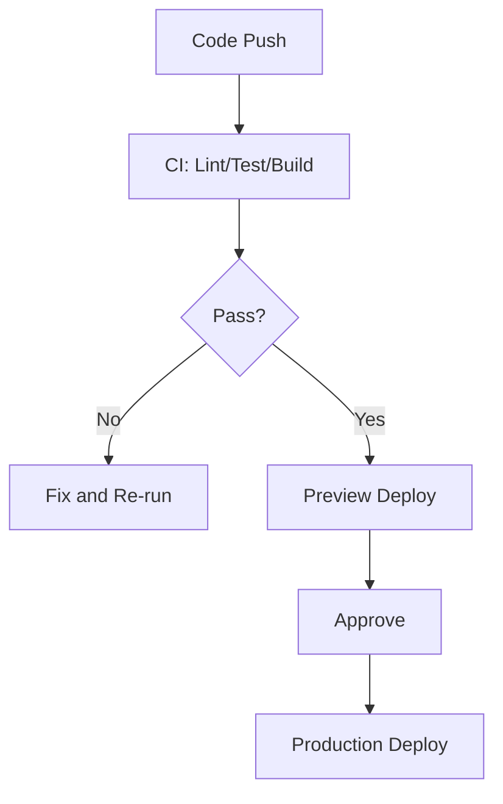

# Day 88 [Advanced]: CI/CD for Frontend

## Index

- [Goal](#goal)
- [Prerequisites](#prerequisites)
- [Explanation](#explanation)
- [Topic by Topic](#topic-by-topic)
- [Key Concepts](#key-concepts)
- [Visual Concept Map](#visual-concept-map)
- [End-to-End Practical](#end-to-end-practical)
- [Hands-on Coding](#hands-on-coding)
- [Mini Exercise](#mini-exercise)
- [Assessment Quiz](#assessment-quiz)
- [Task](#task)
- [Self Check](#self-check)
- [Interview Questions and Answers](#interview-questions-and-answers)
- [Day 88 Outcome](#day-88-outcome)

## Goal

Design a practical CI/CD pipeline for frontend projects that enforces quality gates and enables reliable releases.

## Prerequisites

- Day 87 completed
- Basic Git workflow and test/build commands knowledge

## Explanation

CI/CD automates verification and deployment so teams can ship faster with consistent quality controls.

## Topic by Topic

### Topic 1: CI Pipeline Stages

Theory:
Typical stages: install, lint, test, build, artifact.

Practical:
Run all checks on pull requests.

Code Example:

```yaml
steps: [install, lint, test, build]
```

**Explanation:** CI stages create a repeatable safety net so defects are caught before they move deeper into delivery.

**Key Points:**

- Order fast checks before slow ones.
- Make the pipeline easy to understand.
- Fail early on clear quality issues.

### Topic 2: Fast Feedback and Caching

Theory:
Dependency caching improves pipeline speed.

Practical:
Cache node_modules or package manager store.

Code Example:

```yaml
cache: npm
```

**Explanation:** Fast feedback matters because slow pipelines reduce developer trust and encourage bypassing checks.

**Key Points:**

- Use caching to shorten pipeline time.
- Keep feedback loops fast for contributors.
- Optimize without hiding failures.

### Topic 3: Quality Gates

Theory:
Merge should block when lint/tests/build fail.

Practical:
Require successful checks before merge.

Code Example:

```yaml
if: success()
```

**Explanation:** Quality gates protect the main branch by making critical standards non-optional.

**Key Points:**

- Define which failures block merges.
- Keep gates aligned with real risk.
- Review gate strictness as the app evolves.

### Topic 4: CD and Preview Environments

Theory:
Preview deployments help validate PR changes in browser.

Practical:
Auto-deploy preview on branch push.

Code Example:

```yaml
deploy-preview: on pull_request
```

**Explanation:** Preview environments help teams review real behavior before production, especially for UI-heavy changes.

**Key Points:**

- Use previews for early stakeholder feedback.
- Validate real routes and flows before release.
- Keep deployment promotion controlled.

### Topic 5: Release Safety and Rollback

Theory:
Deploy pipelines should include rollback-ready artifacts.

Practical:
Tag release build and keep previous version reference.

Code Example:

```yaml
release-tag: v1.4.2
```

**Explanation:** Release safety is not complete without rollback. Teams need a quick recovery path when production issues appear.

**Key Points:**

- Plan rollback before deployment.
- Make recovery steps fast and documented.
- Pair releases with monitoring checks.

### Topic 6: Operational Readiness for CICD for Frontend

Theory:
Senior-level frontend work connects implementation with observability, release discipline, security posture, and platform constraints.

Practical:
Add one operational rule (monitoring, rollback, security check, or browser support gate) tied to this topic.

Code Example:

`jsx
// Define an operational gate for safe rollout and rollback.
`
**Explanation:** CICD design is itself an operational system, so it should include explicit rules for safe rollout and safe recovery.

**Key Points:**

- Document deployment gates clearly.
- Link pipeline checks to production risk.
- Treat release automation as product infrastructure.

## Key Concepts

- Automated quality gates
- Pipeline speed optimization
- PR preview validation
- Safe production deployment workflow
- Rollback-aware release operations

- Operational excellence mindset

## Visual Concept Map



## End-to-End Practical

1. Define project CI commands.
2. Create pipeline config for PR checks.
3. Add dependency cache and artifacts.
4. Configure preview deployment step.
5. Add production deploy trigger with rollback plan.

## Hands-on Coding

### Example 1: Case - Basic GitHub Actions CI

Scenario:
Team wants mandatory lint/test/build before merge.

```yaml
name: Frontend CI

on:
	pull_request:
	push:
		branches: [main]

jobs:
	validate:
		runs-on: ubuntu-latest
		steps:
			- uses: actions/checkout@v4
			- uses: actions/setup-node@v4
				with:
					node-version: 20
					cache: npm
			- run: npm ci
			- run: npm run lint
			- run: npm run test -- --run
			- run: npm run build
```

### Example 2: Case - Preview Deploy Job

Scenario:
Product managers need clickable preview links for each PR.

```yaml
	preview:
		if: github.event_name == 'pull_request'
		needs: validate
		runs-on: ubuntu-latest
		steps:
			- run: echo "Deploy preview environment"
```

### Example 3: Case - Production Deploy with Manual Approval

Scenario:
Main branch deploy requires approval gate for release manager.

```yaml
	production:
		if: github.ref == 'refs/heads/main'
		needs: validate
		environment: production
		runs-on: ubuntu-latest
		steps:
			- run: echo "Deploy to production"
```

## Mini Exercise

Scenario:
You are setting pipeline for an e-commerce frontend.

Add CI checks, preview deployment, and production release gate with rollback notes.

Expected output:

- Merge blocked on quality failures
- Preview available for feature branches
- Controlled production deployment path

## Assessment Quiz

### Quiz Questions

1. Why run lint/test/build in CI?
2. What is preview deployment used for?
3. True or False: CI speed has no effect on team productivity.
4. Why keep rollback strategy in CD?
5. What is a common CI anti-pattern?

### Quiz Answers

1. Enforce quality gates before merge/release
2. Validate real UI behavior before merging
3. False
4. To recover quickly from bad releases
5. Deploying without automated validation

## Task

- Add pipeline for lint, test, build, preview deploy
- Add production release guardrail
- Complete mini exercise

## Self Check

- You can define a reliable frontend CI/CD workflow
- You can enforce quality and release safety through automation
- You can answer at least 4 out of 5 quiz questions correctly

## Interview Questions and Answers

### Beginner

**Question:** What is CI in frontend projects?

**Answer:** Automated checks run on code changes before integration.

**Question:** What is CD?

**Answer:** Automated or controlled deployment of validated builds.

### Middle

**Question:** Why are quality gates important in CI?

**Answer:** They prevent broken code from reaching shared branches.

**Question:** How do preview deployments help product teams?

**Answer:** They allow visual validation of PR changes before merge.

### Advanced

**Question:** How do you optimize pipeline runtime without sacrificing confidence?

**Answer:** Cache dependencies, parallelize jobs, and keep layered test strategy.

**Question:** What makes a CD flow production-safe?

**Answer:** Explicit approvals, observability checks, and rollback-ready artifacts.

## Day 88 Outcome

- You can build practical CI/CD pipelines for frontend delivery
- You can enforce release quality with automated guardrails
- You are ready for formal release discipline in Day 89
