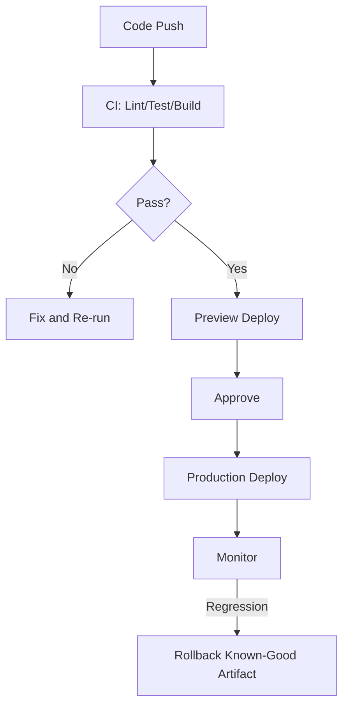

---
title: CI/CD for Frontend
slug: day-088-cicd-for-frontend
dayLabel: Day 88
level: Advanced
estimatedMinutes: 30
order: 88
track: react
---
# Day 88 [Advanced]: CI/CD for Frontend

## Goal

Design a practical CI/CD pipeline for frontend projects that enforces quality gates and enables reliable releases.

## Prerequisites

- Day 87 completed
- Basic Git workflow and test/build commands knowledge

## Explanation

CI/CD automates verification and deployment so teams can ship faster with consistent quality controls. A strong pipeline should be reproducible, fail safely, protect deployment credentials, publish traceable artifacts, and make rollback practical rather than relying on a developer's local machine.

## Topic by Topic

### Topic 1: CI Pipeline Stages

Theory:
Typical stages: install, lint, test, build, artifact.

Practical:
Run all checks on pull requests.

Code Example:

```yaml
steps: [install, lint, test, build]
```

**Explanation:** CI stages create a repeatable safety net so defects are caught before they move deeper into delivery. Keep the pipeline deterministic by pinning or locking dependency versions and make the produced artifact traceable to a commit.

**Key Points:**

- Order fast checks before slow ones.
- Make the pipeline easy to understand.
- Fail early on clear quality issues.
- Keep builds reproducible and artifacts traceable.

### Topic 2: Fast Feedback and Caching

Theory:
Dependency caching improves pipeline speed.

Practical:
Cache package-manager data rather than treating `node_modules` as the source of truth.

Code Example:

```yaml
cache: npm
```

**Explanation:** Fast feedback matters because slow pipelines reduce developer trust and encourage bypassing checks. Cache immutable package-manager data where possible and ensure cache keys include the lockfile so dependency changes invalidate stale caches.

**Key Points:**

- Use caching to shorten pipeline time.
- Keep feedback loops fast for contributors.
- Optimize without hiding failures.
- Key caches from dependency-lock state.

### Topic 3: Quality Gates

Theory:
Merge should block when lint/tests/build fail.

Practical:
Require successful checks before merge.

Code Example:

```yaml
if: success()
```

**Explanation:** Quality gates protect the main branch by making critical standards non-optional. Required status checks should be configured in repository settings, while the workflow itself should clearly report failures and avoid accidentally allowing skipped critical jobs to appear successful.

**Key Points:**

- Define which failures block merges.
- Keep gates aligned with real risk.
- Review gate strictness as the app evolves.
- Make required checks explicit at repository level.

### Topic 4: CD and Preview Environments

Theory:
Preview deployments help validate PR changes in browser.

Practical:
Auto-deploy preview on branch push.

Code Example:

```yaml
deploy-preview: on pull_request
```

**Explanation:** Preview environments help teams review real behavior before production, especially for UI-heavy changes. They should use safe, least-privilege credentials and sanitized test data rather than production secrets or customer data.

**Key Points:**

- Use previews for early stakeholder feedback.
- Validate real routes and flows before release.
- Keep deployment promotion controlled.
- Keep preview environments isolated from production data and credentials.

### Topic 5: Release Safety and Rollback

Theory:
Deploy pipelines should include rollback-ready artifacts.

Practical:
Tag release build and keep previous version reference.

Code Example:

```yaml
release-tag: v1.4.2
```

**Explanation:** Release safety is not complete without rollback. Teams need a quick recovery path when production issues appear. Prefer immutable, versioned artifacts so rollback means promoting a known-good build rather than rebuilding an old commit under changed dependencies.

**Key Points:**

- Plan rollback before deployment.
- Make recovery steps fast and documented.
- Pair releases with monitoring checks.
- Prefer immutable and traceable release artifacts.

### Topic 6: Operational Readiness for CICD for Frontend

Theory:
Senior-level frontend work connects implementation with observability, release discipline, security posture, and platform constraints.

Practical:
Add one operational rule (monitoring, rollback, security check, or browser support gate) tied to this topic.

Code Example:

```yaml
# Define an operational gate for safe rollout and rollback.
releaseGate:
  monitorAfterDeploy: true
  rollbackReady: true
  credentialsLeastPrivilege: true
```

**Explanation:** CI/CD design is itself an operational system, so it should include explicit rules for safe rollout and safe recovery. Treat workflow files and deployment configuration as production code: review changes, protect secrets, restrict permissions, and monitor deployment health.

**Key Points:**

- Document deployment gates clearly.
- Link pipeline checks to production risk.
- Treat release automation as product infrastructure.
- Use least-privilege credentials and protected environments.

## Key Concepts

- Automated quality gates
- Pipeline speed optimization
- PR preview validation
- Safe production deployment workflow
- Rollback-aware release operations
- Reproducible and traceable builds
- Secret and permission hygiene
- Operational excellence mindset

## Visual Concept Map



## End-to-End Practical

1. Define project CI commands.
2. Create pipeline config for PR checks.
3. Add dependency cache and artifacts.
4. Configure preview deployment step.
5. Add production deploy trigger with rollback plan.
6. Protect deployment secrets and use least-privilege permissions.
7. Record the commit, artifact, and environment for each deployment.
8. Add post-deployment health checks and rollback criteria.

## Hands-on Coding

### Example 1: Case - Basic GitHub Actions CI

Scenario:
Team wants mandatory lint/test/build before merge.

```yaml
name: Frontend CI

on:
  pull_request:
  push:
    branches: [main]

permissions:
  contents: read

jobs:
  validate:
    runs-on: ubuntu-latest
    steps:
      - uses: actions/checkout@v4
      - uses: actions/setup-node@v4
        with:
          node-version: 20
          cache: npm
      - run: npm ci
      - run: npm run lint
      - run: npm run test -- --run
      - run: npm run build
```

**Review point:** Keep the lockfile committed and make required checks branch-protection rules rather than relying only on workflow naming.

### Example 2: Case - Preview Deploy Job

Scenario:
Product managers need clickable preview links for each PR.

```yaml
  preview:
    if: github.event_name == 'pull_request'
    needs: validate
    runs-on: ubuntu-latest
    permissions:
      contents: read
      pull-requests: write
    steps:
      - run: echo "Deploy preview environment"
```

**Review point:** In a real provider integration, use a short-lived deployment credential and never expose production secrets to an untrusted pull-request execution context.

### Example 3: Case - Production Deploy with Manual Approval

Scenario:
Main branch deploy requires approval gate for release manager.

```yaml
  production:
    if: github.ref == 'refs/heads/main'
    needs: validate
    environment: production
    runs-on: ubuntu-latest
    permissions:
      contents: read
    steps:
      - run: echo "Deploy to production"
```

**Review point:** Configure required reviewers/protected environments in the deployment platform and promote the exact artifact validated by CI where possible.

## Mini Exercise

Scenario:
You are setting pipeline for an e-commerce frontend.

Add CI checks, preview deployment, and production release gate with rollback notes. Define what happens when lint passes but tests fail, when preview deployment fails, and when production health checks fail after deployment.

Expected output:

- Merge blocked on quality failures
- Preview available for feature branches
- Controlled production deployment path
- Known-good rollback artifact and explicit rollback criteria
- Secrets and deployment permissions follow least privilege

## Assessment Quiz

### Quiz Questions

1. Why run lint/test/build in CI?
2. What is preview deployment used for?
3. True or False: CI speed has no effect on team productivity.
4. Why keep rollback strategy in CD?
5. What is a common CI anti-pattern?
6. Why should deployment artifacts be immutable or traceable?
7. Why should preview environments avoid production secrets?
8. Where should critical merge requirements be enforced?

### Quiz Answers

1. Enforce quality gates before merge/release
2. Validate real UI behavior before merging
3. False
4. To recover quickly from bad releases
5. Deploying without automated validation
6. So the exact tested build can be identified and safely promoted or rolled back.
7. Pull-request code and preview infrastructure can have broader attack exposure and should not receive unnecessary production privileges.
8. In protected branch/repository rules, backed by successful CI status checks.

## Task

- Add pipeline for lint, test, build, preview deploy
- Add production release guardrail
- Add protected/least-privilege deployment permissions
- Define rollback artifact and health-check criteria
- Complete mini exercise

## Self Check

- You can define a reliable frontend CI/CD workflow
- You can enforce quality and release safety through automation
- You can explain caching, artifact traceability, and rollback tradeoffs
- You can answer at least 6 out of 8 quiz questions correctly

## Interview Questions and Answers

### Beginner

**Question:** What is CI in frontend projects?

**Answer:** Automated checks run on code changes before integration.

**Question:** What is CD?

**Answer:** Automated or controlled deployment of validated builds.

### Middle

**Question:** Why are quality gates important in CI?

**Answer:** They prevent broken code from reaching shared branches.

**Question:** How do preview deployments help product teams?

**Answer:** They allow visual validation of PR changes before merge.

### Advanced

**Question:** How do you optimize pipeline runtime without sacrificing confidence?

**Answer:** Cache dependencies, parallelize independent jobs, and keep a layered test strategy while retaining the checks that protect critical paths.

**Question:** What makes a CD flow production-safe?

**Answer:** Explicit approvals, protected environments, least-privilege credentials, observability checks, traceable artifacts, and a tested rollback path.

**Question:** How would you prevent a compromised pull request from obtaining production credentials?

**Answer:** Isolate preview execution, avoid exposing production secrets to untrusted PR code, use protected environments, restrict workflow permissions, and use short-lived credentials where supported.

**Question:** How would you design rollback for a frontend release?

**Answer:** Publish immutable versioned artifacts, record which artifact is live, define health signals and rollback thresholds, and promote a previously validated known-good artifact when the current release violates those thresholds.

## Day 88 Outcome

- You can build practical CI/CD pipelines for frontend delivery
- You can enforce release quality with automated guardrails
- You can design safer preview, deployment, and rollback workflows
- You are ready for formal release discipline in Day 89
