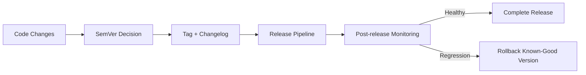

---
title: Release Management and SemVer
slug: day-089-release-management-and-semver
dayLabel: Day 89
level: Advanced
estimatedMinutes: 30
order: 89
track: react
---
# Day 89 [Advanced]: Release Management and SemVer

## Goal

Establish disciplined frontend release management using Semantic Versioning, changelogs, and predictable release workflows.

## Prerequisites

- Day 88 completed
- Familiarity with Git branching and CI/CD pipelines

## Explanation

Release management transforms code changes into safe, trackable product updates with clear communication and rollback readiness. Semantic Versioning (SemVer) is useful only when the team agrees on what constitutes a breaking change and applies the rule consistently. A release process should also connect versioning, artifact traceability, validation, monitoring, and rollback.

## Topic by Topic

### Topic 1: Semantic Versioning Basics

Theory:
SemVer format: `MAJOR.MINOR.PATCH`.

Practical:
Classify real changes into correct version bump.

Code Example:

```text
2.4.1 -> patch fix, 2.5.0 -> new backward-compatible feature
```

**Explanation:** Semantic versioning gives teams a shared language for how risky a release is and what kind of change users should expect. A MAJOR bump represents an incompatible public API or behavior change, MINOR adds backward-compatible functionality, and PATCH represents backward-compatible fixes.

**Key Points:**

- Use version numbers intentionally.
- Reflect breaking versus safe changes clearly.
- Keep release communication predictable.
- Define what counts as a public contract for the application.

### Topic 2: Conventional Commits and Release Notes

Theory:
Structured commit messages simplify changelog generation.

Practical:
Use `feat:`, `fix:`, `perf:`, `breaking:` conventions.

Code Example:

```text
feat(auth): add token refresh queue
```

**Explanation:** Conventional commits improve release automation because commit messages can drive notes, version bumps, and change summaries. They are a convention, not a guarantee of correctness, so release decisions should still be reviewed against the actual user and API impact.

**Key Points:**

- Keep commit intent explicit.
- Use commit format consistently.
- Support automated release documentation.
- Do not rely on commit text alone to identify breaking changes.

### Topic 3: Changelog Strategy

Theory:
Changelog should be user-impact and developer-impact oriented.

Practical:
Group entries by Added/Changed/Fixed/Breaking.

Code Example:

```md
## [2.5.0] - 2026-07-23
```

**Explanation:** A changelog helps users and teams understand what changed without scanning raw commit history. Release notes should prioritize impact, migration requirements, and actions users need to take rather than exposing internal implementation details.

**Key Points:**

- Write clear change summaries.
- Separate user-facing and internal details when helpful.
- Keep release history easy to browse.
- Call out migration or upgrade actions explicitly.

### Topic 4: Release Checklist

Theory:
Stable release requires pre-release validation gates.

Practical:
Include tests, accessibility, migration notes, and rollback plan.

Code Example:

```text
Checklist: CI pass, smoke pass, docs updated, rollback verified
```

**Explanation:** Release checklists reduce avoidable mistakes by making critical steps explicit instead of relying on memory. The checklist should distinguish mandatory go/no-go gates from informational tasks so a non-critical documentation delay does not accidentally hide a production safety failure.

**Key Points:**

- Verify release prerequisites before shipping.
- Include rollback readiness in the checklist.
- Keep the checklist lightweight but strict.
- Validate accessibility and critical user journeys before release.

### Topic 5: Post-release Monitoring

Theory:
Release quality is validated after deployment via telemetry.

Practical:
Track errors/perf after release tag.

Code Example:

```text
Monitor 30-min error spike window after release
```

**Explanation:** Release work is not finished at deployment time; post-release monitoring confirms whether the change is actually healthy. Compare error rate, performance, availability, and key business/user flows against a suitable pre-release baseline, and define escalation thresholds before deployment.

**Key Points:**

- Watch key signals after shipping.
- Compare against pre-release expectations.
- React quickly to regressions.
- Define rollback thresholds before the release starts.

### Topic 6: Operational Readiness for Release Management and SemVer

Theory:
Senior-level frontend work connects implementation with observability, release discipline, security posture, and platform constraints.

Practical:
Add one operational rule (monitoring, rollback, security check, or browser support gate) tied to this topic.

Code Example:

```yaml
releaseGate:
  versionReviewed: true
  changelogUpdated: true
  rollbackReady: true
  monitorAfterDeploy: true
```

**Explanation:** Mature release management ties versioning, rollout, monitoring, and rollback into one consistent discipline. The release process should also define ownership: who approves the release, who watches production health, who decides whether to roll back, and how the decision is communicated.

**Key Points:**

- Document release governance rules.
- Tie SemVer to real engineering process.
- Keep rollback ownership explicit.
- Make release health criteria measurable.

## Key Concepts

- SemVer change classification
- Structured release communication
- Repeatable release checklist discipline
- Rollback readiness
- Post-release observability
- Release ownership and governance
- Operational excellence mindset

## Visual Concept Map



## End-to-End Practical

1. Collect merged changes for release scope.
2. Classify version bump based on impact.
3. Draft changelog entry with clear categories.
4. Run release checklist and create tag.
5. Publish the exact validated artifact associated with the release tag.
6. Monitor and validate release health.
7. Execute rollback if predefined thresholds are exceeded.

## Hands-on Coding

### Example 1: Case - SemVer Decision Matrix

Scenario:
A release includes bug fix, new dashboard filter, and removed legacy endpoint.

```text
Bug fix only -> PATCH
Backward-compatible feature -> MINOR
Breaking API/behavior change -> MAJOR
```

**Review point:** If removing the legacy endpoint changes a supported public contract, the release may require a MAJOR version even when the other changes are only PATCH/MINOR-level changes.

### Example 2: Case - Changelog Template

Scenario:
Team needs standard format for each release announcement.

```md
## [3.2.0] - 2026-07-23

### Added

- New analytics filters for sales dashboard

### Changed

- Improved token refresh retry strategy

### Fixed

- Hydration mismatch in event details page

### Breaking

- Removed deprecated `/v1/orders` response fields
```

**Review point:** Breaking changes should include migration guidance whenever consumers need to change code or configuration.

### Example 3: Case - Release Checklist Snippet

Scenario:
Release manager needs go/no-go decision checklist.

```md
- [ ] CI pipeline green
- [ ] Smoke tests passed in preview/staging
- [ ] Changelog and migration notes updated
- [ ] Monitoring dashboard and alert rules ready
- [ ] Rollback command/version documented
```

**Review point:** Add explicit owner/approval information for high-risk releases so responsibility is clear during deployment and incident response.

## Mini Exercise

Scenario:
You are releasing version of a commerce frontend with cart fixes and new checkout coupon feature.

Decide SemVer bump, draft changelog, and prepare release checklist including rollback plan.

Expected output:

- Correct version bump rationale
- Clear release notes for technical and product stakeholders
- Safe release readiness gate
- Explicit rollback trigger and known-good version

## Assessment Quiz

### Quiz Questions

1. What does a MAJOR version bump indicate?
2. Why are changelogs important?
3. True or False: Patch releases can include breaking changes.
4. What should happen before tagging a release?
5. Why monitor immediately after release?
6. When should a frontend release require a MAJOR bump?
7. Why should rollback thresholds be defined before deployment?
8. Why is artifact traceability important during release management?

### Quiz Answers

1. Backward-incompatible change
2. They communicate change impact and improve traceability
3. False
4. Checklist validation and quality gate confirmation
5. To catch regressions quickly and respond fast
6. When it introduces a backward-incompatible public API, contract, or behavior change under the team's versioning policy.
7. It removes ambiguity during incidents and allows a faster, more objective rollback decision.
8. It identifies exactly which validated build is running and allows the team to reproduce, promote, or roll back that build safely.

## Task

- Draft release process and changelog template
- Apply SemVer classification to one realistic release
- Define release health and rollback criteria
- Complete mini exercise

## Self Check

- You can manage frontend releases with professional discipline
- You can communicate changes clearly using SemVer and changelogs
- You can distinguish feature, fix, and breaking release impact
- You can answer at least 6 out of 8 quiz questions correctly

## Interview Questions and Answers

### Beginner

**Question:** What is Semantic Versioning?

**Answer:** A versioning system using MAJOR.MINOR.PATCH to indicate change impact.

**Question:** What is the purpose of a changelog?

**Answer:** To document and communicate what changed in each release.

### Middle

**Question:** How do you decide between MINOR and PATCH?

**Answer:** MINOR adds backward-compatible features; PATCH fixes bugs without new features.

**Question:** What should every release checklist contain?

**Answer:** Build/test gate, docs update, deployment readiness, rollback plan.

### Advanced

**Question:** How does release discipline affect engineering velocity?

**Answer:** It reduces incident recovery cost and builds predictable delivery cadence.

**Question:** What signals indicate release process immaturity?

**Answer:** No rollback plan, inconsistent versioning, and missing post-release monitoring.

**Question:** How should a team handle a release containing both a feature and a breaking change?

**Answer:** Classify the release according to the highest-impact public contract change; under standard SemVer that means a MAJOR bump for the breaking change.

**Question:** How would you design a rollback decision for a frontend release?

**Answer:** Define measurable error/performance/user-flow thresholds before deployment, identify the last known-good artifact, monitor after release, and roll back when the agreed thresholds are exceeded.

## Day 89 Outcome

- You can run SemVer-driven release workflows effectively
- You can create clear and reliable release communication
- You can connect release versioning with monitoring and rollback decisions
- You are ready for browser compatibility strategy in Day 90
