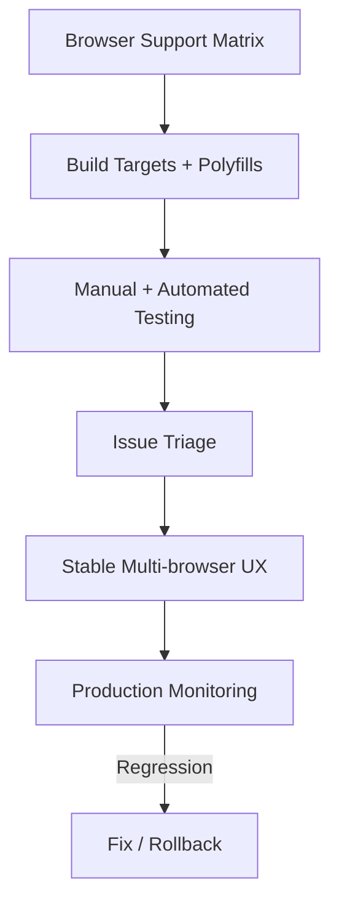

---
title: Browser Compatibility Strategy
slug: day-090-browser-compatibility-strategy
dayLabel: Day 90
level: Advanced
estimatedMinutes: 30
order: 90
track: react
---
# Day 90 [Advanced]: Browser Compatibility Strategy

## Goal

Create a repeatable browser compatibility strategy that prevents cross-browser regressions in production.

## Prerequisites

- Day 89 completed
- Understanding of CSS/JS build tooling and testing basics

## Explanation

Different browsers vary in CSS support, JS APIs, and rendering behavior. Compatibility planning ensures stable UX across target environments. A useful strategy is evidence-driven: combine real user traffic, browser support requirements, framework/tooling constraints, and the business cost of supporting older environments rather than choosing a browser list arbitrarily.

## Topic by Topic

### Topic 1: Target Browser Matrix

Theory:
Support policy should match real user traffic and business requirements.

Practical:
Define primary, secondary, and minimum supported versions.

Code Example:

```text
Chrome latest-2, Edge latest-2, Safari latest-2, Firefox latest-2
```

**Explanation:** A browser support matrix sets expectations early, so development and QA effort matches real business needs. The exact versions should be driven by product requirements and current analytics, not copied blindly from another project.

**Key Points:**

- Base support targets on users and business constraints.
- Distinguish primary and minimum supported browsers.
- Keep the matrix written and reviewable.
- Review the matrix periodically as browser usage changes.

### Topic 2: CSS Compatibility and Fallbacks

Theory:
New CSS features may behave differently across engines.

Practical:
Add fallbacks for unsupported properties.

Code Example:

```css
display: flex;
display: grid;
```

**Explanation:** CSS compatibility planning means designing fallbacks so layout still works when the newest feature support is uneven. Prefer feature detection and progressive enhancement over browser-name checks whenever possible.

**Key Points:**

- Use progressive enhancement where practical.
- Add fallbacks for risky properties.
- Test real layouts in target browsers.
- Prefer capability detection over user-agent sniffing.

### Topic 3: JavaScript Compatibility

Theory:
Some APIs require polyfills or transpilation for older browsers.

Practical:
Configure build target and polyfill strategy.

Code Example:

```js
import "core-js/stable";
```

**Explanation:** JavaScript compatibility depends on both syntax support and runtime APIs, which is why transpilation and polyfills are different concerns. Avoid shipping a large global polyfill bundle when targeted or conditional support is sufficient.

**Key Points:**

- Configure build targets intentionally.
- Polyfill only what the app truly needs.
- Keep legacy support costs visible.
- Distinguish syntax transformation from missing runtime APIs.

### Topic 4: Cross-browser Testing Workflow

Theory:
Validation should combine manual smoke tests and automated coverage.

Practical:
Test key journeys on at least three browsers.

Code Example:

```text
Login -> Search -> Checkout smoke path
```

**Explanation:** Cross-browser testing should focus on critical journeys first, because those are the flows where regressions hurt most. Automate stable journeys with a browser-testing tool and reserve manual exploratory testing for areas where visual or interaction differences are difficult to encode.

**Key Points:**

- Test core user journeys across browsers.
- Mix manual and automated checks.
- Reuse a stable smoke-test checklist.
- Run the highest-risk compatibility tests in CI where practical.

### Topic 5: Compatibility Issue Triage

Theory:
Not every issue has equal business impact.

Practical:
Classify compatibility bugs by severity and traffic impact.

Code Example:

```text
P1: Broken checkout on Safari
```

**Explanation:** Compatibility issues should be prioritized by business impact, not only by how technically interesting the bug is. Include affected browser share, affected user journey, severity, reproducibility, and whether a safe workaround exists.

**Key Points:**

- Rank issues by severity and affected traffic.
- Fix revenue or trust-impacting bugs first.
- Keep triage rules consistent across releases.
- Record browser/OS/version details needed to reproduce the defect.

### Topic 6: Operational Readiness for Browser Compatibility Strategy

Theory:
Senior-level frontend work connects implementation with observability, release discipline, security posture, and platform constraints.

Practical:
Add one operational rule (monitoring, rollback, security check, or browser support gate) tied to this topic.

Code Example:

```yaml
compatibilityGate:
  browserMatrixReviewed: true
  criticalFlowsCovered: true
  rollbackReady: true
```

**Explanation:** Compatibility strategy becomes stronger when releases include support gates, monitoring, and rollback plans for browser-specific regressions. Track errors by browser and version when the telemetry platform can provide that information without collecting unnecessary user data.

**Key Points:**

- Add browser support checks to release flow.
- Monitor production issues by browser when possible.
- Keep a quick recovery plan for major compatibility failures.
- Avoid collecting unnecessary user-identifying data for diagnostics.

## Key Concepts

- Browser support policy definition
- CSS/JS fallback strategy
- Polyfill and transpilation planning
- Cross-browser validation workflow
- Impact-based compatibility triage
- Capability detection and progressive enhancement
- Browser-aware production monitoring
- Operational excellence mindset

## Visual Concept Map



## End-to-End Practical

1. Define target browser matrix from analytics and product requirements.
2. Configure Browserlist/build targets.
3. Run smoke tests on three representative browsers.
4. Fix one compatibility issue with a capability-based fallback.
5. Document compatibility checklist for releases.
6. Add browser/version context to safe error telemetry.
7. Define a rollback or mitigation path for severe browser-specific regressions.

## Hands-on Coding

### Example 1: Case - Browserlist Configuration

Scenario:
A B2B dashboard needs official browser support policy for enterprise users.

```json
{
  "browserslist": [
    "last 2 Chrome versions",
    "last 2 Firefox versions",
    "last 2 Safari versions",
    "last 2 Edge versions"
  ]
}
```

**Review point:** This is an illustrative policy. In a real application, validate the list against current product analytics and the framework's supported browser baseline before adopting it.

### Example 2: Case - CSS Fallback for Layout Issue

Scenario:
A pricing card layout breaks in older Safari due to unsupported gap behavior.

```css
.price-grid {
  display: flex;
  flex-wrap: wrap;
  margin: -8px;
}

.price-grid > * {
  margin: 8px;
}
```

**Review point:** Prefer feature/capability testing where the actual issue is feature support. Avoid assuming every older Safari version has the same limitation.

### Example 3: Case - Polyfill for Missing API

Scenario:
Legacy browser in enterprise environment lacks required `Promise.finally` behavior.

```js
import "core-js/features/promise/finally";

fetch("/api/status")
  .then((r) => r.json())
  .finally(() => {
    console.log("Request completed");
  });
```

**Review point:** Confirm that the target browser actually lacks the API before shipping the polyfill, and let the build tooling manage the supported browser set where possible.

## Mini Exercise

Scenario:
You are preparing a travel booking app for launch in mixed browser environments.

Define browser support matrix, test critical paths in Chrome/Firefox/Safari, and resolve one CSS or JS compatibility defect. Record the affected browser/version, root cause, fallback, and regression test.

Expected output:

- Documented compatibility scope
- Verified core journey behavior in target browsers
- One concrete compatibility fix with fallback explanation
- Regression test or repeatable verification step

## Assessment Quiz

### Quiz Questions

1. Why define browser matrix before development decisions?
2. What is one role of `browserslist`?
3. True or False: Cross-browser testing can be skipped if app works in Chrome.
4. Why add CSS fallbacks?
5. How should compatibility issues be prioritized?
6. Why distinguish transpilation from polyfills?
7. Why prefer capability detection over browser-name checks?
8. What production signal can help identify browser-specific regressions?

### Quiz Answers

1. It guides build targets and testing scope
2. Declares target browsers for transpilation/autoprefixing tools
3. False
4. To maintain usable layout/behavior where features differ
5. By business impact, affected traffic, and severity
6. Transpilation changes unsupported syntax while polyfills provide missing runtime APIs.
7. Browser-name checks can become brittle; capability detection tests what the environment can actually do.
8. Error or performance telemetry segmented by browser/version, using appropriate privacy controls.

## Task

- Test app on three browsers and fix one issue
- Define compatibility policy and fallback strategy
- Add a regression check for the fixed issue
- Document browser/version evidence for one defect
- Complete mini exercise

## Self Check

- You can establish a browser compatibility strategy proactively
- You can debug and fix cross-browser defects systematically
- You can distinguish transpilation, polyfills, and CSS fallbacks
- You can answer at least 6 out of 8 quiz questions correctly

## Interview Questions and Answers

### Beginner

**Question:** What is browser compatibility?

**Answer:** Ensuring app behavior and UI work correctly across target browsers.

**Question:** Why is browser testing needed?

**Answer:** Browsers differ in feature support and rendering engines.

### Middle

**Question:** What is a practical compatibility workflow?

**Answer:** Define support matrix, test critical flows, fix defects, and document policies.

**Question:** How does browserslist help frontend builds?

**Answer:** It informs tooling which syntax/features need transpilation and prefixes.

### Advanced

**Question:** How do you keep compatibility strategy sustainable over time?

**Answer:** Review analytics, update matrix periodically, and automate key cross-browser tests.

**Question:** What is a common release risk related to browser support?

**Answer:** Introducing modern feature usage without fallback for high-traffic environments that are still inside the supported browser policy.

**Question:** When should you use a polyfill instead of a transpiler?

**Answer:** Use a polyfill when the target runtime lacks an API or built-in behavior; use transpilation when the target environment cannot parse newer JavaScript syntax.

**Question:** How would you debug a browser-specific production regression?

**Answer:** Identify browser/OS/version and affected journey from safe telemetry, reproduce on the same environment, isolate the unsupported capability or rendering difference, add a targeted fix and regression test, then monitor the next release.

## Day 90 Outcome

- You can build and maintain a practical cross-browser strategy
- You can reduce runtime surprises with proactive compatibility checks
- You can distinguish build-time and runtime compatibility techniques
- You are ready for observability and quality scaling topics in later modules
