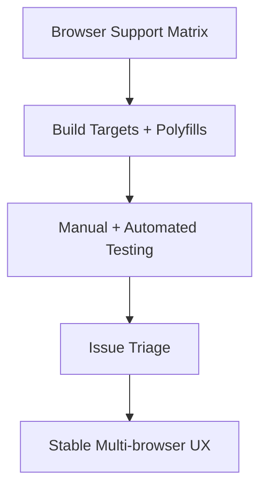

# Day 90 [Advanced]: Browser Compatibility Strategy

## Index

- [Goal](#goal)
- [Prerequisites](#prerequisites)
- [Explanation](#explanation)
- [Topic by Topic](#topic-by-topic)
- [Key Concepts](#key-concepts)
- [Visual Concept Map](#visual-concept-map)
- [End-to-End Practical](#end-to-end-practical)
- [Hands-on Coding](#hands-on-coding)
- [Mini Exercise](#mini-exercise)
- [Assessment Quiz](#assessment-quiz)
- [Task](#task)
- [Self Check](#self-check)
- [Interview Questions and Answers](#interview-questions-and-answers)
- [Day 90 Outcome](#day-90-outcome)

## Goal

Create a repeatable browser compatibility strategy that prevents cross-browser regressions in production.

## Prerequisites

- Day 89 completed
- Understanding of CSS/JS build tooling and testing basics

## Explanation

Different browsers vary in CSS support, JS APIs, and rendering behavior. Compatibility planning ensures stable UX across target environments.

## Topic by Topic

### Topic 1: Target Browser Matrix

Theory:
Support policy should match real user traffic and business requirements.

Practical:
Define primary, secondary, and minimum supported versions.

Code Example:

```text
Chrome latest-2, Edge latest-2, Safari latest-2, Firefox latest-2
```

**Explanation:** A browser support matrix sets expectations early, so development and QA effort matches real business needs.

**Key Points:**

- Base support targets on users and business constraints.
- Distinguish primary and minimum supported browsers.
- Keep the matrix written and reviewable.

### Topic 2: CSS Compatibility and Fallbacks

Theory:
New CSS features may behave differently across engines.

Practical:
Add fallbacks for unsupported properties.

Code Example:

```css
display: flex;
display: grid;
```

**Explanation:** CSS compatibility planning means designing fallbacks so layout still works when the newest feature support is uneven.

**Key Points:**

- Use progressive enhancement where practical.
- Add fallbacks for risky properties.
- Test real layouts in target browsers.

### Topic 3: JavaScript Compatibility

Theory:
Some APIs require polyfills or transpilation for older browsers.

Practical:
Configure build target and polyfill strategy.

Code Example:

```js
import "core-js/stable";
```

**Explanation:** JavaScript compatibility depends on both syntax support and runtime APIs, which is why transpilation and polyfills are different concerns.

**Key Points:**

- Configure build targets intentionally.
- Polyfill only what the app truly needs.
- Keep legacy support costs visible.

### Topic 4: Cross-browser Testing Workflow

Theory:
Validation should combine manual smoke tests and automated coverage.

Practical:
Test key journeys on at least three browsers.

Code Example:

```text
Login -> Search -> Checkout smoke path
```

**Explanation:** Cross-browser testing should focus on critical journeys first, because those are the flows where regressions hurt most.

**Key Points:**

- Test core user journeys across browsers.
- Mix manual and automated checks.
- Reuse a stable smoke-test checklist.

### Topic 5: Compatibility Issue Triage

Theory:
Not every issue has equal business impact.

Practical:
Classify compatibility bugs by severity and traffic impact.

Code Example:

```text
P1: Broken checkout on Safari
```

**Explanation:** Compatibility issues should be prioritized by business impact, not only by how technically interesting the bug is.

**Key Points:**

- Rank issues by severity and affected traffic.
- Fix revenue or trust-impacting bugs first.
- Keep triage rules consistent across releases.

### Topic 6: Operational Readiness for Browser Compatibility Strategy

Theory:
Senior-level frontend work connects implementation with observability, release discipline, security posture, and platform constraints.

Practical:
Add one operational rule (monitoring, rollback, security check, or browser support gate) tied to this topic.

Code Example:

`jsx
// Define an operational gate for safe rollout and rollback.
`
**Explanation:** Compatibility strategy becomes stronger when releases include support gates, monitoring, and rollback plans for browser-specific regressions.

**Key Points:**

- Add browser support checks to release flow.
- Monitor production issues by browser when possible.
- Keep a quick recovery plan for major compatibility failures.

## Key Concepts

- Browser support policy definition
- CSS/JS fallback strategy
- Polyfill and transpilation planning
- Cross-browser validation workflow
- Impact-based compatibility triage

- Operational excellence mindset

## Visual Concept Map



## End-to-End Practical

1. Define target browser matrix from analytics.
2. Configure browserlist/build targets.
3. Run smoke tests on three browsers.
4. Fix one compatibility issue with fallback.
5. Document compatibility checklist for releases.

## Hands-on Coding

### Example 1: Case - Browserlist Configuration

Scenario:
A B2B dashboard needs official browser support policy for enterprise users.

```json
{
  "browserslist": [
    "last 2 Chrome versions",
    "last 2 Firefox versions",
    "last 2 Safari versions",
    "last 2 Edge versions"
  ]
}
```

### Example 2: Case - CSS Fallback for Layout Issue

Scenario:
A pricing card layout breaks in older Safari due to unsupported gap behavior.

```css
.price-grid {
  display: flex;
  flex-wrap: wrap;
  margin: -8px;
}

.price-grid > * {
  margin: 8px;
}
```

### Example 3: Case - Polyfill for Missing API

Scenario:
Legacy browser in enterprise environment lacks required `Promise.finally` behavior.

```js
import "core-js/features/promise/finally";

fetch("/api/status")
  .then((r) => r.json())
  .finally(() => {
    console.log("Request completed");
  });
```

## Mini Exercise

Scenario:
You are preparing a travel booking app for launch in mixed browser environments.

Define browser support matrix, test critical paths in Chrome/Firefox/Safari, and resolve one CSS or JS compatibility defect.

Expected output:

- Documented compatibility scope
- Verified core journey behavior in target browsers
- One concrete compatibility fix with fallback explanation

## Assessment Quiz

### Quiz Questions

1. Why define browser matrix before development decisions?
2. What is one role of `browserslist`?
3. True or False: Cross-browser testing can be skipped if app works in Chrome.
4. Why add CSS fallbacks?
5. How should compatibility issues be prioritized?

### Quiz Answers

1. It guides build targets and testing scope
2. Declares target browsers for transpilation/autoprefixing tools
3. False
4. To maintain usable layout/behavior where features differ
5. By business impact, affected traffic, and severity

## Task

- Test app on three browsers and fix one issue
- Define compatibility policy and fallback strategy
- Complete mini exercise

## Self Check

- You can establish a browser compatibility strategy proactively
- You can debug and fix cross-browser defects systematically
- You can answer at least 4 out of 5 quiz questions correctly

## Interview Questions and Answers

### Beginner

**Question:** What is browser compatibility?

**Answer:** Ensuring app behavior and UI work correctly across target browsers.

**Question:** Why is browser testing needed?

**Answer:** Browsers differ in feature support and rendering engines.

### Middle

**Question:** What is a practical compatibility workflow?

**Answer:** Define support matrix, test critical flows, fix defects, and document policies.

**Question:** How does browserslist help frontend builds?

**Answer:** It informs tooling which syntax/features need transpilation and prefixes.

### Advanced

**Question:** How do you keep compatibility strategy sustainable over time?

**Answer:** Review analytics, update matrix periodically, automate key cross-browser tests.

**Question:** What is a common release risk related to browser support?

**Answer:** Introducing modern feature usage without fallback for high-traffic older environments.

## Day 90 Outcome

- You can build and maintain a practical cross-browser strategy
- You can reduce runtime surprises with proactive compatibility checks
- You are ready for observability and quality scaling topics in later modules
