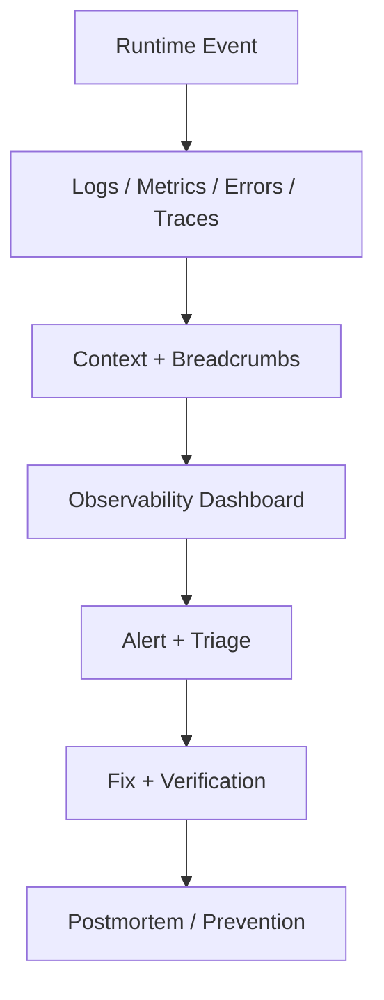

---
title: Observability and Error Monitoring
slug: day-091-observability-and-error-monitoring
dayLabel: Day 91
level: Advanced
estimatedMinutes: 30
order: 91
track: react
---
# Day 91 [Advanced]: Observability and Error Monitoring

## Goal

Implement frontend observability with structured monitoring, tracing context, and actionable incident diagnostics.

## Prerequisites

- Day 90 completed
- Familiarity with error boundaries and production monitoring basics

## Explanation

Observability goes beyond raw errors. It combines exceptions, logs, metrics, and context so teams can detect, diagnose, and resolve incidents quickly. A mature frontend setup also correlates telemetry with releases, environments, affected journeys, and safe user context while avoiding collection of unnecessary sensitive data.

## Topic by Topic

### Topic 1: Observability Signals

Theory:
Key signals are errors, performance metrics, logs, and traces.

Practical:
Instrument one feature to capture all key signals.

Code Example:

```ts
Monitoring.captureException(error);
```

**Explanation:** Observability starts with deciding which signals matter most, such as errors, performance, and user-impacting events. The goal is not to collect everything; it is to collect enough reliable evidence to explain what users experienced.

**Key Points:**

- Track the signals that reflect real user health.
- Combine errors, performance, and business events.
- Use observability to reduce blind spots in production.
- Define useful dashboards before adding excessive telemetry.

### Topic 2: Structured Error Context

Theory:
Context (user role, route, release) makes alerts actionable.

Practical:
Attach metadata before capturing errors.

Code Example:

```ts
Monitoring.setContext("route", { path: location.pathname });
```

**Explanation:** Structured context turns a raw error into a diagnosable issue by adding route, user role, release, or feature information. Prefer stable identifiers and categorical metadata over copying complete request payloads into telemetry.

**Key Points:**

- Add context that helps debugging directly.
- Keep metadata consistent across the app.
- Avoid noisy or irrelevant fields.
- Redact credentials, tokens, and sensitive personal data.

### Topic 3: Breadcrumbs and User Journey

Theory:
Breadcrumbs reconstruct sequence of user actions before failure.

Practical:
Track key interactions as breadcrumbs.

Code Example:

```ts
Monitoring.addBreadcrumb({ category: "checkout", message: "Clicked Pay" });
```

**Explanation:** Breadcrumbs help teams understand what the user did before a failure, which speeds up root-cause analysis. Keep breadcrumbs concise and meaningful; avoid storing form values, tokens, payment details, or other sensitive input.

**Key Points:**

- Record key user actions before errors.
- Use breadcrumbs to reconstruct broken flows.
- Keep the trail concise and meaningful.
- Never use breadcrumbs as a dumping ground for user input.

### Topic 4: Alerting and Severity Policy

Theory:
Not all issues are equal; severity maps to response urgency.

Practical:
Define P1/P2/P3 alert rules.

Code Example:

```text
P1: payment failure spike, P2: feature degradation, P3: low-impact UI bug
```

**Explanation:** Alerting is effective only when severity rules are clear and not every event is treated like an emergency. Thresholds should consider error rate, affected users, business impact, duration, and whether the failure blocks a critical journey.

**Key Points:**

- Define severity by business impact.
- Prevent alert fatigue with sensible thresholds.
- Route critical alerts to the right owners quickly.
- Use deduplication and grouping where supported.

### Topic 5: Incident Triage Workflow

Theory:
Observability is useful only with clear triage ownership.

Practical:
Create incident checklist: detect, assign, fix, verify.

Code Example:

```text
Alert -> Owner -> Root Cause -> Fix -> Verify -> Postmortem note
```

**Explanation:** Incident triage needs a repeatable flow so teams can classify, assign, fix, and verify issues without chaos. Capture the timeline, mitigation, root cause, and follow-up actions for significant incidents.

**Key Points:**

- Use a standard triage workflow.
- Separate urgent incidents from background issues.
- Verify the fix after deployment.
- Record lessons learned for recurring failures.

### Topic 6: Sampling, Noise Control, and Release Correlation

Theory:
Too much monitoring data becomes noise. Useful observability balances signal quality, event volume, and release context.

Practical:
Sample low-value events, keep critical flows unsampled where justified, and compare incidents against current release version.

Code Example:

```ts
Monitoring.init({
  dsn: import.meta.env.VITE_MONITOR_DSN,
  release: "frontend@4.7.0",
  sampleRate: 0.2,
});
```

**Explanation:** Sampling and release correlation keep monitoring scalable by reducing noise while still preserving high-value diagnostic data. Sampling rates should be chosen based on traffic, cost, and incident-detection requirements rather than using one number for every event type.

**Key Points:**

- Sample low-value noise carefully.
- Correlate issues to releases and environments.
- Keep critical diagnostic signals available.
- Review telemetry volume and cost as traffic grows.

## Key Concepts

- Multi-signal observability
- Context-rich error capture
- User journey breadcrumbs
- Severity-based incident response
- Repeatable triage process
- Monitoring noise control
- Release-aware debugging
- Privacy-aware telemetry design

## Visual Concept Map



## End-to-End Practical

1. Initialize monitoring SDK with release/environment.
2. Add context and breadcrumb tracking in one critical flow.
3. Capture handled and unhandled errors.
4. Trigger test event and confirm dashboard ingestion.
5. Validate alert routing and triage owner workflow.
6. Configure appropriate sampling and event filtering.
7. Verify that telemetry excludes secrets and unnecessary sensitive data.
8. Correlate one test incident with a release and verify the recovery path.

## Hands-on Coding

### Example 1: Case - Structured Error Capture in Checkout

Scenario:
Checkout API failures need rich diagnostics to reduce MTTR.

```ts
try {
  await submitOrder(payload);
} catch (error) {
  Monitoring.setTag("feature", "checkout");
  Monitoring.setContext("checkout", {
    cartItems: payload.items.length,
    paymentMethod: payload.paymentMethod,
  });
  Monitoring.captureException(error);
}
```

**Review point:** In a real application, verify that `paymentMethod` is a non-sensitive category rather than a card number or secret. Prefer safe metadata such as payment-provider type over raw payment details.

### Example 2: Case - Breadcrumb Trail for User Actions

Scenario:
Support team needs journey trace before report-generation failure.

```ts
Monitoring.addBreadcrumb({ category: "reports", message: "Opened filters" });
Monitoring.addBreadcrumb({
  category: "reports",
  message: "Applied date range",
});
Monitoring.addBreadcrumb({
  category: "reports",
  message: "Clicked Export CSV",
});
```

**Review point:** Breadcrumb messages should describe actions, not capture the actual filter values or exported data.

### Example 3: Case - Release-tagged Monitoring Event

Scenario:
Engineering wants to correlate new errors with current release.

```ts
Monitoring.init({
  dsn: import.meta.env.VITE_MONITOR_DSN,
  release: "frontend@4.7.0",
  environment: import.meta.env.MODE,
});
```

**Review point:** Release and environment metadata make regressions easier to correlate with deployments. Keep the monitoring DSN/configuration appropriate for the environment and never place secrets in frontend source code.

## Mini Exercise

Scenario:
You own an internal analytics module with intermittent production failures.

Instrument observability for the module, add breadcrumbs for key actions, and define one actionable alert rule. Include a safe metadata policy describing what must never be captured.

Expected output:

- Dashboard shows contextualized errors
- User journey breadcrumbs support debugging
- Alert rule maps to clear owner and severity
- Telemetry excludes secrets and unnecessary sensitive data

## Assessment Quiz

### Quiz Questions

1. Why is context important in monitoring?
2. What are breadcrumbs used for?
3. True or False: All frontend errors should trigger high-severity alerts.
4. What is one benefit of release tagging?
5. What completes an observability loop after detection?
6. Why is monitoring sample control useful?
7. What should never be included in frontend telemetry?
8. Why are severity thresholds important?

### Quiz Answers

1. It helps quickly identify impacted flow and root cause
2. Reconstructing user actions before failure
3. False
4. Correlates incidents with deployments
5. Triage, fix, and verification
6. It reduces noisy low-value data while preserving important operational signal.
7. Secrets such as tokens/passwords and unnecessary sensitive personal or payment data.
8. They reduce alert fatigue and make response urgency consistent with business impact.

## Task

- Add error events and validate dashboard traces
- Add context and breadcrumbs for one critical flow
- Define one severity-based alert rule
- Add safe telemetry/redaction handling
- Complete mini exercise

## Self Check

- You can instrument practical frontend observability
- You can convert error data into faster incident response
- You can design privacy-aware monitoring context
- You can answer at least 6 out of 8 quiz questions correctly

## Interview Questions and Answers

### Beginner

**Question:** What is frontend observability?

**Answer:** Visibility into runtime behavior through errors, metrics, logs, traces, and useful context.

**Question:** Why monitor production errors?

**Answer:** Many real failures only appear under real user conditions.

### Middle

**Question:** What metadata should be attached to captured errors?

**Answer:** Route, feature, release version, environment, and safe action context. User identifiers should be collected only when justified and permitted.

**Question:** How do breadcrumbs help debugging speed?

**Answer:** They reveal sequence of user actions before failure.

### Advanced

**Question:** How do you reduce alert fatigue in frontend monitoring?

**Answer:** Use severity policies, deduplication, grouping, and threshold-based alerts tied to business impact.

**Question:** What KPI reflects observability maturity?

**Answer:** Lower mean time to detection and resolution for production incidents, along with improved detection coverage and fewer repeated incidents.

**Question:** How would you design privacy-aware frontend telemetry?

**Answer:** Collect only necessary diagnostic data, classify sensitive fields, redact secrets and personal data, restrict access to telemetry, and periodically review what the SDK captures.

**Question:** How do you correlate a production regression with a frontend release?

**Answer:** Tag telemetry with release/environment metadata, compare error and performance baselines before and after deployment, identify affected journeys, and use that evidence to decide mitigation or rollback.

## Day 91 Outcome

- You can build actionable frontend observability
- You can instrument context-rich monitoring for real incidents
- You can control telemetry noise while preserving critical signals
- You are ready for performance governance with budgets in Day 92
