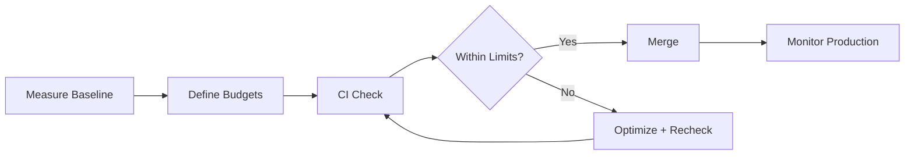

---
title: Web Performance Budgets
slug: day-092-web-performance-budgets
dayLabel: Day 92
level: Advanced
estimatedMinutes: 30
order: 92
track: react
---
# Day 92 [Advanced]: Web Performance Budgets

## Goal

Define and enforce web performance budgets to prevent regressions in bundle size, rendering metrics, and runtime responsiveness.

## Prerequisites

- Day 91 completed
- Familiarity with Lighthouse, Web Vitals, and CI pipelines

## Explanation

Performance budgets create measurable limits so teams can catch regressions early instead of fixing slowdowns after release. A useful budget combines **resource budgets** (JavaScript, CSS, images), **experience budgets** (Core Web Vitals), and **route-specific expectations**. Budgets should be based on real measurements and business-critical journeys rather than arbitrary numbers.

## Topic by Topic

### Topic 1: Budget Categories

Theory:
Budgets can target bundle size, Core Web Vitals, and route-level load time.

Practical:
Define budgets for JS size and vitals metrics.

Code Example:

```text
LCP < 2.5s, INP < 200ms, JS main bundle < 220KB gzip
```

**Explanation:** Performance budgets work best when they cover measurable areas like bundle size, vitals, and route timings. Resource budgets help control what is downloaded, while experience budgets verify what the user actually experiences.

**Key Points:**

- Define budgets for the metrics you care about.
- Keep categories simple and measurable.
- Tie budgets to user experience impact.
- Track both resource cost and user-perceived performance.

### Topic 2: Baseline and Threshold Selection

Theory:
Budgets should be data-driven from current baseline + target.

Practical:
Capture current performance and set realistic limits.

Code Example:

```text
Current LCP 2.2s -> budget 2.5s guardrail
```

**Explanation:** Baselines and thresholds should be based on current app health and realistic improvement targets, not arbitrary numbers. Record the test conditions because Lighthouse results can vary with device, network, CPU throttling, cache state, and test location.

**Key Points:**

- Start from measured baseline data.
- Set thresholds that are strict but achievable.
- Revisit targets as the product evolves.
- Compare results under consistent test conditions.

### Topic 3: CI Enforcement

Theory:
Automated budget checks block regressions before merge.

Practical:
Fail CI when threshold is breached.

Code Example:

```yaml
if: performance_budget_breached -> fail
```

**Explanation:** CI enforcement turns budgets from documentation into real quality gates that prevent silent regressions. Avoid relying on a single noisy measurement for a hard failure; use stable test environments, tolerances, and trend-based checks where appropriate.

**Key Points:**

- Fail builds when critical budgets break.
- Keep checks automated and visible.
- Use CI to enforce performance discipline.
- Reduce false positives with consistent environments and sensible thresholds.

### Topic 4: Route-specific Budgets

Theory:
Different pages may need different budgets based on business criticality.

Practical:
Set stricter budgets for homepage and checkout.

Code Example:

```text
Checkout LCP budget tighter than settings page
```

**Explanation:** Different routes have different performance needs, so budgets should reflect the risk and expectations of each flow. A checkout route may deserve stricter budgets because delays can directly affect conversion, while an internal settings page may have a different target.

**Key Points:**

- Set tighter budgets for critical user journeys.
- Avoid one-size-fits-all route targets.
- Match budgets to route purpose and load profile.
- Include important authenticated and transactional routes, not only public pages.

### Topic 5: Governance and Ownership

Theory:
Budgets require ownership and review in PR process.

Practical:
Add performance budget section in PR checklist.

Code Example:

```md
- [ ] Budget impact checked for changed routes
```

**Explanation:** Governance matters because budgets decay over time without ownership, review, and team accountability. Teams should define who investigates a breach, when exceptions are allowed, and when budgets are recalibrated.

**Key Points:**

- Assign clear owners for budget health.
- Review regressions regularly.
- Treat performance as an ongoing responsibility.
- Make exceptions explicit and time-bound.

### Topic 6: Portfolio-Level Excellence for Web Performance Budgets

Theory:
At expert level, outcomes improve when technical choices are backed by measurable impact, clear communication, and repeatable workflows.

Practical:
Capture one measurable outcome and one improvement plan linked to this topic so your portfolio evidence stays credible.

Code Example:

```ts
// Track one measurable outcome and one follow-up improvement item.
const performanceOutcome = {
  metric: "LCP",
  before: 3.1,
  target: 2.5,
  improvement: "Reduce render-blocking resources",
};
```

**Explanation:** Portfolio-level performance maturity means budgets are not just local checks, but part of how the team demonstrates engineering discipline. A credible performance result should state the metric, baseline, target, measurement conditions, and action taken rather than claiming an improvement without evidence.

**Key Points:**

- Use budgets as evidence of performance culture.
- Connect them to delivery and review processes.
- Show measurable before-and-after improvement.
- Record enough context to make performance claims reproducible.

## Key Concepts

- Quantified performance guardrails
- Baseline-driven target setting
- CI regression prevention
- Route-priority budgeting
- Team ownership and policy
- Resource budgets vs user-experience budgets
- Consistent measurement conditions
- Evidence-driven engineering

## Visual Concept Map



## End-to-End Practical

1. Measure baseline vitals and bundle size.
2. Define route-level budget thresholds.
3. Add budget validation in CI.
4. Trigger intentional regression test.
5. Confirm CI fails/passes correctly.
6. Record the measurement environment and test conditions.
7. Define an exception process for justified budget breaches.
8. Monitor production performance after release and recalibrate budgets when evidence supports it.

## Hands-on Coding

### Example 1: Case - Budget Definition Document

Scenario:
Product team wants explicit performance SLOs for homepage and checkout.

```md
## Performance Budget

### Global

- Total JS (initial): <= 250KB gzip
- CSS (initial): <= 80KB gzip

### Homepage

- LCP <= 2.5s
- CLS <= 0.1

### Checkout

- LCP <= 2.2s
- INP <= 200ms
```

**Review point:** Treat these as illustrative limits. Validate them against real user data, device/network assumptions, and the current application's performance baseline before making them hard release gates.

### Example 2: Case - CI Budget Guard (Lighthouse-style)

Scenario:
Pipeline should fail if performance drops below agreed threshold.

```yaml
name: Performance Budget

on:
  pull_request:

jobs:
  perf-budget:
    runs-on: ubuntu-latest
    steps:
      - uses: actions/checkout@v4
      - uses: actions/setup-node@v4
        with:
          node-version: 20
          cache: npm
      - run: npm ci
      - run: npm run build
      - run: npm run perf:check
```

**Review point:** Keep `perf:check` deterministic and make the script fail with a useful message identifying the breached route and metric. For real Lighthouse CI, configure the tool's assertions rather than using the illustrative placeholder alone.

### Example 3: Case - Budget Breach Report Template

Scenario:
A PR introduces a heavy chart library and increases initial bundle by 90KB.

```md
## Budget Breach Report

- Metric: Initial JS size
- Budget: 250KB
- Observed: 340KB
- Root Cause: New chart dependency in landing route
- Action: Lazy load charts, split route bundle
- Verification: Re-run performance check after optimization
```

**Review point:** The report should make the tradeoff and remediation measurable so reviewers can decide whether the breach is temporary, justified, or a release blocker.

## Mini Exercise

Scenario:
You maintain a booking app and recent releases feel slower.

Define budgets for homepage, search, and checkout; add one CI budget check and demonstrate pass/fail behavior. Record the baseline, test conditions, and the optimization you would make if the budget fails.

Expected output:

- Measurable thresholds documented
- CI blocks regressions when limits break
- Team has clear performance governance workflow
- Test conditions and baseline are recorded

## Assessment Quiz

### Quiz Questions

1. Why use performance budgets?
2. What metrics can budgets include?
3. True or False: Budget checks should be manual only.
4. Why are route-specific budgets useful?
5. What should happen when a budget is exceeded?
6. Why should performance measurements use consistent test conditions?
7. What is the difference between a resource budget and a user-experience budget?
8. Why should budget exceptions be time-bound?

### Quiz Answers

1. To prevent gradual performance regressions
2. Bundle size, LCP, INP, CLS, route load time
3. False
4. Different routes have different business/performance priorities
5. CI should fail and trigger optimization before merge, unless an explicitly approved exception applies
6. Performance results vary with device, CPU, network, cache, and environment, so inconsistent conditions can create misleading failures or passes.
7. A resource budget limits things such as JS/CSS/image bytes; a user-experience budget limits outcomes such as LCP, INP, or CLS.
8. To prevent temporary tradeoffs from becoming permanent performance debt.

## Task

- Define thresholds and enforce one budget check in CI
- Add one route-specific budget policy
- Document baseline and measurement conditions
- Define one exception and rollback/mitigation rule
- Complete mini exercise

## Self Check

- You can create and enforce practical web performance budgets
- You can integrate budget governance into delivery workflow
- You can explain resource vs user-experience budgets
- You can answer at least 6 out of 8 quiz questions correctly

## Interview Questions and Answers

### Beginner

**Question:** What is a web performance budget?

**Answer:** A defined limit for performance metrics to prevent regressions.

**Question:** Why track bundle size budgets?

**Answer:** Large bundles can increase download, parse, and execution cost, especially on slower devices and networks.

### Middle

**Question:** How do you choose initial budget values?

**Answer:** Start from baseline measurements under defined conditions, compare against real-user data when available, and set realistic improvement guards.

**Question:** Why enforce budgets in CI?

**Answer:** To catch regressions before they reach production.

### Advanced

**Question:** How would you handle unavoidable budget breaches?

**Answer:** Document the business/technical tradeoff, isolate the impact, add a mitigation plan, assign an owner, and make the exception explicit and time-bound.

**Question:** What governance pattern keeps budgets effective over time?

**Answer:** Route-level ownership, regular review, automated regression reporting, and a clear exception process.

**Question:** How can performance budgets create false positives?

**Answer:** Noisy test environments, changing network conditions, cold-cache differences, or thresholds that are too close to normal variance can cause unstable failures. Stable test conditions and sensible tolerance help.

**Question:** How would you combine lab and real-user performance data?

**Answer:** Use lab tests for repeatable regression detection and controlled experiments, then use real-user data to validate whether those changes affect actual users across devices, networks, and geographies.

## Day 92 Outcome

- You can set measurable performance budgets and enforce them
- You can prevent regressions through CI-based governance
- You can distinguish resource budgets from user-experience budgets
- You can make performance improvements measurable and reproducible
- You are ready for accessibility audit workflows in Day 93
