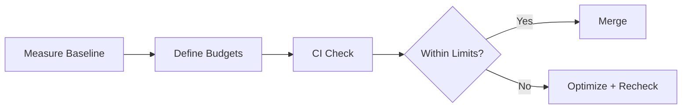

# Day 92 [Advanced]: Web Performance Budgets

## Index

- [Goal](#goal)
- [Prerequisites](#prerequisites)
- [Explanation](#explanation)
- [Topic by Topic](#topic-by-topic)
- [Key Concepts](#key-concepts)
- [Visual Concept Map](#visual-concept-map)
- [End-to-End Practical](#end-to-end-practical)
- [Hands-on Coding](#hands-on-coding)
- [Mini Exercise](#mini-exercise)
- [Assessment Quiz](#assessment-quiz)
- [Task](#task)
- [Self Check](#self-check)
- [Interview Questions and Answers](#interview-questions-and-answers)
- [Day 92 Outcome](#day-92-outcome)

## Goal

Define and enforce web performance budgets to prevent regressions in bundle size, rendering metrics, and runtime responsiveness.

## Prerequisites

- Day 91 completed
- Familiarity with Lighthouse, Web Vitals, and CI pipelines

## Explanation

Performance budgets create measurable limits so teams can catch regressions early instead of fixing slowdowns after release.

## Topic by Topic

### Topic 1: Budget Categories

Theory:
Budgets can target bundle size, Core Web Vitals, and route-level load time.

Practical:
Define budgets for JS size and vitals metrics.

Code Example:

```text
LCP < 2.5s, INP < 200ms, JS main bundle < 220KB gzip
```

**Explanation:** Performance budgets work best when they cover measurable areas like bundle size, vitals, and route timings.

**Key Points:**

- Define budgets for the metrics you care about.
- Keep categories simple and measurable.
- Tie budgets to user experience impact.

### Topic 2: Baseline and Threshold Selection

Theory:
Budgets should be data-driven from current baseline + target.

Practical:
Capture current performance and set realistic limits.

Code Example:

```text
Current LCP 2.2s -> budget 2.5s guardrail
```

**Explanation:** Baselines and thresholds should be based on current app health and realistic improvement targets, not arbitrary numbers.

**Key Points:**

- Start from measured baseline data.
- Set thresholds that are strict but achievable.
- Revisit targets as the product evolves.

### Topic 3: CI Enforcement

Theory:
Automated budget checks block regressions before merge.

Practical:
Fail CI when threshold is breached.

Code Example:

```yaml
if: lighthouse_score < threshold -> fail
```

**Explanation:** CI enforcement turns budgets from documentation into real quality gates that prevent silent regressions.

**Key Points:**

- Fail builds when critical budgets break.
- Keep checks automated and visible.
- Use CI to enforce performance discipline.

### Topic 4: Route-specific Budgets

Theory:
Different pages may need different budgets based on business criticality.

Practical:
Set stricter budgets for homepage and checkout.

Code Example:

```text
Checkout LCP budget tighter than settings page
```

**Explanation:** Different routes have different performance needs, so budgets should reflect the risk and expectations of each flow.

**Key Points:**

- Set tighter budgets for critical user journeys.
- Avoid one-size-fits-all route targets.
- Match budgets to route purpose and load profile.

### Topic 5: Governance and Ownership

Theory:
Budgets require ownership and review in PR process.

Practical:
Add performance budget section in PR checklist.

Code Example:

```md
- [ ] Budget impact checked for changed routes
```

**Explanation:** Governance matters because budgets decay over time without ownership, review, and team accountability.

**Key Points:**

- Assign clear owners for budget health.
- Review regressions regularly.
- Treat performance as an ongoing responsibility.

### Topic 6: Portfolio-Level Excellence for Web Performance Budgets

Theory:
At expert level, outcomes improve when technical choices are backed by measurable impact, clear communication, and repeatable workflows.

Practical:
Capture one measurable outcome and one improvement plan linked to this topic so your portfolio evidence stays credible.

Code Example:

`jsx
// Track one measurable outcome and one follow-up improvement item.
`
**Explanation:** Portfolio-level performance maturity means budgets are not just local checks, but part of how the team demonstrates engineering discipline.

**Key Points:**

- Use budgets as evidence of performance culture.
- Connect them to delivery and review processes.
- Show measurable before-and-after improvement.

## Key Concepts

- Quantified performance guardrails
- Baseline-driven target setting
- CI regression prevention
- Route-priority budgeting
- Team ownership and policy

- Evidence-driven engineering

## Visual Concept Map



## End-to-End Practical

1. Measure baseline vitals and bundle size.
2. Define route-level budget thresholds.
3. Add budget validation in CI.
4. Trigger intentional regression test.
5. Confirm CI fails/passes correctly.

## Hands-on Coding

### Example 1: Case - Budget Definition Document

Scenario:
Product team wants explicit performance SLOs for homepage and checkout.

```md
## Performance Budget

### Global

- Total JS (initial): <= 250KB gzip
- CSS (initial): <= 80KB gzip

### Homepage

- LCP <= 2.5s
- CLS <= 0.1

### Checkout

- LCP <= 2.2s
- INP <= 200ms
```

### Example 2: Case - CI Budget Guard (Lighthouse-style)

Scenario:
Pipeline should fail if performance drops below agreed threshold.

```yaml
name: Performance Budget

on:
	pull_request:

jobs:
	perf-budget:
		runs-on: ubuntu-latest
		steps:
			- uses: actions/checkout@v4
			- run: npm ci
			- run: npm run build
			- run: npm run perf:check
```

### Example 3: Case - Budget Breach Report Template

Scenario:
A PR introduces a heavy chart library and increases initial bundle by 90KB.

```md
## Budget Breach Report

- Metric: Initial JS size
- Budget: 250KB
- Observed: 340KB
- Root Cause: New chart dependency in landing route
- Action: Lazy load charts, split route bundle
```

## Mini Exercise

Scenario:
You maintain a booking app and recent releases feel slower.

Define budgets for homepage, search, and checkout; add one CI budget check and demonstrate pass/fail behavior.

Expected output:

- Measurable thresholds documented
- CI blocks regressions when limits break
- Team has clear performance governance workflow

## Assessment Quiz

### Quiz Questions

1. Why use performance budgets?
2. What metrics can budgets include?
3. True or False: Budget checks should be manual only.
4. Why are route-specific budgets useful?
5. What should happen when a budget is exceeded?

### Quiz Answers

1. To prevent gradual performance regressions
2. Bundle size, LCP, INP, CLS, route load time
3. False
4. Different routes have different business/performance priorities
5. CI should fail and trigger optimization before merge

## Task

- Define thresholds and enforce one budget check in CI
- Add one route-specific budget policy
- Complete mini exercise

## Self Check

- You can create and enforce practical web performance budgets
- You can integrate budget governance into delivery workflow
- You can answer at least 4 out of 5 quiz questions correctly

## Interview Questions and Answers

### Beginner

**Question:** What is a web performance budget?

**Answer:** A defined limit for performance metrics to prevent regressions.

**Question:** Why track bundle size budgets?

**Answer:** Large bundles slow page loads and interactions.

### Middle

**Question:** How do you choose initial budget values?

**Answer:** Start from baseline measurements and set realistic improvement guards.

**Question:** Why enforce budgets in CI?

**Answer:** To catch regressions before they reach production.

### Advanced

**Question:** How would you handle unavoidable budget breaches?

**Answer:** Document tradeoff, isolate impact, add mitigation plan, and approve intentionally.

**Question:** What governance pattern keeps budgets effective over time?

**Answer:** Route-level ownership, quarterly review, and automated regression reporting.

## Day 92 Outcome

- You can set measurable performance budgets and enforce them
- You can prevent regressions through CI-based governance
- You are ready for accessibility audit workflows in Day 93
