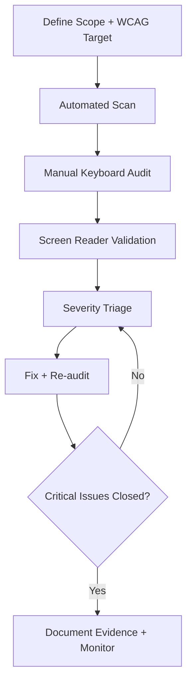

---
title: Accessibility Audit Workflow
slug: day-093-accessibility-audit-workflow
dayLabel: Day 93
level: Advanced
estimatedMinutes: 30
order: 93
track: react
---
# Day 93 [Advanced]: Accessibility Audit Workflow

## Goal

Run a repeatable accessibility audit workflow and close critical barriers in React interfaces.

## Prerequisites

- Day 92 completed
- Basic accessibility concepts: semantics, keyboard access, ARIA

## Explanation

Accessibility quality improves when teams use a consistent audit process combining automated checks and manual user-journey validation. A production audit should use a recognized target such as WCAG 2.2 AA, document scope and evidence, and verify fixes with the same workflow that discovered the issue.

## Topic by Topic

### Topic 1: Audit Scope Definition

Theory:
Audit should focus on high-traffic and business-critical flows.

Practical:
Select primary journey: login, search, checkout, form submit.

Code Example:

```text
Scope: signup, checkout, payment confirmation
```

**Explanation:** Accessibility audits begin by defining scope so the team knows which routes, components, states, and flows are in review. Record the target WCAG level and any product-specific requirements so the audit has an explicit definition of done.

**Key Points:**

- Start with a clear audit target.
- Prioritize high-traffic and critical flows.
- Keep scope explicit to avoid gaps.
- Record the accessibility standard and target conformance level.

### Topic 2: Automated Baseline Checks

Theory:
Automated tools catch many low-level violations quickly.

Practical:
Run axe/Lighthouse and capture issue list.

Code Example:

```text
Run axe: color contrast, aria attributes, form labels
```

**Explanation:** Automated checks provide quick baseline coverage, but they do not replace deeper manual validation. Use automation repeatedly in development and CI to catch common regressions while treating the output as evidence that still needs interpretation.

**Key Points:**

- Use tools to catch obvious issues early.
- Treat automation as a starting point, not final proof.
- Fix repeated baseline failures first.
- Keep automated results reproducible where possible.

### Topic 3: Manual Keyboard and Focus Audit

Theory:
Keyboard-only navigation reveals real interaction barriers.

Practical:
Validate tab order, focus trap, escape behavior.

Code Example:

```text
Tab -> Shift+Tab -> Enter -> Escape walkthrough
```

**Explanation:** Keyboard and focus auditing reveals whether the interface is actually operable without a mouse. Check visible focus, logical order, focus movement after opening/closing dialogs, and whether users can escape interactive regions without becoming trapped.

**Key Points:**

- Check tab order and focus visibility.
- Verify dialogs, menus, and forms carefully.
- Treat keyboard access as mandatory, not optional.
- Test focus restoration after transient UI closes.

### Topic 4: Screen Reader Validation

Theory:
Announcements, labels, and landmarks must be meaningful.

Practical:
Check form errors, dialog titles, dynamic status messages.

Code Example:

```jsx
<p role="alert">Email is required</p>
```

**Explanation:** Screen reader validation confirms whether semantics and announcements make the UI understandable, not just navigable. Test the actual user journey with a supported screen reader and verify that labels, headings, landmarks, errors, and status changes are announced at the right time.

**Key Points:**

- Test with real screen reader workflows.
- Check labels, roles, and live regions.
- Validate the experience, not only the markup.
- Avoid unnecessary ARIA when native HTML semantics already provide the correct behavior.

### Topic 5: Severity-based Remediation

Theory:
Prioritize blockers that prevent task completion.

Practical:
Classify findings as critical/high/medium/low and fix top issues first.

Code Example:

```text
Critical: keyboard trap, missing submit label, inaccessible modal
```

**Explanation:** Severity-based remediation helps teams fix the most harmful accessibility issues first instead of treating every defect equally. Record the affected journey, users impacted, reproducibility, WCAG criterion when applicable, owner, and verification status.

**Key Points:**

- Prioritize blockers before minor polish issues.
- Tie severity to user impact.
- Track remediation clearly across releases.
- Link findings to reproducible evidence and applicable WCAG criteria.

### Topic 6: Portfolio-Level Excellence for Accessibility Audit Workflow

Theory:
At expert level, outcomes improve when technical choices are backed by measurable impact, clear communication, and repeatable workflows.

Practical:
Capture one measurable outcome and one improvement plan linked to this topic so your portfolio evidence stays credible.

Code Example:

```ts
// Track one measurable outcome and one follow-up improvement item.
const accessibilityOutcome = {
  highSeverityFindingsBefore: 8,
  highSeverityFindingsAfter: 2,
  nextAuditDate: "2026-09-01",
};
```

**Explanation:** Portfolio-level accessibility excellence means audits become repeatable engineering practice, not last-minute compliance work. Evidence should show what was measured, what changed, and how the team will prevent regression without exposing private user information.

**Key Points:**

- Make accessibility part of normal review flow.
- Show evidence of ongoing audit discipline.
- Treat inclusive design as a core quality signal.
- Track measurable remediation outcomes and regression-prevention actions.

## Key Concepts

- Audit scope and prioritization
- Automated plus manual hybrid checks
- Keyboard and screen reader verification
- Severity-driven remediation
- Repeatable compliance workflow
- WCAG-based evidence and conformance targets
- Regression prevention and remediation ownership
- Evidence-driven engineering

## Visual Concept Map



## End-to-End Practical

1. Select one critical user flow.
2. Define the WCAG target and audit scope.
3. Run automated accessibility checks.
4. Execute keyboard-only walkthrough.
5. Validate with screen-reader pass.
6. Fix top blockers and re-run audit.
7. Document findings, evidence, owners, and verification status.
8. Add regression checks for issues likely to recur.

## Hands-on Coding

### Example 1: Case - Accessible Modal Audit Fix

Scenario:
Settings modal traps focus incorrectly and lacks descriptive title.

```jsx
<div role="dialog" aria-modal="true" aria-labelledby="settings-title">
  <h2 id="settings-title">Settings</h2>
  <button type="button" onClick={onClose}>Close</button>
</div>
```

**Review point:** The snippet provides semantic labeling, but a production modal also needs reliable focus movement into the dialog, a usable focus trap while open, focus restoration to the trigger on close, and an accessible close control.

### Example 2: Case - Form Label and Error Announcement Fix

Scenario:
Application form has unlabeled fields and silent validation errors.

```jsx
<label htmlFor="phone">Phone</label>
<input
  id="phone"
  aria-invalid={!!errors.phone}
  aria-describedby={errors.phone ? "phone-error" : undefined}
/>
{errors.phone && (
  <p id="phone-error" role="alert">
    {errors.phone.message}
  </p>
)}
```

**Review point:** Keep `aria-describedby` tied to an existing error element and ensure the error message is understandable without relying on color alone.

### Example 3: Case - Keyboard Navigation Repair

Scenario:
Checkout promo section cannot be reached via keyboard.

```jsx
<button type="button" onClick={applyPromo}>
  Apply Promo
</button>
```

Replace non-focusable clickable containers with semantic controls. Native buttons also provide expected keyboard interaction and accessible semantics without unnecessary custom key handling.

## Mini Exercise

Scenario:
You are auditing a profile-management flow with tabs, modal edit forms, and async status updates.

Run full audit workflow, fix at least 3 high-severity issues, and summarize before/after findings. For each issue, record the affected user journey, evidence, WCAG criterion if applicable, fix, and regression check.

Expected output:

- Clear issue inventory with severity
- Critical blockers resolved
- Improved keyboard and screen-reader experience
- Before/after evidence and repeatable regression checks

## Assessment Quiz

### Quiz Questions

1. Why combine automated and manual accessibility checks?
2. What is a keyboard trap?
3. True or False: Passing automated scan means full accessibility compliance.
4. Why use role="alert" for errors?
5. What should happen after fixes are applied?
6. Why should native HTML semantics be preferred before adding ARIA?
7. What information makes an accessibility finding actionable?
8. Why should accessibility audits be repeated after remediation?

### Quiz Answers

1. Automation is fast but misses interaction-context issues
2. Focus cannot leave a component/region using keyboard
3. False
4. To announce validation errors to assistive technology when appropriate
5. Re-audit to verify regression-free improvements
6. Native controls usually provide correct semantics and keyboard behavior with less complexity.
7. User impact, affected flow, reproduction steps, evidence, applicable WCAG criterion, owner, and verification status.
8. Fixes can introduce regressions, so re-testing verifies that the barrier is actually removed.

## Task

- Run audit checklist and resolve major blockers
- Document severity, evidence, WCAG mapping, and remediation status
- Add regression coverage for one fixed issue
- Complete mini exercise

## Self Check

- You can run a structured accessibility audit workflow
- You can prioritize and resolve impactful accessibility defects
- You can distinguish automated findings from issues requiring manual judgment
- You can answer at least 6 out of 8 quiz questions correctly

## Interview Questions and Answers

### Beginner

**Question:** What is an accessibility audit?

**Answer:** A systematic review of UI to ensure usability for people with diverse abilities.

**Question:** Why test keyboard navigation?

**Answer:** Many users rely on keyboard-only interaction.

### Middle

**Question:** What is a practical accessibility triage approach?

**Answer:** Prioritize blockers that prevent task completion first, then track remediation and verification.

**Question:** What are common audit misses?

**Answer:** Focus order issues, unlabeled controls, poor focus visibility, and unannounced dynamic updates.

### Advanced

**Question:** How do teams keep accessibility from regressing?

**Answer:** CI checks, component standards, code review checklist, automated regression tests, and periodic manual audits.

**Question:** What metric indicates a mature accessibility workflow?

**Answer:** Reduced high-severity findings, improved critical-flow coverage, and faster remediation cycles release-over-release.

**Question:** Why is automated accessibility testing insufficient by itself?

**Answer:** Many important issues depend on interaction context, focus behavior, content meaning, and real assistive-technology experience that automated rules cannot fully determine.

**Question:** How would you build an accessibility audit into a release process?

**Answer:** Define WCAG targets, run automated checks in CI, manually test critical journeys, block releases for agreed blockers, track remediation ownership, and re-audit fixes before release.

## Day 93 Outcome

- You can execute a production-style accessibility audit workflow
- You can drive measurable accessibility quality improvements
- You can combine automated checks with manual accessibility validation
- You are ready for advanced frontend security hardening in Day 94
