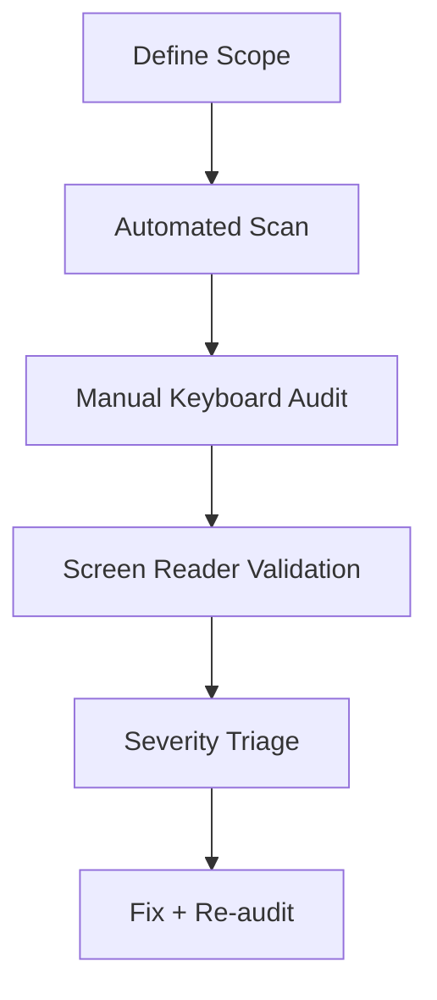

# Day 93 [Advanced]: Accessibility Audit Workflow

## Index

- [Goal](#goal)
- [Prerequisites](#prerequisites)
- [Explanation](#explanation)
- [Topic by Topic](#topic-by-topic)
- [Key Concepts](#key-concepts)
- [Visual Concept Map](#visual-concept-map)
- [End-to-End Practical](#end-to-end-practical)
- [Hands-on Coding](#hands-on-coding)
- [Mini Exercise](#mini-exercise)
- [Assessment Quiz](#assessment-quiz)
- [Task](#task)
- [Self Check](#self-check)
- [Interview Questions and Answers](#interview-questions-and-answers)
- [Day 93 Outcome](#day-93-outcome)

## Goal

Run a repeatable accessibility audit workflow and close critical barriers in React interfaces.

## Prerequisites

- Day 92 completed
- Basic accessibility concepts: semantics, keyboard access, ARIA

## Explanation

Accessibility quality improves when teams use a consistent audit process combining automated checks and manual user-journey validation.

## Topic by Topic

### Topic 1: Audit Scope Definition

Theory:
Audit should focus on high-traffic and business-critical flows.

Practical:
Select primary journey: login, search, checkout, form submit.

Code Example:

```text
Scope: signup, checkout, payment confirmation
```

**Explanation:** Accessibility audits begin by defining scope so the team knows which routes, components, and flows are in review.

**Key Points:**

- Start with a clear audit target.
- Prioritize high-traffic and critical flows.
- Keep scope explicit to avoid gaps.

### Topic 2: Automated Baseline Checks

Theory:
Automated tools catch many low-level violations quickly.

Practical:
Run axe/Lighthouse and capture issue list.

Code Example:

```text
Run axe: color contrast, aria attributes, form labels
```

**Explanation:** Automated checks provide quick baseline coverage, but they do not replace deeper manual validation.

**Key Points:**

- Use tools to catch obvious issues early.
- Treat automation as a starting point, not final proof.
- Fix repeated baseline failures first.

### Topic 3: Manual Keyboard and Focus Audit

Theory:
Keyboard-only navigation reveals real interaction barriers.

Practical:
Validate tab order, focus trap, escape behavior.

Code Example:

```text
Tab -> Shift+Tab -> Enter -> Escape walkthrough
```

**Explanation:** Keyboard and focus auditing reveals whether the interface is actually operable without a mouse.

**Key Points:**

- Check tab order and focus visibility.
- Verify dialogs, menus, and forms carefully.
- Treat keyboard access as mandatory, not optional.

### Topic 4: Screen Reader Validation

Theory:
Announcements, labels, and landmarks must be meaningful.

Practical:
Check form errors, dialog titles, dynamic status messages.

Code Example:

```jsx
<p role="alert">Email is required</p>
```

**Explanation:** Screen reader validation confirms whether semantics and announcements make the UI understandable, not just navigable.

**Key Points:**

- Test with real screen reader workflows.
- Check labels, roles, and live regions.
- Validate the experience, not only the markup.

### Topic 5: Severity-based Remediation

Theory:
Prioritize blockers that prevent task completion.

Practical:
Classify findings as critical/high/medium/low and fix top issues first.

Code Example:

```text
Critical: keyboard trap, missing submit label, inaccessible modal
```

**Explanation:** Severity-based remediation helps teams fix the most harmful accessibility issues first instead of treating every defect equally.

**Key Points:**

- Prioritize blockers before minor polish issues.
- Tie severity to user impact.
- Track remediation clearly across releases.

### Topic 6: Portfolio-Level Excellence for Accessibility Audit Workflow

Theory:
At expert level, outcomes improve when technical choices are backed by measurable impact, clear communication, and repeatable workflows.

Practical:
Capture one measurable outcome and one improvement plan linked to this topic so your portfolio evidence stays credible.

Code Example:

`jsx
// Track one measurable outcome and one follow-up improvement item.
`
**Explanation:** Portfolio-level accessibility excellence means audits become repeatable engineering practice, not last-minute compliance work.

**Key Points:**

- Make accessibility part of normal review flow.
- Show evidence of ongoing audit discipline.
- Treat inclusive design as a core quality signal.

## Key Concepts

- Audit scope and prioritization
- Automated plus manual hybrid checks
- Keyboard and screen reader verification
- Severity-driven remediation
- Repeatable compliance workflow

- Evidence-driven engineering

## Visual Concept Map



## End-to-End Practical

1. Select one critical user flow.
2. Run automated accessibility checks.
3. Execute keyboard-only walkthrough.
4. Validate with screen-reader pass.
5. Fix top blockers and re-run audit.

## Hands-on Coding

### Example 1: Case - Accessible Modal Audit Fix

Scenario:
Settings modal traps focus incorrectly and lacks descriptive title.

```jsx
<div role="dialog" aria-modal="true" aria-labelledby="settings-title">
  <h2 id="settings-title">Settings</h2>
  <button onClick={onClose}>Close</button>
</div>
```

### Example 2: Case - Form Label and Error Announcement Fix

Scenario:
Application form has unlabeled fields and silent validation errors.

```jsx
<label htmlFor="phone">Phone</label>
<input id="phone" aria-invalid={!!errors.phone} aria-describedby="phone-error" />
{errors.phone && <p id="phone-error" role="alert">{errors.phone.message}</p>}
```

### Example 3: Case - Keyboard Navigation Repair

Scenario:
Checkout promo section cannot be reached via keyboard.

```jsx
<button type="button" onClick={applyPromo}>
  Apply Promo
</button>
```

Replace non-focusable clickable containers with semantic controls.

## Mini Exercise

Scenario:
You are auditing a profile-management flow with tabs, modal edit forms, and async status updates.

Run full audit workflow, fix at least 3 high-severity issues, and summarize before/after findings.

Expected output:

- Clear issue inventory with severity
- Critical blockers resolved
- Improved keyboard and screen-reader experience

## Assessment Quiz

### Quiz Questions

1. Why combine automated and manual accessibility checks?
2. What is a keyboard trap?
3. True or False: Passing automated scan means full accessibility compliance.
4. Why use role="alert" for errors?
5. What should happen after fixes are applied?

### Quiz Answers

1. Automation is fast but misses interaction-context issues
2. Focus cannot leave a component/region using keyboard
3. False
4. To announce validation errors immediately to assistive tech
5. Re-audit to verify regression-free improvements

## Task

- Run audit checklist and resolve major blockers
- Document severity and remediation status
- Complete mini exercise

## Self Check

- You can run a structured accessibility audit workflow
- You can prioritize and resolve impactful accessibility defects
- You can answer at least 4 out of 5 quiz questions correctly

## Interview Questions and Answers

### Beginner

**Question:** What is an accessibility audit?

**Answer:** A systematic review of UI to ensure usability for people with diverse abilities.

**Question:** Why test keyboard navigation?

**Answer:** Many users rely on keyboard-only interaction.

### Middle

**Question:** What is a practical accessibility triage approach?

**Answer:** Prioritize blockers that prevent task completion first.

**Question:** What are common audit misses?

**Answer:** Focus order issues, unlabeled controls, and unannounced dynamic updates.

### Advanced

**Question:** How do teams keep accessibility from regressing?

**Answer:** CI checks, component standards, code review checklist, and periodic manual audits.

**Question:** What metric indicates a mature accessibility workflow?

**Answer:** Reduced high-severity findings and faster remediation cycles release-over-release.

## Day 93 Outcome

- You can execute a production-style accessibility audit workflow
- You can drive measurable accessibility quality improvements
- You are ready for advanced frontend security hardening in Day 94
