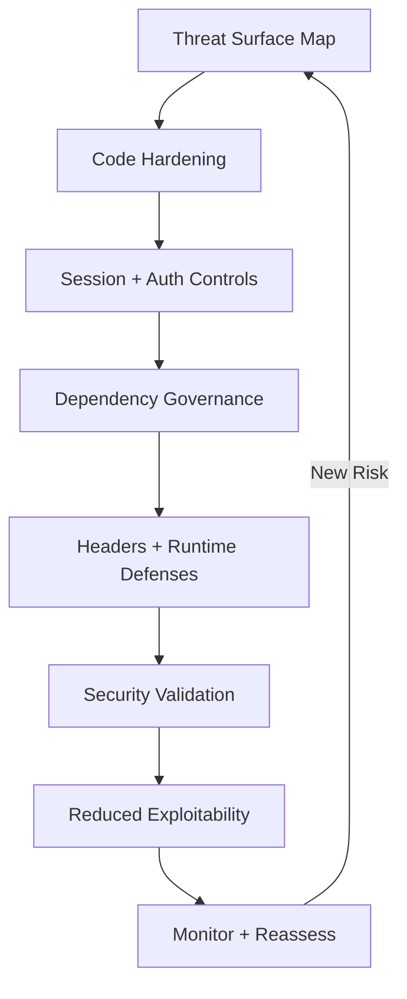

---
title: Frontend Security Hardening
slug: day-094-frontend-security-hardening
dayLabel: Day 94
level: Expert
estimatedMinutes: 30
order: 94
track: react
---
# Day 94 [Expert]: Frontend Security Hardening

## Goal

Harden frontend security posture using a practical checklist that reduces exploit surface and improves release safety.

## Prerequisites

- Day 93 completed
- Security basics, auth flow understanding, API validation awareness

## Explanation

Security hardening means proactively reducing attack opportunities in UI rendering, session handling, dependencies, configuration, and operational controls. Frontend security is defense in depth: browser code cannot make a backend insecure system safe, so controls should be applied at the browser, API, server/edge, dependency, and release layers.

## Topic by Topic

### Topic 1: Threat Surface Mapping

Theory:
Identify where user input, tokens, and external scripts enter the app.

Practical:
Map risk points by feature and severity.

Code Example:

```text
Inputs, auth storage, third-party scripts, API responses
```

**Explanation:** Security hardening starts with understanding the threat surface so teams know where user input, auth, and third-party code create risk. For each surface, document the asset being protected, trust boundary, attacker capability, and mitigation.

**Key Points:**

- Map risky entry points first.
- Focus on real attack surfaces, not vague fear.
- Use threat mapping to guide priorities.
- Identify trust boundaries and sensitive assets explicitly.

### Topic 2: XSS and Unsafe Rendering Controls

Theory:
Direct HTML injection and untrusted string interpolation are high risk.

Practical:
Remove unsafe rendering paths and sanitize where unavoidable.

Code Example:

```jsx
<p>{comment}</p>
```

**Explanation:** XSS prevention remains one of the most important frontend controls because unsafe rendering can expose sessions and user data. Prefer React's normal escaped rendering and avoid `dangerouslySetInnerHTML` unless the content is intentionally treated as HTML and sanitized with a maintained, well-configured sanitizer.

**Key Points:**

- Avoid unsafe HTML injection by default.
- Sanitize only when raw HTML is unavoidable.
- Review rendering paths that touch user content.
- Treat content from APIs, URLs, CMS systems, and user input as untrusted.

### Topic 3: Session and Token Hardening

Theory:
Token misuse increases account takeover risk.

Practical:
Minimize token exposure and enforce expiry/logout behavior.

Code Example:

```ts
if (isTokenExpired()) forceLogout();
```

**Explanation:** Session and token hardening reduce the blast radius when browser code or network behavior is compromised. Where architecture allows, prefer secure, appropriately scoped cookies such as `HttpOnly`, `Secure`, and suitable `SameSite` settings over exposing long-lived credentials to JavaScript. Client-side expiry checks improve UX but are not a security boundary; the server must enforce authorization and token validity.

**Key Points:**

- Minimize token exposure to JavaScript.
- Prefer safer session strategies where possible.
- Treat auth storage as part of security design.
- Never rely on client-side checks as the only authorization control.

### Topic 4: Dependency and Supply-chain Controls

Theory:
Frontend dependencies can introduce critical vulnerabilities.

Practical:
Run audits, pin versions, and remove unused libraries.

Code Example:

```text
Audit -> classify -> patch -> retest
```

**Explanation:** Dependency and supply-chain controls matter because vulnerable packages can undermine otherwise secure application code. Use lockfiles, review dependency updates, scan direct and transitive dependencies, and treat unexpected install scripts or package ownership changes as supply-chain signals worth investigating.

**Key Points:**

- Audit dependencies regularly.
- Remove unused packages quickly.
- Track upstream vulnerabilities proactively.
- Keep lockfiles reviewed and reproducible.

### Topic 5: Security Headers and Runtime Defenses

Theory:
CSP and related headers provide defense in depth.

Practical:
Define baseline header policy with backend/platform team.

Code Example:

```text
CSP, HSTS, X-Content-Type-Options, frame-ancestors
```

**Explanation:** Headers and runtime defenses provide protection around the app itself, especially when combined with safe rendering and session practices. CSP should be designed deliberately and tested in report-only mode where appropriate before enforcement. `frame-ancestors` is a CSP directive and should be configured through the policy rather than treated as a legacy standalone header.

**Key Points:**

- Use CSP and related headers intentionally.
- Coordinate frontend needs with platform teams.
- Treat runtime defenses as part of release readiness.
- Validate headers in staging and monitor violations after rollout.

### Topic 6: Portfolio-Level Excellence for Frontend Security Hardening

Theory:
At expert level, outcomes improve when technical choices are backed by measurable impact, clear communication, and repeatable workflows.

Practical:
Capture one measurable outcome and one improvement plan linked to this topic so your portfolio evidence stays credible.

Code Example:

```ts
// Track one measurable outcome and one follow-up improvement item.
const securityOutcome = {
  criticalFindingsBefore: 5,
  criticalFindingsAfter: 0,
  residualRisksDocumented: true,
};
```

**Explanation:** Portfolio-level security excellence means you can explain both what was hardened and why those controls matter in real production systems. Evidence should describe risk reduction without exposing secrets, credentials, exploit payloads, or private customer information.

**Key Points:**

- Document security decisions clearly.
- Show practical hardening, not only theory.
- Connect controls to real threats and business impact.
- Record residual risk and prevention steps.

## Key Concepts

- Attack surface reduction
- Safe rendering and input handling
- Session/token risk mitigation
- Supply-chain vulnerability management
- Platform-level security controls
- Defense-in-depth security architecture
- Security governance and residual-risk tracking
- Evidence-driven engineering

## Visual Concept Map



## End-to-End Practical

1. Create frontend security checklist.
2. Scan app for unsafe rendering patterns.
3. Harden token/session handling flows.
4. Audit and patch vulnerable dependencies.
5. Validate with targeted security test cases.
6. Review security headers and CSP in staging.
7. Verify authorization remains server-enforced for protected operations.
8. Document residual risks and monitoring/response actions.

## Hands-on Coding

### Example 1: Case - Sanitized Rich-text Rendering

Scenario:
Community feed needs limited rich text support without XSS exposure.

```tsx
import DOMPurify from "dompurify";

function SafeHtml({ raw }: { raw: string }) {
  const sanitized = DOMPurify.sanitize(raw);
  return <div dangerouslySetInnerHTML={{ __html: sanitized }} />;
}
```

**Review point:** Only use this pattern when HTML rendering is a real product requirement. Keep the sanitizer dependency maintained, avoid trusting client-side sanitization as the only protection, and apply server-side validation/output controls where appropriate.

### Example 2: Case - Strict Session Expiry Guard

Scenario:
Finance dashboard should block actions when token is expired.

```ts
function requireActiveSession() {
  const expiry = Number(sessionStorage.getItem("access_exp"));
  if (!expiry || Date.now() > expiry) {
    authStore.clear();
    window.location.href = "/login?reason=expired";
  }
}
```

**Review point:** This is a client-side UX guard, not authorization. The API must independently validate the session/token and enforce permissions on every protected operation. Avoid storing long-lived sensitive tokens in browser-accessible storage when a safer cookie-based design is available.

### Example 3: Case - Security Checklist Artifact

Scenario:
Release manager needs formal hardening checklist before deploy.

```md
## Frontend Security Checklist

- [ ] No unsafe untrusted HTML rendering paths
- [ ] Runtime validation for critical API responses
- [ ] Token/session expiry and forced logout tested
- [ ] Dependency audit reviewed and critical issues patched
- [ ] CSP/header policy validated in staging
- [ ] Protected API authorization verified server-side
- [ ] No secrets or credentials committed to frontend source
```

## Mini Exercise

Scenario:
You are preparing a payments frontend release and must close top security findings.

Run hardening checklist, fix at least 3 high-risk items, and provide a remediation summary with residual risks. For each finding, record the affected asset, attack path at a high level, mitigation, verification method, and remaining risk.

Expected output:

- High-risk findings reduced significantly
- Hardened auth/session and rendering paths
- Documented residual risk and next actions
- Evidence that security controls were verified rather than only configured

## Assessment Quiz

### Quiz Questions

1. Why is frontend security hardening continuous rather than one-time?
2. What is one major source of frontend exploits?
3. True or False: Dependency vulnerabilities can be ignored if app still works.
4. Why coordinate CSP with backend/platform teams?
5. What should a hardening report include?
6. Why should client-side authorization checks not be trusted alone?
7. What is one advantage of minimizing long-lived tokens in JavaScript-accessible storage?
8. Why should security controls be validated after deployment?

### Quiz Answers

1. Threats, dependencies, and code paths evolve continuously
2. Unsafe rendering of untrusted input (XSS)
3. False
4. Headers are commonly enforced at server/edge layers and must align with deployment architecture.
5. Findings, severity, fixes, verification evidence, and residual risk
6. An attacker can modify or bypass browser code, so the server must enforce authentication and authorization.
7. It reduces credential exposure if malicious browser code or an XSS vulnerability occurs.
8. Configuration can drift and releases can introduce new behavior, so monitoring verifies that the intended protection is active.

## Task

- Run security checklist and close top findings
- Document mitigations, verification evidence, and residual risks
- Review dependency and CSP/header posture
- Complete mini exercise

## Self Check

- You can execute a practical frontend hardening process
- You can reduce exploit surface with prioritized controls
- You can distinguish client-side defenses from server-enforced security boundaries
- You can answer at least 6 out of 8 quiz questions correctly

## Interview Questions and Answers

### Beginner

**Question:** What is frontend security hardening?

**Answer:** Strengthening frontend code and configuration to reduce vulnerability risk.

**Question:** Why is XSS dangerous?

**Answer:** It can execute attacker-controlled scripts in a user's browser context and potentially expose accessible data or actions.

### Middle

**Question:** How do you prioritize security findings?

**Answer:** By exploitability, user impact, affected assets, exposure, and business-critical flow risk.

**Question:** Why include runtime API validation in security strategy?

**Answer:** It creates a safer boundary around untrusted API data and prevents malformed payloads from destabilizing UI logic, while backend validation remains authoritative.

### Advanced

**Question:** What is a scalable frontend security governance model?

**Answer:** Threat modeling, secure coding standards, dependency scanning, CI security gates, protected deployment configuration, and release checklists.

**Question:** How do you justify security work to product stakeholders?

**Answer:** Tie findings to concrete assets, exploitability, affected users, business impact, compliance requirements where applicable, and measurable risk reduction.

**Question:** Why is localStorage-based authentication often discouraged for long-lived sensitive tokens?

**Answer:** JavaScript can read localStorage, so an XSS vulnerability can expose those credentials. A secure, appropriately configured cookie-based session can reduce that exposure, although it introduces its own CSRF and session-management considerations.

**Question:** How would you design defense in depth for a React application?

**Answer:** Combine safe rendering, strict input/output handling, secure session design, dependency governance, CSP and security headers, server-side authorization, monitoring, and release-time security checks so failure of one layer does not automatically compromise the whole system.

## Day 94 Outcome

- You can run expert-level frontend security hardening workflows
- You can remediate high-impact findings with structured prioritization
- You can distinguish browser-side defenses from authoritative server security controls
- You are ready for state strategy design in Day 95
