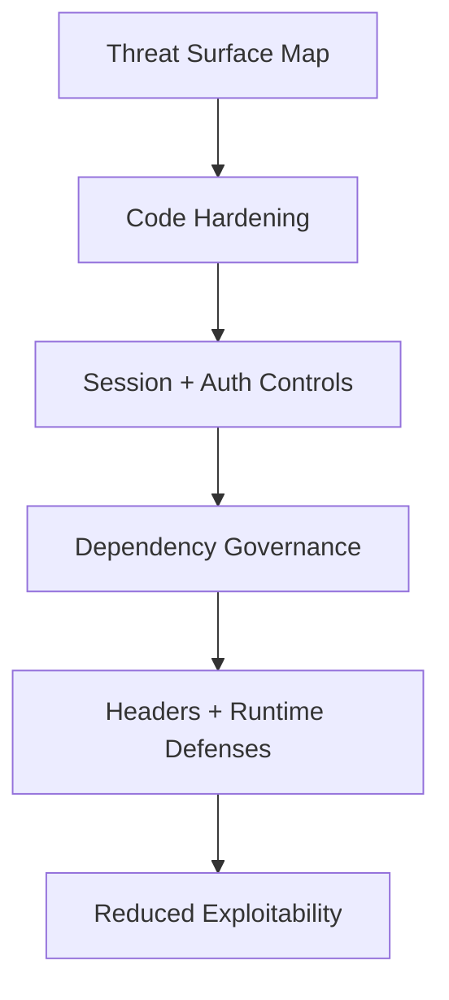

# Day 94 [Expert]: Frontend Security Hardening

## Index

- [Goal](#goal)
- [Prerequisites](#prerequisites)
- [Explanation](#explanation)
- [Topic by Topic](#topic-by-topic)
- [Key Concepts](#key-concepts)
- [Visual Concept Map](#visual-concept-map)
- [End-to-End Practical](#end-to-end-practical)
- [Hands-on Coding](#hands-on-coding)
- [Mini Exercise](#mini-exercise)
- [Assessment Quiz](#assessment-quiz)
- [Task](#task)
- [Self Check](#self-check)
- [Interview Questions and Answers](#interview-questions-and-answers)
- [Day 94 Outcome](#day-94-outcome)

## Goal

Harden frontend security posture using a practical checklist that reduces exploit surface and improves release safety.

## Prerequisites

- Day 93 completed
- Security basics, auth flow understanding, API validation awareness

## Explanation

Security hardening means proactively reducing attack opportunities in UI rendering, session handling, dependencies, configuration, and operational controls.

## Topic by Topic

### Topic 1: Threat Surface Mapping

Theory:
Identify where user input, tokens, and external scripts enter the app.

Practical:
Map risk points by feature and severity.

Code Example:

```text
Inputs, auth storage, third-party scripts, API responses
```

**Explanation:** Security hardening starts with understanding the threat surface so teams know where user input, auth, and third-party code create risk.

**Key Points:**

- Map risky entry points first.
- Focus on real attack surfaces, not vague fear.
- Use threat mapping to guide priorities.

### Topic 2: XSS and Unsafe Rendering Controls

Theory:
Direct HTML injection and untrusted string interpolation are high risk.

Practical:
Remove unsafe rendering paths and sanitize where unavoidable.

Code Example:

```jsx
<p>{comment}</p>
```

**Explanation:** XSS prevention remains one of the most important frontend controls because unsafe rendering can expose sessions and user data.

**Key Points:**

- Avoid unsafe HTML injection by default.
- Sanitize only when raw HTML is unavoidable.
- Review rendering paths that touch user content.

### Topic 3: Session and Token Hardening

Theory:
Token misuse increases account takeover risk.

Practical:
Minimize token exposure and enforce expiry/logout behavior.

Code Example:

```ts
if (isTokenExpired()) forceLogout();
```

**Explanation:** Session and token hardening reduce the blast radius when browser code or network behavior is compromised.

**Key Points:**

- Minimize token exposure to JavaScript.
- Prefer safer session strategies where possible.
- Treat auth storage as part of security design.

### Topic 4: Dependency and Supply-chain Controls

Theory:
Frontend dependencies can introduce critical vulnerabilities.

Practical:
Run audits, pin versions, and remove unused libraries.

Code Example:

```text
Audit -> classify -> patch -> retest
```

**Explanation:** Dependency and supply-chain controls matter because vulnerable packages can undermine otherwise secure application code.

**Key Points:**

- Audit dependencies regularly.
- Remove unused packages quickly.
- Track upstream vulnerabilities proactively.

### Topic 5: Security Headers and Runtime Defenses

Theory:
CSP and related headers provide defense in depth.

Practical:
Define baseline header policy with backend/platform team.

Code Example:

```text
CSP, HSTS, X-Content-Type-Options, frame-ancestors
```

**Explanation:** Headers and runtime defenses provide protection around the app itself, especially when combined with safe rendering and session practices.

**Key Points:**

- Use CSP and related headers intentionally.
- Coordinate frontend needs with platform teams.
- Treat runtime defenses as part of release readiness.

### Topic 6: Portfolio-Level Excellence for Frontend Security Hardening

Theory:
At expert level, outcomes improve when technical choices are backed by measurable impact, clear communication, and repeatable workflows.

Practical:
Capture one measurable outcome and one improvement plan linked to this topic so your portfolio evidence stays credible.

Code Example:

`jsx
// Track one measurable outcome and one follow-up improvement item.
`
**Explanation:** Portfolio-level security excellence means you can explain both what was hardened and why those controls matter in real production systems.

**Key Points:**

- Document security decisions clearly.
- Show practical hardening, not only theory.
- Connect controls to real threats and business impact.

## Key Concepts

- Attack surface reduction
- Safe rendering and input handling
- Session/token risk mitigation
- Supply-chain vulnerability management
- Platform-level security controls

- Evidence-driven engineering

## Visual Concept Map



## End-to-End Practical

1. Create frontend security checklist.
2. Scan app for unsafe rendering patterns.
3. Harden token/session handling flows.
4. Audit and patch vulnerable dependencies.
5. Validate with targeted security test cases.

## Hands-on Coding

### Example 1: Case - Sanitized Rich-text Rendering

Scenario:
Community feed needs limited rich text support without XSS exposure.

```tsx
import DOMPurify from "dompurify";

function SafeHtml({ raw }: { raw: string }) {
  const sanitized = DOMPurify.sanitize(raw);
  return <div dangerouslySetInnerHTML={{ __html: sanitized }} />;
}
```

### Example 2: Case - Strict Session Expiry Guard

Scenario:
Finance dashboard should block actions when token is expired.

```ts
function requireActiveSession() {
  const expiry = Number(localStorage.getItem("access_exp"));
  if (!expiry || Date.now() > expiry) {
    authStore.clear();
    window.location.href = "/login?reason=expired";
  }
}
```

### Example 3: Case - Security Checklist Artifact

Scenario:
Release manager needs formal hardening checklist before deploy.

```md
## Frontend Security Checklist

- [ ] No unsafe untrusted HTML rendering paths
- [ ] Runtime validation for critical API responses
- [ ] Token/session expiry and forced logout tested
- [ ] Dependency audit reviewed and critical issues patched
- [ ] CSP/header policy validated in staging
```

## Mini Exercise

Scenario:
You are preparing a payments frontend release and must close top security findings.

Run hardening checklist, fix at least 3 high-risk items, and provide a remediation summary with residual risks.

Expected output:

- High-risk findings reduced significantly
- Hardened auth/session and rendering paths
- Documented residual risk and next actions

## Assessment Quiz

### Quiz Questions

1. Why is frontend security hardening continuous rather than one-time?
2. What is one major source of frontend exploits?
3. True or False: Dependency vulnerabilities can be ignored if app still works.
4. Why coordinate CSP with backend/platform teams?
5. What should a hardening report include?

### Quiz Answers

1. Threats, dependencies, and code paths evolve continuously
2. Unsafe rendering of untrusted input (XSS)
3. False
4. Headers are usually enforced at server/edge layer
5. Findings, severity, fixes, and residual risk

## Task

- Run security checklist and close top findings
- Document mitigations and residual risks
- Complete mini exercise

## Self Check

- You can execute a practical frontend hardening process
- You can reduce exploit surface with prioritized controls
- You can answer at least 4 out of 5 quiz questions correctly

## Interview Questions and Answers

### Beginner

**Question:** What is frontend security hardening?

**Answer:** Strengthening frontend code and configuration to reduce vulnerability risk.

**Question:** Why is XSS dangerous?

**Answer:** It can execute attacker scripts in user sessions.

### Middle

**Question:** How do you prioritize security findings?

**Answer:** By exploitability, user impact, and business-critical flow exposure.

**Question:** Why include runtime API validation in security strategy?

**Answer:** It prevents malformed or malicious payloads from destabilizing UI logic.

### Advanced

**Question:** What is a scalable frontend security governance model?

**Answer:** Threat modeling, secure coding standards, CI security gates, and release checklists.

**Question:** How do you justify security work to product stakeholders?

**Answer:** Tie findings to real risk reduction, compliance, and incident prevention outcomes.

## Day 94 Outcome

- You can run expert-level frontend security hardening workflows
- You can remediate high-impact findings with structured prioritization
- You are ready for state strategy design in Day 95
