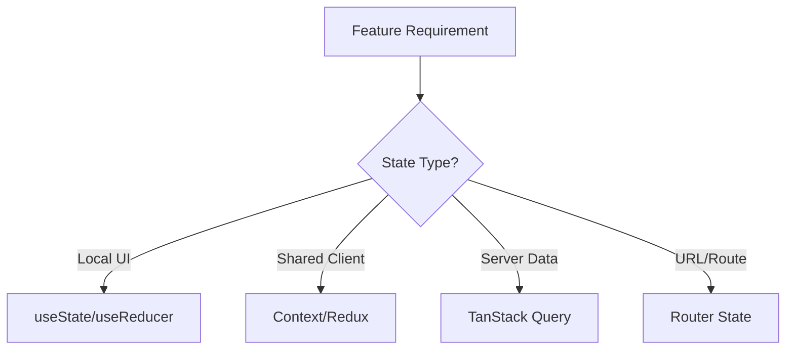

# Day 95 [Advanced]: State Strategy Design

## Index

- [Goal](#goal)
- [Prerequisites](#prerequisites)
- [Explanation](#explanation)
- [Topic by Topic](#topic-by-topic)
- [Key Concepts](#key-concepts)
- [Visual Concept Map](#visual-concept-map)
- [End-to-End Practical](#end-to-end-practical)
- [Hands-on Coding](#hands-on-coding)
- [Mini Exercise](#mini-exercise)
- [Assessment Quiz](#assessment-quiz)
- [Task](#task)
- [Self Check](#self-check)
- [Interview Questions and Answers](#interview-questions-and-answers)
- [Day 95 Outcome](#day-95-outcome)

## Goal

Design a robust state strategy by selecting the right state tools based on scope, ownership, lifecycle, and update frequency.

## Prerequisites

- Day 94 completed
- Understanding of useState, useReducer, Context, Redux Toolkit, and server-state tools

## Explanation

Not all state is equal. Good architecture separates local UI state, shared app state, and server state to reduce complexity and improve maintainability.

## Topic by Topic

### Topic 1: State Type Classification

Theory:
Common categories: local UI state, shared client state, server/cache state, and URL state.

Practical:
Map one feature into these categories.

Code Example:

```text
Local: modal open
Shared: auth user
Server: product list
URL: ?page=2&sort=price
```

**Explanation:** State strategy starts by classifying state correctly, because different state types need different handling patterns.

**Key Points:**

- Separate local, server, derived, and shared state.
- Match state type to actual behavior needs.
- Avoid using one tool for every problem.

### Topic 2: Tool Selection Matrix

Theory:
Choose tool based on update frequency, cross-feature access, and persistence need.

Practical:
Use a matrix for quick architecture decisions.

Code Example:

```text
useState -> local
useReducer -> complex local
Context -> low-frequency shared
Redux -> large shared domain
TanStack Query -> server state
```

**Explanation:** A tool selection matrix helps teams choose between `useState`, `useReducer`, context, Redux, or query tools with clear reasoning.

**Key Points:**

- Pick tools based on complexity and scope.
- Prefer the simplest correct solution.
- Revisit choices as features grow.

### Topic 3: Ownership and Boundaries

Theory:
Each state slice should have clear ownership and write paths.

Practical:
Define who reads/writes cart, filters, and user profile.

Code Example:

```text
Checkout feature owns coupon state; global store owns auth session.
```

**Explanation:** Ownership and boundaries prevent state from spreading unpredictably across unrelated modules.

**Key Points:**

- Keep state close to its main owner.
- Lift or centralize only when justified.
- Define boundaries before scaling shared state.

### Topic 4: Derived State and Normalization

Theory:
Derived values should be computed from source state, not duplicated.

Practical:
Use selectors/useMemo for totals and filtered lists.

Code Example:

```ts
const total = useMemo(() => items.reduce((s, i) => s + i.price, 0), [items]);
```

**Explanation:** Derived state and normalization keep the state layer simpler by avoiding duplication and inconsistent data shapes.

**Key Points:**

- Prefer deriving over duplicating when practical.
- Normalize large or relational data thoughtfully.
- Keep transformations predictable.

### Topic 5: Evolution Strategy

Theory:
State architecture should evolve with feature scale.

Practical:
Define when to migrate from local to centralized state.

Code Example:

```text
Trigger: more than 3 sibling consumers or repeated prop drilling
```

**Explanation:** Evolution strategy matters because state architecture that works today may become a bottleneck later if migration paths are unclear.

**Key Points:**

- Design with future growth in mind.
- Document when to refactor state tools.
- Keep migrations incremental where possible.

### Topic 6: Portfolio-Level Excellence for State Strategy Design

Theory:
At expert level, outcomes improve when technical choices are backed by measurable impact, clear communication, and repeatable workflows.

Practical:
Capture one measurable outcome and one improvement plan linked to this topic so your portfolio evidence stays credible.

Code Example:

`jsx
// Track one measurable outcome and one follow-up improvement item.
`
**Explanation:** Portfolio-level state design excellence means you can justify why the chosen state strategy fits the app’s scale and complexity.

**Key Points:**

- Explain strategy decisions clearly.
- Show tradeoffs between simplicity and scale.
- Connect state choices to long-term maintainability.

## Key Concepts

- State category modeling
- Right-tool selection framework
- Ownership and write-path clarity
- Derived state discipline
- Scalable migration triggers

- Evidence-driven engineering

## Visual Concept Map



## End-to-End Practical

1. Pick a medium feature (e.g., checkout dashboard).
2. List all state pieces involved.
3. Classify each state type.
4. Select tools with decision rationale.
5. Document ownership and migration rules.

## Hands-on Coding

### Example 1: Case - Checkout State Decomposition

Scenario:
A checkout page mixes UI toggles, cart data, and API state in one component.

```text
State Design:
- useState: promo input open/close
- Redux slice: cart items and totals
- TanStack Query: shipping rates and payment options
- URL state: step=shipping|payment
```

### Example 2: Case - Dashboard Filter Strategy

Scenario:
Analytics dashboard filters are used across multiple widgets and route reloads.

```ts
// URL as source of truth for sharable filter state
const params = new URLSearchParams(location.search);
const range = params.get("range") ?? "7d";
```

### Example 3: Case - Migration from Context to Redux

Scenario:
Team initially used Context for orders, but feature grew across many modules.

```text
Migration Trigger:
- Frequent updates causing wide re-renders
- Multiple feature consumers with complex write operations

Migration Plan:
- Create order slice
- Move writes to actions/thunks
- Keep read access via selectors
```

## Mini Exercise

Scenario:
You are designing state architecture for a project management app with tasks, comments, live notifications, and filters.

Classify each state type, assign tools, and justify one migration trigger.

Expected output:

- Explicit state classification table
- Clear ownership per domain
- Practical tool choices with rationale

## Assessment Quiz

### Quiz Questions

1. Why is state classification important before coding?
2. Which state type is best handled by TanStack Query?
3. True or False: All shared state should always go to Redux.
4. What is a common sign to migrate from local state to centralized state?
5. Why avoid duplicating derived state?

### Quiz Answers

1. It prevents wrong tool choice and architectural debt
2. Server-synced remote data
3. False
4. Frequent cross-component access with complex updates
5. Duplication causes inconsistency and harder debugging

## Task

- Write state strategy for one medium feature
- Include classification, ownership, and tool rationale
- Complete mini exercise

## Self Check

- You can design state architecture from first principles
- You can justify tool decisions with clear criteria
- You can answer at least 4 out of 5 quiz questions correctly

## Interview Questions and Answers

### Beginner

**Question:** What is local state in React?

**Answer:** State used within a single component or tightly scoped subtree.

**Question:** Why not keep everything in one global store?

**Answer:** It adds unnecessary complexity for simple local interactions.

### Middle

**Question:** How do you decide between Context and Redux?

**Answer:** Context fits low-frequency shared reads; Redux fits complex high-frequency shared writes.

**Question:** Why keep server data out of client-only stores when possible?

**Answer:** Server-state tools handle caching, staleness, retries, and synchronization better.

### Advanced

**Question:** How can poor state strategy hurt performance?

**Answer:** It causes unnecessary re-renders, stale data bugs, and hard-to-reason update flows.

**Question:** What is a durable state strategy document format?

**Answer:** Per-feature table listing state type, owner, tool, lifecycle, and migration triggers.

## Day 95 Outcome

- You can architect scalable state strategy for medium and large features
- You can select state tools with evidence-based reasoning
- You are ready for design system integration at scale in Day 96
