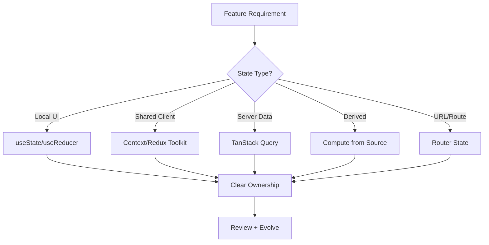

---
title: State Strategy Design
slug: day-095-state-strategy-design
dayLabel: Day 95
level: Advanced
estimatedMinutes: 30
order: 95
track: react
---
# Day 95 [Advanced]: State Strategy Design

## Goal

Design a robust state strategy by selecting the right state tools based on scope, ownership, lifecycle, update frequency, and synchronization requirements.

## Prerequisites

- Day 94 completed
- Understanding of useState, useReducer, Context, Redux Toolkit, and server-state tools

## Explanation

Not all state is equal. Good architecture separates local UI state, shared app state, server state, derived state, and URL state to reduce complexity and improve maintainability. The goal is not to centralize everything; it is to establish clear ownership, predictable write paths, and an intentional source of truth for each piece of state.

## Topic by Topic

### Topic 1: State Type Classification

Theory:
Common categories: local UI state, shared client state, server/cache state, derived state, and URL state.

Practical:
Map one feature into these categories.

Code Example:

```text
Local: modal open
Shared: auth user
Server: product list
Derived: cart total
URL: ?page=2&sort=price
```

**Explanation:** State strategy starts by classifying state correctly, because different state types need different handling patterns. First identify the source of truth, then decide whether a value should be stored, derived, cached, or represented in the URL.

**Key Points:**

- Separate local, server, derived, and shared state.
- Match state type to actual behavior needs.
- Avoid using one tool for every problem.
- Treat the source of truth as an explicit architectural decision.

### Topic 2: Tool Selection Matrix

Theory:
Choose a tool based on update frequency, scope, cross-feature access, synchronization, and persistence needs.

Practical:
Use a matrix for quick architecture decisions.

Code Example:

```text
useState -> local UI state
useReducer -> complex local transitions
Context -> low-frequency shared values
Redux Toolkit -> complex shared client state
TanStack Query -> server/cache state
Router state -> shareable navigation/filter state
```

**Explanation:** A tool selection matrix helps teams choose between `useState`, `useReducer`, context, Redux Toolkit, or query tools with clear reasoning. These are not mutually exclusive: a feature can legitimately use several state mechanisms when each owns a different category of state.

**Key Points:**

- Pick tools based on complexity and scope.
- Prefer the simplest correct solution.
- Do not confuse server state with client-owned state.
- Revisit choices as features grow.

### Topic 3: Ownership and Boundaries

Theory:
Each state slice should have clear ownership and write paths.

Practical:
Define who reads/writes cart, filters, and user profile.

Code Example:

```text
Checkout feature owns coupon state; global store owns auth session.
Shipping rates are owned by the server-state cache.
```

**Explanation:** Ownership and boundaries prevent state from spreading unpredictably across unrelated modules. Every important state value should have an obvious owner, allowed writers, lifecycle, and source of truth.

**Key Points:**

- Keep state close to its main owner.
- Lift or centralize only when justified.
- Define boundaries before scaling shared state.
- Avoid multiple independent writers for the same source of truth.

### Topic 4: Derived State and Normalization

Theory:
Derived values should be computed from source state, not duplicated.

Practical:
Use selectors or useMemo for totals and filtered lists when computation cost or referential stability justifies it.

Code Example:

```ts
const total = useMemo(
  () => items.reduce((sum, item) => sum + item.price, 0),
  [items]
);
```

**Explanation:** Derived state and normalization keep the state layer simpler by avoiding duplication and inconsistent data shapes. `useMemo` is an optimization, not a requirement for every calculation; first keep derivation correct and simple, then optimize measured hot paths.

**Key Points:**

- Prefer deriving over duplicating when practical.
- Normalize large or relational data thoughtfully.
- Keep transformations predictable.
- Do not use memoization automatically without a performance reason.

### Topic 5: Evolution Strategy

Theory:
State architecture should evolve with feature scale.

Practical:
Define when to migrate from local to centralized state.

Code Example:

```text
Trigger examples:
- Many unrelated consumers need the same state
- Complex cross-feature write rules emerge
- Prop drilling becomes difficult to maintain
- Frequent updates expose performance or ownership problems
```

**Explanation:** Evolution strategy matters because state architecture that works today may become a bottleneck later if migration paths are unclear. Migration should be driven by observed complexity, ownership problems, performance characteristics, or product requirements rather than arbitrary consumer-count rules.

**Key Points:**

- Design with future growth in mind.
- Document when to refactor state tools.
- Keep migrations incremental where possible.
- Measure before making performance-driven architecture changes.

### Topic 6: Portfolio-Level Excellence for State Strategy Design

Theory:
At expert level, outcomes improve when technical choices are backed by measurable impact, clear communication, and repeatable workflows.

Practical:
Capture one measurable outcome and one improvement plan linked to this topic so your portfolio evidence stays credible.

Code Example:

```ts
// Track one measurable outcome and one follow-up improvement item.
const stateStrategyOutcome = {
  duplicatedStateSourcesBefore: 5,
  duplicatedStateSourcesAfter: 1,
  nextArchitectureReview: "2026-09-01",
};
```

**Explanation:** Portfolio-level state design excellence means you can justify why the chosen state strategy fits the app’s scale and complexity. Strong evidence describes the original problem, the tradeoff behind the chosen architecture, and the measurable result rather than simply listing technologies.

**Key Points:**

- Explain strategy decisions clearly.
- Show tradeoffs between simplicity and scale.
- Connect state choices to long-term maintainability.
- Capture measurable outcomes without exposing sensitive application data.

## Key Concepts

- State category modeling
- Right-tool selection framework
- Source-of-truth definition
- Ownership and write-path clarity
- Derived state discipline
- Scalable migration triggers
- Evidence-driven architecture decisions

## Visual Concept Map



## End-to-End Practical

1. Pick a medium feature (e.g., checkout dashboard).
2. List all state pieces involved.
3. Classify each state type and identify its source of truth.
4. Select tools with decision rationale.
5. Document ownership, allowed write paths, lifecycle, and migration rules.
6. Identify one measurable architecture or performance outcome.

## Hands-on Coding

### Example 1: Case - Checkout State Decomposition

Scenario:
A checkout page mixes UI toggles, cart data, and API state in one component.

```text
State Design:
- useState: promo input open/close
- Redux slice: cart items and totals
- TanStack Query: shipping rates and payment options
- URL state: step=shipping|payment
```

**Review point:** Keep server-fetched shipping/payment data in the server-state layer unless there is a deliberate reason to copy it into client state. Avoid duplicating the same source of truth across Redux and query cache.

### Example 2: Case - Dashboard Filter Strategy

Scenario:
Analytics dashboard filters are used across multiple widgets and route reloads.

```ts
// URL as source of truth for shareable filter state
const params = new URLSearchParams(location.search);
const range = params.get("range") ?? "7d";
```

**Review point:** URL state is useful when filters need to be shareable, bookmarkable, or restorable after navigation. Validate and normalize incoming values before using them in API requests.

### Example 3: Case - Migration from Context to Redux

Scenario:
Team initially used Context for orders, but the feature grew across many modules.

```text
Migration Trigger:
- Frequent updates causing wide re-renders
- Multiple feature consumers with complex write operations

Migration Plan:
- Create order slice
- Move writes to actions/thunks
- Keep read access via selectors
- Remove duplicated Context ownership after migration
```

**Review point:** Migration should solve an observed problem. Do not move state to Redux solely because a feature has crossed an arbitrary component count.

## Mini Exercise

Scenario:
You are designing state architecture for a project management app with tasks, comments, live notifications, and filters.

Classify each state type, assign tools, identify the source of truth, and justify one migration trigger.

Expected output:

- Explicit state classification table
- Clear ownership per domain
- Practical tool choices with rationale
- One measurable outcome or validation criterion

## Assessment Quiz

### Quiz Questions

1. Why is state classification important before coding?
2. Which state type is best handled by TanStack Query?
3. True or False: All shared state should always go to Redux.
4. What is a useful sign to migrate from local state to centralized state?
5. Why avoid duplicating derived state?
6. What does "source of truth" mean in state architecture?
7. Why should server state usually remain in a server-state tool?
8. Why should architecture changes be validated with measurements when performance is the motivation?

### Quiz Answers

1. It prevents wrong tool choice and architectural debt.
2. Server-synced remote/cache data.
3. False.
4. Repeated cross-feature access, complex writes, ownership problems, or measured performance issues.
5. Duplication can cause inconsistency and harder debugging.
6. The authoritative location from which a value is derived or updated.
7. Query tools provide caching, staleness, retries, refetching, and synchronization behavior designed for remote data.
8. A measured baseline helps confirm that the architectural change actually improves the target problem.

## Task

- Write a state strategy for one medium feature.
- Include classification, source of truth, ownership, and tool rationale.
- Define one migration trigger and one validation metric.
- Complete mini exercise.

## Self Check

- You can design state architecture from first principles.
- You can identify the source of truth for important values.
- You can justify tool decisions with clear criteria.
- You can answer at least 6 out of 8 quiz questions correctly.

## Interview Questions and Answers

### Beginner

**Question:** What is local state in React?

**Answer:** State used within a single component or tightly scoped subtree.

**Question:** Why not keep everything in one global store?

**Answer:** It adds unnecessary complexity for simple local interactions and can create unnecessary coupling.

### Middle

**Question:** How do you decide between Context and Redux Toolkit?

**Answer:** Context is useful for relatively simple shared values and low-frequency updates; Redux Toolkit is better suited to complex shared client state with explicit update flows and tooling needs.

**Question:** Why keep server data out of client-only stores when possible?

**Answer:** Server-state tools handle caching, staleness, retries, refetching, and synchronization more directly.

### Advanced

**Question:** How can poor state strategy hurt performance?

**Answer:** It can create unnecessary re-renders, duplicated data, broad subscriptions, stale values, and hard-to-reason update flows.

**Question:** What is a durable state strategy document format?

**Answer:** A per-feature table listing state value, category, source of truth, owner, tool, lifecycle, update path, and migration triggers.

**Question:** When should you avoid centralizing state?

**Answer:** When state is local, short-lived, and has no meaningful cross-feature consumers. Centralizing it would add complexity without solving a real requirement.

**Question:** How would you review a state architecture for a large React application?

**Answer:** Inventory state by category, identify sources of truth and ownership, inspect read/write paths, check server-cache duplication, review subscription boundaries, measure performance hotspots, and document migration or simplification opportunities.

## Day 95 Outcome

- You can architect scalable state strategy for medium and large features
- You can select state tools with evidence-based reasoning
- You can establish clear ownership and sources of truth
- You are ready for design system integration at scale in Day 96
