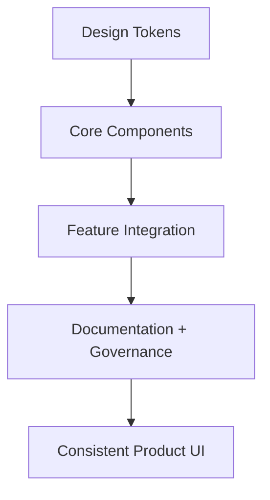

# Day 96 [Expert]: Design System Integration

## Index

- [Goal](#goal)
- [Prerequisites](#prerequisites)
- [Explanation](#explanation)
- [Topic by Topic](#topic-by-topic)
- [Key Concepts](#key-concepts)
- [Visual Concept Map](#visual-concept-map)
- [End-to-End Practical](#end-to-end-practical)
- [Hands-on Coding](#hands-on-coding)
- [Mini Exercise](#mini-exercise)
- [Assessment Quiz](#assessment-quiz)
- [Task](#task)
- [Self Check](#self-check)
- [Interview Questions and Answers](#interview-questions-and-answers)
- [Day 96 Outcome](#day-96-outcome)

## Goal

Integrate a scalable design system with tokens, reusable components, accessibility standards, and team adoption workflows.

## Prerequisites

- Day 95 completed
- Strong React component design and styling architecture fundamentals

## Explanation

A design system is not only a component library. It includes tokens, usage guidelines, accessibility constraints, and governance that keeps product UI consistent over time.

## Topic by Topic

### Topic 1: Design Tokens as Single Source of Truth

Theory:
Tokens encode visual decisions: color, spacing, typography, radius, elevation.

Practical:
Define tokens and consume them in all components.

Code Example:

```css
:root {
  --ds-color-primary: #0a4db3;
  --ds-space-4: 16px;
}
```

**Explanation:** Design tokens should stay the single source of truth so colors, spacing, and typography do not drift across teams.

**Key Points:**

- Centralize visual decisions in tokens.
- Reuse token values consistently.
- Treat tokens as product infrastructure.

### Topic 2: Component API Standards

Theory:
Components need predictable props, variants, and states.

Practical:
Define Button/Input/Card/Modal prop contracts.

Code Example:

```ts
type ButtonProps = { variant: "primary" | "secondary"; disabled?: boolean };
```

**Explanation:** Component API standards help teams consume the design system consistently instead of inventing new behavior for each screen.

**Key Points:**

- Keep component props predictable.
- Align API naming across the system.
- Design APIs for reuse, not one-off cases.

### Topic 3: Accessibility-by-default Components

Theory:
Design system components should ship with semantics and focus behavior built-in.

Practical:
Modal role/label, input label support, keyboard interactions.

Code Example:

```tsx
<div role="dialog" aria-modal="true" aria-labelledby={titleId}>
```

**Explanation:** Accessibility-by-default components reduce repeated audit work because inclusive behavior is built into the base system.

**Key Points:**

- Bake focus, labels, and semantics into components.
- Make accessible usage the easiest usage.
- Reduce downstream accessibility debt.

### Topic 4: Theming and Brand Customization

Theory:
Themes should override tokens, not rewrite components.

Practical:
Add light/dark or brand variants through token layers.

Code Example:

```css
[data-theme="dark"] {
  --ds-color-bg: #111827;
}
```

**Explanation:** Theming and brand customization let one design system support multiple products or visual modes without fragmenting the UI.

**Key Points:**

- Use theming for controlled variation.
- Keep branding changes token-driven.
- Avoid forking components unnecessarily.

### Topic 5: Governance and Adoption

Theory:
A system succeeds when teams can discover, trust, and adopt it.

Practical:
Add docs, examples, versioning, and deprecation policy.

Code Example:

```text
Changelog + migration guide for component API changes
```

**Explanation:** Governance and adoption determine whether the design system stays healthy or becomes an unused side project.

**Key Points:**

- Define contribution and review rules.
- Support adoption with documentation and examples.
- Measure whether teams actually use the system.

### Topic 6: Portfolio-Level Excellence for Design System Integration

Theory:
At expert level, outcomes improve when technical choices are backed by measurable impact, clear communication, and repeatable workflows.

Practical:
Capture one measurable outcome and one improvement plan linked to this topic so your portfolio evidence stays credible.

Code Example:

`jsx
// Track one measurable outcome and one follow-up improvement item.
`
**Explanation:** Portfolio-level design system excellence means you can show both technical integration and the organizational discipline needed to keep it effective.

**Key Points:**

- Demonstrate system consistency across features.
- Show governance, not just components.
- Connect design-system work to delivery speed and quality.

## Key Concepts

- Token-driven consistency
- Component API contract design
- Built-in accessibility guarantees
- Theme scalability model
- Governance and adoption lifecycle

- Evidence-driven engineering

## Visual Concept Map



## End-to-End Practical

1. Define token foundation file.
2. Build Button, Input, Card, Modal components.
3. Add accessibility defaults and variants.
4. Integrate components into one feature screen.
5. Publish usage guide and versioning notes.

## Hands-on Coding

### Example 1: Case - Typed Button Component with Variants

Scenario:
Product teams need a consistent action button with standardized variants.

```tsx
type ButtonProps = {
  children: React.ReactNode;
  variant?: "primary" | "secondary";
  disabled?: boolean;
  onClick?: () => void;
};

export function Button({
  children,
  variant = "primary",
  disabled,
  onClick,
}: ButtonProps) {
  return (
    <button
      className={`ds-btn ds-btn--${variant}`}
      disabled={disabled}
      onClick={onClick}
    >
      {children}
    </button>
  );
}
```

### Example 2: Case - Accessible Modal Component

Scenario:
System modal should enforce semantic structure and close behavior.

```tsx
type ModalProps = {
  open: boolean;
  title: string;
  onClose: () => void;
  children: React.ReactNode;
};

export function Modal({ open, title, onClose, children }: ModalProps) {
  if (!open) return null;
  const titleId = "ds-modal-title";

  return (
    <div role="dialog" aria-modal="true" aria-labelledby={titleId}>
      <h2 id={titleId}>{title}</h2>
      <button onClick={onClose}>Close</button>
      {children}
    </div>
  );
}
```

### Example 3: Case - Token-based Theme Integration

Scenario:
Enterprise app supports white-label branding without component rewrites.

```css
:root {
  --ds-color-primary: #0a4db3;
  --ds-radius-md: 10px;
}

[data-theme="brand-b"] {
  --ds-color-primary: #c2410c;
}
```

```tsx
document.documentElement.setAttribute("data-theme", "brand-b");
```

## Mini Exercise

Scenario:
You are integrating a design system into a booking flow that currently uses ad-hoc UI components.

Replace local Button/Input/Card/Modal with design-system versions and document migration steps.

Expected output:

- Consistent UI behavior and styling
- Accessible and typed component usage
- Clear migration and versioning notes

## Assessment Quiz

### Quiz Questions

1. Why are design tokens essential in a design system?
2. What is a key benefit of standardized component APIs?
3. True or False: Theming should require duplicating every component.
4. Why embed accessibility defaults in system components?
5. What keeps a design system sustainable at scale?

### Quiz Answers

1. They centralize visual decisions for consistency and changeability
2. Predictable usage and lower integration errors
3. False
4. It ensures accessibility is baseline, not optional
5. Governance, documentation, versioning, and adoption workflows

## Task

- Build mini design system package with Button/Input/Card/Modal
- Integrate tokens, accessibility, and usage standards
- Complete mini exercise

## Self Check

- You can design and integrate a scalable design system foundation
- You can deliver reusable, accessible, typed UI primitives
- You can answer at least 4 out of 5 quiz questions correctly

## Interview Questions and Answers

### Beginner

**Question:** What is a design system?

**Answer:** A reusable set of components, tokens, and guidelines for consistent UI.

**Question:** Why use shared components?

**Answer:** To reduce duplication and ensure consistent behavior.

### Middle

**Question:** How do tokens help in theming?

**Answer:** Themes override token values without changing component code.

**Question:** What is a common integration challenge?

**Answer:** Migrating legacy ad-hoc components without breaking feature delivery.

### Advanced

**Question:** How do you measure design system adoption success?

**Answer:** Usage coverage, reduced UI defects, faster development, and fewer duplicate components.

**Question:** What governance policy avoids breaking consumers?

**Answer:** SemVer-driven releases, deprecation windows, and migration guides.

## Day 96 Outcome

- You can integrate expert-level design system foundations into real products
- You can align consistency, accessibility, and scalability in UI architecture
- You are ready for large-scale module architecture in Day 97
