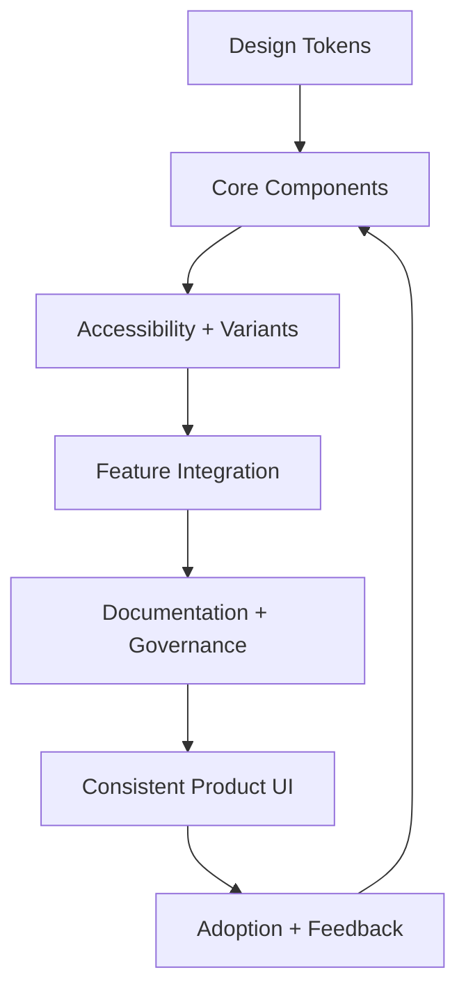

---
title: Design System Integration
slug: day-096-design-system-integration
dayLabel: Day 96
level: Expert
estimatedMinutes: 30
order: 96
track: react
---
# Day 96 [Expert]: Design System Integration

## Goal

Integrate a scalable design system with tokens, reusable components, accessibility standards, versioning, and team adoption workflows.

## Prerequisites

- Day 95 completed
- Strong React component design and styling architecture fundamentals

## Explanation

A design system is not only a component library. It includes tokens, usage guidelines, accessibility constraints, documentation, versioning, and governance that keeps product UI consistent over time. A mature system also defines ownership and a safe path for introducing, deprecating, and migrating components.

## Topic by Topic

### Topic 1: Design Tokens as Single Source of Truth

Theory:
Tokens encode visual decisions: color, spacing, typography, radius, elevation.

Practical:
Define tokens and consume them in all components.

Code Example:

```css
:root {
  --ds-color-primary: #0a4db3;
  --ds-space-4: 16px;
  --ds-radius-md: 8px;
}
```

**Explanation:** Design tokens should stay the single source of truth so colors, spacing, and typography do not drift across teams. Prefer semantic tokens such as `--ds-color-primary` over embedding raw values throughout component styles.

**Key Points:**

- Centralize visual decisions in tokens.
- Reuse token values consistently.
- Treat tokens as product infrastructure.
- Separate primitive values from semantic usage where the system is large enough to benefit from the distinction.

### Topic 2: Component API Standards

Theory:
Components need predictable props, variants, states, and composition patterns.

Practical:
Define Button/Input/Card/Modal prop contracts.

Code Example:

```ts
type ButtonProps = {
  variant: "primary" | "secondary";
  size?: "sm" | "md" | "lg";
  disabled?: boolean;
};
```

**Explanation:** Component API standards help teams consume the design system consistently instead of inventing new behavior for each screen. Good APIs expose intentional states while avoiding dozens of narrowly targeted props that make components difficult to reason about.

**Key Points:**

- Keep component props predictable.
- Align API naming across the system.
- Design APIs for reuse, not one-off cases.
- Prefer composition when a component needs many unrelated configuration options.

### Topic 3: Accessibility-by-default Components

Theory:
Design system components should ship with semantics and focus behavior built-in.

Practical:
Modal role/label, input label support, keyboard interactions.

Code Example:

```tsx
<div role="dialog" aria-modal="true" aria-labelledby={titleId}>
```

**Explanation:** Accessibility-by-default components reduce repeated audit work because inclusive behavior is built into the base system. For complex widgets such as dialogs, this includes focus movement, keyboard behavior, focus restoration, and appropriate announcements—not only ARIA attributes.

**Key Points:**

- Bake focus, labels, and semantics into components.
- Make accessible usage the easiest usage.
- Reduce downstream accessibility debt.
- Prefer native HTML semantics before adding ARIA.

### Topic 4: Theming and Brand Customization

Theory:
Themes should override tokens, not rewrite components.

Practical:
Add light/dark or brand variants through token layers.

Code Example:

```css
[data-theme="dark"] {
  --ds-color-bg: #111827;
  --ds-color-primary: #60a5fa;
}
```

**Explanation:** Theming and brand customization let one design system support multiple products or visual modes without fragmenting the UI. Theme changes should remain within documented token boundaries so contrast and component states remain predictable.

**Key Points:**

- Use theming for controlled variation.
- Keep branding changes token-driven.
- Avoid forking components unnecessarily.
- Validate contrast and interaction states for every supported theme.

### Topic 5: Governance and Adoption

Theory:
A system succeeds when teams can discover, trust, and adopt it.

Practical:
Add docs, examples, versioning, and deprecation policy.

Code Example:

```text
Changelog + migration guide for component API changes
```

**Explanation:** Governance and adoption determine whether the design system stays healthy or becomes an unused side project. Teams need clear contribution rules, ownership, release discipline, documentation, and a predictable deprecation window.

**Key Points:**

- Define contribution and review rules.
- Support adoption with documentation and examples.
- Measure whether teams actually use the system.
- Use deprecation and migration policies instead of abrupt breaking changes.

### Topic 6: Portfolio-Level Excellence for Design System Integration

Theory:
At expert level, outcomes improve when technical choices are backed by measurable impact, clear communication, and repeatable workflows.

Practical:
Capture one measurable outcome and one improvement plan linked to this topic so your portfolio evidence stays credible.

Code Example:

```ts
// Track one measurable outcome and one follow-up improvement item.
const designSystemOutcome = {
  duplicateComponentsBefore: 12,
  duplicateComponentsAfter: 4,
  adoptionReviewDate: "2026-09-01",
};
```

**Explanation:** Portfolio-level design system excellence means you can show both technical integration and the organizational discipline needed to keep it effective. Strong evidence should connect the change to measurable outcomes such as adoption, defect reduction, migration progress, or delivery efficiency.

**Key Points:**

- Demonstrate system consistency across features.
- Show governance, not just components.
- Connect design-system work to delivery speed and quality.
- Track outcomes without exposing sensitive product or user information.

## Key Concepts

- Token-driven consistency
- Component API contract design
- Built-in accessibility guarantees
- Theme scalability model
- Governance and adoption lifecycle
- Versioning and deprecation strategy
- Evidence-driven engineering

## Visual Concept Map



## End-to-End Practical

1. Define token foundation file.
2. Build Button, Input, Card, Modal components.
3. Add accessibility defaults and variants.
4. Integrate components into one feature screen.
5. Publish usage guide and versioning notes.
6. Define a deprecation path for one legacy component.
7. Measure adoption or duplicate-component reduction.

## Hands-on Coding

### Example 1: Case - Typed Button Component with Variants

Scenario:
Product teams need a consistent action button with standardized variants.

```tsx
type ButtonProps = {
  children: React.ReactNode;
  variant?: "primary" | "secondary";
  disabled?: boolean;
  onClick?: () => void;
};

export function Button({
  children,
  variant = "primary",
  disabled,
  onClick,
}: ButtonProps) {
  return (
    <button
      type="button"
      className={`ds-btn ds-btn--${variant}`}
      disabled={disabled}
      onClick={onClick}
    >
      {children}
    </button>
  );
}
```

**Review point:** A production design-system button should also define focus styles, loading behavior, accessible disabled state, and a controlled API for supported variants. Avoid allowing arbitrary style values that bypass the token system.

### Example 2: Case - Accessible Modal Component

Scenario:
System modal should enforce semantic structure and close behavior.

```tsx
type ModalProps = {
  open: boolean;
  title: string;
  onClose: () => void;
  children: React.ReactNode;
};

export function Modal({ open, title, onClose, children }: ModalProps) {
  if (!open) return null;
  const titleId = "ds-modal-title";

  return (
    <div role="dialog" aria-modal="true" aria-labelledby={titleId}>
      <h2 id={titleId}>{title}</h2>
      <button type="button" onClick={onClose}>Close</button>
      {children}
    </div>
  );
}
```

**Review point:** This establishes semantics but is not a complete production dialog. The system component should manage focus entering the dialog, keyboard dismissal where appropriate, focus restoration, unique IDs, and interaction with background content.

### Example 3: Case - Token-based Theme Integration

Scenario:
Enterprise app supports white-label branding without component rewrites.

```css
:root {
  --ds-color-primary: #0a4db3;
  --ds-radius-md: 10px;
}

[data-theme="brand-b"] {
  --ds-color-primary: #c2410c;
}
```

```tsx
document.documentElement.setAttribute("data-theme", "brand-b");
```

**Review point:** Validate theme values for contrast and component states. In a production application, prefer a controlled theme provider or application-level state rather than arbitrary DOM mutation from unrelated components.

## Mini Exercise

Scenario:
You are integrating a design system into a booking flow that currently uses ad-hoc UI components.

Replace local Button/Input/Card/Modal with design-system versions and document migration steps.

Expected output:

- Consistent UI behavior and styling
- Accessible and typed component usage
- Clear migration and versioning notes
- One measurable adoption or duplicate-component reduction metric

## Assessment Quiz

### Quiz Questions

1. Why are design tokens essential in a design system?
2. What is a key benefit of standardized component APIs?
3. True or False: Theming should require duplicating every component.
4. Why embed accessibility defaults in system components?
5. What keeps a design system sustainable at scale?
6. Why is a deprecation policy important?
7. Why should design-system components prefer native HTML semantics where possible?
8. What is one useful measure of design-system adoption?

### Quiz Answers

1. They centralize visual decisions for consistency and changeability.
2. Predictable usage and lower integration errors.
3. False.
4. It makes accessible behavior the baseline rather than an optional downstream task.
5. Governance, documentation, versioning, ownership, and adoption workflows.
6. It gives consumers time to migrate instead of forcing abrupt breaking changes.
7. Native semantics usually provide established accessibility behavior with less custom complexity.
8. Usage coverage, migration completion, duplicate-component reduction, or reduction in UI consistency defects.

## Task

- Build a mini design system package with Button/Input/Card/Modal.
- Integrate tokens, accessibility, and usage standards.
- Define one versioning/deprecation rule.
- Measure one adoption or consistency outcome.
- Complete mini exercise.

## Self Check

- You can design and integrate a scalable design system foundation.
- You can deliver reusable, accessible, typed UI primitives.
- You can define token-driven theming and component API standards.
- You can answer at least 6 out of 8 quiz questions correctly.

## Interview Questions and Answers

### Beginner

**Question:** What is a design system?

**Answer:** A reusable set of components, tokens, guidelines, accessibility rules, and practices for consistent UI.

**Question:** Why use shared components?

**Answer:** To reduce duplication and ensure consistent behavior.

### Middle

**Question:** How do tokens help in theming?

**Answer:** Themes override token values without changing component code.

**Question:** What is a common integration challenge?

**Answer:** Migrating legacy ad-hoc components without breaking feature delivery.

### Advanced

**Question:** How do you measure design system adoption success?

**Answer:** Usage coverage, migration progress, reduced UI defects, faster development, and fewer duplicate components.

**Question:** What governance policy avoids breaking consumers?

**Answer:** SemVer-driven releases, deprecation windows, clear ownership, and migration guides.

**Question:** How do you prevent a design system from becoming a collection of inconsistent components?

**Answer:** Establish design principles, token constraints, API conventions, accessibility requirements, contribution review, visual regression checks, and ownership for each component.

**Question:** How would you safely migrate a large application to a new design system?

**Answer:** Inventory existing UI, prioritize high-value components, provide compatibility adapters where useful, migrate incrementally, measure adoption and regressions, deprecate legacy components with a documented timeline, and remove them only after consumers have migrated.

## Day 96 Outcome

- You can integrate expert-level design system foundations into real products
- You can align consistency, accessibility, and scalability in UI architecture
- You can establish governance and migration practices for long-lived systems
- You are ready for large-scale module architecture in Day 97
