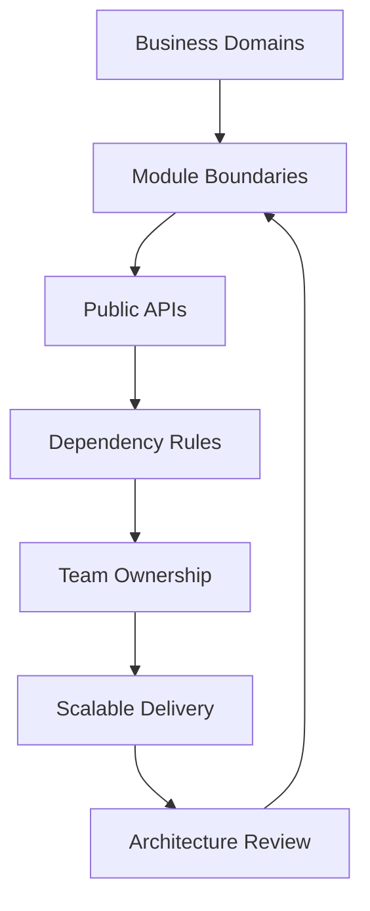

---
title: Large-Scale Module Architecture
slug: day-097-large-scale-module-architecture
dayLabel: Day 97
level: Expert
estimatedMinutes: 35
order: 97
track: react
---
# Day 97 [Expert]: Large-Scale Module Architecture

## Goal

Design and evolve large-scale frontend module architecture with clear domain boundaries, ownership, stable contracts, and dependency governance.

## Prerequisites

- Day 96 completed
- Strong understanding of feature-based architecture, typed state, and CI quality gates

## Explanation

At large scale, architecture quality directly affects team velocity, change safety, and the cost of coordination. Domain-oriented modules reduce coupling by grouping code around business capabilities rather than file types. A mature architecture also makes ownership, public APIs, dependency direction, and exceptions explicit so teams can evolve modules without creating hidden coupling.

## Topic by Topic

### Topic 1: Domain-driven Module Boundaries

Theory:
Module boundaries should align with business domains, not file types.

Practical:
Split app by catalog, checkout, billing, and support domains.

Code Example:

```text
features/catalog, features/checkout, features/billing
```

**Explanation:** Domain-driven module boundaries reduce coupling by grouping code around business capabilities instead of file type alone. A useful boundary has a clear responsibility, owner, public contract, and reason to change.

**Key Points:**

- Organize modules by domain meaning.
- Keep boundaries visible in the folder structure.
- Reduce accidental cross-feature entanglement.
- Prefer boundaries that reflect business ownership and change patterns.

### Topic 2: Public APIs per Module

Theory:
Each module should expose stable entry points and hide internals.

Practical:
Create `index.ts` exports for module contracts.

Code Example:

```ts
export { CheckoutPage } from "./ui/CheckoutPage";
```

**Explanation:** Public APIs per module keep imports intentional so consumers depend only on stable entry points. This creates an abstraction boundary that lets the module reorganize its internals without forcing every consumer to change.

**Key Points:**

- Export only the supported surface area.
- Hide internal implementation details.
- Make refactors safer for consumers.
- Review public exports as carefully as any API contract.

### Topic 3: Dependency Direction and Anti-corruption

Theory:
One-way dependencies prevent cyclic complexity.

Practical:
Enforce rules: feature can use shared, shared cannot import feature.

Code Example:

```text
feature -> shared allowed; shared -> feature blocked
```

**Explanation:** Dependency direction rules protect architecture by ensuring stable layers are not polluted by feature-specific details. When domains must interact, use explicit contracts or anti-corruption adapters rather than allowing internal implementation details to leak across boundaries.

**Key Points:**

- Keep dependencies flowing in one direction.
- Use anti-corruption layers at risky boundaries.
- Prevent cycles and leakage early.
- Treat dependency exceptions as explicit, reviewed decisions.

### Topic 4: Cross-module Communication Patterns

Theory:
Prefer events/contracts over deep cross-imports.

Practical:
Use typed interfaces for inter-module data exchange.

Code Example:

```ts
type CheckoutEvent = { type: "ORDER_PLACED"; orderId: string };
```

**Explanation:** Cross-module communication needs clear patterns so teams do not create hidden coupling through ad hoc sharing. Contracts should communicate intent while keeping each module responsible for its own internal state and behavior.

**Key Points:**

- Choose communication patterns deliberately.
- Avoid bypassing module boundaries casually.
- Keep shared contracts stable and clear.
- Prefer domain events or explicit interfaces when direct ownership transfer is not appropriate.

### Topic 5: Architecture Governance at Scale

Theory:
Large teams need ADRs, ownership maps, and automated lint constraints.

Practical:
Define governance checklist for each new module.

Code Example:

```text
ADR + owner + dependency check + integration tests
```

**Explanation:** Governance at scale matters because large architectures drift quickly without rules, reviews, and shared ownership. Automated checks should enforce repeatable constraints while ADRs explain intentional architectural decisions and approved exceptions.

**Key Points:**

- Review architecture continuously.
- Document module standards and exceptions.
- Treat governance as part of delivery, not overhead.
- Automate rules that can be checked consistently.

### Topic 6: Portfolio-Level Excellence for Large Scale Module Architecture

Theory:
At expert level, outcomes improve when technical choices are backed by measurable impact, clear communication, and repeatable workflows.

Practical:
Capture one measurable outcome and one improvement plan linked to this topic so your portfolio evidence stays credible.

Code Example:

```ts
// Track one measurable outcome and one follow-up improvement item.
const moduleArchitectureOutcome = {
  crossDomainImportsBefore: 18,
  crossDomainImportsAfter: 6,
  nextArchitectureReview: "2026-09-01",
};
```

**Explanation:** Portfolio-level architecture excellence means you can explain how module structure supports team scale, feature safety, and long-term change. Strong evidence connects the architectural decision to measurable outcomes such as reduced coupling, fewer dependency violations, faster ownership handoffs, or safer releases.

**Key Points:**

- Connect structure to maintainability outcomes.
- Show reasoning behind module boundaries.
- Demonstrate architecture as an engineering asset.
- Track measurable outcomes without exposing sensitive product data.

## Key Concepts

- Domain-aligned modular decomposition
- Stable module API contracts
- Dependency governance and cycle prevention
- Scalable cross-team collaboration patterns
- Architecture governance discipline
- Evidence-driven engineering

## Visual Concept Map



## End-to-End Practical

1. Select one large feature area.
2. Define domain boundaries and module responsibilities.
3. Create public API contracts per module.
4. Add dependency rules and architecture checks.
5. Document design rationale in ADR format.
6. Assign ownership and define an exception process for boundary violations.
7. Measure coupling, dependency violations, or delivery impact before and after the change.

## Hands-on Coding

### Example 1: Case - Module Blueprint for Commerce Platform

Scenario:
Commerce app struggles with tangled imports and unclear ownership across teams.

```text
src/
	app/
		providers/
		router/
	features/
		catalog/
			ui/
			model/
			api/
			index.ts
		checkout/
			ui/
			model/
			api/
			index.ts
		billing/
			ui/
			model/
			api/
			index.ts
	shared/
		ui/
		lib/
		config/
```

**Review point:** The structure is useful only when dependency rules and ownership match the folders. Do not allow `shared` to become a dumping ground for business-specific code.

### Example 2: Case - Public API Contract File

Scenario:
Checkout module should expose only stable entry points to other modules.

```ts
// features/checkout/index.ts
export { CheckoutPage } from "./ui/CheckoutPage";
export { useCheckoutSummary } from "./model/useCheckoutSummary";
export type { CheckoutEvent } from "./model/events";
```

**Review point:** Consumers should import from `features/checkout`, not from internal paths such as `features/checkout/model/...`. This makes the module boundary enforceable and refactoring safer.

### Example 3: Case - Architecture Rule Definition

Scenario:
Team wants to prevent shared layer from importing feature-specific code.

```text
Rule Set:
- shared cannot import from features
- features cannot import internals of other features (only their index.ts)
- app layer can compose features
```

**Review point:** Convert stable rules into automated lint or dependency checks where possible. Keep intentional exceptions documented in an ADR rather than silently bypassing the rule.

## Mini Exercise

Scenario:
You are leading architecture for a multi-team project with profile, payments, and analytics modules.

Produce module map, API contracts, dependency rules, ownership assignments, and one documented exception; then refactor one area accordingly.

Expected output:

- Clear module ownership boundaries
- Public API surface for each domain
- Reduced coupling and improved team parallelism
- One measurable before/after architecture metric

## Assessment Quiz

### Quiz Questions

1. Why should module boundaries align with domains?
2. What is the purpose of module public APIs?
3. True or False: Cross-importing internal files across modules improves flexibility.
4. Why enforce one-way dependencies?
5. What keeps architecture healthy over time?
6. Why are public APIs important for large-team refactoring?
7. What should happen when a team needs to violate an architecture rule?
8. Which metric can help demonstrate that a modularization effort worked?

### Quiz Answers

1. It reflects business ownership and scales better with teams.
2. To provide stable integration contracts and hide internals.
3. False.
4. To avoid cycles and uncontrolled coupling.
5. Governance: ADRs, ownership, automated dependency checks, and continuous review.
6. They isolate consumers from internal implementation changes.
7. Document and review the exception rather than silently bypassing the rule.
8. Dependency violations, cross-domain imports, coupling indicators, or measurable delivery/change-safety improvements.

## Task

- Refactor one section into domain-oriented modules.
- Add module API contracts and dependency rules.
- Assign ownership and document one architecture exception.
- Record one before/after architecture metric.
- Complete mini exercise.

## Self Check

- You can architect modules for large team scale.
- You can enforce robust boundaries with explicit contracts.
- You can explain dependency direction and exception handling.
- You can answer at least 6 out of 8 quiz questions correctly.

## Interview Questions and Answers

### Beginner

**Question:** What is a module boundary?

**Answer:** A defined scope of code ownership and responsibility.

**Question:** Why avoid huge shared folders with mixed concerns?

**Answer:** They create coupling and unclear ownership.

### Middle

**Question:** What is a practical rule for cross-module imports?

**Answer:** Import only from module public API files.

**Question:** How do domain boundaries improve team productivity?

**Answer:** Teams can work independently with fewer merge conflicts and regressions.

### Advanced

**Question:** How do you prevent architecture erosion in fast-moving teams?

**Answer:** Add lint rules, dependency checks, ADR reviews, ownership enforcement, and CI validation.

**Question:** What is a tradeoff of strict module boundaries?

**Answer:** Slight upfront design overhead that pays off with long-term maintainability, safer refactoring, and clearer ownership.

**Question:** How do you handle an unavoidable cross-domain dependency?

**Answer:** Define an explicit contract or adapter, document the dependency and ownership, and keep the dependency direction visible rather than importing internal implementation details.

**Question:** How would you evaluate whether a large-scale modularization was successful?

**Answer:** Establish a baseline for dependency violations, cross-domain imports, change coupling, ownership clarity, and relevant delivery metrics; then compare those measures after migration while checking that teams can still ship features efficiently.

## Day 97 Outcome

- You can design and govern large-scale module architecture
- You can improve scalability with domain contracts and dependency discipline
- You can establish measurable architecture quality and ownership practices
- You are ready for micro frontend strategy decisions in Day 98
